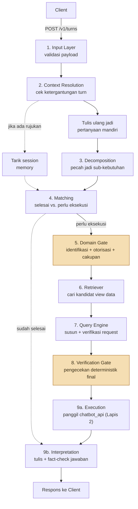

# Nirwana Chatbot

*[English](README.md)*

[](https://github.com/Ardiyanto24/nirwana-chatbot/actions/workflows/ci.yml)
[](LICENSE)


Backend chatbot AI dengan Role-Based Access Control (RBAC), berada di depan platform data industri hospitality internal. Dibangun sebagai proyek portofolio yang mendemonstrasikan desain sistem LLM level produksi: pipeline pemrosesan sembilan tahap, dua lapis otorisasi independen, tracing request penuh, dan pipeline CI/CD yang mencakup regression test RBAC otomatis serta scan keamanan adversarial terjadwal.

## Apa ini

Staf hotel group — dari General Manager sampai Front Office Staff — bertanya dalam bahasa natural tentang operasional mereka ("Berapa occupancy rate bulan lalu?", "Bandingkan revenue F&B dengan kuartal lalu"). Layanan ini mengubah pertanyaan itu jadi request data yang tepat dan terotorisasi, mengeksekusinya, dan menuliskan jawaban bahasa natural yang sudah di-fact-check — tanpa pernah membiarkan suatu peran melihat data yang bukan haknya, dan tanpa pernah membiarkan model AI langsung mengeksekusi tindakan yang belum diverifikasi.

Ini adalah **Lapis 1** dari desain RBAC dua lapis yang disengaja: repository ini memahami *apa* yang diminta dan *apakah itu layak diminta sama sekali*; layanan eksternal terpisah (`chatbot_api`) menegakkan akses data row-level sesungguhnya pada tiap request yang sampai kepadanya. Tidak ada satu lapis pun yang menggantikan yang lain — lihat [`docs/ARCHITECTURE.id.md`](docs/ARCHITECTURE.id.md).

## Sorotan teknis

- **Generate, lalu verify — independen, di setiap titik yang penting.** Setiap keputusan yang bergantung pada pemahaman makna (bukan sekadar aturan tetap) mendapat panggilan LLM kedua yang independen untuk mengecek yang pertama, alih-alih mempercayai satu penilaian saja.
- **Dua lapis otorisasi independen.** Akses role×domain dan batasan cakupan individu ditegakkan di sini, *sebelum* request bahkan terbentuk; akses row-level ditegakkan di hilir oleh layanan yang tidak pernah dimodifikasi proyek ini.
- **Tracing request penuh.** Tiap turn dibungkus trace OpenTelemetry yang mencakup kesembilan tahap pemrosesan, diekspor lewat komponen collector Go custom ke dashboard publik dengan isi identik dengan yang privat.
- **Pipeline CI/CD yang menguji mode kegagalan yang benar-benar relevan di sini**: bukan cuma unit test, tapi regression suite RBAC zero-leakage khusus, gate evaluasi reliabilitas prompt berkelanjutan (17 suite test), dan scan keamanan adversarial (red-team) terjadwal mingguan untuk percobaan prompt-injection dan bypass RBAC.
- **Jujur soal apa yang masih terbuka.** Setiap keterbatasan yang ditemukan di sepanjang jalan — termasuk satu temuan keamanan aktif yang belum diperbaiki dari scan red-team — diungkapkan, bukan disembunyikan. Lihat [`SECURITY.id.md`](SECURITY.id.md) dan [`docs/KNOWN_LIMITATIONS.id.md`](docs/KNOWN_LIMITATIONS.id.md).

## Arsitektur sekilas



Rincian lengkap tiap tahap: [`docs/ARCHITECTURE.id.md`](docs/ARCHITECTURE.id.md). Tracing/dashboard: [`docs/OBSERVABILITY.id.md`](docs/OBSERVABILITY.id.md).

## Status proyek

| Lini kerja | Status |
|---|---|
| 1. Input Layer, Context Resolution & Decomposition | ✅ Selesai — 7 milestone |
| 2. Domain Gate & Verification Gate (RBAC) | ✅ Selesai — 4 milestone |
| 3. Retriever & Query Engine | ✅ Selesai — 5 milestone |
| 4. Execution & Interpretation | ✅ Selesai — 5 milestone |
| 5. Observability Dashboard | ✅ Selesai — 4 milestone |
| 6. Custom Exporter (Go) | ✅ Selesai — 2 milestone |
| 7. Orchestration & API Layer | ✅ Selesai — 18 milestone |
| 8. CI/CD | 🟡 Berjalan — 7/10 milestone (deployment produksi: provisioning VPS, reverse proxy TLS, dan pipeline deploy otomatis masih tertunda) |

Riwayat lengkap: [`CHANGELOG.md`](CHANGELOG.md). Bukti, keputusan, dan log per-milestone: [`milestones/`](milestones/).

## Mulai cepat (pengembangan lokal)

Butuh Python 3.13+ dan [`uv`](https://docs.astral.sh/uv/).

```bash
uv sync
cp .env.example .env
# isi .env: OPENROUTER_API_KEY, DATABASE_URL (Supabase), CHATBOT_API_BASE_URL, GRAFANA_ADMIN_PASSWORD
```

Jalankan observability stack lokal (Collector + Jaeger + Prometheus + Grafana):

```bash
docker compose -f infra/observability/docker-compose.yml up -d
```

Jalankan API:

```bash
uv run uvicorn src.main:app --port 8001
```

> **Catatan**: `CHATBOT_API_BASE_URL` menunjuk ke Lapis 2 (`chatbot_api`) — layanan terpisah milik tim platform data, bukan bagian repository ini. Tanpa itu berjalan, pipeline tetap menjalankan tahap 1-8 dengan benar, tapi Execution (tahap 9a) akan gagal. Lihat [`docs/panduan-integrasi-frontend.md`](docs/panduan-integrasi-frontend.md) untuk kontrak request/response `POST /v1/turns`.

Jalankan test suite:

```bash
uv run pytest
```

## Tech stack

| Layer | Teknologi |
|---|---|
| API | FastAPI, Uvicorn, Pydantic |
| Akses data | SQLModel, Supabase (Postgres) |
| Pencarian | BM25 (`rank-bm25`), OpenAI `text-embedding-3-small` (fallback semantik) |
| Provider LLM | OpenRouter (pilihan model per langkah didokumentasikan di [`src/config/llm.py`](src/config/llm.py)) |
| Tracing | OpenTelemetry, Jaeger, Prometheus, Grafana |
| Exporter custom | Go, OpenTelemetry Collector Builder, `pgx` |
| Dashboard publik | Next.js, TypeScript, Tailwind ([repository terpisah](https://github.com/Ardiyanto24/nirwana-observability-dashboard)) |
| CI/CD | GitHub Actions — `ruff`, `golangci-lint`, `gitleaks`, `pip-audit`/`govulncheck`, `pytest`/`go test`, Promptfoo (eval + red-team) |
| Kontainerisasi | Docker, multi-stage, ARM64 native |

## Peta dokumentasi

| | |
|---|---|
| [`docs/ARCHITECTURE.id.md`](docs/ARCHITECTURE.id.md) | Cara kerja pipeline sembilan tahap secara rinci |
| [`docs/OBSERVABILITY.id.md`](docs/OBSERVABILITY.id.md) | Pipeline tracing dan dashboard |
| [`docs/panduan-integrasi-frontend.md`](docs/panduan-integrasi-frontend.md) | Kontrak request/response `POST /v1/turns` |
| [`docs/KNOWN_LIMITATIONS.id.md`](docs/KNOWN_LIMITATIONS.id.md) | Isu terbuka terkurasi dan trade-off yang diterima |
| [`SECURITY.id.md`](SECURITY.id.md) | Kebijakan keamanan, termasuk satu temuan aktif belum diperbaiki |
| [`docs/VERSIONING.id.md`](docs/VERSIONING.id.md) | Apa yang dianggap breaking change untuk layanan ini |
| [`CHANGELOG.md`](CHANGELOG.md) | Riwayat rilis lengkap, satu entri per milestone *(Inggris)* |
| [`milestones/`](milestones/) | Riwayat pembangunan lengkap — keputusan, log, dan bukti verifikasi seluruh 52 milestone |

## Lisensi

[MIT](LICENSE) — lihat file lisensi untuk detail.
