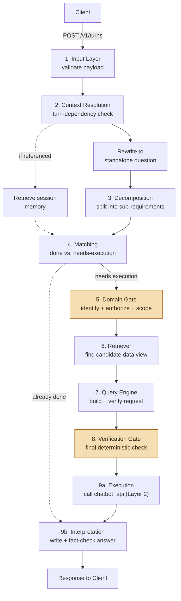

# Nirwana Chatbot

*[Bahasa Indonesia](README.id.md)*

[](https://github.com/Ardiyanto24/nirwana-chatbot/actions/workflows/ci.yml)
[](LICENSE)


An AI chatbot backend with role-based access control (RBAC), sitting in front of an internal hospitality-industry data platform. Built as a portfolio project demonstrating production-grade LLM system design: a nine-stage processing pipeline, two independent layers of authorization, full request tracing, and a CI/CD pipeline that includes automated RBAC regression testing and scheduled adversarial security scanning.

## What this is

A hotel group's staff — from a General Manager to Front Office Staff — ask natural-language questions about their operations ("What was our occupancy rate last month?", "Compare F&B revenue to last quarter"). This service turns that question into the right authorized data request, executes it, and writes back a fact-checked natural-language answer — without ever letting a role see data it isn't entitled to, and without ever letting an AI model directly execute an unverified action.

It is **Layer 1** of a deliberately two-layer RBAC design: this repository understands *what* is being asked and *whether it should be asked at all*; a separate, external service (`chatbot_api`) enforces the actual row-level data access on every request that reaches it. Neither layer substitutes for the other — see [`docs/ARCHITECTURE.md`](docs/ARCHITECTURE.md).

## Engineering highlights

- **Generate, then verify — independently, everywhere it matters.** Every decision that depends on understanding meaning (not just fixed rules) gets a second, independent LLM pass checking the first one, rather than trusting a single judgment.
- **Two independent authorization layers.** Role×domain access and individual-scope constraints are enforced here, *before* a request is even built; row-level access is enforced downstream by a service this project never modifies.
- **Full request tracing.** Every turn is wrapped in an OpenTelemetry trace spanning all nine processing stages, exported through a custom Go collector component to a public dashboard with content identical to the private one.
- **A CI/CD pipeline that tests for the failure modes that matter here**: not just unit tests, but a dedicated zero-leakage RBAC regression suite, a continuously-evaluated prompt-reliability gate (17 test suites), and a weekly scheduled adversarial (red-team) scan for prompt-injection and RBAC-bypass attempts.
- **Honest about what's still open.** Every limitation found along the way — including an active, unpatched security finding from the red-team scan — is disclosed, not hidden. See [`SECURITY.md`](SECURITY.md) and [`docs/KNOWN_LIMITATIONS.md`](docs/KNOWN_LIMITATIONS.md).

## Architecture at a glance



Full breakdown of every stage: [`docs/ARCHITECTURE.md`](docs/ARCHITECTURE.md). Tracing/dashboards: [`docs/OBSERVABILITY.md`](docs/OBSERVABILITY.md).

## Project status

| Workstream | Status |
|---|---|
| 1. Input Layer, Context Resolution & Decomposition | ✅ Complete — 7 milestones |
| 2. Domain Gate & Verification Gate (RBAC) | ✅ Complete — 4 milestones |
| 3. Retriever & Query Engine | ✅ Complete — 5 milestones |
| 4. Execution & Interpretation | ✅ Complete — 5 milestones |
| 5. Observability Dashboard | ✅ Complete — 4 milestones |
| 6. Custom Exporter (Go) | ✅ Complete — 2 milestones |
| 7. Orchestration & API Layer | ✅ Complete — 18 milestones |
| 8. CI/CD | 🟡 In progress — 7/10 milestones (production deployment: VPS provisioning, TLS reverse proxy, and an automated deploy pipeline are still pending) |

Full history: [`CHANGELOG.md`](CHANGELOG.md). Per-milestone evidence, decisions, and logs: [`milestones/`](milestones/).

## Quick start (local development)

Requires Python 3.13+ and [`uv`](https://docs.astral.sh/uv/).

```bash
uv sync
cp .env.example .env
# fill in .env: OPENROUTER_API_KEY, DATABASE_URL (Supabase), CHATBOT_API_BASE_URL, GRAFANA_ADMIN_PASSWORD
```

Start the local observability stack (Collector + Jaeger + Prometheus + Grafana):

```bash
docker compose -f infra/observability/docker-compose.yml up -d
```

Run the API:

```bash
uv run uvicorn src.main:app --port 8001
```

> **Note**: `CHATBOT_API_BASE_URL` points at Layer 2 (`chatbot_api`) — a separate service owned by the data platform team, not part of this repository. Without it running, the pipeline still exercises stages 1–8 correctly, but Execution (stage 9a) will fail. See [`docs/panduan-integrasi-frontend.md`](docs/panduan-integrasi-frontend.md) for the request/response contract of `POST /v1/turns`.

Run the test suite:

```bash
uv run pytest
```

## Tech stack

| Layer | Technology |
|---|---|
| API | FastAPI, Uvicorn, Pydantic |
| Data access | SQLModel, Supabase (Postgres) |
| Search | BM25 (`rank-bm25`), OpenAI `text-embedding-3-small` (semantic fallback) |
| LLM provider | OpenRouter (model choice per step documented in [`src/config/llm.py`](src/config/llm.py)) |
| Tracing | OpenTelemetry, Jaeger, Prometheus, Grafana |
| Custom exporter | Go, OpenTelemetry Collector Builder, `pgx` |
| Public dashboard | Next.js, TypeScript, Tailwind ([separate repository](https://github.com/Ardiyanto24/nirwana-observability-dashboard)) |
| CI/CD | GitHub Actions — `ruff`, `golangci-lint`, `gitleaks`, `pip-audit`/`govulncheck`, `pytest`/`go test`, Promptfoo (eval + red-team) |
| Containerization | Docker, multi-stage, native ARM64 |

## Documentation map

| | |
|---|---|
| [`docs/ARCHITECTURE.md`](docs/ARCHITECTURE.md) | How the nine-stage pipeline works, in detail |
| [`docs/OBSERVABILITY.md`](docs/OBSERVABILITY.md) | Tracing pipeline and dashboards |
| [`docs/panduan-integrasi-frontend.md`](docs/panduan-integrasi-frontend.md) | `POST /v1/turns` request/response contract *(Indonesian)* |
| [`docs/KNOWN_LIMITATIONS.md`](docs/KNOWN_LIMITATIONS.md) | Curated open issues and accepted trade-offs |
| [`SECURITY.md`](SECURITY.md) | Security policy, including one active unpatched finding |
| [`docs/VERSIONING.md`](docs/VERSIONING.md) | What counts as a breaking change for this service |
| [`CHANGELOG.md`](CHANGELOG.md) | Full release history, one entry per milestone |
| [`milestones/`](milestones/) | Complete build history — decisions, logs, and verification evidence for all 52 milestones *(Indonesian)* |

## License

[MIT](LICENSE) — see the license file for details.
