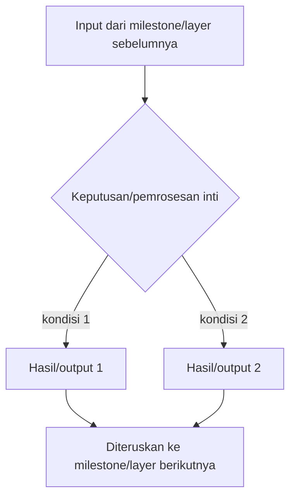

# Report — Milestone <id>: <Nama Milestone>

Dokumen ini adalah ringkasan hasil akhir milestone — ditulis setelah seluruh checkpoint di plan selesai diverifikasi dan di-commit. Berbeda dari `logs.md` (catatan peristiwa kronologis, tidak dihaluskan), `report.md` adalah kesimpulan: apa yang benar-benar tercapai, dibandingkan terhadap apa yang dijanjikan di dokumen sumber.

**Sebelum mengisi, tentukan dulu jenis milestone ini** — menentukan apakah Bagian 3 (Cara Kerja dan Arsitektur) di bawah relevan diisi atau dilewati:

- **Milestone berbasis kode/sistem** — outputnya sesuatu yang berjalan (mekanisme, endpoint, service, exporter, dashboard) — py "cara kerja" yang bisa dijelaskan dan arsitektur yang bisa didiagramkan. **Wajib isi Bagian 3.**
- **Milestone berbasis dokumen** — outputnya murni dokumen/kesepakatan tanpa kode yang berjalan (misalnya kontrak yang disepakati, hasil pemetaan/tinjauan tanpa implementasi). **Lewati Bagian 3**, gunakan Bagian 3 versi pendek yang menyatakan itu eksplisit alih-alih menghapus section-nya sama sekali.

*(Catatan untuk project ini: sejauh peta 22 milestone yang sudah diaudit di delapan dokumen sumber kebenaran, seluruhnya berjenis "berbasis kode/sistem" — tidak ada milestone yang outputnya murni dokumen tanpa kode berjalan. Percabangan ini tetap disediakan di template untuk kasus milestone baru yang mungkin muncul di kemudian hari, bukan berdasar contoh nyata yang sudah ada di project ini saat ini.)*

---

## Bagian 1 — Ringkasan Hasil

**Status akhir:** <Selesai sesuai rencana / Selesai dengan penyesuaian dari plan / Selesai sebagian, dengan follow-up>

<Satu-dua paragraf: apa yang dicapai milestone ini, secara langsung — bukan menyalin ulang Lingkup dari dokumen sumber, tapi menyatakan hasil konkretnya. Pembaca yang cuma baca bagian ini seharusnya sudah tahu inti hasilnya tanpa perlu baca sisa dokumen.>

## Bagian 2 — Kriteria Keberhasilan vs Bukti Nyata

<Salin persis tiap Kriteria Keberhasilan dari dokumen `rancangan-*.md` sumber, pasangkan dengan bukti aktual — bukan "sudah terpenuhi" tanpa rincian, tapi apa yang benar-benar dijalankan dan hasilnya. Rujuk `logs.md` untuk detail penuh kalau perlu, jangan mengulang seluruh isinya di sini.>

| Kriteria (dari dokumen sumber) | Bukti Aktual | Terpenuhi? |
|---|---|---|
| <kriteria 1> | <bukti konkret, atau rujukan ke checkpoint/task di logs.md> | Ya / Sebagian / Tidak, lihat Bagian 4 |

---

## Bagian 3 — Cara Kerja dan Arsitektur

*(Wajib untuk milestone berbasis kode/sistem. Untuk milestone berbasis dokumen, ganti seluruh bagian ini dengan satu kalimat: "Milestone ini menghasilkan dokumen/kesepakatan, tidak ada sistem yang berjalan untuk didiagramkan — lihat Bagian 1 untuk ringkasan hasil.")*

### Cara Kerja

<Jelaskan bagaimana hasil milestone ini benar-benar bekerja — dalam bahasa yang bisa dipahami tanpa perlu membaca kode sumbernya langsung. Uraikan alur dari input sampai output, termasuk keputusan penting yang memengaruhi perilakunya (rujuk `decisions.md` untuk alasan lengkap, jangan mengulang argumennya di sini).>

### Diagram Arsitektur

<Diagram Mermaid yang menggambarkan komponen dan alur data milestone ini — cukup detail untuk dipahami berdiri sendiri, tidak perlu mereplikasi seluruh diagram besar dari dokumen arsitektur induk. Pilih jenis diagram sesuai sifat milestone:
- `flowchart` untuk alur keputusan/pemrosesan bercabang (cocok untuk milestone seperti Domain Gate, Verification Gate)
- `sequenceDiagram` untuk interaksi antar komponen berurutan (cocok untuk milestone seperti Execution yang memanggil sistem eksternal)
- `graph`/`flowchart` sederhana untuk topologi komponen (cocok untuk milestone infrastruktur seperti Collector atau Custom Exporter)

Contoh kerangka (sesuaikan bentuk dan isi sepenuhnya dengan milestone yang sebenarnya):>

### Integrasi dengan Komponen Lain

<Bagaimana hasil milestone ini terhubung ke milestone/pekerjaan lain yang sudah ada — rujuk "Catatan Serah Terima ke Pekerjaan Lain" dari dokumen sumber, dan konfirmasi eksplisit apakah kontrak yang dijanjikan di sana benar-benar terpenuhi sesuai bentuknya, atau ada penyesuaian.>

---

## Bagian 4 — Perubahan dari Plan

<Ringkasan tingkat-tinggi dari seluruh penyimpangan plan-vs-eksekusi yang tercatat di `logs.md` (bagian "Kesesuaian dengan plan" per task, dan "Task/Checkpoint di Luar Plan"). Jangan mengulang detail penuh — cukup daftar apa yang berubah dan kenapa, dengan rujukan ke task/checkpoint di `logs.md` untuk yang mau menelusuri lebih dalam. Kalau tidak ada penyimpangan sama sekali, nyatakan itu eksplisit: "Tidak ada penyimpangan dari plan — seluruh checkpoint dan task dikerjakan persis sesuai rencana.">

## Bagian 5 — Keterbatasan dan Item Provisional

<Apa yang diketahui belum sempurna dari hasil milestone ini — baik yang sudah tercatat formal di `docs/keterbatasan-diterima.md` (cukup rujuk, jangan duplikasi isinya) maupun yang baru terlihat setelah milestone ini selesai dan belum sempat dicatat di sana (catat di sini, lalu pindahkan ke `docs/keterbatasan-diterima.md` sebagai bagian penutupan milestone kalau memang keterbatasan yang diterima sadar, bukan bug yang harus diperbaiki).>

## Bagian 6 — Follow-up

<Pekerjaan yang perlu dilakukan pihak lain atau di milestone mendatang sebagai akibat langsung dari hasil milestone ini — termasuk keputusan tertunda baru yang perlu dipindahkan ke `docs/keputusan-tertunda.md`. Kalau tidak ada, nyatakan eksplisit: "Tidak ada follow-up — hasil milestone ini final untuk cakupannya.">
