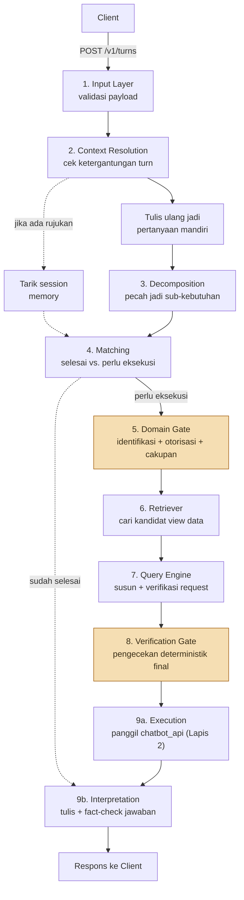

# Arsitektur Sistem

*[English](ARCHITECTURE.md)*

## RBAC Dua Lapis

Repository ini adalah **Lapis 1** dari desain otorisasi dua lapis yang berada di depan platform data hospitality internal:

- **Lapis 1 (repo ini)** memahami apa yang sebenarnya diminta pengguna, dalam bahasa natural, dan memutuskan *apakah request layak dibentuk sama sekali* — memeriksa akses domain berbasis peran dan batasan cakupan individu (mis. staf yang bertanya "siapa teknisi tercepat" seharusnya hanya melihat datanya sendiri) sebelum satu query pun terbentuk.
- **Lapis 2 (`chatbot_api`, eksternal, tidak dimodifikasi di sini)** menegakkan kontrol akses row-level sesungguhnya (`property_id` / `own_property` / `all_properties`) pada setiap request yang sampai kepadanya, apa pun keputusan Lapis 1.

Lapis 1 tidak pernah membangun ulang penegakan row-level milik Lapis 2 — ia dikonsumsi murni sebagai HTTP client. Pemisahan ini ada karena Lapis 2 tidak punya cara mengetahui *apa maksud sebuah pertanyaan*; Lapis 1 tidak punya cara menjamin *data apa yang sesungguhnya dikembalikan sebuah query*. Tidak ada satu lapis pun yang menggantikan lapis lainnya (lihat [SECURITY.id.md](../SECURITY.id.md) untuk kasus nyata di mana ini terbukti penting).

## Pipeline sembilan tahap

Setiap request melewati sembilan tahap, diorkestrasi oleh [`proses_turn()`](../src/orchestration/turn_pipeline.py) di dalam satu span OpenTelemetry (`invoke_agent`) yang membungkus seluruh turn:

1. **Input Layer** (`src/layers/input_layer/`) — memvalidasi payload masuk (session, nomor turn, peran, ID karyawan, pertanyaan, dan histori turn sebelumnya) terhadap skema Pydantic.
2. **Context Resolution** (`src/layers/context_resolution/`) — mendeteksi apakah pertanyaan baru bergantung pada turn sebelumnya, lalu menjalankan dua langkah *secara paralel*: menulis ulang pertanyaan jadi kalimat mandiri sepenuhnya (selalu jalan), dan menarik session memory yang cocok (hanya jika rujukan ke turn sebelumnya genuinely terdeteksi).
3. **Decomposition** (`src/layers/decomposition/`) — memecah pertanyaan (yang sudah mandiri) jadi daftar sub-kebutuhan atomik yang bisa dijawab independen, tiap sub-kebutuhan diverifikasi independen sebelum diterima.
4. **Matching** (`src/layers/context_resolution/matching.py`) — untuk tiap sub-kebutuhan, memutuskan apakah bisa dijawab dari session memory yang sudah tersimpan atau genuinely butuh request data baru.
5. **Domain Gate** (`src/layers/domain_gate/`) — mengidentifikasi domain data apa yang tersentuh sub-kebutuhan (dengan pengecekan opini-kedua "titik buta" independen), memeriksa otorisasi domain berbasis peran, dan mendeteksi batasan cakupan individu.
6. **Retriever** (`src/layers/retriever/`) — mencari di antara 67 view data yang tersedia (pencarian hybrid kata kunci + fallback semantik) untuk kecocokan struktural dan makna terbaik, dibatasi ke domain yang benar-benar diizinkan bagi pemanggil.
7. **Query Engine** (`src/layers/query_engine/`) — membangun request API konkret (view + parameter) dan secara independen memverifikasi bentuknya benar-benar cocok dengan yang diminta.
8. **Verification Gate** (`src/layers/verification_gate/`) — pengecekan final yang sepenuhnya deterministik (tanpa LLM) sebelum apa pun dikirim keluar: memastikan struktur request, bahwa view yang diresolusi cocok dengan yang diotorisasi, dan memaksa-koreksi filter cakupan individu kalau berlaku.
9. **Execution & Interpretation** (`src/layers/execution/`, `src/layers/interpretation/`) — memanggil `chatbot_api` (Lapis 2), mengklasifikasikan respons (berhasil / sebagian / ditolak / gagal teknis), menyimpan hasil ke session memory, lalu menulis jawaban bahasa natural dan secara independen mem-fact-check-nya terhadap data yang mendasarinya sebelum dikembalikan.

*(Disederhanakan demi keterbacaan — pipeline nyata juga mengelompokkan sub-kebutuhan independen jadi "wave" eksekusi berurutan saat satu bergantung pada yang lain, dan mem-propagasi context trace OpenTelemetry secara manual lintas cabang paralel di langkah 2. Lihat [`src/orchestration/turn_pipeline.py`](../src/orchestration/turn_pipeline.py) untuk urutan pemanggilan persisnya.)*

## Generate, lalu verify — secara independen

Di mana pun keputusan bergantung pada pemahaman makna (bukan aturan tetap yang bisa didaftar), sistem ini memasangkan satu panggilan LLM yang *generate* penilaian dengan panggilan LLM **kedua, independen** yang *verify* penilaian itu — tidak pernah mempercayai satu kali jalan saja untuk apa pun yang ambigu. Dua contoh nyata:

- **Domain Gate** (langkah 5): satu model mengidentifikasi domain apa yang tersentuh pertanyaan; panggilan kedua yang independen mengecek ulang khusus domain yang mungkin terlewat langkah pertama, bias ke arah over-inclusion (domain sensitif yang terlewat adalah gap RBAC nyata; yang berlebih hanya menyebabkan penolakan yang tidak perlu).
- **Interpretation** (langkah 9b): satu model menulis narasi jawaban akhir; model kedua yang independen mem-fact-check-nya terhadap data yang benar-benar dikembalikan, menolak SELURUH jawaban kalau mengandung klaim tak berdasar (lihat [`docs/KNOWN_LIMITATIONS.id.md`](KNOWN_LIMITATIONS.id.md) untuk trade-off yang ditimbulkan ini).

Verifikasi hanya boleh murni deterministik (tanpa LLM) kalau seluruh ruang kesalahan yang mungkin bisa didaftar sebagai aturan eksplisit di depan — **Verification Gate** (langkah 8) adalah satu-satunya tahap di mana itu berlaku, karena di titik itu pengecekan yang tersisa murni struktural (apakah view request ini cocok dengan yang diotorisasi?), bukan semantik.

## Kontrak API

Kontrak HTTP untuk `POST /v1/turns` (bentuk request/response, kode error, dan contoh nyata) didokumentasikan terpisah untuk pihak yang membangun frontend: [`docs/panduan-integrasi-frontend.md`](panduan-integrasi-frontend.md).

## Observability

Setiap tahap di atas diinstrumentasi dengan OpenTelemetry dan diekspor ke dashboard privat (Grafana) maupun publik (Next.js) dengan isi identik — lihat [`docs/OBSERVABILITY.id.md`](OBSERVABILITY.id.md).
