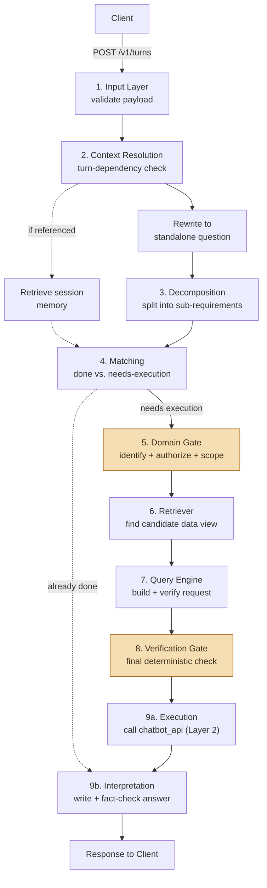

# System Architecture

*[Bahasa Indonesia](ARCHITECTURE.id.md)*

## Two-layer RBAC

This repository is **Layer 1** of a two-layer authorization design sitting in front of an internal hospitality data platform:

- **Layer 1 (this repo)** understands what a user is actually asking, in natural language, and decides *whether the request should be built at all* — checking role-based domain access and individual-scope constraints (e.g. a staff member asking about "the fastest technician" should only ever see their own record) before a single query is formed.
- **Layer 2 (`chatbot_api`, external, not modified here)** enforces the actual row-level access control (`property_id` / `own_property` / `all_properties`) on every request that reaches it, regardless of what Layer 1 decided.

Layer 1 never re-implements Layer 2's row-level enforcement — it's consumed purely as an HTTP client. This split exists because Layer 2 has no way to know *what a question means*; Layer 1 has no way to guarantee *what data a query actually returns*. Neither layer is a substitute for the other (see [SECURITY.md](../SECURITY.md) for a real case where this mattered).

## The nine-stage pipeline

Every request runs through nine stages, orchestrated by [`proses_turn()`](../src/orchestration/turn_pipeline.py) inside one OpenTelemetry span (`invoke_agent`) that wraps the entire turn:

1. **Input Layer** (`src/layers/input_layer/`) — validates the incoming payload (session, turn index, role, employee id, question, and prior turn history) against a Pydantic schema.
2. **Context Resolution** (`src/layers/context_resolution/`) — detects whether the new question depends on an earlier turn, then runs two steps *in parallel*: rewriting the question into a fully self-contained sentence (always), and pulling matching session memory (only if a reference to an earlier turn was actually detected).
3. **Decomposition** (`src/layers/decomposition/`) — splits the (now self-contained) question into a list of independently-answerable atomic sub-requirements, each verified independently before being accepted.
4. **Matching** (`src/layers/context_resolution/matching.py`) — for each sub-requirement, decides whether it can be answered from already-stored session memory or genuinely needs a fresh data request.
5. **Domain Gate** (`src/layers/domain_gate/`) — identifies which data domains a sub-requirement touches (with an independent second-opinion "blind spot" check), checks role-based domain authorization, and detects individual-scope constraints.
6. **Retriever** (`src/layers/retriever/`) — searches the 67 available data views (hybrid keyword + semantic fallback search) for the best structural and semantic match, restricted to domains the caller is actually authorized for.
7. **Query Engine** (`src/layers/query_engine/`) — builds a concrete API request (view + parameters) and independently verifies its shape actually matches what was asked for.
8. **Verification Gate** (`src/layers/verification_gate/`) — the final, fully deterministic (no LLM) check before anything is sent externally: confirms the request structure, that the resolved view matches what was authorized, and force-corrects the individual-scope filter if one applies.
9. **Execution & Interpretation** (`src/layers/execution/`, `src/layers/interpretation/`) — calls `chatbot_api` (Layer 2), classifies the response (success / partial / denied / technical failure), saves the result to session memory, then writes a natural-language answer and independently fact-checks it against the underlying data before it's returned.

*(Simplified for readability — the real pipeline also groups independent sub-requirements into sequential execution "waves" when one depends on another, and threads the OpenTelemetry trace context manually across the parallel branch in step 2. See [`src/orchestration/turn_pipeline.py`](../src/orchestration/turn_pipeline.py) for the exact call order.)*

## Generate, then verify — independently

Wherever a decision depends on understanding meaning (as opposed to a fixed, enumerable rule), this system pairs an LLM call that *generates* a judgment with a **second, independent** LLM call that *verifies* it — never trusting a single pass on anything ambiguous. Two concrete examples:

- **Domain Gate** (step 5): one model identifies which domains a question touches; a second, independent call re-checks specifically for domains the first pass might have missed, biased toward over-inclusion (a missed sensitive domain is a real RBAC gap; an over-included one only causes an unnecessary denial).
- **Interpretation** (step 9b): one model writes the final narrative answer; a second, independent model fact-checks it against the actual data returned, rejecting the entire answer if it contains an unsupported claim (see [`docs/KNOWN_LIMITATIONS.md`](KNOWN_LIMITATIONS.md) for the trade-off this creates).

Verification is only allowed to be purely deterministic (no LLM) when the entire space of possible mistakes can be enumerated as explicit rules up front — the **Verification Gate** (step 8) is the one stage where that holds, because by that point the only remaining checks are structural (does this request's view match what was authorized?), not semantic.

## API contract

The HTTP contract for `POST /v1/turns` (request/response shapes, error codes, and worked examples) is documented separately for consumers building a frontend: [`docs/panduan-integrasi-frontend.md`](panduan-integrasi-frontend.md) *(Indonesian)*.

## Observability

Every stage above is instrumented with OpenTelemetry and exported to both a private (Grafana) and public (Next.js) dashboard with identical content — see [`docs/OBSERVABILITY.md`](OBSERVABILITY.md).
