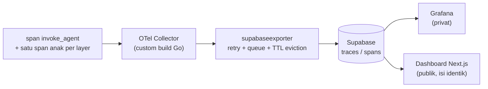

# Observability

*[English](OBSERVABILITY.md)*

Setiap layer yang dijelaskan di [`docs/ARCHITECTURE.id.md`](ARCHITECTURE.id.md) diinstrumentasi dengan OpenTelemetry, dan data trace yang dihasilkan berakhir di dua dashboard dengan **isi identik** — satu privat, satu publik. Pemisahan ini murni alasan operasional (tier gratis Grafana Cloud tidak bisa mempublikasikan dashboard ke internet publik), bukan batas privasi.

## Apa yang direkam

Tiap turn dibungkus satu span akar, `invoke_agent`, dengan satu span anak per langkah pemrosesan. Default-nya aman sejak awal: **input prompt dan output LLM tidak pernah direkam sebagai isi span** — hanya metadata terstruktur (nama model, jumlah token, hasil keputusan seperti `error.type` atau `intent.count`, timing). Ini keputusan sengaja sejak awal proyek, bukan tambahan belakangan.

## Pipeline

- **OTel Collector**: build custom (lewat OpenTelemetry Collector Builder) yang membundel exporter buatan sendiri bersama komponen standar, menggantikan image resmi `otel/opentelemetry-collector-contrib`.
- **`supabaseexporter`** (Go, [`custom-exporter/supabaseexporter/`](../custom-exporter/supabaseexporter/)): mengonversi span OTel jadi baris di tabel `traces`/`spans` Supabase. Ia menahan span anak sampai span akar turn induknya tiba (span selesai tidak berurutan — anak selalu selesai lebih dulu dari induknya), meng-evict apa pun yang sudah menunggu lebih dari 60 menit (mis. proses yang crash sehingga span akarnya tidak pernah tiba), dan mencoba ulang kegagalan penulisan sesaat dengan exponential backoff lewat mekanisme retry/queue bawaan Collector alih-alih membuang data pada kegagalan pertama.
- **Supabase** (tabel `traces` / `spans`): sumber kebenaran bersama yang dibaca kedua dashboard.
- **Grafana** (self-hosted, privat): tampilan waterfall trace, latency p95 per layer, distribusi status, dan frekuensi error-type — panel dibangun di atas pipeline `spanmetricsconnector` yang ditambahkan berdampingan (bukan menggantikan) pipeline trace mentah.
- **Dashboard publik** ([`nirwana-observability-dashboard`](https://github.com/Ardiyanto24/nirwana-observability-dashboard), repository terpisah, Next.js + tabel Supabase yang sama): daftar trace dengan filter, tampilan waterfall per-trace, dan halaman ringkasan agregat — sengaja mencerminkan isi Grafana supaya siapa pun yang meninjau proyek ini bisa melihat data trace nyata tanpa perlu menjalankan infrastruktur lokal.

## Keterbatasan yang diketahui

Bucket histogram latency bawaan pipeline metrik belum sepenuhnya mencakup rentang latency nyata sistem ini (pengecekan deterministik <5ms sampai panggilan LLM 90+ detik) — lihat [`docs/KNOWN_LIMITATIONS.id.md`](KNOWN_LIMITATIONS.id.md).
