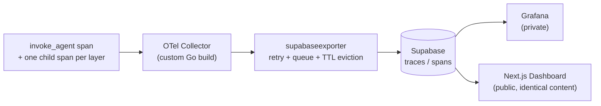

# Observability

*[Bahasa Indonesia](OBSERVABILITY.id.md)*

Every layer described in [`docs/ARCHITECTURE.md`](ARCHITECTURE.md) is instrumented with OpenTelemetry, and the resulting trace data ends up in two dashboards with **identical content** — one private, one public. The split is purely operational (a free Grafana Cloud plan can't publish dashboards to the public internet), not a privacy boundary.

## What gets recorded

Every turn is wrapped in a single root span, `invoke_agent`, with one child span per processing step. The default is safe-by-construction: **prompt inputs and LLM outputs are never recorded as span content** — only structured metadata (model name, token counts, decision outcomes like `error.type` or `intent.count`, timing). This was a deliberate choice from the start of the project, not a retrofit.

## Pipeline

- **OTel Collector**: a custom build (via the OpenTelemetry Collector Builder) that bundles a purpose-built exporter alongside the standard components, replacing the stock `otel/opentelemetry-collector-contrib` image.
- **`supabaseexporter`** (Go, [`custom-exporter/supabaseexporter/`](../custom-exporter/supabaseexporter/)): converts OTel spans into rows in Supabase's `traces`/`spans` tables. It buffers child spans until their parent turn's root span arrives (spans finish out of order — a child always finishes before its parent), evicts anything that's waited longer than 60 minutes (e.g. a crashed process whose root span never arrives), and retries transient write failures with exponential backoff via the Collector's built-in retry/queue mechanism rather than dropping data on the first failure.
- **Supabase** (`traces` / `spans` tables): the shared source of truth both dashboards read from.
- **Grafana** (self-hosted, private): trace waterfall view, p95 latency per layer, status distribution, and error-type frequency — panels built on top of a `spanmetricsconnector` pipeline added alongside (not replacing) the raw trace pipeline.
- **Public dashboard** ([`nirwana-observability-dashboard`](https://github.com/Ardiyanto24/nirwana-observability-dashboard), a separate repository, Next.js + the same Supabase tables): a trace list with filters, a per-trace waterfall view, and an aggregate summary page — deliberately mirroring Grafana's content so anyone reviewing this project can see real trace data without needing local infrastructure running.

## Known gaps

The metrics pipeline's default latency histogram buckets don't fully cover this system's real latency spread (sub-5ms deterministic checks up to 90+ second LLM calls) — see [`docs/KNOWN_LIMITATIONS.md`](KNOWN_LIMITATIONS.md).
