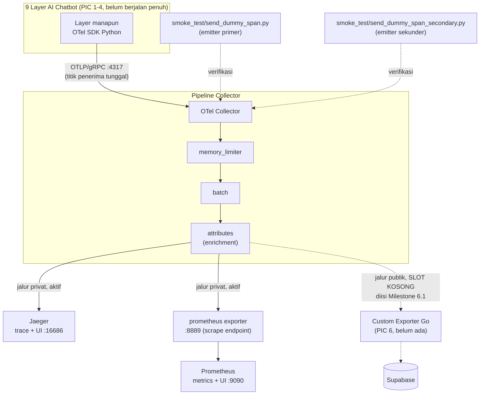

# Report — Milestone 1.1: Penyiapan OTel Collector sebagai Fondasi Observability Bersama

Milestone ini berjenis **berbasis kode/sistem** — outputnya sebuah stack yang benar-benar berjalan (Collector + Jaeger + Prometheus) dan bisa dibuktikan menerima data. Bagian 3 diisi penuh.

## Bagian 1 — Ringkasan Hasil

**Status akhir:** Selesai sesuai rencana, dengan beberapa perbaikan kecil di tengah jalan (lihat Bagian 4).

Milestone 1.1 menghasilkan satu OTel Collector lokal (via Docker Compose) yang menjadi titik penerima OTLP tunggal (`localhost:4317` grpc / `4318` http) untuk seluruh 9 layer AI Chatbot. Pipeline-nya fan-out ke jalur privat aktif penuh (Jaeger untuk trace, Prometheus untuk metrics) dan satu slot exporter publik yang sudah disiapkan formatnya (dikomentari eksplisit) untuk diisi PIC 6 di Milestone 6.1. Versi konvensi atribut `gen_ai.*` dikunci eksplisit di kode (`infra/observability/genai_semconv.py`), termasuk temuan penting bahwa governance spesifikasinya baru pindah repo (2026-06-12) — dicatat sebagai keterbatasan diterima pertama proyek ini. Dua skrip verifikasi independen (`smoke_test/send_dummy_span.py` dan `send_dummy_span_secondary.py`) membuktikan lewat pemanggilan nyata (bukan asumsi) bahwa Collector menerima trace dan metric dari lebih dari satu sumber, dan datanya benar-benar sampai ke Jaeger API dan Prometheus API dengan atribut yang benar.

## Bagian 2 — Kriteria Keberhasilan vs Bukti Nyata

| Kriteria (dari dokumen sumber) | Bukti Aktual | Terpenuhi? |
|---|---|---|
| "Span percobaan sederhana (dummy, dibuat khusus untuk uji coba ini) berhasil dikirim dan terlihat di Jaeger dengan atribut yang benar." | `send_dummy_span.py` dijalankan, `GET /api/traces/<trace_id>` ke Jaeger API mengembalikan trace berisi span `invoke_agent`+`chat` dengan atribut `gen_ai.operation.name`, `gen_ai.request.model`, `gen_ai.conversation.id`, `gen_ai.usage.input_tokens`, `gen_ai.usage.output_tokens` sesuai yang dikirim. Detail: `logs.md` Checkpoint 3, Task 11. | Ya |
| "Setidaknya satu PIC lain (diverifikasi lewat percobaan nyata, bukan asumsi) berhasil mengarahkan instrumentasinya ke Collector yang sama dan span mereka juga muncul, membuktikan fondasi ini benar-benar bisa dipakai bersama tanpa perlu instance terpisah." | `send_dummy_span_secondary.py` dijalankan sebagai proses Python terpisah, `service.name` berbeda, bentuk span berbeda (`input.validate`, non-LLM). Trace-nya terverifikasi terpisah di Jaeger API dengan `trace_id` berbeda dari skrip primer. Detail: `logs.md` Checkpoint 4, Task 13. **Catatan keterbatasan: ini simulasi "PIC lain" lewat skrip kedua, bukan bukti dari kode PIC 2/3/4 sungguhan — lihat Bagian 5.** | Ya (dengan simulasi, dicatat eksplisit) |
| "Versi konvensi atribut GenAI yang dipakai tercatat eksplisit dan bisa ditemukan langsung di kode (bukan hanya di dokumen ini), sehingga siapa pun yang membaca kode PIC lain tahu persis versi konvensi mana yang harus diikuti." | `infra/observability/genai_semconv.py` berisi konstanta `GENAI_SEMCONV_SPEC_STATUS`, `GENAI_SEMCONV_SPEC_SOURCE`, `GENAI_SEMCONV_PYTHON_PACKAGE`, docstring lengkap menjelaskan temuan perpindahan governance. Detail riset: `logs.md` Checkpoint 3, Task 8-9. | Ya |

## Bagian 3 — Cara Kerja dan Arsitektur

### Cara Kerja

Seluruh 9 layer (nantinya, begitu PIC 2-4 mulai instrumentasi) mengirim span/metric via OTel SDK Python ke Collector lewat OTLP/gRPC di `localhost:4317`. Collector memproses data lewat tiga processor berurutan: `memory_limiter` (mencegah Collector kehabisan memori kalau volume data tinggi), `batch` (efisiensi pengiriman), `attributes` (enrichment, contoh: menambah `deployment.environment=local-dev` ke setiap span/metric). Setelah diproses, data di-fan-out ke dua ekspor: trace ke Jaeger (lewat OTLP juga, karena Jaeger modern punya receiver OTLP bawaan), metrics diserap Prometheus lewat scrape endpoint yang dibuka Collector (`:8889`). Jalur publik (untuk dashboard Next.js+Supabase, PIC 6) belum aktif — formatnya sudah disiapkan sebagai komentar di config, tinggal diisi.

Konvensi atribut `gen_ai.*` (dipakai untuk span berjenis LLM call, contoh: `chat`) dikunci di satu modul (`genai_semconv.py`) supaya seluruh layer memakai nama atribut yang konsisten, bukan hardcode string masing-masing.

### Diagram Arsitektur

### Integrasi dengan Komponen Lain

Merujuk "Catatan Serah Terima ke Pekerjaan Lain" di `rancangan-context-decomposition.md`:

- **Ke PIC 2 (`rancangan-rbac-authorization.md`), PIC 3 (`rancangan-retrieval-query.md`), PIC 4 (`rancangan-execution-interpretation.md`):** endpoint OTLP (`localhost:4317`/`4318`) dan konvensi instrumentasi didokumentasikan di `infra/observability/README.md`, siap dipakai — **terpenuhi**. Pola referensi konkret (bukan hanya deskripsi) tersedia lewat dua skrip di `smoke_test/`.
- **Ke PIC 6 (`rancangan-custom-exporter-supabase.md`):** slot exporter kedua sudah disiapkan formatnya di `otel-collector-config.yaml` (dikomentari, dengan instruksi cara mengisi) — **terpenuhi**. Perubahan struktur pipeline di masa depan (kalau ada) wajib dikomunikasikan ke PIC 6, sesuai catatan dokumen sumber.

## Bagian 4 — Perubahan dari Plan

Empat penyimpangan kecil dari plan, semuanya koreksi di tempat (tidak ada checkpoint/task baru di luar struktur plan):

1. **Task 1 (Checkpoint 1):** `uv init` default (tanpa flag) ternyata membuat struktur `src/nirwana_chatbot/` (package layout) — melanggar batasan bahwa struktur `src/` sengaja ditunda ke Milestone 1.2. Dikoreksi dengan `uv init --bare`. Detail: `logs.md` Checkpoint 1, Task 1.
2. **Task 7 (Checkpoint 2):** Image Collector `latest` (v0.158.0) menampilkan warning deprecation untuk exporter type `otlp` (harus `otlp_grpc`). Dikoreksi, dicatat sebagai Keputusan 5 di `decisions.md`. Detail: `logs.md` Checkpoint 2, Task 7.
3. **Task 8-9 (Checkpoint 3):** Riset versi GenAI semconv mengungkap perpindahan governance yang jauh lebih signifikan dari yang dibayangkan saat plan ditulis (bukan sekadar "cek versi lalu catat") — memicu inisialisasi `docs/keterbatasan-diterima.md` lebih awal dari estimasi di plan (plan menyebutnya bagian Checkpoint 5, nyatanya di Checkpoint 3, konsisten dengan prinsip "jangan tunda ke penutupan"). Detail: `logs.md` Checkpoint 3, Task 8, dan Keputusan 6 di `decisions.md`.
4. Tidak ada penyimpangan lain — Checkpoint 4 dan Checkpoint 5 (sejauh ditulis) berjalan persis sesuai plan.

## Bagian 5 — Keterbatasan dan Item Provisional

- **Governance GenAI semconv pindah repo, belum ada paket Python resmi** — sudah tercatat formal di `docs/keterbatasan-diterima.md` #1. Ringkas: proyek memakai `opentelemetry-semantic-conventions==0.65b0` (deprecated tapi nilai stringnya masih akurat) karena tidak ada alternatif lebih baik saat ini.
- **Kriteria Keberhasilan #2 (multi-emitter) dibuktikan lewat simulasi, bukan PIC sungguhan** — belum tercatat di `docs/keterbatasan-diterima.md` karena sifatnya spesifik ke titik waktu proyek ini (akan otomatis usang begitu Milestone 2.1/3.1 mulai kirim span nyata), bukan keterbatasan permanen yang perlu backlog project-wide. Pemicu peninjauan: begitu Milestone 2.1 atau 3.1 pertama kali mengirim span nyata ke Collector ini, verifikasi ulang secara langsung bahwa mereka terhubung ke instance yang sama (bukan re-run smoke test lama).
- **Tag image Docker `latest`** — trade-off disadari (lihat Keputusan 4 di `decisions.md`): reproducibility antar waktu tidak dijamin persis sama, tapi risiko image usang/ditarik dari registry dianggap lebih besar untuk stack verifikasi lokal ini.

## Bagian 6 — Follow-up

- PIC 2 (Milestone 2.1) dan PIC 3 (Milestone 3.1), begitu mulai instrumentasi nyata, wajib mengikuti pola dari `infra/observability/README.md` dan mengimpor konstanta dari `genai_semconv.py` — bukan hardcode ulang string `gen_ai.*`.
- PIC 6 (Milestone 6.1) mengisi slot exporter publik di `otel-collector-config.yaml` sesuai format yang sudah dikomentari.
- Model per langkah dan provider routing LLM (Claude Console/OpenRouter) masih belum ditentukan untuk keseluruhan proyek — bukan follow-up dari milestone ini secara langsung (Milestone 1.1 tidak memanggil LLM sama sekali), tapi tetap jadi keputusan pertama yang perlu diajukan begitu Milestone 1.2/1.3 mulai menyentuh pemanggilan model AI pertama.
