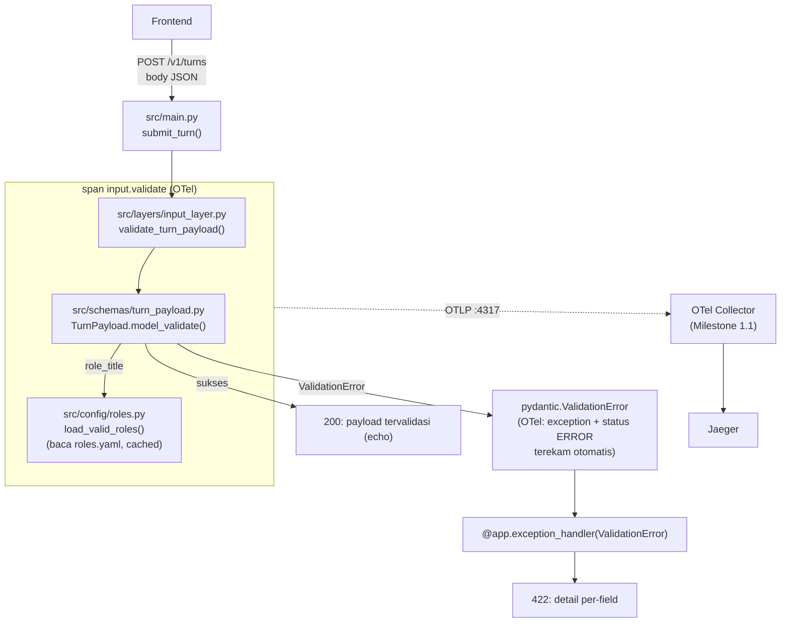

# Report — Milestone 1.2: Membangun Input Layer

Milestone ini berjenis **berbasis kode/sistem** — outputnya endpoint HTTP yang benar-benar berjalan dan bisa dibuktikan menerima/menolak payload. Bagian 3 diisi penuh.

## Bagian 1 — Ringkasan Hasil

**Status akhir:** Selesai sesuai rencana, dengan beberapa koreksi teknis di tengah jalan (lihat Bagian 4).

Milestone 1.2 menghasilkan Input Layer sebagai endpoint HTTP sungguhan (`POST /v1/turns`, FastAPI) — titik masuk pertama sistem AI Chatbot RBAC. Payload satu turn percakapan divalidasi murni mekanis (tanpa LLM): field wajib, tipe data, `turn_index≥1`, `role_title` terhadap whitelist 20 role (file config `src/config/roles.yaml`, bukan hardcode — dipilih setelah diskusi mendalam dengan user soal database vs file config vs hardcode), dan `previous_turn` wajib-jika-`turn_index>1`. Payload valid dikembalikan `200` (echo, karena Layer 2 belum ada untuk diteruskan); payload cacat dikembalikan `422` dengan pesan menyebut field spesifik. Span `input.validate` dipancarkan ke Collector Milestone 1.1 untuk tiap pemanggilan, diverifikasi nyata muncul di Jaeger dengan atribut benar — termasuk perekaman otomatis exception+stack trace untuk kasus gagal.

Struktur `src/` (per-layer) resmi ditetapkan di milestone ini — keputusan yang sengaja ditunda dari Milestone 1.1. Sebagai bagian dari itu, `genai_semconv.py` dipindah dari `infra/observability/` ke `src/observability/`.

## Bagian 2 — Kriteria Keberhasilan vs Bukti Nyata

| Kriteria (dari dokumen sumber) | Bukti Aktual | Terpenuhi? |
|---|---|---|
| "Payload dengan salah satu field wajib hilang (dicoba untuk tiap field secara bergantian) selalu ditolak dengan pesan yang menyebut field spesifik itu, bukan pesan generik seperti 'payload tidak valid'." | `tests/layers/test_input_layer.py::test_missing_required_field_rejected_with_specific_message`, parametrized 5× (`session_id`/`turn_index`/`role_title`/`employee_id`/`question`) — semua `422`, `detail[].loc` menyebut field yang dihilangkan. Diverifikasi juga lewat `curl` nyata di Checkpoint 3. Detail: `logs.md` Checkpoint 3-4. | Ya |
| "Payload yang benar pada `turn_index = 1` (tanpa histori sama sekali) dan pada `turn_index > 1` (dengan histori turn sebelumnya turut disertakan) sama-sama diterima dan diteruskan dengan benar, membuktikan validasi menangani kedua kasus tanpa memperlakukan salah satunya sebagai kondisi khusus yang terlewat." | `test_turn_index_1_without_history_accepted` dan `test_turn_index_2_with_previous_turn_accepted` — keduanya `200`. Diverifikasi juga lewat `curl` nyata (Checkpoint 3) dan span nyata di Jaeger (Checkpoint 4, `session.id=milestone-1.2-span-verify`, `turn.index=1`, tanpa error). Detail: `logs.md` Checkpoint 3-4. | Ya |

## Bagian 3 — Cara Kerja dan Arsitektur

### Cara Kerja

Frontend mengirim `POST /v1/turns` dengan body JSON (payload mentah, tipe `dict` di sisi FastAPI — bukan lewat parameter bertipe model, supaya validasi tetap terjadi lewat fungsi `validate_turn_payload()` yang independen-testable). Fungsi ini membungkus pemanggilan `TurnPayload.model_validate(raw)` (Pydantic) dalam satu span `input.validate`, mengisi atribut `session.id`/`turn.index` best-effort dari raw payload sebelum validasi (supaya tetap terekam meski validasi gagal total). Kalau validasi gagal, `pydantic.ValidationError` menjalar keluar — OTel SDK otomatis merekam exception & status `ERROR` pada span (tanpa kode tambahan), lalu exception handler kustom (`@app.exception_handler(ValidationError)`, didaftarkan karena FastAPI tidak otomatis menangani `ValidationError` biasa dalam pola ini) mengonversinya jadi respons `422` dengan detail per-field. Kalau validasi sukses, endpoint mengembalikan `200` berisi payload tervalidasi (echo — Layer 2 Context Resolution belum ada untuk diteruskan lebih lanjut).

`role_title` divalidasi lewat `field_validator` yang mengecek keanggotaan ke `load_valid_roles()` (`src/config/roles.py`, membaca `roles.yaml`, di-cache) — bukan lookup ke `chatbot_api`/database manapun, karena `role_permissions` tidak punya endpoint sama sekali.

### Diagram Arsitektur

### Integrasi dengan Komponen Lain

Dicek eksplisit lewat pencarian menyeluruh terhadap `rancangan-context-decomposition.md`: bagian "Catatan Serah Terima ke Pekerjaan Lain" (baris 153-159) **tidak menyebut Milestone 1.2 secara spesifik** — hanya membahas fondasi Collector (Milestone 1.1) dan output Milestone 1.7 ke Domain Gate. Jadi **tidak ada kontrak serah-terima eksplisit dari dokumen sumber untuk milestone ini**. Yang tersedia untuk milestone berikutnya (Milestone 1.3, Pemetaan Ketergantungan Turn) adalah bentuk `TurnPayload` tervalidasi itu sendiri (`src/schemas/turn_payload.py`) — belum ada kontrak formal tertulis di dokumen sumber soal bentuk ini, jadi Milestone 1.3 perlu membaca kode ini langsung, bukan dokumen kontrak terpisah.

## Bagian 4 — Perubahan dari Plan

Tujuh penyimpangan dari plan, semuanya koreksi di tempat (tidak ada checkpoint/task baru di luar struktur plan):

1. **Checkpoint 1, Task 3:** `infra/observability/README.md` ikut diperbarui (referensi path `genai_semconv.py`) — perluasan kecil dari file list Task 3, di luar cakupan literalnya tapi konsisten dengan semangat "reposisi".
2. **Checkpoint 3, Task 10:** Plan salah asumsi FastAPI otomatis menangani `pydantic.ValidationError` jadi `422` — ternyata butuh exception handler eksplisit (dicatat sebagai Keputusan 6 di `decisions.md`).
3. **Checkpoint 4, Task 12:** Ditemukan `StarletteDeprecationWarning` untuk `httpx`, diperbaiki dengan swap ke `httpx2` (Keputusan 7).
4. **Checkpoint 5, Task 17 (bagian dari checkpoint ini):** Root `.gitignore` juga diperbarui (`__pycache__/`, `*.pyc`, `.pytest_cache/`, `AGENT.md` eksplisit) — perluasan wajar kebersihan repo, dibundel dengan commit Checkpoint 4 karena berkaitan langsung dengan setup test suite.
5. Docker stack Milestone 1.1 sempat berhenti (idle sejak commit terakhir sesi sebelumnya) — dinyalakan ulang sebelum verifikasi, dicatat sebagai peristiwa infrastruktur, bukan bug kode.
6. Tidak ada penyimpangan pada Checkpoint 2 — berjalan persis sesuai plan.
7. Task 15 (lengkapi `logs.md` dengan ringkasan commit) dan Task 17 (update `CLAUDE.md`/`AGENT.md`) dikerjakan sebagai bagian penutupan normal, tanpa penyimpangan dari rencana.

## Bagian 5 — Keterbatasan dan Item Provisional

- **Daftar 20 role di `roles.yaml` tidak bisa auto-sync** — sudah tercatat di `docs/keterbatasan-diterima.md` #1 (dicatat Milestone 1.1, relevan juga di sini karena akar masalahnya sama: `role_permissions` tanpa endpoint). Pemicu peninjauan tetap sama: setiap kali dokumen domain-source direvisi.
- **Keputusan database utuh untuk proyek ditunda** — tercatat di `docs/keputusan-tertunda.md` #1 (diinisialisasi milestone ini), pemicu peninjauan: awal implementasi Milestone 1.5.
- **`previous_turn` diabaikan (bukan ditolak) saat `turn_index=1` tapi tetap terkirim** — keputusan derived tanpa dasar dokumen eksplisit (Keputusan 13 `decisions.md`), risiko rendah (perilaku permisif), belum diverifikasi terhadap payload frontend sungguhan (belum ada frontend nyata).
- **Response sukses (`200`) murni echo** — karena Layer 2 (Context Resolution, Milestone 1.3) belum ada, endpoint belum benar-benar "meneruskan" payload kemana pun. Ini bukan bug, tapi keterbatasan sementara yang wajar untuk milestone tunggal.

**Addendum pasca-milestone (ditambahkan saat Milestone 1.3, 2026-08-14):** Kontrak `previous_turn: PreviousTurn | None` (tunggal) yang dijelaskan di seluruh laporan ini **sudah direvisi** menjadi `history: list[HistoryTurn]` (seluruh histori sesi) di Milestone 1.3 — gap nyata ditemukan antara kontrak ini dan Kriteria Keberhasilan M1.3 (deteksi rujukan ke turn jauh, bukan cuma N-1). Lihat `milestones/1.3-pemetaan-ketergantungan-turn/decisions.md` Keputusan 1 untuk kronologi lengkap. Entri di atas (termasuk baris `previous_turn` tepat sebelum addendum ini) **tidak diubah** — ini catatan forward-reference murni, konsisten prinsip "jangan menghaluskan sejarah"; laporan ini tetap merekam kondisi nyata saat Milestone 1.2 selesai.

## Bagian 6 — Follow-up

- Milestone 1.3 (Pemetaan Ketergantungan Turn) menjadi konsumen langsung `TurnPayload` — perlu membaca `src/schemas/turn_payload.py` langsung karena tidak ada kontrak dokumen tertulis terpisah (lihat Bagian 3, Integrasi).
- Milestone 1.5 (Session Memory): evaluasi keputusan database project-wide sesuai `docs/keputusan-tertunda.md` #1, termasuk apakah `src/config/roles.yaml` sebaiknya dipindah ke database yang sama.
- Model per langkah dan provider routing LLM masih belum ditentukan untuk keseluruhan proyek — bukan follow-up langsung milestone ini (Input Layer tidak memanggil LLM), tapi jadi keputusan pertama yang perlu diajukan begitu Milestone 1.3 mulai menyentuh pemanggilan model AI pertama.
