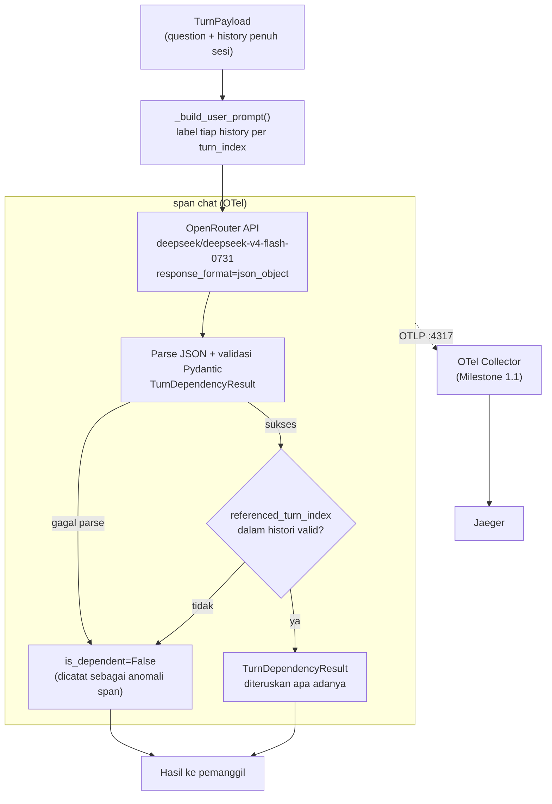

# Report — Milestone 1.3: Membangun Pemetaan Ketergantungan Turn

Milestone ini berjenis **berbasis kode/sistem** — outputnya mekanisme yang benar-benar berjalan (pemanggilan LLM nyata) dan bisa dibuktikan bekerja. Bagian 3 diisi penuh.

## Bagian 1 — Ringkasan Hasil

**Status akhir:** Selesai sesuai rencana — termasuk penyelesaian gap arsitektur nyata yang ditemukan sebelum implementasi dimulai (lihat Bagian 4).

Milestone 1.3 menghasilkan `detect_turn_dependency()` — pemanggilan LLM pertama di seluruh proyek, mendeteksi apakah teks turn terakhir bergantung pada turn lain dalam sesi yang sama, dan kalau ya, turn mana persisnya. Sebelum implementasi ini bisa dimulai, riset mendalam menemukan gap nyata: kontrak payload Milestone 1.2 hanya membawa satu turn sebelumnya, sementara Kriteria Keberhasilan Milestone 1.3 menuntut deteksi rujukan ke turn yang jauh lebih lama — gap ini diselesaikan bersama user dengan merevisi payload membawa **seluruh histori sesi**, dikerjakan sebagai Checkpoint 1 milestone ini (membuka ulang Milestone 1.2 yang sudah selesai/ter-commit). Provider LLM (OpenRouter) dan model (DeepSeek V4 Flash 0731, eksplisit untuk testing) diputuskan bersama user sebagai keputusan pertama proyek soal LLM. Mekanisme diverifikasi lolos ketiga Kriteria Keberhasilan sumber lewat pemanggilan API nyata (bukan mock), termasuk skenario tersulit (rujukan ke turn jauh, bukan turn terdekat) yang justru jadi bukti langsung bahwa revisi payload di Checkpoint 1 benar-benar diperlukan dan berhasil.

## Bagian 2 — Kriteria Keberhasilan vs Bukti Nyata

| Kriteria (dari dokumen sumber) | Bukti Aktual | Terpenuhi? |
|---|---|---|
| "Kalimat dengan rujukan eksplisit ke turn sebelumnya (skenario uji: 'bandingkan dengan bulan lalu', merujuk sesuatu yang memang sudah dibahas beberapa turn sebelumnya) menghasilkan referensi turn yang benar." | `test_kelompok_a_rujukan_eksplisit_ke_turn_sebelumnya` — panggilan API nyata, `is_dependent=True`, `referenced_turn_index=1` (benar). Detail: `logs.md` Checkpoint 4. | Ya |
| "Kalimat yang sepenuhnya berdiri sendiri tanpa rujukan apa pun ke percakapan sebelumnya menghasilkan penanda 'tidak bergantung', tanpa memaksakan rujukan yang sebenarnya tidak ada." | `test_kelompok_b_berdiri_sendiri_tanpa_rujukan` — panggilan API nyata, `is_dependent=False`, `referenced_turn_index=None`. Detail: `logs.md` Checkpoint 4. | Ya |
| "Kalimat yang merujuk balik ke turn yang bukan tepat sebelumnya (skenario uji: turn ketujuh merujuk turn ketiga, dengan beberapa turn lain di antaranya membahas topik berbeda) tetap terdeteksi dan diarahkan ke turn yang benar, bukan salah tangkap ke turn terdekat." | `test_kelompok_c_rujukan_ke_turn_jauh_bukan_terdekat` — skenario 7-turn domain hospitality nyata, panggilan API nyata, `is_dependent=True`, `referenced_turn_index=3` (benar — bukan turn 6 yang terdekat tapi tidak relevan). Kriteria ini yang memicu revisi payload Checkpoint 1; sekarang genuinely terpenuhi karena histori penuh tersedia. Detail: `logs.md` Checkpoint 4. | Ya |

Verifikasi span nyata (di luar tiga kriteria di atas, tapi bagian Output M1.3): span `chat` dikonfirmasi muncul di Jaeger dengan `gen_ai.request.model`, `gen_ai.usage.input_tokens`/`output_tokens` terisi angka nyata dari respons API. Detail: `logs.md` Checkpoint 4, Task 16.

## Bagian 3 — Cara Kerja dan Arsitektur

### Cara Kerja

`detect_turn_dependency(payload: TurnPayload)` menyusun prompt (system+user) berisi seluruh `payload.history` (dilabeli `turn_index` masing-masing, urut) dan teks pertanyaan turn terakhir, memanggil OpenRouter (model DeepSeek V4 Flash 0731) dengan `response_format={"type": "json_object"}`, lalu mem-parsing hasilnya jadi `TurnDependencyResult(is_dependent, referenced_turn_index)`. Seluruh proses dibungkus satu span `chat`, mencatat model, token usage, dan (kalau dependent) `turn_index` yang dirujuk.

Verifikasi output murni deterministik (bukan LLM kedua): `referenced_turn_index` harus salah satu dari `turn_index` yang benar-benar ada di histori yang dikirim — kalau tidak (atau parsing gagal total), dipaksa `is_dependent=False` dan dicatat sebagai anomali di span. Ini konsisten prinsip proyek "generate lalu verify" karena ruang kesalahan yang diverifikasi (bentuk output) tertutup, sementara penilaian makna itu sendiri tetap satu keputusan LLM tunggal sesuai kontrak Milestone 1.3.

`session_id` pada hasil akhir (kalau nanti dipakai layer berikutnya) tidak pernah diminta dari LLM — selalu sama dengan sesi saat ini, ditempel di luar respons LLM untuk menghindari halusinasi.

### Diagram Arsitektur

### Integrasi dengan Komponen Lain

Section "Catatan Serah Terima ke Pekerjaan Lain" (`rancangan-context-decomposition.md` baris 153-159) tidak menyebut Milestone 1.3 secara spesifik (sama seperti Milestone 1.2). Tapi bagian "Kenapa Ini Jadi Milestone Terpisah" Milestone 1.3 sendiri eksplisit menyatakan hasil milestone ini memicu dua jalur kerja paralel berikutnya: Milestone 1.4 (Rewrite Mandiri) dan Milestone 1.5 (Tarik Session Memory) — keduanya menunggu keluaran `TurnDependencyResult`/referensi turn dari milestone ini sebagai prasyarat. Bentuk output (`is_dependent`, `referenced_turn_index`) tersedia di `src/schemas/turn_dependency.py` untuk keduanya membaca langsung, karena tidak ada kontrak dokumen tertulis terpisah untuk bentuk ini.

Milestone ini **juga merevisi kontrak Milestone 1.2** (lihat Bagian 4) — pemilik pekerjaan Milestone 1.4/1.5 perlu tahu bentuk payload yang sesungguhnya sekarang adalah `history: list[HistoryTurn]`, bukan `previous_turn` tunggal seperti yang mungkin masih diasumsikan dari laporan Milestone 1.2 awal (sudah ditambahkan addendum di sana, lihat Bagian 4).

## Bagian 4 — Perubahan dari Plan

Empat penyimpangan dari plan, semuanya koreksi/penyesuaian teknis di tempat (tidak ada checkpoint baru di luar struktur plan):

1. **Checkpoint 1 (seluruh checkpoint):** Bukan penyimpangan dari plan — plan ini sendiri sudah secara sadar merancang Checkpoint 1 sebagai prasyarat revisi Milestone 1.2, hasil dari gap yang ditemukan dan diselesaikan bersama user *sebelum* plan ditulis. Dicatat di sini untuk kelengkapan konteks, bukan sebagai deviasi.
2. **Checkpoint 3, Task 12:** `response_format` pakai `{"type": "json_object"}`, bukan `json_schema` strict mode seperti disebut plan — karena dukungan `json_schema` bervariasi antar model OpenRouter, `json_object` + validasi Pydantic defensif lebih robust untuk model testing yang dipilih (Keputusan 4 `decisions.md`).
3. **Checkpoint 4, Task 16:** Ditemukan pemanggilan langsung (non-HTTP) tidak otomatis memanggil `setup_tracing()` — span tidak terkirim tanpa setup eksplisit. Diperbaiki dengan pola smoke-test Milestone 1.1 (Keputusan 5 `decisions.md`).
4. Beberapa smoke test/skenario tambahan ditambahkan di luar deskripsi task literal (Task 5 skenario sukses multi-turn; Task 12a-b smoke test kedua) — memperkuat keyakinan verifikasi, bukan mengubah struktur checkpoint.

## Bagian 5 — Keterbatasan dan Item Provisional

- **Payload histori penuh bisa membesar untuk sesi sangat panjang** — sudah tercatat di `docs/keterbatasan-diterima.md` #2 (entri baru milestone ini). Belum ada mekanisme ringkasan/pemangkasan; pemicu peninjauan: begitu ada payload sungguhan dari sesi panjang, atau context window model manapun mulai terlampaui.
- **Model DeepSeek V4 Flash 0731 eksplisit untuk testing** — bukan klaim final produksi (dicatat di `decisions.md` Keputusan 3). Ganti model nanti tidak menyentuh logic `turn_dependency.py`, cukup `src/config/llm.py`.
- **`response_format json_object` (bukan `json_schema` strict)** — bergantung pada validasi Pydantic defensif + prompt yang eksplisit menjelaskan bentuk JSON, bukan garansi struktural dari provider. Terbukti bekerja di seluruh skenario uji, tapi robustness jangka panjang terhadap variasi output model belum teruji ekstensif (baru 6 pemanggilan API nyata total sepanjang milestone ini: 2 smoke test + 3 test suite + 1 verifikasi span).
- **Belum wired ke endpoint HTTP manapun** — `detect_turn_dependency()` berdiri sendiri, dipanggil langsung (bukan lewat `POST /v1/turns`), sesuai Batasan Mengikat plan. Pipeline penuh (9 layer tersambung) adalah pekerjaan milestone mendatang.

## Bagian 6 — Follow-up

- Milestone 1.4 (Rewrite Mandiri) dan Milestone 1.5 (Tarik Session Memory) — keduanya menunggu langsung keluaran milestone ini (lihat Bagian 3, Integrasi), perlu membaca `src/schemas/turn_dependency.py` dan `src/schemas/turn_payload.py` (`history` baru) langsung.
- Milestone 1.5 juga perlu meninjau ulang `docs/keputusan-tertunda.md` #1 (keputusan database project-wide, diinisialisasi Milestone 1.2) — sekarang ditambah pertimbangan baru: apakah histori payload yang membesar (keterbatasan Bagian 5) relevan dengan keputusan storage Session Memory.
- `setup_tracing()` perlu dipanggil sekali di titik masuk aplikasi begitu beberapa layer mulai dirangkai jadi satu pipeline (dicatat di `decisions.md` Keputusan 5) — bukan diulang di tiap fungsi layer.
