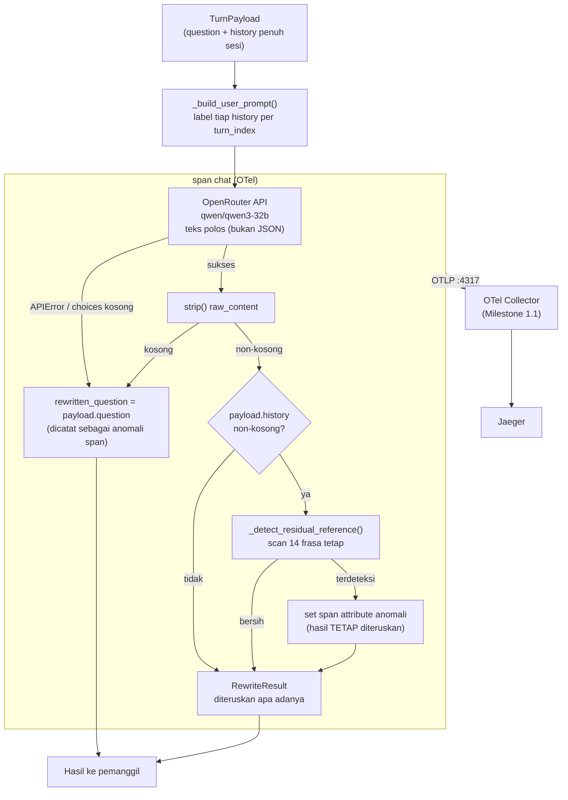

# Report — Milestone 1.4: Membangun Penulisan Ulang Pertanyaan Jadi Mandiri

Milestone ini berjenis **berbasis kode/sistem** — outputnya mekanisme yang benar-benar berjalan (pemanggilan LLM nyata) dan bisa dibuktikan bekerja. Bagian 3 diisi penuh.

## Bagian 1 — Ringkasan Hasil

**Status akhir:** Selesai sesuai rencana.

Milestone 1.4 menghasilkan `rewrite_to_standalone()` — pemanggilan LLM kedua di proyek (setelah M1.3), menulis ulang teks turn terakhir jadi kalimat yang bisa dipahami sepenuhnya berdiri sendiri, meresolusi elipsis/koreferensi bahasa sehari-hari jadi penyebutan eksplisit berdasar histori sesi. Model dipilih lewat riset komparatif eksplisit (Qwen3-32B via OpenRouter, atas bukti benchmark Bahasa Indonesia langsung/SEA-HELM), berbeda dari model M1.3 (DeepSeek V4 Flash 0731) — konsisten prinsip "model per-langkah boleh beda kalau kebutuhannya beda". Mekanisme diverifikasi lolos kedua Kriteria Keberhasilan sumber lewat panggilan API nyata, ditambah eval mendalam 12 skenario yang menemukan satu bug transient (diperbaiki di tempat) dan satu pola keterbatasan model yang genuinely signifikan (recency bias pada kasus ambigu, mereplikasi temuan M1.3).

## Bagian 2 — Kriteria Keberhasilan vs Bukti Nyata

| Kriteria (dari dokumen sumber) | Bukti Aktual | Terpenuhi? |
|---|---|---|
| "Kalimat yang mengandung elipsis/koreferensi (skenario uji: 'bandingkan dengan occupancy satu tahun sebelumnya'...) menghasilkan kalimat mandiri yang menyebutkan bulan dan tahun secara eksplisit." | `test_kelompok_a_elipsis_diresolusi_jadi_eksplisit` — panggilan API nyata, hasil menyebut "April" dan "2025" eksplisit (satu tahun sebelum April 2026 dari histori). Detail: `logs.md` Checkpoint 2. Diperkuat 9/10 skenario elipsis relevan di eval (`evals/1.4-.../audit.md` S03-S06, S08, S10-S12 lolos; S07 satu temuan nyata dianalisis terpisah). | Ya |
| "Kalimat yang sudah mandiri sejak awal (tidak mengandung rujukan apa pun) diteruskan tanpa perubahan makna yang tidak perlu." | `test_kelompok_b_sudah_mandiri_diteruskan_tanpa_distorsi` — panggilan API nyata, entitas kunci (Maret, 2026, reservasi) dipertahankan utuh. Detail: `logs.md` Checkpoint 2. Diperkuat S01/S02/S09/S12 di eval (S01 diteruskan dengan parafrasa sah "occupancy"→"tingkat keterisian", tetap tanpa distorsi makna). | Ya |

Verifikasi span nyata (di luar dua kriteria di atas, tapi bagian Output M1.4): span `chat` dikonfirmasi muncul di Jaeger dengan `gen_ai.request.model=qwen/qwen3-32b`, `gen_ai.usage.input_tokens`/`output_tokens` terisi angka nyata dari respons API. Detail: `logs.md` Checkpoint 1-2.

## Bagian 3 — Cara Kerja dan Arsitektur

### Cara Kerja

`rewrite_to_standalone(payload: TurnPayload)` menyusun prompt (system+user) berisi seluruh `payload.history` (dilabeli `turn_index` masing-masing, urut) dan teks pertanyaan turn terakhir, memanggil OpenRouter (model Qwen3-32B) **tanpa** `response_format=json_object` (beda M1.3 — output cuma 1 field string, JSON wrapper tidak menambah manfaat struktural), lalu mengembalikan `RewriteResult(rewritten_question)`. Seluruh proses dibungkus satu span `chat`, mencatat model dan token usage.

Verifikasi output murni deterministik ruang-tertutup (bukan LLM kedua): hasil rewrite di-scan terhadap daftar tetap 14 frasa penanda rujukan sisa (mis. "dibanding itu", "hal tersebut") — kalau terdeteksi (dan histori non-kosong), dicatat sebagai span attribute anomali `rewrite.residual_reference_detected`, TANPA mengubah hasil (beda dari M1.3 yang punya nilai fallback pasti `is_dependent=False` — rewrite tidak punya nilai "aman" setara). Kegagalan API (`APIError`, respons kosong, atau `choices` kosong — celah yang ditemukan dan ditutup di Checkpoint 3) memicu fallback ke `payload.question` asli tanpa modifikasi, dicatat sebagai `rewrite.forced_fallback_reason`.

### Diagram Arsitektur

### Integrasi dengan Komponen Lain

Section "Catatan Serah Terima ke Pekerjaan Lain" (`rancangan-context-decomposition.md` baris 153-159) menyebut output Milestone 1.4 (kalimat mandiri) menjadi input langsung Milestone 1.6 (Decomposition) bersama output Milestone 1.7 — perubahan bentuk output berdampak langsung dan perlu dikomunikasikan sebelum diubah. M1.4 **bukan** milestone terakhir di `rancangan-context-decomposition.md` (masih ada M1.5, 1.6, 1.7), jadi kontrak "Catatan Serah Terima" penuh belum sepenuhnya applicable — tapi bentuk output (`RewriteResult.rewritten_question`) sudah tersedia di `src/schemas/rewrite.py` untuk Milestone 1.6 membaca langsung begitu dimulai.

`rewrite_to_standalone()` **tidak** mengonsumsi output `TurnDependencyResult` (M1.3) — berjalan independen sesuai klaim eksplisit dokumen sumber, keduanya baru bertemu nanti di Milestone 1.7 bersama hasil Milestone 1.5.

## Bagian 4 — Perubahan dari Plan

Tiga penyimpangan dari plan, semuanya koreksi/penyesuaian teknis di tempat (tidak ada checkpoint baru di luar struktur plan):

1. **Checkpoint 1, Verifikasi span:** Docker Desktop mengalami error engine (`500 Internal Server Error`) saat percobaan pertama verifikasi span — bukan masalah kode proyek, murni infrastruktur lokal. Diselesaikan lewat restart komputer penuh oleh user (di luar percobaan restart proses/WSL yang sempat dicoba tapi tidak cukup). Setelah restart, verifikasi berjalan normal tanpa masalah lebih lanjut.
2. **Checkpoint 3, Task 12:** Eksekusi pertama `run_eval.py` crash (`TypeError`) karena `response.choices` kosong pada satu respons OpenRouter (transient, dikonfirmasi tidak reproducible). Ditambahkan pengecekan defensif di `rewrite.py` (celah nyata pada Keputusan 8 yang belum ditutup implementasi awal) dan retry di `run_eval.py` — dicatat sebagai commit `fix` terpisah.
3. **Checkpoint 3, Task 13:** Audit menemukan `required_phrases` S01 di `rancangan.md` terlalu kaku (mengasumsikan istilah Inggris "occupancy" dipertahankan verbatim, padahal model menerjemahkannya sah ke "tingkat keterisian") — dicatat sebagai temuan metodologi eval, bukan revisi `rancangan.md` yang sudah ditulis sebelum eksekusi (prinsip "jangan melonggarkan kriteria setelah lihat hasil" dipertahankan; koreksi dicatat di `audit.md` sebagai analisis, bukan mengubah `rancangan.md` retroaktif).

## Bagian 5 — Keterbatasan dan Item Provisional

- **Recency bias pada kasus ambigu-multi-kandidat** — S07 eval menemukan Qwen3-32B salah menangkap topik saat ada distraktor topikal yang lebih baru (mirip temuan S07 `evals/1.3-.../audit.md` pada DeepSeek untuk tugas berbeda). Bukan bug sistem (mekanisme tetap menghasilkan kalimat mandiri valid), tapi keterbatasan model nyata pada kasus genuinely ambigu. Berpotensi relevan untuk desain Milestone 1.6/1.7 — dicatat sebagai perhatian, bukan aksi mendesak (baru 2 data point lintas M1.3+M1.4).
- **Qwen3-32B beroperasi mode reasoning/thinking** — konsumsi token output lebih tinggi dari perkiraan awal untuk tugas "ringan" (117-636 token output per skenario di eval, sebagian besar chain-of-thought internal). Biaya efektif per-request lebih tinggi dari yang tersirat murni dari harga per-token $0.08/$0.28. Belum berdampak pada kelolosan fungsional, tapi relevan untuk estimasi biaya produksi pada volume tinggi.
- **Heuristic verifikasi deterministik (`_detect_residual_reference`) belum pernah terpicu** di seluruh 12 skenario eval — belum ada bukti positif atau negatif soal efektivitasnya, perlu lebih banyak data (mis. model lebih lemah, atau skenario yang sengaja memancing kegagalan) sebelum bisa dinilai.
- **Metodologi eval berbasis substring matching (`required_phrases`/`forbidden_phrases`) punya batas untuk tugas generatif berbahasa bebas** — S01 adalah false-negative alat ukur (parafrasa sah tidak tertangkap literal match). Direkomendasikan untuk milestone generatif berikutnya (dicatat di `audit.md` Rekomendasi).
- **Model Qwen3-32B eksplisit untuk testing** — bukan klaim final produksi (dicatat di `decisions.md` Keputusan 1). Ganti model nanti tidak menyentuh logic `rewrite.py`, cukup `src/config/llm.py`.
- **Belum wired ke endpoint HTTP manapun** — `rewrite_to_standalone()` berdiri sendiri, dipanggil langsung, sama seperti `turn_dependency.py` M1.3. Pipeline penuh (9 layer tersambung) adalah pekerjaan milestone mendatang.

## Bagian 6 — Follow-up

- Milestone 1.6 (Decomposition) — menunggu output `RewriteResult.rewritten_question` sebagai input, perlu membaca `src/schemas/rewrite.py` langsung (belum ada kontrak dokumen tertulis terpisah untuk bentuk ini, sama seperti pola M1.3).
- Milestone 1.7 (Pencocokan) — perlu tahu pola recency-bias (Bagian 5) sebagai konteks kalau mekanisme pencocokannya nanti juga menghadapi kasus ambigu-multi-kandidat serupa.
- Kalau model produksi final nanti berbeda dari Qwen3-32B, ulangi `evals/1.4-rewrite-mandiri/run_eval.py` (sudah reusable) dengan model baru — perhatikan khusus S07 sebagai skenario diagnostik ambigu, dan pantau apakah pola reasoning-token-tinggi juga muncul di model lain.
