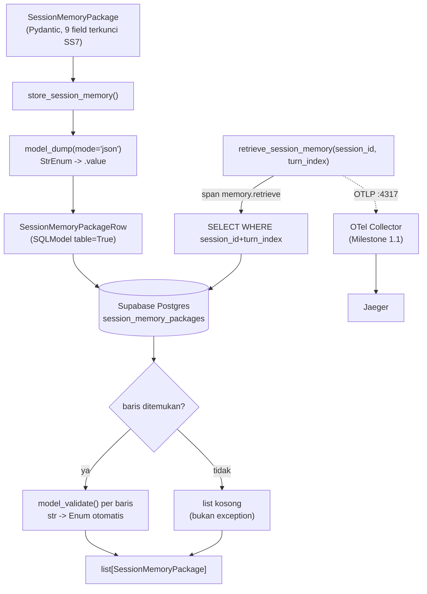

# Report — Milestone 1.5: Membangun Penarikan Data dari Session Memory

Milestone ini berjenis **berbasis kode/sistem** — outputnya mekanisme yang benar-benar berjalan (koneksi database nyata) dan bisa dibuktikan bekerja. Bagian 3 diisi penuh.

## Bagian 1 — Ringkasan Hasil

**Status akhir:** Selesai sesuai rencana.

Milestone 1.5 menghasilkan `store_session_memory()`/`retrieve_session_memory()` (`src/layers/context_resolution/session_memory.py`) — mekanisme penyimpanan dan pengambilan paket Session Memory berdasar `{session_id, turn_index}`, murni deterministik tanpa LLM sama sekali (beda total dari M1.3/M1.4). Milestone ini juga jadi titik penyelesaian dua keputusan tertunda sejak Milestone 1.2: database proyek dipilih (**Supabase**, project sama dengan rencana dashboard observability M5.x/M6.x, diakses lewat **SQLModel**) dan `src/config/roles.yaml` dimigrasi penuh ke tabel `roles` di database yang sama. Mekanisme diverifikasi lolos kedua Kriteria Keberhasilan sumber lewat panggilan database nyata ke Supabase, dengan tiga temuan mid-implementation yang diperbaiki di tempat (dialect driver, connection pooler, penyimpanan enum) dan satu insiden near-miss yang diverifikasi tidak menyebabkan kerusakan nyata.

## Bagian 2 — Kriteria Keberhasilan vs Bukti Nyata

| Kriteria (dari dokumen sumber) | Bukti Aktual | Terpenuhi? |
|---|---|---|
| "Referensi ke turn yang memang pernah dieksekusi dan tersimpan mengembalikan paket data yang isinya persis sama dengan yang tersimpan sebelumnya (nilai, status, catatan interpretasi — tidak ada yang hilang atau berubah dalam proses pengambilan)." | `test_kelompok_a_simpan_lalu_ambil_kembali_identik` — panggilan DB nyata, `results[0] == package` (semua 9 field, termasuk `nilai_hasil` dict dan `catatan_interpretasi` list). Diperkuat smoke test Checkpoint 6 dengan span nyata di Jaeger. Detail: `logs.md` Checkpoint 7. | Ya |
| "Referensi ke turn yang datanya kosong atau belum pernah ada tidak menyebabkan kegagalan sistem — cukup mengembalikan hasil kosong yang bisa ditangani dengan wajar oleh langkah berikutnya." | `test_kelompok_b_turn_tidak_ada_mengembalikan_list_kosong` — panggilan DB nyata ke turn yang belum pernah ada, `results == []`, tidak ada exception. Detail: `logs.md` Checkpoint 7. | Ya |

Verifikasi span nyata (di luar dua kriteria di atas, tapi bagian Output M1.5): span `memory.retrieve` dikonfirmasi muncul di Jaeger dengan `session.id`, `turn.index`, `memory.packages_found` terisi angka nyata dari hasil query. Detail: `logs.md` Checkpoint 6.

## Bagian 3 — Cara Kerja dan Arsitektur

### Cara Kerja

`store_session_memory(package: SessionMemoryPackage)` mengonversi schema Pydantic murni jadi `SessionMemoryPackageRow` (SQLModel `table=True`) lewat `model_dump(mode="json")` — memastikan `LabelBentukJawaban`/`StatusEksekusi` (StrEnum) diserialisasi ke `.value` yang benar (`"nilai_tunggal"`, bukan `"NILAI_TUNGGAL"`) — lalu insert ke tabel `session_memory_packages` di Supabase.

`retrieve_session_memory(session_id, turn_index)` query `WHERE session_id=... AND turn_index=...`, mengembalikan list kosong (bukan exception) kalau tidak ada baris cocok. Setiap row dikonversi balik jadi `SessionMemoryPackage` lewat `model_validate()` — Pydantic secara otomatis mengoersi string DB kembali jadi member Enum yang tepat. Dibungkus satu span `memory.retrieve`, mencatat `session.id`, `turn.index`, dan `memory.packages_found`.

Primary key tabel `session_memory_packages` sengaja **sintetik** (auto-increment `id`), bukan `atomic_intent_id` — karena Milestone 1.7 nanti akan menyimpan ULANG paket dengan `atomic_intent_id` yang sama sebagai baris arsip baru di bawah turn yang berjalan (lihat Lingkup M1.7), jadi `atomic_intent_id` bukan unik per baris.

### Diagram Arsitektur

### Integrasi dengan Komponen Lain

Section "Catatan Serah Terima ke Pekerjaan Lain" (`rancangan-context-decomposition.md` baris 158-159) eksplisit menyebut skema paket Session Memory yang dibaca M1.5 juga dipakai `rancangan-execution-interpretation.md` untuk menyimpan hasil eksekusi baru — kedua pekerjaan membaca dan menulis struktur data yang sama, perubahan skema perlu disepakati bersama. `retrieve_session_memory()` (Milestone 1.5) menghasilkan bentuk `list[SessionMemoryPackage]` yang ditahan sampai dipakai Milestone 1.7 (Pencocokan Atomic Intent × Data Memory) — belum digabung ke jalur manapun di milestone ini sendiri, sesuai Lingkup M1.5 ("hasil yang diambil di sini ditahan dulu").

Migrasi `roles.yaml` (Milestone 1.2) menutup keterikatan lintas-milestone yang eksplisit dicatat sejak awal (`docs/keputusan-tertunda.md` #1) — `src/schemas/turn_payload.py` (M1.2) sekarang transitif bergantung pada `src/config/database.py` (M1.5) lewat `load_valid_roles()`, dampak dan mitigasinya dibahas di Bagian 5.

## Bagian 4 — Perubahan dari Plan

Empat penyimpangan dari plan, semuanya koreksi/penyesuaian teknis di tempat (tidak ada checkpoint baru di luar struktur plan):

1. **Checkpoint 3, Task 4:** Dua temuan berurutan — (a) SQLAlchemy default jatuh ke driver `psycopg2` (tidak diinstal) untuk skema URL `postgresql://`, diperbaiki dengan normalisasi dialect eksplisit `postgresql+psycopg://`; (b) hostname *direct connection* Supabase IPv6-only, gagal resolve di jaringan lokal — diperbaiki dengan beralih ke connection string Connection Pooler (IPv4-compatible). Dicatat `decisions.md` Keputusan 12.
2. **Checkpoint 5, Task 9:** Kolom Enum native Postgres (rencana awal Checkpoint 4) ternyata menyimpan nama member Python, bukan value string yang dikunci arsitektur — diperbaiki jadi kolom `str` polos + validasi Enum di level Pydantic. Dicatat `decisions.md` Keputusan 13.
3. **Checkpoint 5 (insiden, bukan bug kode):** Query pembersihan tipe ENUM lama sempat tidak di-scope ke schema `public`, berpotensi menyentuh tipe internal Supabase (`auth`/`storage`/`realtime`). Diverifikasi langsung TIDAK ada kerusakan nyata (23 tabel schema `auth` tetap utuh) — dicatat sebagai near-miss, disampaikan ke user saat kejadian, pelajaran diterapkan untuk query administratif berikutnya (wajib schema-qualified).
4. **Checkpoint 10:** Rencana plan menyebut 2 commit (`test` verifikasi regresi + `chore` hapus file). Karena verifikasi regresi (Task 16-17) tidak mengubah file apa pun, tidak ada diff terpisah untuk commit "test" — hasil akhirnya 1 commit (`chore`) yang mencakup hasil kedua verifikasi di badan pesan.

## Bagian 5 — Keterbatasan dan Item Provisional

- **Input Layer (M1.2) sekarang transitif bergantung pada koneksi database** — `load_valid_roles()` query Supabase, bukan lagi murni in-memory. Mitigasi sadar: `@lru_cache(maxsize=1)` memastikan query cuma sekali per siklus hidup proses (cold start), bukan per-request. Regresi 12/12 `test_input_layer.py` mengonfirmasi tidak ada perilaku yang berubah, tapi test ini sekarang juga transitif butuh `DATABASE_URL` tersedia untuk lolos (dicatat sebagai perubahan karakteristik test, bukan disembunyikan).
- **Tanpa mekanisme TTL/expiry untuk Session Memory** — sesuai forced-decision (Kriteria Keberhasilan tidak memintanya, `arsitektur-ai-chatbot-rbac.md` Bagian 8 poin 2 eksplisit "masih terbuka"). Belum jadi masalah karena belum ada data produksi nyata.
- **Tanpa Alembic/migration tooling** — skema pertama, `SQLModel.metadata.create_all()` cukup untuk sekarang. Kalau skema `session_memory_packages`/`roles` perlu berubah nanti (kolom baru, dst.), Alembic perlu dipertimbangkan saat itu.
- **`store_session_memory()` tidak diinstrumentasi span khusus** — forced by kontrak observability (hanya `memory.retrieve` yang disebut eksplisit sebagai Output M1.5). Kalau Milestone 4.5 (Execution, pemanggil produksi store) butuh observability untuk operasi simpan, itu jadi kontrak milik milestone tersebut. *(Koreksi Milestone 4.3, 2026-08-17: nomor yang benar adalah 4.3, bukan 4.5 — span `memory.store` ditambahkan langsung di `store_session_memory()` oleh M4.3, lihat `milestones/4.3-penyimpanan-paket-session-memory/decisions.md` Keputusan 5.)*
- **Project Supabase dipakai bersama rencana M5.x/M6.x** — nama tabel (`session_memory_packages`, `roles`) sudah dipilih tidak bertabrakan dengan `traces`/`spans`, tapi ini perlu diperiksa ulang saat M5/M6 benar-benar mulai mengimplementasikan skemanya.
- **Model database TIDAK ditest untuk concurrent write** — skala proyek ini (solo, portofolio) belum butuh, tapi kalau nanti API produksi menerima banyak request paralel yang menulis Session Memory bersamaan, perilaku belum diverifikasi.

## Bagian 6 — Follow-up

- Milestone 1.7 (Pencocokan Atomic Intent × Data Memory) — menunggu langsung `list[SessionMemoryPackage]` dari `retrieve_session_memory()`, perlu membaca `src/schemas/session_memory.py` dan `src/layers/context_resolution/session_memory.py` langsung.
- Milestone 4.5 (Execution) — akan jadi pemanggil produksi pertama `store_session_memory()` untuk menyimpan hasil eksekusi baru (`sumber="eksekusi_baru"`); perlu mengonfirmasi span observability untuk operasi ini kalau kontraknya belum ada. *(Koreksi Milestone 4.3, 2026-08-17: nomor yang benar adalah 4.3 ("Membangun Penyimpanan Paket ke Session Memory") — Milestone 4.3 SUDAH menjadi pemanggil produksi pertama, lewat `src/layers/execution/penyimpanan_paket.py`. Span `memory.store` sudah dikonfirmasi/ditambahkan. Lihat `milestones/4.3-penyimpanan-paket-session-memory/report.md`.)*
- `docs/keputusan-tertunda.md` entri #1 ditandai selesai — lihat entri terpisah di dokumen tersebut.
- Kalau Milestone 5.x/6.x mulai mengimplementasikan skema `traces`/`spans` di project Supabase yang sama, cek ulang tidak ada tabrakan baru dengan `session_memory_packages`/`roles`.
