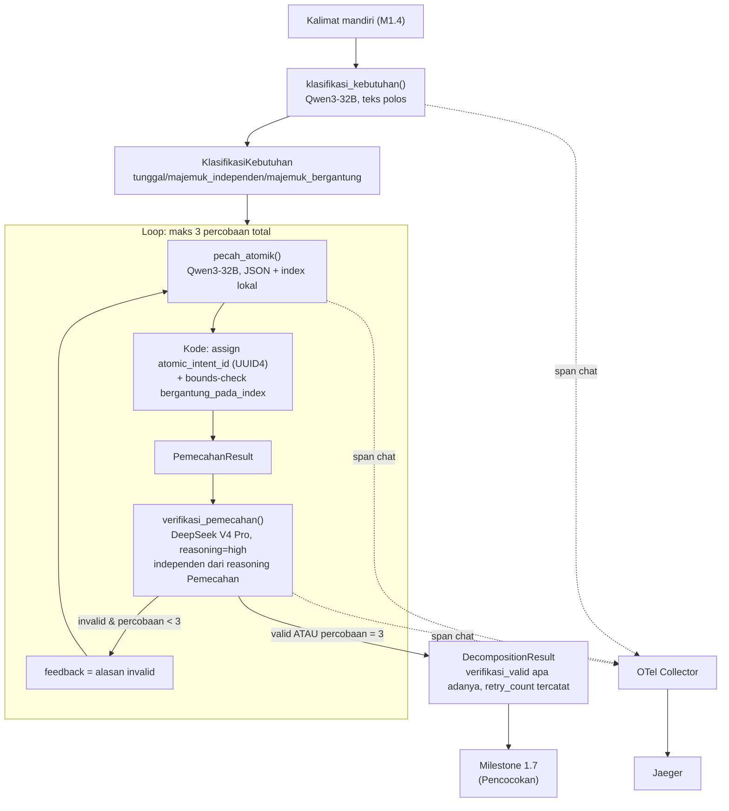

# Report — Milestone 1.6: Membangun Decomposition (Klasifikasi, Pemecahan, Verifikasi)

Milestone ini berjenis **berbasis kode/sistem** — outputnya mekanisme yang benar-benar berjalan (tiga pemanggilan LLM berurutan) dan bisa dibuktikan bekerja. Bagian 3 diisi penuh.

## Bagian 1 — Ringkasan Hasil

**Status akhir:** Selesai sesuai rencana.

Milestone 1.6 menghasilkan `decompose_question()` — mekanisme 3-langkah (Klasifikasi, Pemecahan, Verifikasi) yang mengubah kalimat mandiri hasil M1.4 jadi daftar kebutuhan atomik terstruktur. Ini pemanggilan LLM **generate-lalu-verify penuh pertama** di proyek (M1.3/M1.4 verifikasinya deterministik ruang-tertutup) — Langkah Verifikasi memakai model berbeda (DeepSeek V4 Pro, reasoning "high") dari Langkah Klasifikasi/Pemecahan (Qwen3-32B), dengan kebijakan retry maksimal 3 kali kalau verifikasi gagal. Diverifikasi nyata lolos kedua Kriteria Keberhasilan sumber. Eval mendalam 14 skenario menemukan pola signifikan: retry-dengan-feedback tidak menunjukkan bukti perbaikan pada 5/5 kasus gagal yang teramati, dan taksonomi `label_bentuk_jawaban` (5 nilai, dikunci arsitektur) punya gap nyata untuk kebutuhan deskriptif/multi-nilai — keduanya temuan substantif, bukan artefak metodologi eval.

## Bagian 2 — Kriteria Keberhasilan vs Bukti Nyata

| Kriteria (dari dokumen sumber) | Bukti Aktual | Terpenuhi? |
|---|---|---|
| "Pertanyaan majemuk yang saling bergantung (skenario uji: 'bandingkan X dengan Y'...) menghasilkan lebih dari satu kebutuhan atomik dengan relasi ketergantungan yang benar antara keduanya." | `test_kelompok_a_majemuk_bergantung_relasi_benar` — panggilan LLM nyata lewat `decompose_question()` end-to-end, >1 atomic intent dengan relasi bergantung yang benar-benar merujuk ke kebutuhan independen yang ada. Diperkuat 4/4 skenario majemuk-bergantung di eval (S03, S04, S06, S13) — struktur relasi benar di SEMUA kasus termasuk yang gagal verifikasi karena alasan lain. | Ya |
| "Langkah verifikasi terbukti mampu menangkap setidaknya satu kasus pemecahan yang sengaja dibuat keliru dalam pengujian terkontrol." | `test_kelompok_b_verifikasi_menangkap_pemecahan_keliru` — hasil pemecahan sengaja dibuat keliru (kebutuhan hilang) dipanggil langsung ke `verifikasi_pemecahan()`, `valid=False` dengan alasan spesifik. Diperkuat S11 eval (kesalahan SUBTIL — label+relasi keliru, bukan hilang total — juga tertangkap) DAN ditemukan tidak sengaja di 5 skenario eval lain (S05-S08, S14) yang genuinely gagal verifikasi karena alasan nyata (bukan skenario terkontrol, tapi bukti tambahan verifikasi bekerja). | Ya |

Verifikasi span nyata (di luar dua kriteria di atas, tapi bagian Output M1.6): span `chat` ×3 dikonfirmasi muncul di Jaeger — Klasifikasi (`decomposition.classification`), Pemecahan (`intent.count`, `intent.relation_type`), Verifikasi (`decomposition.verification_valid`) — dengan atribut terisi nyata untuk kedua model (Qwen3-32B dan DeepSeek V4 Pro).

## Bagian 3 — Cara Kerja dan Arsitektur

### Cara Kerja

`decompose_question(question)` memanggil `klasifikasi_kebutuhan()` sekali (Qwen3-32B, teks polos, 3 nilai enum), lalu loop `pecah_atomik()` (Qwen3-32B, JSON, index lokal untuk relasi) → `verifikasi_pemecahan()` (DeepSeek V4 Pro reasoning="high", JSON, menilai independen tanpa melihat reasoning Pemecahan) — diulang maksimal 3 kali total kalau verifikasi invalid, dengan alasan invalid disisipkan sebagai feedback ke percobaan Pemecahan berikutnya.

`atomic_intent_id` tidak pernah diminta dari LLM — kode generate UUID4 SETELAH respons Pemecahan diterima, menerjemahkan index lokal LLM (`bergantung_pada_index`) jadi UUID sungguhan dengan bounds-check deterministik (index dangling di-drop + flag anomali span) — mirror pola bounds-check M1.3.

### Diagram Arsitektur

### Integrasi dengan Komponen Lain

Output `DecompositionResult` (khususnya `atomic_intents: list[AtomicIntent]`) jadi input langsung Milestone 1.7 (Pencocokan Atomic Intent × Data Memory) — dikonfirmasi lewat `rancangan-context-decomposition.md` diagram pipeline (Langkah 5-6 → Langkah 7). `label_bentuk_jawaban` per atomic intent (di-reuse dari `src/schemas/session_memory.py`, M1.5) jadi kontrak bersama yang sama dipakai Milestone 1.5 (baca/simpan) dan nanti Milestone 4.x (Execution/Interpretation) — temuan gap taksonomi (Bagian 5) relevan langsung untuk konsumen ini.

## Bagian 4 — Perubahan dari Plan

Satu penyimpangan dari plan (murni penyederhanaan teknis, tidak ada checkpoint baru di luar struktur plan):

1. **Checkpoint 7, Task 7:** Plan menyebut `decomposition.retry_count`/`decomposition.verification_exhausted` sebagai span attribute pada span Langkah 6 (Verifikasi) di percobaan terakhir. Disederhanakan: informasi ini cukup tersedia lewat `DecompositionResult.retry_count` yang dikembalikan fungsi, TIDAK diretrofit ke span (akan butuh mengubah signature `verifikasi_pemecahan()` yang sudah teruji di Checkpoint 6 untuk manfaat marginal). Kontrak observability sendiri (`rancangan-observability-ai-chatbot.md` Bagian 2) hanya mewajibkan `intent.count`/`intent.relation_type` untuk layer Decomposition — atribut retry adalah elaborasi plan sendiri, bukan kontrak mengikat, jadi penyederhanaan ini tidak melanggar kewajiban observability manapun.

## Bagian 5 — Keterbatasan dan Item Provisional

- **Retry-dengan-feedback belum menunjukkan bukti perbaikan** — temuan paling signifikan dari eval mendalam (`evals/1.6-decomposition/audit.md`). Di seluruh 13 skenario eval, `retry_count` cuma bernilai 0 (langsung benar) atau tepat 2/exhausted (gagal total di semua 3 percobaan) — TIDAK ADA kasus yang membaik di percobaan tengah meski feedback alasan invalid disisipkan eksplisit ke prompt. Baru 5 data point kegagalan, belum cukup untuk mengubah kebijakan (Keputusan 3 `decisions.md`, sudah diputuskan user), tapi **layak dipantau eksplisit di milestone/eval berikutnya** — kalau pola sama berulang, kebijakan retry mungkin perlu didesain ulang (feedback lebih terstruktur, atau reconsider nilai tambah retry dibanding flag-and-pass-through).
- **Taksonomi `label_bentuk_jawaban` (5 nilai) py gap nyata** untuk kebutuhan deskriptif/naratif terbuka (mis. "bagaimana performa X") dan kebutuhan pendukung multi-nilai yang jadi input tren (mis. "nilai per bulan" sebelum dihitung trennya) — ditemukan lewat 2 skenario eval (S05, S07) yang verifier tolak berulang tanpa ada label yang benar-benar cocok tersedia. **Bukan bug M1.6** — ini kontrak bersama PIC 1/PIC 4 yang dikunci `arsitektur-ai-chatbot-rbac.md` §7, tidak bisa diubah sepihak. Dipromosikan jadi entri baru `docs/keterbatasan-diterima.md` (lihat Bagian 6).
- **Mislabel persisten meski label benar tersedia** (S08 eval — pertanyaan "siapa 5 staff teratas" tetap dilabel `nilai_tunggal` bukan `peringkat` di 3 percobaan berturut-turut) — indikasi `_SYSTEM_PROMPT` `pemecahan.py` bisa diperkuat dengan contoh eksplisit per label, belum dilakukan sekarang (butuh lebih banyak data, konsisten preseden M1.3 soal tidak mengubah prompt produksi dari sedikit temuan).
- **Over-dekomposisi** (S06 eval — Pemecahan menambah kebutuhan perbandingan yang tidak diminta literal) — pola kebalikan dari under-capture yang lebih umum ditemukan di M1.3/M1.4.
- **Disagreement filosofi atomicity untuk permintaan gabungan** (S14 eval — user minta "satu angka gabungan", Verifier tetap menuntut breakdown per komponen) — area abu-abu yang defensible dari kedua sisi, belum ada keputusan eksplisit dari dokumen sumber soal ini.
- **Kompleksitas/volume TIDAK memprediksi kegagalan** — S13 (skenario paling rumit yang dirancang, 11 atomic intent) lolos bersih di percobaan pertama; kegagalan nyata justru pada skenario dengan 1-2 atomic intent (S05, S08). Berguna untuk kalibrasi ekspektasi risiko di milestone/eval mendatang.
- **`store_session_memory()`-setara untuk Decomposition tidak ada** — M1.6 tidak menulis apa pun ke database, murni fungsi transformasi in-memory, konsisten Lingkup milestone.
- **Belum wired ke endpoint HTTP manapun** — konsisten preseden M1.3/M1.4/M1.5.

## Bagian 6 — Follow-up

- Milestone 1.7 (Pencocokan) — menunggu langsung `DecompositionResult.atomic_intents` sebagai input.
- **Entri baru `docs/keterbatasan-diterima.md`** ditambahkan (Task 15, Checkpoint 10) mencakup gap taksonomi `label_bentuk_jawaban` DAN temuan retry-tidak-efektif — dua isu lintas-milestone yang perlu dipantau, bukan diperbaiki sepihak sekarang.
- Kalau Milestone 4.x (Execution/Interpretation) mulai mengonsumsi `label_bentuk_jawaban` untuk penyusunan visualisasi (M4.5), gap taksonomi ini relevan langsung — perlu ditinjau ulang bersama pemilik kontrak sebelum M4.5 dimulai.
- Kalau milestone LLM berikutnya juga punya mekanisme retry serupa, pantau apakah pola "retry_count 0 atau exhausted, tidak pernah membaik di tengah" berulang — kalau ya, pertimbangkan redesign kebijakan retry project-wide.
