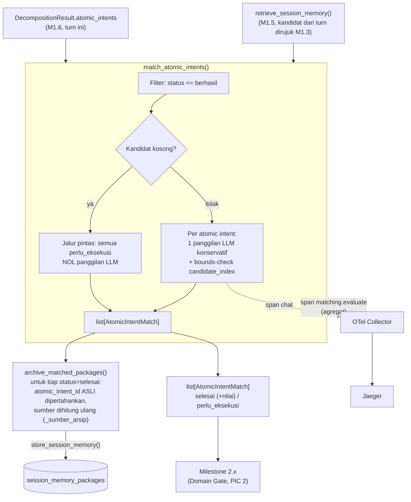

# Report — Milestone 1.7: Membangun Pencocokan Atomic Intent terhadap Data Session Memory

Milestone ini berjenis **berbasis kode/sistem** — outputnya mekanisme yang benar-benar berjalan (pencocokan LLM + arsip ulang ke database) dan bisa dibuktikan bekerja. Bagian 3 diisi penuh.

## Bagian 1 — Ringkasan Hasil

**Status akhir:** Selesai sesuai rencana.

Milestone 1.7 menghasilkan `match_and_archive()` (`src/layers/context_resolution/matching.py`) — titik temu jalur Decomposition (M1.6) dan Session Memory (M1.5) yang sebelumnya berjalan paralel sejak M1.3. Mekanisme pencocokan yang sebelumnya berstatus "KERANGKA AWAL" di dokumen arsitektur sekarang diputuskan: LLM semantik (Qwen3-32B), satu panggilan konservatif per atomic intent dengan fallback aman ke `perlu_eksekusi` — BUKAN pola generate-lalu-verify penuh seperti M1.6, karena risiko di titik ini asimetris (false negative aman/murah, false positive berbahaya) dan bisa ditangani cukup lewat desain prompt + fallback tanpa verifier independen kedua. Kandidat difilter ke `status=berhasil` saja sebelum ditawarkan sebagai kandidat cocok — keputusan penulis yang dikonfirmasi user lewat diskusi pemahaman sistem sebelum plan ditulis. Diverifikasi nyata lolos ketiga Kriteria Keberhasilan sumber, termasuk rantai arsip ulang turun-temurun (turn 7→5→3) yang dibuktikan lewat DUA pemanggilan nyata berantai, bukan fixture ganda. Eval mendalam 11 skenario menemukan mekanisme filter dan prompt konservatif bekerja tepat sesuai desain di seluruh kasus kritis (anti false-positive entitas kunci, filter status), dengan satu temuan nyata: pola distractor-confusion pada kandidat topik-mirip (manifestasi baru dari recency bias yang sudah tercatat lintas M1.3/M1.4) plus non-determinisme `temperature=0` pada model — keduanya gagal ke arah aman, tidak pernah false-positive.

## Bagian 2 — Kriteria Keberhasilan vs Bukti Nyata

| Kriteria (dari dokumen sumber) | Bukti Aktual | Terpenuhi? |
|---|---|---|
| "Kebutuhan atomik yang jelas merujuk hasil yang sudah dieksekusi di turn sebelumnya (skenario uji: 'occupancy April 2026'...) berhasil dicocokkan dengan benar dan tidak dieksekusi ulang." | `test_kelompok_a_intent_sudah_tersimpan_dicocokkan_tidak_dieksekusi_ulang` — panggilan LLM+DB nyata lewat `match_and_archive()` end-to-end, `status=selesai` dengan `nilai_hasil` identik paket asal. Diperkuat 8/9 skenario eval yang menguji arah "harus cocok" (S01, S06[a], S08, S11) LOLOS penuh. | Ya |
| "Kebutuhan atomik yang benar-benar baru... tidak pernah tercocokkan secara keliru ke data lama manapun." | `test_kelompok_b_intent_baru_tidak_pernah_cocok_keliru` — topik tidak berkaitan, `status=perlu_eksekusi`, `paket=None`. Diperkuat S02/S03 eval (entitas kunci beda, topik/domain sama — kasus PALING SULIT untuk anti false-positive) LOLOS bersih, dan S09 (temuan nyata) tetap gagal ke arah AMAN (tidak pernah salah cocok ke kandidat yang salah). | Ya |
| "Paket yang diambil dari memory dan disimpan ulang sebagai arsip turn ini bisa ditarik kembali oleh turn berikutnya yang merujuk balik ke turn saat ini (skenario uji: turn ketujuh merujuk hasil turn kelima, di mana hasil itu sendiri sebenarnya berasal dari turn ketiga)." | `test_kelompok_c_rantai_arsip_ulang_turn_tujuh_lima_tiga` — DUA pemanggilan `match_and_archive()` NYATA berantai (bukan fixture ganda): turn 5 mengarsip dari turn 3, lalu turn 7 mencocokkan ke baris arsip turn 5 yang BENAR-BENAR baru ditulis. `sumber` baris turn 7 tetap `"session_memory (turn 3)"` (turn PALING ASAL), tidak putus di turn 5 (arsip perantara) — dibuktikan lewat `_sumber_arsip()` yang ditemukan dan diperbaiki SELAMA smoke test Checkpoint 5. | Ya |

Verifikasi span nyata (di luar tiga kriteria di atas, tapi bagian Output M1.7): span wrapper non-LLM `matching.evaluate` + span `chat` bersarang dikonfirmasi muncul di Jaeger lewat query API langsung — atribut `candidate.pool_size`, `intent.matched_count`/`intent.unmatched_count` (agregat, sesuai kontrak "jumlah atomic intent cocok/tidak cocok"), `gen_ai.request.model`, `matching.result` per panggilan — semua terisi nyata.

## Bagian 3 — Cara Kerja dan Arsitektur

### Cara Kerja

`match_and_archive(atomic_intents, candidates, session_id, turn_index)` memanggil `match_atomic_intents()` lalu `archive_matched_packages()` untuk hasilnya. `match_atomic_intents()` memfilter `candidates` ke `status=berhasil` saja; kalau hasil filter kosong, jalur pintas deterministik (semua `perlu_eksekusi`, nol panggilan LLM). Kalau ada kandidat, satu panggilan LLM konservatif PER atomic intent (Qwen3-32B, index lokal ke daftar kandidat terfilter, mirror pola index-lokal M1.3/M1.6), dengan bounds-check deterministik pada `candidate_index` sebagai jaring pengaman struktural — fallback ke `perlu_eksekusi` pada kegagalan apa pun (parse gagal, API gagal, index dangling).

`archive_matched_packages()` untuk tiap match `selesai`, membangun `SessionMemoryPackage` baru dengan `atomic_intent_id`/field lain disalin UTUH dari paket lama (BUKAN `atomic_intent_id` baru M1.6 turn ini), `turn_index` diganti ke turn saat ini, dan `sumber` dihitung lewat `_sumber_arsip()` — dibangun ulang jadi `"session_memory (turn N)"` (N = turn asal) kalau paket lama masih `"eksekusi_baru"`, atau dipertahankan verbatim kalau paket lama sudah berupa arsip sebelumnya (rantai transitif).

### Diagram Arsitektur

### Integrasi dengan Komponen Lain

Input: `AtomicIntent` (M1.6) dan `SessionMemoryPackage` (M1.5, hasil `retrieve_session_memory()` berdasar referensi M1.3) — DITERIMA sebagai parameter polos, TIDAK memanggil layer sebelumnya secara internal (mirror pola komposisi longgar seluruh proyek). Output `list[AtomicIntentMatch]` — dikonfirmasi lewat `rancangan-context-decomposition.md` (Catatan Serah Terima) jadi input langsung Domain Gate (`rancangan-rbac-authorization.md`, PIC 2, Milestone 2.x) bersama kalimat mandiri hasil M1.4. Sisi database: `archive_matched_packages()` adalah pemanggil produksi PERTAMA `store_session_memory()` (M1.5) — sebelumnya cuma dipakai sebagai utilitas test.

## Bagian 4 — Perubahan dari Plan

Dua penyimpangan dari plan, keduanya ditemukan dan diperbaiki SEBELUM commit (bukan dibiarkan sebagai bug tersembunyi):

1. **Checkpoint 5, Task 5:** Plan menyebut `sumber` "disalin UTUH dari paket lama". Smoke test langsung menemukan ini keliru untuk hop PERTAMA rantai (paket lama `sumber="eksekusi_baru"` harus DIBANGUN ULANG jadi `"session_memory (turn N)"`, bukan disalin verbatim) — kalau tidak, KK3 tidak akan tercermin di data sama sekali. Diperbaiki dengan `_sumber_arsip()` sebelum commit Checkpoint 5; `decisions.md` Keputusan 7 diperbarui menjelaskan koreksi ini secara eksplisit (opsi yang salah DAN opsi yang benar-benar keliru lainnya sama-sama dicatat di "Opsi yang Dipertimbangkan tapi Ditolak").
2. **Checkpoint 8, Task 11:** Plan menyebut 10 skenario eval (S01-S10). Run pertama menemukan S07 (non-eksklusivitas) tidak benar-benar menguji Keputusan 6 karena payload skenario mengandung ambiguitas temporal tak disengaja — ditambahkan S11 (retest dengan paraphrase eksplisit) sebagai skenario ke-11, konsisten prinsip "jumlah skenario tidak dipatok" (bukan penyimpangan, melainkan penerapan langsung prinsip itu).

## Bagian 5 — Keterbatasan dan Item Provisional

- **Verifikasi memakai data seed manual, bukan pipeline organik** — `session_memory_packages` di Supabase masih kosong secara organik (Execution/M4.5 belum dibangun). Disepakati EKSPLISIT dengan user sebelum plan ditulis (lihat diskusi pemahaman sistem, `decisions.md` Keputusan 13): test/smoke test menyuntik data via `store_session_memory()` mirror pola M1.5. KK3 khususnya dibuktikan lewat DUA pemanggilan `match_and_archive()` NYATA berantai (bukan dua fixture independen) — memastikan rantai arsip ulang teruji lewat eksekusi kode sungguhan, bukan simulasi ganda yang berpotensi menyembunyikan bug integrasi.
- **Distractor confusion (manifestasi baru recency bias) + non-determinisme `temperature=0`** — temuan eval S09 (`evals/1.7-pencocokan-atomic-intent/audit.md`). Kandidat dengan topik mirip-tapi-salah (bukan cuma posisi terakhir) bisa membuat model ragu bahkan terhadap kandidat yang objektif benar, menghasilkan `perlu_eksekusi` alih-alih match yang benar (arah AMAN, bukan false-positive) — DAN prompt+kandidat identik persis menghasilkan hasil berbeda di dua run terpisah meski `temperature=0`. Bukan bug M1.7 — karakteristik model/provider yang ditemukan lewat testing nyata, berkorelasi langsung dengan `docs/keterbatasan-diterima.md` #3 (recency bias, sudah teramati M1.3+M1.4). Dipromosikan jadi tambahan entri #3 (bukan entri baru terpisah — akar fenomena sama), lihat Bagian 6.
- **Filter kandidat `status=berhasil` (Keputusan 4) adalah judgment call penulis**, tidak tersurat eksplisit di dokumen sumber, meski sudah divalidasi nyata lewat S04/S05 eval (bekerja bahkan pada kasus teks identik persis) dan dikonfirmasi user lewat diskusi sebelum plan ditulis.
- **Belum wired ke endpoint HTTP manapun** — konsisten preseden M1.3/M1.4/M1.5/M1.6.
- **`match_atomic_intents()` tidak dites terhadap kandidat dari LEBIH DARI satu turn sekaligus** — sesuai desain arsitektur (M1.3 hanya pernah mendeteksi SATU `{session_id, turn_index}` rujukan per turn), bukan keterbatasan implementasi, tapi dicatat eksplisit sebagai batas cakupan yang sengaja tidak diuji di luar itu.

## Bagian 6 — Follow-up

- Milestone 2.x (Domain Gate, PIC 2) — menunggu langsung `list[AtomicIntentMatch]` sebagai input, bersama kalimat mandiri M1.4.
- **`docs/keterbatasan-diterima.md` #3 diperluas** (Task 14, Checkpoint 9) mencakup temuan distractor-confusion + non-determinisme `temperature=0` dari M1.7 — bukan entri baru terpisah, melainkan data point tambahan (milestone ketiga, mekanisme berbeda) untuk fenomena recency bias/disambiguasi multi-kandidat yang sudah tercatat.
- Kalau milestone LLM berikutnya (mis. lanjutan M1.x atau PIC 2-4) yang mengandalkan `temperature=0` untuk reproduksibilitas hasil menemukan pola non-determinisme serupa, pertimbangkan mendokumentasikan ini sebagai karakteristik project-wide, bukan spesifik M1.7.
- Kalau pola distractor-confusion terus berulang di milestone berikutnya yang juga melakukan disambiguasi multi-kandidat (mis. Retriever M3.x memilih di antara 67 view), pertimbangkan mitigasi lintas-mekanisme (mis. instruksi prompt eksplisit soal mengabaikan kemiripan topik permukaan, fokus ke entitas kunci) — belum mendesak sekarang (baru 3 data point lintas M1.3/M1.4/M1.7).
