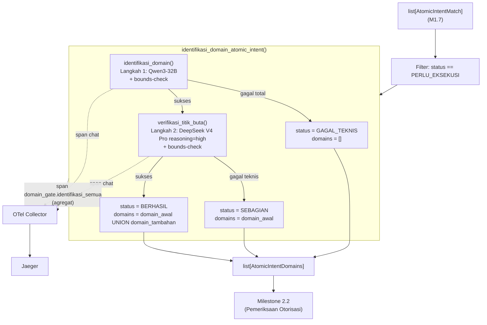

# Report — Milestone 2.1: Membangun Identifikasi Domain dan Verifikasi Titik Buta

Milestone ini berjenis **berbasis kode/sistem** — outputnya mekanisme yang benar-benar berjalan (dua panggilan LLM berurutan + observability) dan bisa dibuktikan bekerja lewat panggilan nyata. Bagian 3 diisi penuh.

## Bagian 1 — Ringkasan Hasil

**Status akhir:** Selesai sesuai rencana, dengan satu perubahan strategi eksekusi eval (Bagian 4) dan satu keterbatasan operasional infrastruktur belum terselesaikan penuh (Bagian 5).

Milestone 2.1 menghasilkan `identifikasi_domain_semua()`/`identifikasi_domain_atomic_intent()` (`src/layers/domain_gate/domain_gate.py`) — pekerjaan LLM pertama PIC 2 (Domain Gate), konsumen langsung `list[AtomicIntentMatch]` (M1.7) dan kalimat mandiri (M1.4). Dua mekanisme berurutan diimplementasikan sesuai Output dokumen sumber: identifikasi domain awal (Qwen3-32B) diikuti verifikasi titik buta independen (DeepSeek V4 Pro, `reasoning="high"`) yang secara aktif mencari domain yang mungkin terlewat — union aditif, BUKAN retry/re-scoring seperti pola M1.6. Cakupan konteks grounding untuk prompt sengaja dibatasi (10 domain + satu contoh cross-domain terdokumentasi `gop_margin`, bukan seluruh 67 view) — keputusan yang terbukti tepat lewat eval (S01: generalisasi ke kasus BARU yang tidak pernah dicontohkan berhasil). Diverifikasi nyata lolos ketiga Kriteria Keberhasilan sumber lewat panggilan LLM sungguhan (`tests/layers/domain_gate/`) dan span nyata di Jaeger. Eval mendalam 10 skenario menemukan mekanisme identifikasi awal presisi tinggi di seluruh kasus (baseline bersih, domain minor, jebakan payroll), dengan satu temuan nyata berulang: verifikasi titik buta cenderung over-triggering (menambah domain tak esensial) pada kombinasi kata bertema finansial/temporal — konsekuensi wajar dari desain yang sengaja mengutamakan tidak-terlewat-domain (asimetri risiko RBAC), bukan bug.

## Bagian 2 — Kriteria Keberhasilan vs Bukti Nyata

| Kriteria (dari dokumen sumber) | Bukti Aktual | Terpenuhi? |
|---|---|---|
| "Kebutuhan yang secara eksplisit menyebut satu domain saja, tapi sebenarnya menyentuh kolom turunan dari domain lain (skenario uji: pertanyaan yang menyentuh `gop_margin` di view domain `reservation`), berhasil mengenali kedua domain, bukan hanya domain yang disebut eksplisit." | `test_kelompok_a_leakage_gop_margin_kenali_dua_domain` (panggilan LLM nyata) — `reservation` DAN `financial` terdeteksi. Diperkuat span nyata Jaeger Checkpoint 8 (`trace_id=ed0a755f...`) dan S01 eval (generalisasi ke kasus BARU "margin keuntungan F&B" — `fnb`+`financial` terdeteksi tanpa pernah dicontohkan literal). | Ya |
| "Langkah verifikasi titik buta terbukti mampu menangkap setidaknya satu domain yang sengaja dihilangkan dari hasil langkah pertama dalam pengujian terkontrol." | `test_kelompok_a_kk2_menangkap_domain_sengaja_dihilangkan` — `domain_awal=[reservation]` sengaja tidak lengkap untuk pertanyaan `gop_margin`, `verifikasi_titik_buta()` berhasil menangkap `financial` sebagai `domain_tambahan`. Guard anti-false-positif diperkuat `test_kelompok_b_guard_anti_false_positive...` (tidak menambah domain palsu kalau `domain_awal` sudah lengkap). | Ya |
| "Kebutuhan yang menyebut 'data tamu' secara umum tanpa menegaskan jenis kolomnya (skenario uji: 'beri saya data kontak Bapak Herman' vs 'berapa nationality mix tamu bulan ini') diklasifikasikan ke domain `guests_pii` atau `guests_profile` secara tepat sesuai kolom yang sebenarnya dimaksud — bukan domain generik 'guests', bukan disamaratakan." | `test_kelompok_b_guests_pii_kontak_tamu` (→ `guests_pii`, `guests_profile` TIDAK ikut) dan `test_kelompok_c_guests_profile_nationality_mix` (→ `guests_profile`, `guests_pii` TIDAK ikut) — panggilan LLM nyata, keduanya presisi. Diperkuat span nyata Jaeger (`trace_id=6fed6752...`) dan S03 eval (kasus GABUNGAN — `guests_pii` DAN `guests_profile` sekaligus dibutuhkan — juga presisi). | Ya |

Verifikasi span nyata (di luar tiga kriteria di atas, tapi bagian Output M2.1): span `chat` × 2 per atomic intent (identifikasi + verifikasi titik buta) dikonfirmasi muncul di Jaeger lewat query API langsung untuk skenario KK1 dan KK3 — atribut `gen_ai.operation.name`/`gen_ai.request.model`/`gen_ai.usage.input_tokens`/`gen_ai.usage.output_tokens` dan atribut kustom (`domain_gate.identifikasi.domains_found`, `domain_gate.verifikasi_titik_buta.domain_tambahan_count`, `domain_gate.gagal_teknis_count`, `domain_gate.sebagian_count`, `intent.count`) semua terisi nyata sesuai kontrak Bagian 2 `rancangan-observability-ai-chatbot.md`.

## Bagian 3 — Cara Kerja dan Arsitektur

### Cara Kerja

`identifikasi_domain_semua(matches: list[AtomicIntentMatch])` memfilter ke `status=PERLU_EKSEKUSI` saja (entri `SELESAI` sudah py jawaban dari Session Memory, langsung ke Interpretation tanpa identifikasi domain), lalu memanggil `identifikasi_domain_atomic_intent()` per atomic intent (bukan batch — Keputusan 10). Untuk tiap atomic intent: `identifikasi_domain()` (Langkah 1, Qwen3-32B) menghasilkan domain awal; kalau gagal total (`gagal=True`, mis. `APIError`/respons kosong/seluruh domain hallucinated), langsung `status=GAGAL_TEKNIS` TANPA memanggil Langkah 2 (tidak ada dasar untuk diverifikasi). Kalau sukses, `verifikasi_titik_buta()` (Langkah 2, DeepSeek V4 Pro `reasoning="high"`) mencari domain tambahan yang mungkin terlewat — union `domain_awal ∪ domain_tambahan` (dedupe, preserve order) jadi hasil akhir; `status=SEBAGIAN` kalau Langkah 2 gagal teknis (domain Langkah 1 tetap dipakai, belum diverifikasi independen), `status=BERHASIL` kalau keduanya sukses.

Kedua langkah LLM memakai bounds-check deterministik identik (`bounds_check_domains()`, dipakai bersama) — domain string di luar 10 nilai closed-set di-drop + dicatat span attribute anomali, tidak pernah crash atau meloloskan nilai invalid. Konteks grounding (`konteks_domain.py`) dipakai bersama kedua prompt — 10 deskripsi domain + catatan pola jebakan (kebocoran kolom turunan + contoh `gop_margin`, fokus terlalu sempit, pemisahan `guests_pii`/`guests_profile`).

### Diagram Arsitektur

### Integrasi dengan Komponen Lain

Input: `list[AtomicIntentMatch]` (M1.7, `match_and_archive()`) — DITERIMA sebagai parameter polos, TIDAK memanggil layer sebelumnya secara internal (mirror pola komposisi longgar M1.7 Keputusan 10). Output: `list[AtomicIntentDomains]` — belum ada konfirmasi Serah Terima penuh ke M2.2 karena M2.2 belum dikerjakan (lihat Bagian 5, item provisional).

## Bagian 4 — Perubahan dari Plan

Satu penyimpangan signifikan dari plan, pada strategi EKSEKUSI (bukan hasil/desain kode):

1. **Checkpoint 5-10 (pola test):** Plan menyebut "unit test dengan LLM di-mock". Setelah cek preseden nyata (`tests/layers/context_resolution/test_matching.py`, `tests/layers/decomposition/test_decompose.py`), ditemukan project TIDAK PERNAH mock panggilan LLM di `tests/` — konvensi nyata adalah panggilan LLM sungguhan, di-skip otomatis kalau `OPENROUTER_API_KEY` tidak diset. Diikuti pola preseden ini (bukan pola "mock" yang disebut plan): fungsi pure (`bounds_check_domains`, `_parse_and_decide`) diuji dengan string buatan tangan untuk kasus hallucinated/parse-error, sementara fungsi utama diuji end-to-end dengan panggilan nyata.
2. **Checkpoint 10 (strategi eksekusi eval):** Plan membayangkan `run_eval.py` dijalankan satu proses tunggal 10 skenario berurutan. Eksekusi nyata menemukan pola hang berkepanjangan tanpa exception yang tidak konsisten (root cause tidak terisolasi penuh, lihat Bagian 5) — diadaptasi jadi eksekusi per-skenario/proses-terisolasi (CLI filter `sys.argv[1]` ditambahkan ke `run_eval.py`), terbukti jauh lebih andal empiris. Hasil akhir (10 payload lengkap) tetap identik dengan yang direncanakan.

## Bagian 5 — Keterbatasan dan Item Provisional

- **Over-triggering verifikasi titik buta pada kata bertema finansial/temporal** — temuan eval S04 (replikasi PERSIS 2x temuan Checkpoint 8) dan S08 (pola serupa). Konsekuensi wajar dari desain yang sengaja mengutamakan tidak-terlewat-domain (Keputusan 9, asimetri risiko M2.1 kebalikan dari M1.7) — dicatat `docs/keterbatasan-diterima.md` #6, bukan bug yang diperbaiki sekarang.
- **Hang panggilan LLM operasional, root cause tidak teridentifikasi penuh** — ditemukan saat eksekusi eval (Checkpoint 10), mitigasi defensif (`timeout=90.0, max_retries=1` eksplisit di `get_openrouter_client()`) diterapkan tapi BUKAN solusi akar masalah yang terbukti. Dicatat `docs/keterbatasan-diterima.md` #7 dengan kejujuran eksplisit soal keterbatasan investigasi ini.
- **Belum wired ke endpoint HTTP manapun** — konsisten preseden M1.2-M1.7.
- **Serah Terima ke M2.2 belum bisa dikonfirmasi penuh** — dokumen sumber (`rancangan-rbac-authorization.md`, "Catatan Serah Terima") menyatakan daftar domain M2.1-2.2 jadi input Retriever/Query Engine; M2.1 sendiri baru separuh dari cakupan itu (M2.2 — pemeriksaan otorisasi — belum dikerjakan). Bentuk keluaran `AtomicIntentDomains` sudah stabil secara desain tapi belum divalidasi lintas-pekerjaan dengan pemilik M2.2 (yang juga bagian dari cakupan PIC 2 yang sama, jadi risiko rendah).
- **`identifikasi_domain_atomic_intent()` cabang status `GAGAL_TEKNIS`/`SEBAGIAN` tidak diuji lewat kegagalan API yang dipaksa nyata** — project tidak mock panggilan LLM, kegagalan API tidak bisa dipicu deterministik on-demand. Divalidasi lewat review kode (pemetaan if/else langsung dari flag `gagal` yang sudah teruji di level `identifikasi.py`/`verifikasi_titik_buta.py`) — dicatat eksplisit sebagai keterbatasan verifikasi di `logs.md` Checkpoint 7, bukan diklaim teruji end-to-end.

## Bagian 6 — Follow-up

- Milestone 2.2 (Pemeriksaan Otorisasi, PIC 2) — menunggu langsung `list[AtomicIntentDomains]` sebagai input untuk dicocokkan ke `role_permissions`. Perlu menyadari kemungkinan domain "berlebih" dari M2.1 (lihat `docs/keterbatasan-diterima.md` #6) saat merancang UX pesan penolakan — pertimbangkan penolakan parsial per-domain, bukan blanket-reject.
- Kalau pola hang panggilan LLM (`docs/keterbatasan-diterima.md` #7) terulang di Milestone 2.2 meski sudah ada timeout eksplisit, investigasi lebih dalam layak dilakukan (root cause M2.1 belum ditemukan penuh).
- Perbaikan typo "19 role" → "20 role" di `CLAUDE.md` bagian "Dokumen Sumber Kebenaran" (ditemukan saat riset plan M2.1, terverifikasi dari isi tabel `rancangan-rbac-ai-chatbot.md` Bagian 2 yang berisi persis 20 baris peran) — diterapkan bersamaan pembaruan "Status Saat Ini" (Checkpoint 12).
- Milestone 2.3 (Deteksi Constraint Cakupan-Individu) menunggu daftar view "performa individu" yang eksplisit ditunda dokumen sumber untuk didiskusikan terpisah saat pengerjaan dimulai — tidak terpengaruh M2.1.
