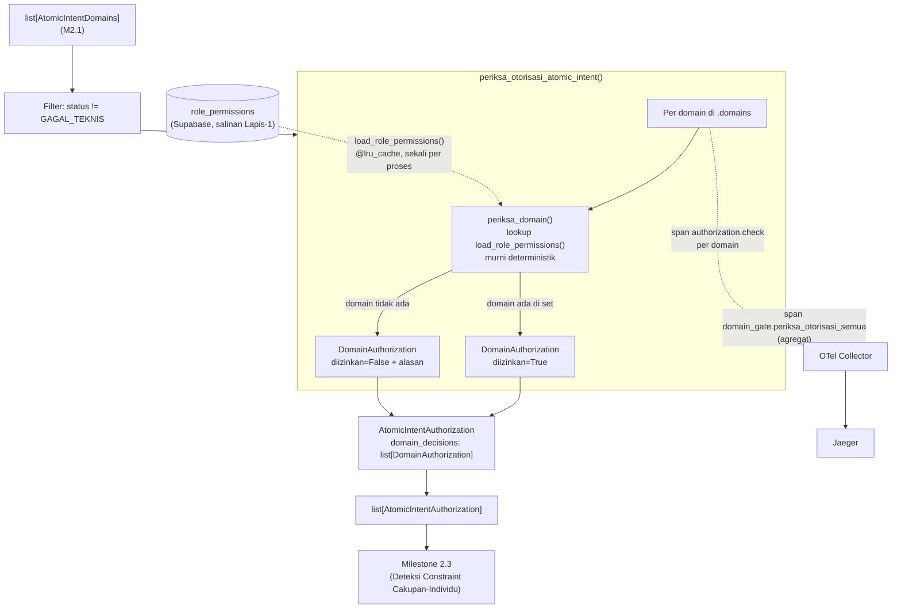

# Report — Milestone 2.2: Membangun Pemeriksaan Otorisasi

Milestone ini berjenis **berbasis kode/sistem** — outputnya mekanisme deterministik yang benar-benar berjalan (lookup database + observability) dan bisa dibuktikan bekerja lewat eksekusi nyata. Bagian 3 diisi penuh.

## Bagian 1 — Ringkasan Hasil

**Status akhir:** Selesai sesuai rencana, tanpa penyimpangan pada hasil (satu penyesuaian kecil pada urutan implementasi internal Checkpoint 4, lihat Bagian 4).

Milestone 2.2 menghasilkan `periksa_otorisasi_semua()`/`periksa_otorisasi_atomic_intent()` (`src/layers/domain_gate/otorisasi.py`) — pekerjaan kedua PIC 2 (Domain Gate), konsumen langsung `list[AtomicIntentDomains]` (Milestone 2.1). Berbeda total dari M2.1: **murni pencocokan aturan berbasis lookup, TANPA LLM sama sekali** — ruang kesalahan tertutup (20 role × 10 domain sudah terdaftar lengkap). Matriks otorisasi disimpan sebagai tabel `role_permissions` baru di Supabase milik proyek ini sendiri (BUKAN tabel produksi `mart_cleaned.role_permissions` yang eksklusif diakses kredensial `chatbot_authz_reader` milik Milestone 4.4) — diseed dari transkripsi manual `rancangan-rbac-ai-chatbot.md` Bagian 2, diverifikasi lewat DUA cross-check independen (manual baris-per-baris saat seed, dan parametrized test 200 kombinasi dengan ekspektasi ditranskripsi ulang dari struktur berbeda) yang sama-sama menghasilkan total 74 baris identik. Output granular PER DOMAIN (`AtomicIntentAuthorization.domain_decisions: list[DomainAuthorization]`), TIDAK menangani `access_scope`/`own_property`/`all_properties` (sepenuhnya tanggung jawab `chatbot_api`). Diverifikasi nyata lolos kedua Kriteria Keberhasilan sumber lewat 218 unit test (200 exhaustive + KK2 + filter) dan span nyata di Jaeger.

## Bagian 2 — Kriteria Keberhasilan vs Bukti Nyata

| Kriteria (dari dokumen sumber) | Bukti Aktual | Terpenuhi? |
|---|---|---|
| "Seluruh kombinasi role × domain yang tercatat di `role_permissions` diuji sistematis (bukan sampel), dan hasil izin/tolaknya cocok persis dengan tabel rujukan — tidak ada kombinasi yang menghasilkan keputusan berbeda dari yang seharusnya." | `test_exhaustive_200_kombinasi_role_domain` — parametrized test SELURUH 20×10=200 kombinasi terhadap tabel `role_permissions` yang sudah di-seed nyata, ekspektasi ditranskripsi ULANG independen (struktur domain-per-domain, beda dari `seed_role_permissions.py` yang role-per-role). **201/201 PASSED** (200 kombinasi + 1 sanity check total baris), dua transkripsi independen sama-sama menghasilkan 74 baris granted. | Ya |
| "Kebutuhan dengan lebih dari satu domain (hasil Milestone 2.1) yang sebagian domainnya diizinkan dan sebagian ditolak, menghasilkan keputusan per-domain yang benar untuk masing-masing, bukan keputusan tunggal yang menyamaratakan semuanya." | `test_kk2_multi_domain_sebagian_diizinkan_sebagian_ditolak` — Front Office Staff dengan `[reservation, financial]`, hasil `reservation`=diizinkan DAN `financial`=ditolak dalam SATU `AtomicIntentAuthorization`. Diperkuat span nyata Jaeger (`trace_id=450aefbb...`): 2 span `authorization.check` terpisah dengan `rbac.decision` berbeda (`allow`/`deny`) untuk domain yang berbeda dalam satu pemanggilan. | Ya |

Verifikasi span nyata (di luar dua kriteria di atas, tapi bagian Output M2.2): span non-LLM `authorization.check` per domain (atribut `rbac.domain`, `rbac.decision`, `error.type=ditolak_otorisasi` untuk kasus tolak) dan span pembungkus agregat `domain_gate.periksa_otorisasi_semua` (`intent.count`, `authorization.ditolak_count`) dikonfirmasi muncul di Jaeger lewat query API langsung — sesuai kontrak Bagian 2 `rancangan-observability-ai-chatbot.md` baris 38.

## Bagian 3 — Cara Kerja dan Arsitektur

### Cara Kerja

`periksa_otorisasi_semua(list[AtomicIntentDomains], role_title)` memfilter entri berstatus `GAGAL_TEKNIS` (domain kosong dari M2.1, tidak ada yang diperiksa), lalu memanggil `periksa_otorisasi_atomic_intent()` per atomic intent. Untuk tiap domain di `.domains`, `periksa_domain(domain, role_title)` mengecek keanggotaan di `load_role_permissions()[role_title]` (dict `role_title -> frozenset[Domain]`, `@lru_cache` — query DB sekali per proses) — `diizinkan=True` kalau ada, `diizinkan=False` + alasan spesifik kalau tidak. Hasil digabung jadi `AtomicIntentAuthorization.domain_decisions: list[DomainAuthorization]` — granular per domain, bukan satu keputusan tunggal.

### Diagram Arsitektur

### Integrasi dengan Komponen Lain

Input: `list[AtomicIntentDomains]` (M2.1, `identifikasi_domain_semua()`) + `role_title: str` (tersedia dari payload turn sejak Input Layer M1.2, sudah divalidasi `load_valid_roles()`) — DITERIMA sebagai parameter polos, TIDAK memanggil M2.1 secara internal (mirror pola komposisi longgar M1.7/M2.1). Output: `list[AtomicIntentAuthorization]` — konsumen berikutnya Milestone 2.3 (Deteksi Constraint Cakupan-Individu, hanya proses atomic intent yang lolos M2.2) dan pada akhirnya Retriever/Query Engine (M3.x, "Kandidat yang dikembalikan terbatas pada domain yang sudah diizinkan Domain Gate").

## Bagian 4 — Perubahan dari Plan

Satu penyesuaian kecil pada urutan implementasi INTERNAL Checkpoint 4 (bukan pada hasil/desain):

1. **Checkpoint 4, Task 6:** Draft awal `otorisasi.py` sempat ditulis LANGSUNG penuh (`periksa_domain()` + orkestrator Checkpoint 5 sekaligus) dalam satu tulisan. Dikembalikan ke cakupan Checkpoint 4 saja (`periksa_domain()` murni) sebelum commit pertama — supaya disiplin checkpoint tetap terjaga (verifikasi+commit tiap checkpoint sebelum menulis kode checkpoint berikutnya, sesuai `CLAUDE.md` Workflow Wajib). Orkestrator ditambahkan kembali sebagai edit terpisah di Checkpoint 5, tidak ada perubahan pada bentuk akhir kode.

## Bagian 5 — Keterbatasan dan Item Provisional

- **Salinan matriks `role_permissions` di Supabase proyek ini bisa DRIFT dari `mart_cleaned.role_permissions` produksi** — kalau tim database engineering merevisi matriks (`rancangan-rbac-ai-chatbot.md`), tidak ada mekanisme sinkronisasi otomatis (di luar cakupan, butuh akses produksi yang memang sengaja tidak diberikan ke Lapis 1). `seed_role_permissions.py` perlu dijalankan ulang manual kalau dokumen sumber direvisi. Kandidat entri baru `docs/keterbatasan-diterima.md`.
- **Belum wired ke endpoint HTTP manapun** — konsisten preseden M1.2-M2.1.
- **Serah Terima ke M2.3 belum bisa dikonfirmasi penuh** — M2.3 (Deteksi Constraint Cakupan-Individu) belum dikerjakan; bentuk keluaran `AtomicIntentAuthorization` sudah stabil secara desain tapi belum divalidasi lintas-pekerjaan dengan implementasi M2.3 nyata (risiko rendah, satu pemilik PIC 2 yang sama).
- **`role_title` diasumsikan sudah tervalidasi** (ada di `load_valid_roles()`) sebelum sampai ke M2.2 — kalau `role_title` tidak dikenal sama sekali (bukan sekadar tidak punya izin domain tertentu), `periksa_domain()` akan mengembalikan `diizinkan=False` untuk SEMUA domain (via `.get(role_title, frozenset())` fallback ke set kosong) — perilaku ini AMAN (fail-closed) tapi belum ada test eksplisit untuk `role_title` yang benar-benar tidak dikenal (di luar 20 yang terdaftar), karena Input Layer M1.2 sudah menjamin ini tidak akan terjadi dalam alur normal.

## Bagian 6 — Follow-up

- Milestone 2.3 (Deteksi Constraint Cakupan-Individu) — konsumen langsung `list[AtomicIntentAuthorization]`, menambahkan metadata constraint untuk atomic intent yang lolos M2.2 dan menyentuh kategori view performa individu.
- Kalau tim database engineering merevisi `rancangan-rbac-ai-chatbot.md` (matriks role_permissions), `seed_role_permissions.py` perlu dijalankan ulang manual — pemicu peninjauan eksplisit dicatat di `docs/keterbatasan-diterima.md` entri baru.
- Milestone 2.4 (Verification Gate) menunggu M2.3 selesai, bukan langsung M2.2.
