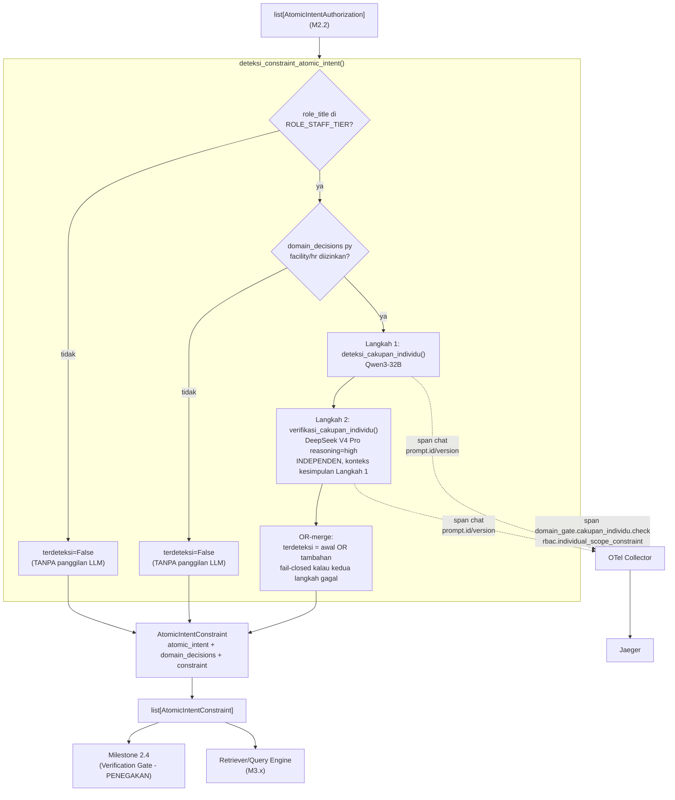

# Report — Milestone 2.3: Membangun Deteksi Constraint Cakupan-Individu

Milestone ini berjenis **berbasis kode/sistem** — outputnya mekanisme LLM generate-verify yang benar-benar berjalan (dua panggilan model independen + pre-filter deterministik + observability) dan bisa dibuktikan bekerja lewat eksekusi nyata. Bagian 3 diisi penuh.

## Bagian 1 — Ringkasan Hasil

**Status akhir:** Selesai sesuai rencana, tanpa penyimpangan pada hasil maupun urutan implementasi.

Milestone 2.3 menghasilkan `deteksi_constraint_atomic_intent()`/`deteksi_constraint_semua()` (`src/layers/domain_gate/cakupan_individu.py`) — pekerjaan ketiga PIC 2 (Domain Gate), konsumen langsung `list[AtomicIntentAuthorization]` (Milestone 2.2). Menutup gap yang secara sengaja tidak dijamin `chatbot_api` (Lapis 2): pembatasan antar-individu dalam satu properti yang sama (mis. Staff housekeeping melihat performa staf lain di propertinya). Dua keputusan genuinely terbuka dikonfirmasi user sebelum implementasi: **daftar eksplisit 9 view kategori "performa individu"** (4 `facility` + 5 `hr`, hasil tinjauan langsung ke `katalog-data-chatbot.md` — satu-satunya area yang ditandai eksplisit masih terbuka sejak penutupan M2.1/M2.2), dan **mekanisme LLM generate-verify dual-call union aditif** (pola persis M2.1, karena asimetri risiko sama: false-negative = potensi kebocoran data performa staf lain). Dua pre-filter deterministik (role Staff-tier, domain `facility`/`hr` relevan) mencegah panggilan LLM sama sekali untuk kasus yang jawabannya sudah pasti dari struktur data M2.2 — dibuktikan lewat unit test yang melempar `AssertionError` kalau fungsi LLM terpanggil, bukan sekadar mengecek hasil akhir. Milestone ini juga yang **pertama dibangun setelah kontrak Manajemen Prompt (Fase 1+2) mengikat penuh** — kedua prompt langsung jadi file `src/prompts/domain_gate/*.md` sejak awal dan reliability testing Promptfoo dibangun natif sebagai bagian checkpoint, bukan retrofit terpisah seperti pola M1.3-M2.1. Diverifikasi nyata lolos ketiga Kriteria Keberhasilan sumber lewat panggilan LLM sungguhan, span nyata di Jaeger, 10 skenario eval milestone (10/10 lolos, tanpa REVIEW), dan 20 skenario reliability testing Promptfoo (20/20 lolos, 20 baris terpush ke `prompt_eval_runs`).

## Bagian 2 — Kriteria Keberhasilan vs Bukti Nyata

| Kriteria (dari dokumen sumber) | Bukti Aktual | Terpenuhi? |
|---|---|---|
| "Kebutuhan dari role Staff yang menyentuh view kategori performa individu (skenario uji: 'siapa staf tercepat bulan ini') menghasilkan catatan constraint yang eksplisit dan bisa ditelusuri." | `test_kk1_staff_kebutuhan_individu_menghasilkan_constraint_eksplisit` — teks identik skenario sumber + `Housekeeping Staff` → `terdeteksi=True`, `alasan` terisi. Diperkuat `evals/2.3-.../` S01-S02, S05-S07 (7 view berbeda, termasuk tanpa kata kunci eksplisit) dan span nyata Jaeger (`domain_gate.deteksi_cakupan_individu.terdeteksi=true`). | Ya |
| "Kebutuhan serupa dari role Manager/Corporate tidak menghasilkan constraint tambahan apa pun, membuktikan pembedaan berdasar role bekerja dengan benar." | `test_kk2_manager_kebutuhan_sama_tidak_menghasilkan_constraint` — teks SAMA, `Housekeeping Manager` → `terdeteksi=False` TANPA panggilan LLM (dibuktikan `test_pre_filter_role_bukan_staff_tier_tanpa_panggilan_llm`, monkeypatch melempar `AssertionError` kalau fungsi LLM terpanggil). Diperkuat `evals/2.3-.../` S08 — generalisasi ke teks BARU (bukan teks KK1/KK2 asli), role A `True`+`alasan`, role B `False` tanpa `alasan`, dari `atomic_intent_id` yang sama. | Ya |
| "Kebutuhan yang tidak menyentuh kategori view sensitif ini sama sekali (baik dari Staff maupun role lain) tidak mendapat constraint apa pun, membuktikan deteksi tidak asal menempel ke semua kebutuhan." | `test_kk3_kebutuhan_tidak_menyentuh_kategori_tidak_mendapat_constraint` — domain `facility` relevan (lolos pre-filter) tapi teks genuinely bukan performa individu → `terdeteksi=False` dibuktikan lewat LLM nyata (bukan pre-filter). Diperkuat `evals/2.3-.../` S03-S04, S10 (3 distractor berbeda, termasuk tanpa kata kunci sama sekali dan tema durasi/waktu) — seluruhnya `terdeteksi=False`. | Ya |

Verifikasi span nyata (di luar tiga kriteria di atas, tapi bagian Output M2.3): trace nyata Jaeger (`b97a12808ac5d23186a61cb53fbd220a`) mengonfirmasi hierarki 5 span benar — `invoke_agent` → `domain_gate.deteksi_constraint_semua` (`intent.count`, `constraint.terdeteksi_count`) → `domain_gate.cakupan_individu.check` (`rbac.individual_scope_constraint`) → 2 span `chat` (masing-masing dengan `prompt.id`/`prompt.version`, model per langkah) — sesuai kontrak Bagian 2 `rancangan-observability-ai-chatbot.md` baris 38 ("penanda constraint cakupan-individu bila terdeteksi").

## Bagian 3 — Cara Kerja dan Arsitektur

### Cara Kerja

`deteksi_constraint_semua(list[AtomicIntentAuthorization], role_title)` memanggil `deteksi_constraint_atomic_intent()` per atomic intent. Dua pre-filter deterministik dijalankan dulu, SEBELUM panggilan LLM apa pun: (1) `role_title` harus salah satu dari 7 role tier Staff (`ROLE_STAFF_TIER`, ditranskripsi manual dari `rancangan-rbac-ai-chatbot.md`); (2) `domain_decisions` (hasil M2.2) harus mengandung `Domain.FACILITY`/`Domain.HR` dengan `diizinkan=True`. Kalau salah satu gagal, `terdeteksi=False` langsung tanpa panggilan LLM. Kalau keduanya lolos, dua langkah LLM independen dijalankan: Langkah 1 (`deteksi_cakupan_individu()`, Qwen3-32B) menilai teks dari nol; Langkah 2 (`verifikasi_cakupan_individu()`, DeepSeek V4 Pro `reasoning="high"`) menilai independen dengan kesimpulan Langkah 1 sebagai konteks, secara aktif mencari titik buta. Hasil akhir `terdeteksi = awal.terdeteksi OR verifikasi.terdeteksi_tambahan` (union aditif — verifier hanya bisa menambah, tidak pernah mengurangi). Kalau KEDUA langkah gagal teknis, hasil fail-closed ke `terdeteksi=True` (konservatif, bukan diam-diam melewatkan constraint).

### Diagram Arsitektur

### Integrasi dengan Komponen Lain

Input: `list[AtomicIntentAuthorization]` (M2.2, `periksa_otorisasi_semua()`) + `role_title: str`. Output: `list[AtomicIntentConstraint]` — skema rata (flat, TIDAK nesting `AtomicIntentAuthorization`) membawa `atomic_intent` + `domain_decisions` (diteruskan dari M2.2) + `constraint` sendiri, konsisten preseden M2.1→M2.2. Konsumen berikutnya: Retriever/Query Engine (M3.x, butuh domain DAN constraint sekaligus per "Catatan Serah Terima" dokumen sumber) dan Milestone 2.4 (Verification Gate) — M2.3 murni **mencatat** constraint, penegakan filter paksa terjadi di M2.4.

## Bagian 4 — Perubahan dari Plan

Tidak ada perubahan pada bentuk kode akhir maupun urutan checkpoint. Satu deviasi administratif kecil: commit Checkpoint 3 Task 4 (`5ce242b`) hanya berisi `src/config/llm.py`, sementara pesan commit sempat menyebut "konteks grounding" yang sebenarnya menyusul di commit Task 5 (`3af6b73`) bersama test-nya — pemisahan kode-vs-test per kategori tetap terjaga, hanya urutan file dalam commit tidak persis draft rencana awal. Dicatat di `logs.md` Checkpoint 3.

## Bagian 5 — Keterbatasan dan Item Provisional

- **Daftar 9 view kategori "performa individu" berpotensi tidak lengkap kalau katalog data direvisi ke depan** — tidak ada mekanisme sinkronisasi otomatis. Dicatat sebagai `docs/keterbatasan-diterima.md` entri #9 (mirror pola entri #8, M2.2). Risiko dimitigasi sebagian oleh sifat generate-verify (prompt mengajarkan pola, bukan daftar tertutup harfiah — dibuktikan `evals/2.3-.../` S05), tapi risiko residual tetap ada untuk domain di luar `facility`/`hr` (diblokir pre-filter sebelum sempat dinilai LLM).
- **Non-determinisme `temperature=0`** (pola sudah terdokumentasi `docs/keterbatasan-diterima.md` #3, lintas M1.3/M1.4/M1.7) tetap berlaku di sini — 10/10 skenario eval dan 20/20 skenario Promptfoo lolos pada saat dijalankan, tapi ini TIDAK menjamin hasil identik pada run berikutnya dengan input yang sama persis. Pemantauan berkelanjutan lewat `prompt_reliability/` adalah mitigasi yang sudah aktif (bukan jaminan absolut).
- **Belum wired ke endpoint HTTP manapun** — konsisten preseden M1.2-M2.2.
- **Serah Terima ke M2.4 dan M3.x belum bisa dikonfirmasi penuh** — keduanya belum dikerjakan; bentuk keluaran `AtomicIntentConstraint` sudah stabil secara desain (flat, konsisten preseden M2.1→M2.2) tapi belum divalidasi lintas-pekerjaan dengan implementasi nyata.
- **Ditemukan di Checkpoint 10**: Promptfoo lokal butuh `PROMPTFOO_PYTHON` diarahkan eksplisit ke virtualenv `uv` (bukan default Python sistem) supaya dependency proyek (`opentelemetry-exporter-otlp-proto-grpc`, dll.) tersedia — dicatat di `prompt_reliability/README.md` supaya tidak perlu didiagnosis ulang untuk milestone LLM berikutnya. Ini keterbatasan operasional lokal, bukan bug kode produksi.

## Bagian 6 — Follow-up

- Milestone 2.4 (Verification Gate) — konsumen langsung `list[AtomicIntentConstraint]` bersama request final dari Query Engine, menegakkan filter cakupan-individu secara paksa (bukan sekadar menolak) kalau request belum menyertakannya.
- Milestone 3.x (Retriever/Query Engine) — juga konsumen langsung `list[AtomicIntentConstraint]`, perlu tahu constraint apa yang perlu dipenuhi saat menyusun parameter request.
- Kalau `katalog-data-chatbot.md` direvisi tim database engineering, `konteks_cakupan_individu.py` perlu ditinjau ulang manual — pemicu peninjauan eksplisit dicatat di `docs/keterbatasan-diterima.md` entri #9.
- Prompt M2.3 (`deteksi_cakupan_individu.md`/`verifikasi_cakupan_individu.md`) sekarang di bawah pemantauan `prompt_reliability/` — jalankan `npx promptfoo eval` (dengan `PROMPTFOO_PYTHON` diarahkan ke `.venv/`) setiap kali salah satu file berubah, sebelum commit di-push, sesuai kontrak `rancangan-manajemen-prompt.md` Bagian 5.
