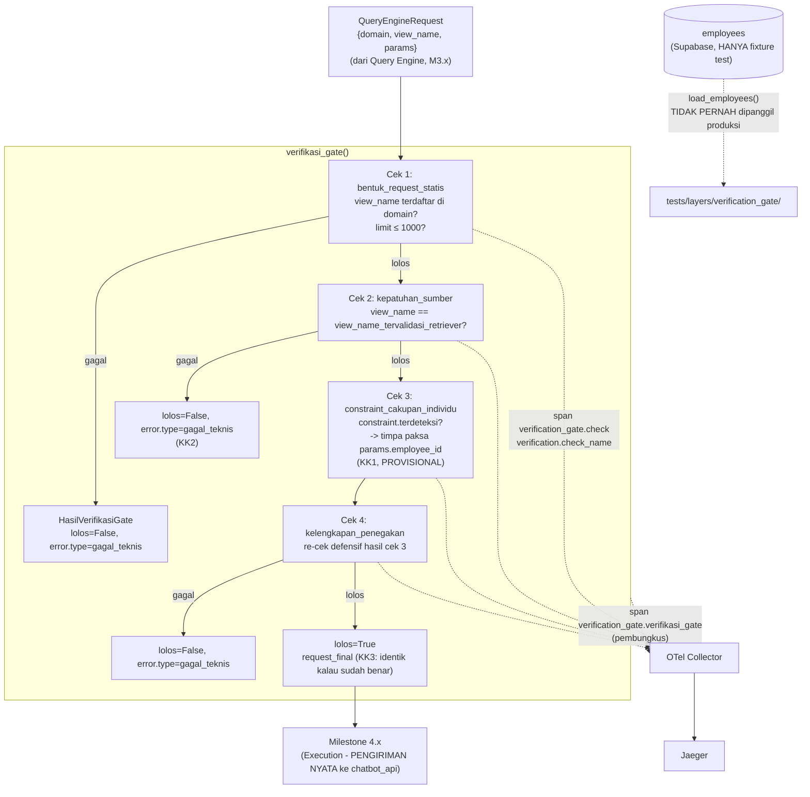

# Report — Milestone 2.4: Membangun Verification Gate

Milestone ini berjenis **berbasis kode/sistem** — outputnya mekanisme deterministik yang benar-benar berjalan (pemeriksaan berlapis + observability) dan bisa dibuktikan bekerja lewat eksekusi nyata. Bagian 3 diisi penuh.

## Bagian 1 — Ringkasan Hasil

**Status akhir:** Selesai sesuai rencana, tanpa penyimpangan pada hasil maupun urutan checkpoint. Milestone ini **menutup PIC 2 (Domain Gate + Verification Gate) sepenuhnya** — M2.1-2.4 seluruhnya selesai.

Milestone 2.4 menghasilkan `verifikasi_gate()` (`src/layers/verification_gate/verifikasi_gate.py`) — gerbang terakhir sebelum request dikirim ke `chatbot_api`, sepenuhnya deterministik, TANPA LLM sama sekali (ruang kesalahan tertutup). Empat pemeriksaan berlapis: (1) bentuk request statis — `view_name` terdaftar di domain yang dinyatakan (katalog 67 view ditranskripsi dari `katalog-data-chatbot.md`, termasuk 2 pengecualian penamaan `guests_contact_view`/`guests_profile_view`), `limit` ≤ 1000; (2) kepatuhan sumber — `view_name` request vs yang divalidasi Retriever (diterima sebagai parameter, M3.x belum dibangun); (3) penegakan constraint cakupan-individu — timpa paksa `params["employee_id"]` kalau `ConstraintCakupanIndividu.terdeteksi=True` (M2.3) dan belum benar; (4) verifikasi kelengkapan penegakan — re-cek defensif hasil cek 3.

**Riset kontrak sebelum plan menemukan gap arsitektur nyata**: `api-chatbot.md` tidak mendokumentasikan parameter apa pun untuk filter level-individu. Dua keputusan genuinely terbuka dikonfirmasi user (dua putaran `AskUserQuestion`, satu di antaranya setelah user memberikan `employees_deduped.csv` nyata sebagai konfirmasi model data): konvensi filter reuse `employee_id` (satu-satunya ID individu di kontrak resmi, sudah mengalir sejak `TurnPayload` M1.2) — **dicatat eksplisit PROVISIONAL, belum dikonfirmasi tim database engineering**; dan tabel `employees` Supabase (84 baris nyata) khusus fixture test M2.4, TIDAK PERNAH di-query logic produksi.

Diverifikasi nyata lolos ketiga Kriteria Keberhasilan sumber lewat 14 unit test (termasuk KK1-3 end-to-end dengan fixture employee nyata) dan span nyata di Jaeger.

## Bagian 2 — Kriteria Keberhasilan vs Bukti Nyata

| Kriteria (dari dokumen sumber) | Bukti Aktual | Terpenuhi? |
|---|---|---|
| "Request yang membawa catatan constraint cakupan-individu dari M2.3 tapi belum menyertakan filter yang sesuai, berhasil dikoreksi paksa dengan filter yang benar sebelum diteruskan — bukan ditolak begitu saja." | `test_orkestrator_kk1_constraint_terdeteksi_dikoreksi_paksa` — `Housekeeping Staff` (E0002, fixture nyata), `params={}`, `constraint.terdeteksi=True` → `lolos=True`, `terkoreksi=True`, `request_final.params["employee_id"]=="E0002"`. Diperkuat span nyata Jaeger (`trace_id=60fa05fa...`): `verification.terkoreksi=true` pada span `constraint_cakupan_individu`. | Ya |
| "Request yang `view_name`-nya tidak sesuai dengan yang divalidasi Retriever ditolak dengan alasan spesifik yang menyebut ketidaksesuaian tersebut." | `test_orkestrator_kk2_view_name_tidak_sesuai_ditolak` — `view_name` request (`v_maintenance_technician_daily`) SENGAJA dibuat tidak cocok dengan Retriever (`v_lookup_maintenance_tickets`) → `lolos=False`, `alasan_penolakan` menyebut KEDUA nilai eksplisit. | Ya |
| "Request yang sudah benar sepenuhnya lolos tanpa perubahan apa pun." | `test_orkestrator_kk3_request_sudah_benar_lolos_tanpa_perubahan` — `HR Staff` fixture nyata, `params` sudah lengkap (`limit`+`employee_id` benar) → `lolos=True`, `terkoreksi=False`, `request_final.params` IDENTIK (`==` penuh) dengan input. | Ya |

Verifikasi span nyata (di luar tiga kriteria di atas, tapi bagian Output M2.4): trace nyata Jaeger (`60fa05fa279e8af1736aa27097cbc9a6`) mengonfirmasi hierarki 6 span benar — `invoke_agent` → `verification_gate.verifikasi_gate` (`verification_gate.lolos`/`verification_gate.terkoreksi`) → 4× `verification_gate.check` dengan `verification.check_name` benar per cek — sesuai kontrak Bagian 2 `rancangan-observability-ai-chatbot.md` baris 41.

## Bagian 3 — Cara Kerja dan Arsitektur

### Cara Kerja

`verifikasi_gate(request, constraint, employee_id, view_name_tervalidasi_retriever)` menjalankan cek 1 (`verifikasi_bentuk_request_statis`) lalu cek 2 (`verifikasi_kepatuhan_sumber`) — EARLY-EXIT tolak (`error.type=gagal_teknis`) kalau salah satu gagal, TANPA lanjut ke cek 3-4. Kalau keduanya lolos: cek 3 (`tegakkan_constraint_cakupan_individu`) menimpa paksa `params["employee_id"]` HANYA kalau `constraint.terdeteksi=True` DAN nilai belum benar — request lain diteruskan tanpa perubahan. Cek 4 (`verifikasi_kelengkapan_penegakan`) re-cek defensif hasil cek 3 benar-benar konsisten (menangkap bug internal, bukan re-derive keputusan baru). Hasil akhir `HasilVerifikasiGate` (`lolos`/`terkoreksi`/`request_final`/`alasan_penolakan`).

### Diagram Arsitektur

### Integrasi dengan Komponen Lain

Input: `QueryEngineRequest` (M3.4-3.5, belum dibangun — skema `{domain, view_name, params}` sudah terkunci di dokumen arsitektur, dikonsumsi sebagai tipe murni tanpa menunggu implementasi M3.x nyata) + `constraint: ConstraintCakupanIndividu` (M2.3, sudah selesai) + `employee_id: str` (tersedia sejak `TurnPayload`, M1.2) + `view_name_tervalidasi_retriever: str` (M3.1-3.3, diterima sebagai parameter). Output: `HasilVerifikasiGate` — konsumen berikutnya Milestone 4.x (Execution, mengirim `request_final` nyata ke `chatbot_api`).

## Bagian 4 — Perubahan dari Plan

Tidak ada perubahan pada bentuk kode akhir maupun urutan checkpoint. Sesuai rencana penuh.

## Bagian 5 — Keterbatasan dan Item Provisional

- **Konvensi filter `employee_id` PROVISIONAL, belum dikonfirmasi tim database engineering** — RISIKO TINGGI, dicatat `docs/keterbatasan-diterima.md` entri #10 (baru). Kalau `chatbot_api` genuinely tidak menegakkan filter ini server-side untuk 9 view performa-individu, mekanisme cek 3-4 M2.4 tidak benar-benar melindungi apa pun secara substantif — meski secara struktural (observability, hasil request) semuanya terlihat benar. **WAJIB diverifikasi sebelum Milestone 4.x mengirim request nyata ke `chatbot_api` produksi.**
- **`QueryEngineRequest.params` tetap opaque `dict[str, Any]`** — skema parameter per-`view_name` belum terdokumentasi di mana pun (dokumen arsitektur sendiri menandainya masih terbuka). Cek 1 M2.4 HANYA memvalidasi yang eksplisit disebut Lingkup sumber (view_name+limit), TIDAK memvalidasi legitimasi nama parameter lain di `params`.
- **Belum ada Query Engine/Retriever nyata (M3.x) untuk diuji integrasi end-to-end** — M2.4 diverifikasi lewat `QueryEngineRequest` yang dikonstruksi manual di test (konsisten preseden M2.1-2.3 yang juga tidak menunggu implementasi hulu/hilir nyata), bukan lewat pipeline penuh.
- **Belum wired ke endpoint HTTP manapun** — konsisten preseden M1.2-M2.3.
- **Serah Terima ke M3.x/M4.x belum bisa dikonfirmasi penuh** — keduanya belum dikerjakan.

## Bagian 6 — Follow-up

- **PIC 2 (Domain Gate + Verification Gate) SELESAI SEPENUHNYA** — M2.1, M2.2, M2.3, M2.4 seluruhnya selesai dan terverifikasi.
- Milestone 3.x (Retriever, Query Engine) — PIC 3, bisa mulai kapan saja (independen dari PIC 2 yang sudah selesai). Perlu menghasilkan `QueryEngineRequest` yang benar-benar sesuai skema `{domain, view_name, params}` yang sudah dikonsumsi M2.4.
- Milestone 4.x (Execution, Interpretation) — PIC 4, menunggu kontrak final PIC 2 (sudah tersedia) dan PIC 3. **Sebelum Execution (M4.x) mengirim request nyata ke `chatbot_api` produksi, konvensi `employee_id` (keterbatasan #10) WAJIB diverifikasi** — ini bukan syarat opsional.
- Kalau ada akses/dokumentasi resmi ke perilaku `chatbot_api` per-view di masa depan, verifikasi ulang segera apakah `employee_id` benar-benar diterapkan sebagai filter baris — pemicu peninjauan eksplisit di `docs/keterbatasan-diterima.md` entri #10.
