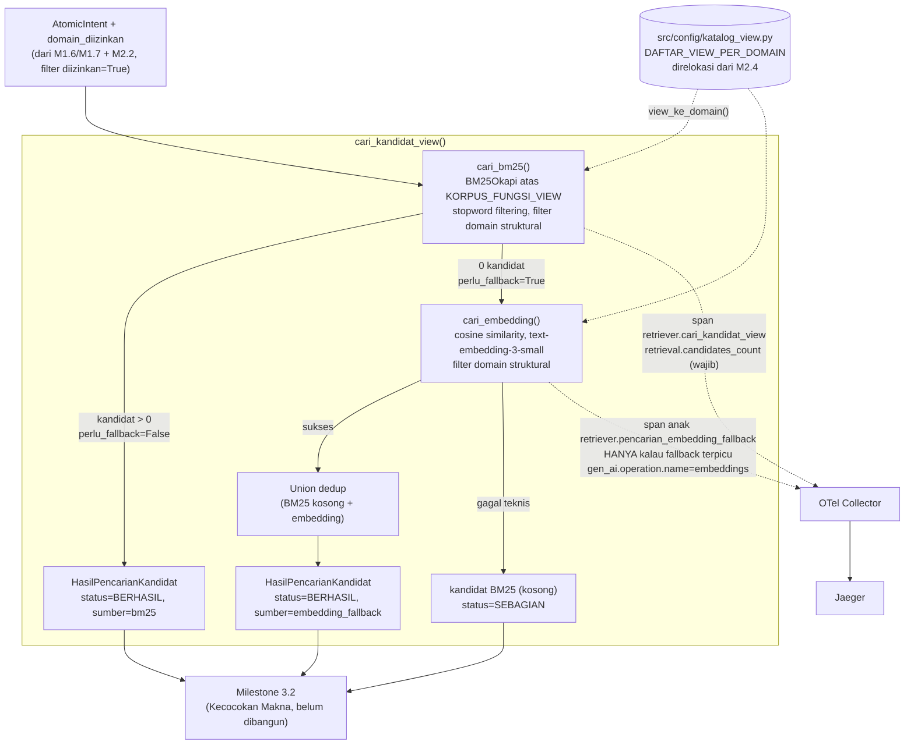

# Report — Milestone 3.1: Pengumpulan Kandidat View

Milestone ini berjenis **berbasis kode/sistem** — outputnya mekanisme pencarian yang benar-benar berjalan (BM25 + fallback embedding + observability) dan bisa dibuktikan bekerja lewat eksekusi nyata. Bagian 3 diisi penuh.

## Bagian 1 — Ringkasan Hasil

**Status akhir:** Selesai sesuai rencana, dengan dua penyimpangan signifikan yang ditemukan dan diperbaiki di tengah jalan (dicatat jujur, bukan disembunyikan) — lihat Bagian 4. Milestone ini adalah **pekerjaan pertama PIC 3 (Retriever, Query Engine)** — `src/layers/retriever/` dan `evals/3.1-.../` dibangun dari nol.

Milestone 3.1 menghasilkan `cari_kandidat_view()` (`src/layers/retriever/retriever.py`) — dari satu kebutuhan atomik + domain yang diizinkan (hasil Domain Gate M2.2), mengumpulkan kandidat `view_name` dari 67 view yang mungkin relevan, sengaja luas (recall-oriented), tanpa memutuskan satu pilihan final. Mekanisme **Hybrid**: BM25 (`rank-bm25`, deterministik, tanpa network call) sebagai jalur utama; fallback ke embedding semantik (`text-embedding-3-small` via OpenRouter) HANYA ketika BM25 tidak menemukan kandidat berskor positif sama sekali.

**Riset kontrak sebelum plan menemukan gap arsitektur nyata**: `DAFTAR_VIEW_PER_DOMAIN` (M2.4) sudah ada tapi hanya nama view tanpa teks deskripsi bisnis; direlokasi ke `src/config/katalog_view.py` (dipakai bersama M2.4+M3.1). Dua keputusan genuinely terbuka dikonfirmasi user lewat `AskUserQuestion`: mekanisme Hybrid (dipilih di atas rekomendasi awal BM25-murni penulis), dan proses perbandingan-empiris 3 model embedding (bukan pilih di depan tanpa bukti) — dengan klarifikasi lanjutan bahwa model terpilih tetap **provisional**, dicatat `docs/keputusan-tertunda.md`.

Diverifikasi nyata lolos kedua Kriteria Keberhasilan sumber lewat 35 unit test (`tests/layers/retriever/` 29 baru + `tests/config/` 6, 5 relokasi M2.4 + 1 baru), eval nyata 3-model-embedding ke OpenRouter (17 payload, `evals/3.1-.../`), dan span nyata di Jaeger.

## Bagian 2 — Kriteria Keberhasilan vs Bukti Nyata

| Kriteria (dari dokumen sumber) | Bukti Aktual | Terpenuhi? |
|---|---|---|
| "Kebutuhan yang jelas cocok dengan satu atau beberapa view tertentu (skenario uji: 'okupansi Bali bulan ini') menghasilkan kandidat yang mencakup view yang benar, tidak terlewat karena pencarian terlalu sempit." | `test_kk1_okupansi_bali_ditemukan` (`test_pencarian_bm25.py`) — `v_reservation_room_type_daily` ada di kandidat. `test_kasus_a_bm25_cukup_embedding_tidak_dipanggil` (`test_retriever.py`) — orkestrator end-to-end, embedding TIDAK dipanggil (dibuktikan `AssertionError` kalau terpanggil). Diperkuat span nyata Jaeger: `retriever.cari_kandidat_view` (`retrieval.candidates_count=2`, `retrieval.fallback_terpicu=False`). | Ya |
| "Kandidat yang dikembalikan terbatas pada domain yang sudah diizinkan Domain Gate — tidak ada kandidat dari domain yang seharusnya ditolak yang ikut lolos ke tahap berikutnya." | `test_kk2_zero_leakage_domain_tidak_diizinkan` (BM25), `test_domain_filtering_identik_pola_bm25` (embedding), `test_kasus_c_kk2_zero_leakage_end_to_end_tanpa_monkeypatch` + `test_kasus_c_kk2_zero_leakage_jalur_fallback_terpicu` (orkestrator, KEDUA jalur — BM25-saja DAN fallback-terpicu, filter struktural di titik materialisasi kandidat, bukan post-filter). | Ya |

Verifikasi span nyata (di luar dua kriteria di atas, bagian Output M3.1): trace nyata Jaeger mengonfirmasi `retriever.cari_kandidat_view` muncul di KEDUA skenario dengan `retrieval.candidates_count` terisi benar; span anak `retriever.pencarian_embedding_fallback` (`gen_ai.operation.name=embeddings`, `gen_ai.request.model=openai/text-embedding-3-small`) HANYA muncul di trace fallback-terpicu, dikonfirmasi absen di trace BM25-saja.

## Bagian 3 — Cara Kerja dan Arsitektur

### Cara Kerja

`cari_kandidat_view(atomic_intent, domain_diizinkan)` memanggil `cari_bm25()` — index BM25Okapi dibangun sekali dari `KORPUS_FUNGSI_VIEW` (67 teks **Fungsi** ditranskripsi manual dari `katalog-data-chatbot.md`, diverifikasi byte-exact via regex independen), tokenizer dengan stopword filtering (~50 kata fungsi Bahasa Indonesia/Inggris — ditambahkan Checkpoint 9 setelah ditemukan tanpa ini skor selalu positif untuk query apa pun). Kandidat dimaterialisasi HANYA untuk domain di `domain_diizinkan` (filter struktural) dan berskor > 0. Kalau `perlu_fallback=False` (ada kandidat), return langsung. Kalau `True` (nol kandidat), panggil `cari_embedding()` — cosine similarity terhadap embedding korpus (`text-embedding-3-small`, dipilih dari perbandingan empiris 3 kandidat Checkpoint 7), union dedup dengan kandidat BM25 (kosong di kasus ini). Kegagalan teknis embedding tidak memblokir pipeline — `status=SEBAGIAN`, bukan exception.

### Diagram Arsitektur

### Integrasi dengan Komponen Lain

Input: `AtomicIntent` (M1.6/M1.7, sudah selesai) + `list[Domain]` (turunan `AtomicIntentAuthorization.domain_decisions` M2.2 difilter `diizinkan=True`, sudah selesai). Output: `HasilPencarianKandidat` — konsumen berikutnya Milestone 3.2 (Kecocokan Makna, belum dibangun) dan Verification Gate M2.4 (parameter `view_name_tervalidasi_retriever` di `verifikasi_gate()`, sudah menunggu bentuk ini sejak M2.4 selesai). `DAFTAR_VIEW_PER_DOMAIN` direlokasi dari `verification_gate/` ke `src/config/` — dipakai BERSAMA oleh M2.4 (existing, regresi 20 test dikonfirmasi hijau tanpa perubahan assertion) dan M3.1 (baru).

**Konfirmasi Catatan Serah Terima `rancangan-retrieval-query.md`**: "pastikan bentuk keluaran Retriever (nama field, format daftar kandidat) terdokumentasi jelas dan tidak berubah sepihak tanpa dikomunikasikan ke pemilik pekerjaan tersebut" — `HasilPencarianKandidat`/`KandidatView` (`src/schemas/retriever.py`) adalah kontrak yang akan dikonsumsi M3.2-3.3 (belum dibangun) dan sudah didokumentasikan lengkap di sini untuk pemilik M2.4 (`view_name_tervalidasi_retriever: str` — Verification Gate menerima `view_name` string tunggal, BUKAN objek `KandidatView` penuh; ekstraksi `view_name` dari kandidat terpilih M3.2-3.3 adalah tanggung jawab milestone tersebut, bukan M3.1).

## Bagian 4 — Perubahan dari Plan

Dua penyimpangan signifikan (dalam arti baik — ditemukan dan diperbaiki, bukan disembunyikan):

1. **Trigger `BM25_SKOR_MINIMUM` (Checkpoint 9)**: plan hanya mengantisipasi revisi nilai numerik. Investigasi nyata menemukan root cause lebih mendasar — tokenizer tanpa stopword filtering membuat skor BM25 SELALU positif untuk query apa pun (kata fungsi umum ada di hampir seluruh 67 teks korpus), sehingga trigger nyaris tidak pernah aktif (dikonfirmasi: SEMUA 5 skenario stress-test Checkpoint 7 gagal memicu trigger dengan implementasi asli, bukan 4/5 seperti draf awal dokumentasi eval). Diperbaiki dengan menambah stopword filtering, threshold numerik `0.0` dipertahankan (kini jadi sinyal wajar).
2. **Koreksi dokumentasi eval** (Checkpoint 9): `rancangan.md`/`audit.md` (Checkpoint 7) ternyata mendokumentasikan baseline BM25 dari skrip eksplorasi yang belum diterapkan ke kode produksi — dikoreksi eksplisit di kedua dokumen (bukan diedit diam-diam menghilangkan jejak), lihat `logs.md` Checkpoint 9 untuk kronologi lengkap.

Di luar dua hal di atas, tidak ada perubahan pada urutan checkpoint maupun bentuk akhir `HasilPencarianKandidat`/`KandidatView` dari yang direncanakan di plan awal.

## Bagian 5 — Keterbatasan dan Item Provisional

- **Model embedding final (`text-embedding-3-small`) PROVISIONAL** — dicatat `docs/keputusan-tertunda.md` #2, TIDAK ditutup permanen seperti model chat/completion di milestone lain (instruksi eksplisit user). Cakupan eval Checkpoint 7 sengaja terbatas (5 skenario buatan tangan).
- **BM25 tetap gagal menemukan kandidat tanpa overlap kata bermakna sama sekali (skenario B1 eval), bahkan pasca-perbaikan stopword filtering** — RISIKO SEDANG, dicatat `docs/keterbatasan-diterima.md` #11. Trigger fallback (`0 kandidat`) tidak aktif untuk kasus ini karena BM25 tetap menemukan kandidat LAIN (salah, tapi bukan nol) — batas struktural pencarian leksikal murni, bukan bug. Model embedding TERBUKTI bisa menemukan kasus ini dengan baik KALAU dipanggil — masalahnya murni di trigger.
- **`retrieval.selected_view` belum diisi** — sengaja, tanggung jawab Milestone 3.3 (belum dibangun) setelah `view_name` final ditentukan M3.2-3.3.
- **Belum ada Milestone 3.2-3.3 (Kecocokan Makna, Kecukupan Struktural) untuk diuji integrasi end-to-end** — M3.1 diverifikasi lewat `AtomicIntent`+`list[Domain]` yang dikonstruksi manual di test, bukan lewat pipeline penuh dari M1.x/M2.x.
- **Belum wired ke endpoint HTTP manapun** — konsisten preseden M1.2-M2.4.
- **Insiden operasional dicatat sebagai prasyarat**: `text-embedding-3-small` butuh setting akun OpenRouter "Allowed Providers" mengizinkan `OpenAI` (bukan hanya `siliconflow`) — kalau lingkungan produksi tidak dikonfigurasi sama, `cari_embedding()` akan gagal teknis (`gagal=True`, ditangani graceful, bukan crash) tapi fallback jadi TIDAK PERNAH berhasil.

## Bagian 6 — Follow-up

- Milestone 3.2 (Kecocokan Makna) — konsumen langsung `HasilPencarianKandidat`, menilai tiap kandidat terhadap definisi lengkap katalog (grain, sumber, catatan jebakan).
- Milestone 3.3 (Kecukupan Struktural) — mencocokkan `label_bentuk_jawaban` terhadap grain view, mengisi `retrieval.selected_view` pada span M3.1 yang sama begitu `view_name` final ditentukan.
- **Pemicu peninjauan eksplisit** (dari `docs/keputusan-tertunda.md` #2 dan `docs/keterbatasan-diterima.md` #11): kalau M3.2+ menunjukkan pola kegagalan fallback nyata di produksi (termasuk pola mirip skenario B1), revisit baik model embedding maupun desain trigger — data produksi nyata akan jadi basis yang jauh lebih kuat dibanding 5 skenario buatan tangan Checkpoint 7.
- Verifikasi berkelanjutan: setting "Allowed Providers" OpenRouter perlu tetap mengizinkan `OpenAI` di lingkungan mana pun kode ini dijalankan produksi — bukan cuma sesi pengembangan ini.
