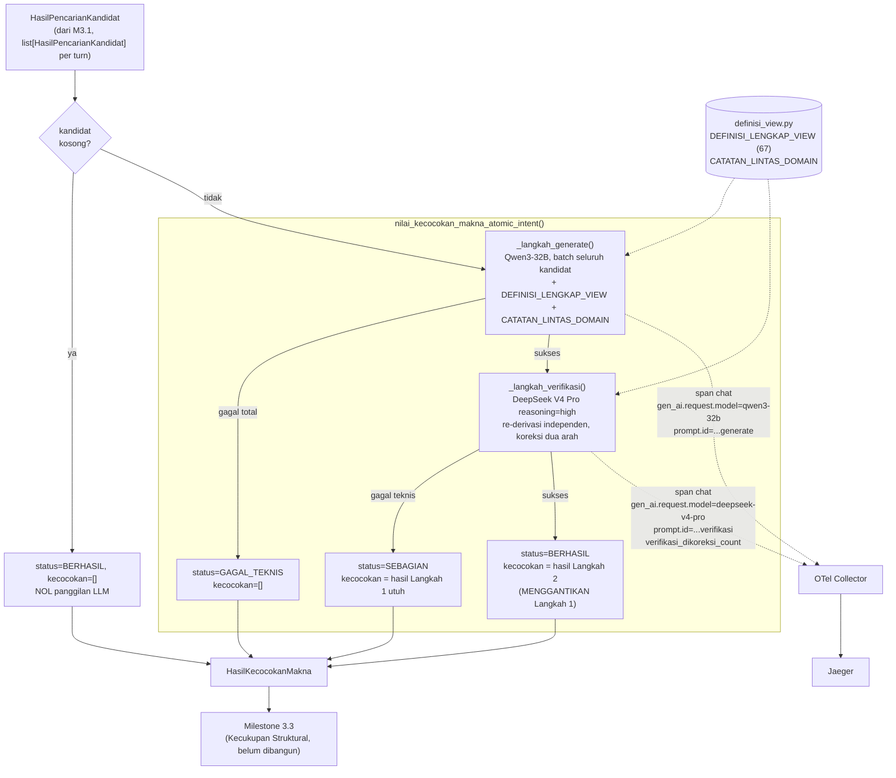

# Report — Milestone 3.2: Pemeriksaan Kecocokan Makna

Milestone ini berjenis **berbasis kode/sistem** — outputnya mekanisme penilaian yang benar-benar berjalan (generate+verifikasi dua langkah + observability) dan bisa dibuktikan bekerja lewat eksekusi nyata. Bagian 3 diisi penuh.

## Bagian 1 — Ringkasan Hasil

**Status akhir:** Selesai sesuai rencana, dengan satu bug tooling ditemukan dan diperbaiki di tengah jalan (Checkpoint 14, Promptfoo assertion syntax — bukan bug prompt/model) serta dua penyesuaian checkpoint kecil (Task 8/10 dipindah Checkpoint 5-6 → 7-8; atribut `dikoreksi_count` dipindah dari span orkestrasi ke span Langkah 2) yang seluruhnya dicatat eksplisit di `logs.md`, bukan disembunyikan. Milestone ini adalah **pemanggilan LLM pertama di layer Retriever** — M3.1 murni BM25/embedding tanpa penilaian generatif.

Milestone 3.2 menghasilkan `nilai_kecocokan_makna_atomic_intent()`/`nilai_kecocokan_makna_semua()` (`src/layers/retriever/kecocokan_makna.py`) — dari `HasilPencarianKandidat` (M3.1), menilai TIAP kandidat `view_name` terhadap definisi lengkapnya di katalog (grain, sumber, kolom, catatan — `src/layers/retriever/definisi_view.py`, corpus baru dibangun dari `katalog-data-chatbot.md`), memberi label `ditemukan`/`sebagian`/`tidak_ditemukan` + alasan. Mekanisme **generate + verifikasi independen dengan koreksi dua arah** (bukan union-aditif seperti M2.1/M2.3): Langkah 1 (Qwen3-32B) memberi label awal batch untuk seluruh kandidat satu kebutuhan atomik sekaligus; Langkah 2 (DeepSeek V4 Pro `reasoning="high"`) independen menilai ulang, hasilnya MENGGANTIKAN Langkah 1 sepenuhnya — bisa mengoreksi ke arah manapun (ditemukan→sebagian ATAU sebagian→ditemukan), sesuai keputusan user yang genuinely terbuka.

**Tiga keputusan genuinely terbuka dikonfirmasi user lewat `AskUserQuestion`** sebelum plan ditulis: mekanisme koreksi dua arah (bukan satu-panggilan-konservatif M1.7 atau union-aditif M2.1/M2.3 — risiko M3.2 simetris, tidak cocok preseden manapun), granularitas batch per kebutuhan atomik (bukan per kandidat), dan cakupan orkestrator menyertakan `_semua()` (beda dari restraint M3.1).

Diverifikasi nyata lolos KEDUA Kriteria Keberhasilan sumber lewat 73 unit test (`tests/layers/retriever/test_kecocokan_makna*.py`, mocked LLM), eval nyata 8 skenario ke OpenRouter (`evals/3.2-.../`, 8/8 lolos termasuk KK1/KK2 sumber persis tanpa toleransi), reliability testing Promptfoo (16 baris `prompt_eval_runs`, 14/16 lolos — 2 temuan nyata didokumentasikan, bukan disembunyikan), dan span nyata di Jaeger.

## Bagian 2 — Kriteria Keberhasilan vs Bukti Nyata

| Kriteria (dari dokumen sumber) | Bukti Aktual | Terpenuhi? |
|---|---|---|
| "Kandidat yang namanya terdengar cocok tapi grain-nya sebenarnya berbeda dari yang dibutuhkan (skenario uji: kebutuhan butuh breakdown per tipe kamar, kandidat yang tersedia hanya ringkasan per properti) diberi label yang tepat (sebagian atau tidak ditemukan), bukan disamaratakan sebagai cocok penuh." | `evals/3.2-.../payloads/S01.json` — persis skenario sumber dijalankan nyata: `v_reservation_room_type_daily=ditemukan`, `v_reservation_property_daily=tidak_ditemukan`, alasan merujuk fakta konkret (kolom `room_type_name` absen). Diperkuat unit test `test_parse_generate_kandidat_hilang_dari_respons_default_aman_bukan_drop` dkk yang membuktikan jaminan struktural tidak pernah men-drop kandidat manapun. | Ya |
| "Kandidat yang benar-benar cocok penuh (nama, grain, dan sumber data semuanya sesuai kebutuhan) diberi label ditemukan tanpa keraguan yang tidak perlu." | `evals/3.2-.../payloads/S02.json` — persis skenario sumber: `v_reservation_room_type_daily=ditemukan` tanpa ragu, alasan merujuk grain+kolom lengkap. Diperkuat S07 (`payloads/S07.json`) yang menunjukkan Langkah 2 secara eksplisit MENGOREKSI keraguan Langkah 1 ke `ditemukan` ("Penilaian awal terlalu ragu, koreksi ke 'ditemukan'") — bukti mekanisme anti-hedging bekerja nyata. | Ya |

Verifikasi span nyata (Checkpoint 15): trace nyata Jaeger mengonfirmasi dua span `"chat"` terpisah (`gen_ai.request.model` beda per langkah — `qwen/qwen3-32b` vs `deepseek/deepseek-v4-pro`), `prompt.id`/`prompt.version` terisi keduanya (`retriever.kecocokan_makna_generate`/`_verifikasi`), `retriever.kecocokan_makna.verifikasi_dikoreksi_count` pada span Langkah 2, dan span orkestrasi `retriever.nilai_kecocokan_makna_semua` dengan atribut agregat `intent_count`/`gagal_teknis_count`/`sebagian_count`.

## Bagian 3 — Cara Kerja dan Arsitektur

### Cara Kerja

`nilai_kecocokan_makna_atomic_intent(hasil_pencarian)`: kalau `hasil_pencarian.kandidat` kosong (M3.1 genuinely tidak menemukan kandidat), jalur pintas `status=BERHASIL, kecocokan=[]` TANPA satu pun panggilan LLM. Kalau ada kandidat, panggil `_langkah_generate()` — Qwen3-32B menilai SELURUH kandidat sekaligus dalam satu prompt (batch per kebutuhan atomik), `_parse_generate()` menjamin struktural setiap kandidat input muncul di output (kandidat hilang/label invalid dari respons LLM diberi default aman `sebagian`, bukan di-drop). Kalau Langkah 1 gagal total → `status=GAGAL_TEKNIS, kecocokan=[]`. Kalau sukses, panggil `_langkah_verifikasi()` — DeepSeek V4 Pro `reasoning="high"` melihat definisi lengkap + label Langkah 1 per kandidat, diinstruksikan re-derivasi independen SEBELUM membandingkan (mitigasi anchoring), hasilnya MENGGANTIKAN Langkah 1 sepenuhnya. Kalau Langkah 2 gagal teknis → `status=SEBAGIAN`, hasil Langkah 1 dipertahankan utuh. Kalau sukses → `status=BERHASIL`, hasil Langkah 2 dipakai. `nilai_kecocokan_makna_semua()` loop fungsi ini lintas seluruh `HasilPencarianKandidat` satu turn.

### Diagram Arsitektur

### Integrasi dengan Komponen Lain

Input: `HasilPencarianKandidat` (M3.1, sudah selesai). Output: `HasilKecocokanMakna` — konsumen berikutnya Milestone 3.3 (Kecukupan Struktural, belum dibangun), yang akan memfinalkan `view_name` tunggal dan mengisi `retrieval.selected_view` pada span M3.1.

**Konfirmasi Catatan Serah Terima**: `HasilPencarianKandidat` (M3.1) TIDAK diubah sepihak — diverifikasi tidak ada modifikasi pada `src/schemas/retriever.py` bagian M3.1 sepanjang milestone ini (hanya penambahan, lihat diff Checkpoint 3). `HasilKecocokanMakna`/`KecocokanKandidat`/`LabelKecocokanMakna` adalah kontrak baru yang didokumentasikan lengkap di sini untuk M3.3 — `kandidat: KandidatView` (objek utuh, bukan `view_name` string polos) sengaja dipertahankan supaya M3.3 punya akses langsung ke `domain`/`skor`/`sumber` asal tanpa join balik.

## Bagian 4 — Perubahan dari Plan

Tiga penyimpangan (seluruhnya dicatat eksplisit di `logs.md` saat terjadi, bukan disembunyikan):

1. **Task 8/10 (Promptfoo config) dipindah Checkpoint 5-6 → 7-8** (Checkpoint 5): ditemukan saat menulis Task 8 bahwa `render_context` butuh fungsi `_render_context_generate()`/`_render_context_verifikasi()` yang belum ada sampai `kecocokan_makna.py` ditulis (Checkpoint 7-8) — bukan penghilangan task, murni reorder eksekusi, konsisten preseden M2.3 (Promptfoo native bersama implementasi).
2. **Atribut `kecocokan_makna.dikoreksi_count` dipindah dari span orkestrasi ke span Langkah 2** (Checkpoint 10): plan awal menaruh atribut ini di span `_semua()`, tapi menghitungnya di sana butuh akses ke state intermediate (hasil Langkah 1 DAN Langkah 2) yang tidak dimiliki `HasilKecocokanMakna` (skema publik final-only). Data yang sama SUDAH tercatat lengkap per-atomic-intent di span Langkah 2 (`verifikasi_dikoreksi_count`) — dipindah bukan dihilangkan.
3. **Bug tooling Promptfoo ditemukan+diperbaiki** (Checkpoint 14): assertion JS yang dipadatkan satu baris dengan `;` (termasuk `return` eksplisit) menyebabkan `SyntaxError` di SELURUH 8 skenario config generate pada percobaan pertama — root cause murni cara promptfoo membungkus function body (`renderedValue.includes("\n")`), bukan bug prompt/model. Diperbaiki dengan memaksa assertion jadi multi-baris.

Di luar tiga hal di atas, tidak ada perubahan pada urutan checkpoint maupun bentuk akhir `HasilKecocokanMakna`/`KecocokanKandidat` dari yang direncanakan di plan awal.

## Bagian 5 — Keterbatasan dan Item Provisional

- **Nuansa reliabilitas kolom hasil join tidak konsisten terangkat di `alasan`** — S07 eval (`payloads/S07.json`) menunjukkan model TIDAK menyinggung sifat join/nullable `property_id` meski `CATATAN_LINTAS_DOMAIN` diinject penuh; hasil akhir tetap benar (`ditemukan`, tepat secara grain), jadi TIDAK mengubah kebenaran fungsional — dicatat sebagai observasi kualitatif (`audit.md` Temuan 2), BUKAN entri `docs/keterbatasan-diterima.md` (baru satu titik data).
- **Batas koreksi Langkah 2 pada starting point adversarial kuat** — Promptfoo S08 verifikasi (Checkpoint 14) menunjukkan Langkah 2 TIDAK selalu mengoreksi turun kandidat yang genuinely `sebagian` kalau Langkah 1 sudah kuat menyatakan `ditemukan` dengan justifikasi yang terdengar masuk akal ("pemanggil bisa filter sendiri"). Catatan penting: S08 di `run_eval.py` (Langkah 1 ASLI, bukan adversarial buatan) LOLOS tepat — temuan ini spesifik starting-point adversarial, bukan kegagalan jalur produksi nyata. Belum cukup bukti (satu titik data) untuk entri `keterbatasan-diterima.md` formal.
- **Replikasi non-determinisme `temperature=0`** (Promptfoo S02 generate-only, Checkpoint 14) — instance baru dari pola yang SUDAH tercatat `docs/keterbatasan-diterima.md` #3 (M1.3/M1.4/M1.7), bukan temuan baru yang perlu entri terpisah. Menguatkan justifikasi arsitektural kenapa Langkah 2 (bukan Langkah 1 sendirian) yang jadi sumber kebenaran akhir.
- **Belum ada Milestone 3.3 (Kecukupan Struktural) untuk diuji integrasi end-to-end** — M3.2 diverifikasi lewat `HasilPencarianKandidat` yang dikonstruksi manual di test/eval, bukan lewat pipeline penuh dari M3.1 nyata.
- **Belum wired ke endpoint HTTP manapun** — konsisten preseden M1.2-M3.1.
- **Model Langkah 1/2 reuse tanpa perbandingan empiris baru** — konsisten preseden (bukan keterbatasan, tapi dicatat supaya jelas: beda dari model embedding M3.1 yang genuinely dibandingkan, keputusan model chat/completion di sini forced by preseden M1.6/M2.1/M2.3).

## Bagian 6 — Follow-up

- Milestone 3.3 (Kecukupan Struktural) — konsumen langsung `HasilKecocokanMakna`, mencocokkan `label_bentuk_jawaban` terhadap grain kandidat berlabel `ditemukan`/`sebagian`, memfinalkan `view_name` tunggal, mengisi `retrieval.selected_view` pada span M3.1.
- **Pemicu peninjauan eksplisit**: kalau M3.3+ atau produksi nyata menunjukkan pola berulang salah satu dari dua temuan Bagian 5 (nuansa join tidak terangkat; koreksi Langkah 2 gagal pada Langkah 1 yang kuat-tapi-salah), naikkan jadi entri formal `docs/keterbatasan-diterima.md` — saat ini keduanya baru satu titik data masing-masing.
- Verifikasi berkelanjutan: `kecocokan_makna.py` dan kedua prompt sudah terdaftar di `prompt_reliability/` — reliability testing wajib dijalankan ulang kalau versi prompt di-bump.
