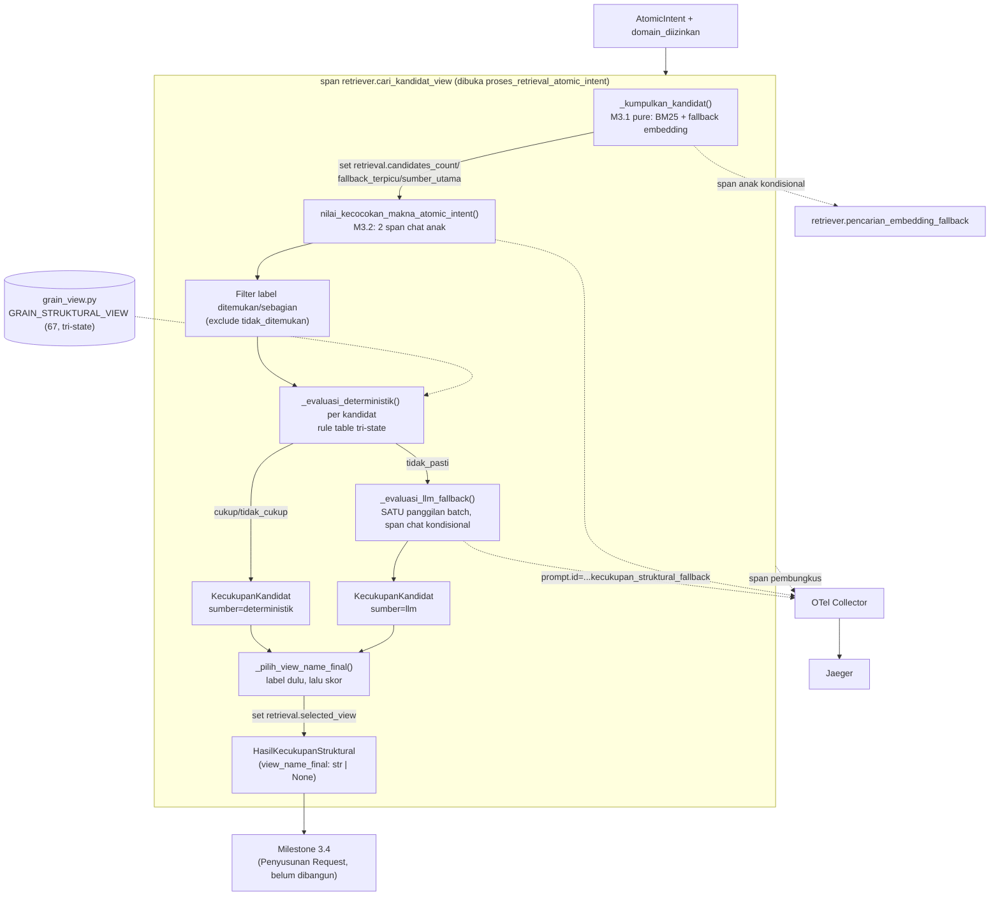

# Report — Milestone 3.3: Pemeriksaan Kecukupan Struktural

Milestone ini berjenis **berbasis kode/sistem** — outputnya mekanisme hybrid (deterministik + fallback LLM konservatif) yang benar-benar berjalan end-to-end dan bisa dibuktikan bekerja lewat eksekusi nyata. Bagian 3 diisi penuh.

## Bagian 1 — Ringkasan Hasil

**Status akhir:** Selesai sesuai rencana. Milestone ini **menutup PIC 3 (Retriever) sepenuhnya** — M3.1 (Pengumpulan Kandidat), M3.2 (Kecocokan Makna), M3.3 (Kecukupan Struktural, di sini) seluruhnya selesai dan terverifikasi.

Milestone 3.3 menghasilkan `evaluasi_kecukupan_struktural_atomic_intent()` dan `proses_retrieval_atomic_intent()` (`src/layers/retriever/kecukupan_struktural.py`) — mencocokkan `label_bentuk_jawaban` (M1.6) terhadap grain kandidat `view_name` yang sudah dinyatakan cocok maknanya di M3.2, lalu memfinalkan SATU `view_name`. Mekanisme **hybrid** (dikonfirmasi user lewat `AskUserQuestion`, dengan penjelasan detail per opsi atas permintaan eksplisit user): rule table deterministik tri-state (`GRAIN_STRUKTURAL_VIEW`, 67 view diklasifikasi manual dari prosa grain katalog) sebagai jalur utama; SATU panggilan LLM konservatif (bukan generate-verify penuh seperti M3.2 — risiko M3.3 asimetris mirror M1.7) untuk kandidat yang rule table-nya genuinely ambigu (`tidak_pasti`). User memilih hybrid secara eksplisit menolak deterministik-murni dengan alasan forward-looking: taksonomi 5 `label_bentuk_jawaban` diperkirakan bertambah kompleks ke depan — rule table karena itu dirancang **fail-safe** ke LLM untuk label yang tidak dikenal.

**Tantangan teknis inti**: KK3 sumber menuntut atribut `retrieval.selected_view` mengisi span M3.1 (`retriever.cari_kandidat_view`) yang SAMA, bukan span baru — sementara OpenTelemetry tidak mengizinkan `set_attribute()` pada span yang sudah `end()`. Diselesaikan lewat refactor terisolasi (Checkpoint 9): logic murni M3.1 diekstrak ke `_kumpulkan_kandidat()` (tanpa span), `cari_kandidat_view()` standalone tetap 100% tidak berubah perilaku (regresi test M3.1 tanpa perubahan assertion), dan orkestrator baru M3.3 (`proses_retrieval_atomic_intent()`) membuka span bernama sama yang membungkus M3.1+M3.2+M3.3 sekaligus.

Diverifikasi nyata lolos KETIGA Kriteria Keberhasilan sumber lewat 54 unit test baru (mocked LLM, total 127 test di `tests/layers/retriever/`+`tests/config/`), eval nyata 6/6 skenario (`evals/3.3-.../`, end-to-end M3.1+M3.2+M3.3 sungguhan), reliability testing Promptfoo (4/4 lolos setelah 3 iterasi perbaikan berbasis bukti), dan verifikasi Jaeger nyata (dua trace_id konkret, KK3 terbukti literal).

## Bagian 2 — Kriteria Keberhasilan vs Bukti Nyata

| Kriteria (dari dokumen sumber) | Bukti Aktual | Terpenuhi? |
|---|---|---|
| "Kebutuhan berlabel tren yang hanya punya kandidat view snapshot (tanpa dimensi waktu berulang) dinyatakan tidak cukup, bukan dipaksakan lolos." | Unit test matriks lengkap (`test_tren_time_series_tidak_tidak_cukup` dkk, 22 skenario Checkpoint 4) + eval nyata S01 (`evals/3.3-.../payloads/S01.json`) + Promptfoo S03 (`v_hr_turnover_snapshot`, pernyataan eksplisit katalog "tidak ada tren historis" → `cukup=false`). | Ya |
| "Kebutuhan berlabel nilai tunggal yang view-nya memang menyediakan grain sesuai (satu baris relevan) dinyatakan cukup." | `test_nilai_tunggal_selalu_cukup` (9 kombinasi tri-state, semua `cukup`) + eval nyata S02 (`v_reservation_room_type_daily` → `view_name_final` persis, tanpa fallback LLM). | Ya |
| "Atribut `retrieval.selected_view` pada span Milestone 3.1 terisi dengan `view_name` yang benar-benar dipilih setelah melalui Milestone 3.2-3.3, terlihat konsisten saat trace ditelusuri di Jaeger/Grafana." | Verifikasi Jaeger nyata (Checkpoint 11): trace `8c8d2782bee629068063f9632a8c725d` (span `retriever.cari_kandidat_view` membawa `retrieval.candidates_count=5` DAN `retrieval.selected_view=v_reservation_room_type_daily` SEKALIGUS) dan trace `c3ef710165a92c51006ee4cf2474bd5f` (span sama, `retrieval.selected_view=""` — jujur konsisten dengan `view_name_final=None`, span anak `chat` fallback M3.3 muncul kondisional). | Ya |

## Bagian 3 — Cara Kerja dan Arsitektur

### Cara Kerja

`proses_retrieval_atomic_intent(atomic_intent, domain_diizinkan)` membuka span `retriever.cari_kandidat_view` yang membungkus: (1) `_kumpulkan_kandidat()` (M3.1 pure, BM25+fallback embedding) → set atribut `retrieval.candidates_count`/`fallback_terpicu`/`sumber_utama`; (2) `nilai_kecocokan_makna_atomic_intent()` (M3.2, dua span `chat` anak); (3) `evaluasi_kecukupan_struktural_atomic_intent()` (M3.3) — filter kandidat label `ditemukan`/`sebagian` (exclude `tidak_ditemukan`), jalankan `_evaluasi_deterministik()` per kandidat (rule table: `nilai_tunggal` selalu cukup; `tren` via `punya_time_series`; `perbandingan`/`peringkat`/`komposisi` via `punya_dimensi_pembanding`), kumpulkan yang `tidak_pasti` dan lempar SEKALI (batch) ke `_evaluasi_llm_fallback()` (span `chat` kondisional, default aman `cukup=False` kalau API gagal), lalu `_pilih_view_name_final()` menerapkan tie-break (label M3.2 DITEMUKAN>SEBAGIAN dulu, lalu skor `KandidatView` M3.1 tertinggi). Span ditutup setelah `retrieval.selected_view` diisi.

### Diagram Arsitektur

### Integrasi dengan Komponen Lain

Input: `AtomicIntent` (M1.6) + `domain_diizinkan` (M2.2). Output: `HasilKecukupanStruktural` — konsumen berikutnya Milestone 3.4 (Penyusunan Request, belum dibangun), yang butuh `view_name_final` (kalau tidak `None`) untuk mengisi `{domain, view_name, params}`.

**Konfirmasi Catatan Serah Terima** (`rancangan-retrieval-query.md`, milestone TERAKHIR Retriever): daftar `view_name` final Retriever (`HasilKecukupanStruktural.view_name_final`) kompatibel bentuknya dengan parameter `view_name_tervalidasi_retriever: str` yang sudah dikonsumsi `verifikasi_gate()` (M2.4) sejak sebelum M3.x dibangun — dikonfirmasi langsung dari kode `src/layers/verification_gate/verifikasi_gate.py` (`verifikasi_kepatuhan_sumber(request, view_name_tervalidasi_retriever)`), bukan asumsi. M3.4/M3.5 (Query Engine — penyusunan `params` dan verifikasi bentuk request) eksplisit DI LUAR cakupan milestone ini.

## Bagian 4 — Perubahan dari Plan

Tidak ada perubahan pada checkpoint atau bentuk akhir yang direncanakan. Satu perbaikan berbasis bukti (bukan penyimpangan plan, melainkan bagian dari "revisi threshold/klasifikasi berbasis bukti" yang eksplisit diantisipasi budaya proyek ini): klasifikasi `punya_time_series` untuk `v_facility_room_status_daily`/`v_hr_headcount_status_daily` direvisi dari `tidak` ke `tidak_pasti` (Checkpoint 7, dari `tidak`) setelah eval Promptfoo menunjukkan model punya argumen masuk akal bahwa keduanya (beda dari `v_hr_turnover_snapshot` yang katalognya eksplisit menyatakan "tidak ada tren historis") genuinely ambigu. Prompt fallback LLM melalui 3 iterasi (v1→v3) berdasar bukti Promptfoo berurutan — didokumentasikan lengkap `logs.md` Checkpoint 7 dan `decisions.md` Addendum Checkpoint 7, bukan disembunyikan.

## Bagian 5 — Keterbatasan dan Item Provisional

- **Fallback LLM (v3) untuk kasus genuinely ambigu tidak selalu konservatif** — eval S01 (`evals/3.3-.../audit.md` Temuan 1) menunjukkan `v_hr_headcount_status_daily` (grain ambigu, tanpa pernyataan eksplisit katalog) dinilai `cukup=True` oleh model. Ini KONSISTEN desain (kasus ambigu memang diserahkan ke penilaian LLM, bukan dipaksa selalu `False`), TAPI berarti "kalau ragu, jawab tidak cukup" tidak selalu diikuti ketat — satu titik data, belum cukup untuk entri formal `docs/keterbatasan-diterima.md`.
- **Taksonomi grain (`grain_view.py`) hasil klasifikasi manual, bukan sumber otoritatif tunggal** — direview + direvisi sekali berdasar bukti eval (mirror preseden M2.3 9-view, M3.1 threshold BM25), tapi berpotensi masih ada kasus lain yang perlu direvisi kalau produksi nyata menunjukkan pola serupa S01/Temuan grain snapshot Checkpoint 7.
- **Belum ada Milestone 3.4 (Query Engine) untuk diuji integrasi end-to-end** — M3.3 diverifikasi lewat `AtomicIntent`+`domain_diizinkan` yang dikonstruksi manual di eval, bukan lewat pipeline penuh dari Decomposition (M1.6)/Domain Gate (M2.1-2.2) nyata.
- **Belum wired ke endpoint HTTP manapun** — konsisten preseden M1.2-M3.2.
- **Model fallback LLM (Qwen3-32B) reuse tanpa perbandingan empiris baru** — forced preseden chat/completion biasa (M1.6/M2.1/M2.3/M3.2), beda dari model embedding M3.1 yang genuinely dibandingkan.

## Bagian 6 — Follow-up

- **PIC 3 (Retriever, Milestone 3.1-3.3) SELESAI SEPENUHNYA.**
- Milestone 3.4 (Penyusunan Request) — konsumen langsung `HasilKecukupanStruktural.view_name_final`, menyusun `params` sesuai `api-chatbot.md` per `view_name` final.
- Milestone 3.5 (Verifikasi Bentuk Request) — melengkapi pola generate-verify M3.4.
- **Pemicu peninjauan eksplisit**: kalau M3.4+ atau produksi nyata menunjukkan pola berulang fallback LLM tidak konservatif pada kasus ambigu (Bagian 5), naikkan jadi entri formal `docs/keterbatasan-diterima.md` — saat ini baru satu titik data (S01).
- Verifikasi berkelanjutan: `kecukupan_struktural.py` dan prompt fallback sudah terdaftar di `prompt_reliability/retriever/kecukupan_struktural_fallback.promptfooconfig.yaml` — reliability testing wajib dijalankan ulang kalau versi prompt di-bump lagi.
