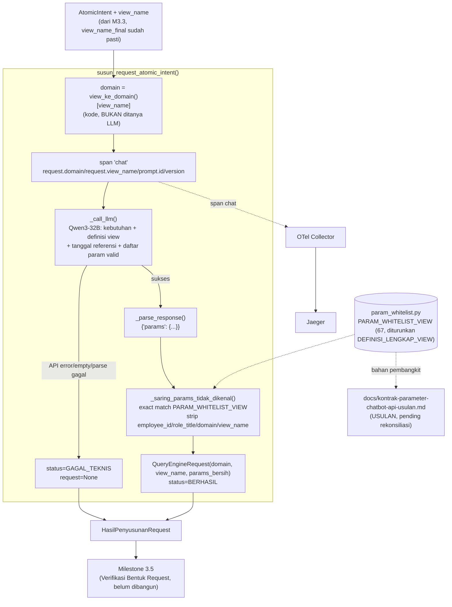

# Report — Milestone 3.4: Penyusunan Request

Milestone ini berjenis **berbasis kode/sistem** — outputnya mekanisme generate-only (satu pemanggilan LLM + filter defensif deterministik) yang benar-benar berjalan end-to-end dan bisa dibuktikan bekerja lewat eksekusi nyata. Bagian 3 diisi penuh.

## Bagian 1 — Ringkasan Hasil

**Status akhir:** Selesai sesuai rencana. Milestone ini adalah **Langkah 1 (generate)** dari dua langkah Query Engine — Milestone 3.5 (verifikasi bentuk request independen) TETAP TERSISA sebelum request benar-benar "final" siap dikirim Verification Gate, DI LUAR cakupan milestone ini.

Milestone 3.4 menghasilkan `susun_request_atomic_intent()` (`src/layers/query_engine/penyusunan_request.py`, subpackage BARU) — dari kebutuhan atomik + `view_name` yang sudah divalidasi Retriever (M3.1-3.3), menyusun `QueryEngineRequest {domain, view_name, params}` (skema di-reuse persis dari M2.4) lewat SATU pemanggilan LLM (ekstraksi parameter terstruktur, resolusi tanggal relatif). `domain` diturunkan deterministik lewat `view_ke_domain()` (M3.1), TIDAK diminta LLM.

**Gap arsitektur nyata dihadapi dan diselesaikan**: `api-chatbot.md` hanya mendokumentasikan 4 parameter global — whitelist parameter PER-VIEW (file `whitelist_<domain>.py`) sepenuhnya eksternal/tidak tersedia, sama seperti gap `employee_id` yang sudah dihadapi M2.4. User dimintai klarifikasi (dua CSV yang diberikan ternyata data isi tabel, bukan dokumentasi kontrak), mengonfirmasi kontrak resmi memang belum final dan secara eksplisit meminta: (1) konvensi provisional (nama kolom asli view, diturunkan programatik dari `DEFINISI_LENGKAP_VIEW` M3.2) dipakai sekarang, (2) diterbitkan formal sebagai `docs/kontrak-parameter-chatbot-api-usulan.md` (67 view, dikelompokkan per domain) untuk direkonsiliasi dengan tim pembangun `chatbot_api` di akhir proyek — BUKAN cuma dicatat di `decisions.md` milestone.

Diverifikasi nyata lolos KEDUA Kriteria Keberhasilan sumber lewat 35 unit test baru (mocked LLM), eval nyata (7 skenario end-to-end, 6/7 lolos check otomatis — S04 REVIEW dikoreksi jadi lolos substansi setelah ditinjau, lihat Bagian 5), reliability testing Promptfoo (4/4 lolos setelah satu iterasi perbaikan prompt v1→v2 berbasis bukti), dan verifikasi Jaeger nyata (satu trace_id konkret, seluruh atribut wajib terkonfirmasi).

## Bagian 2 — Kriteria Keberhasilan vs Bukti Nyata

| Kriteria (dari dokumen sumber) | Bukti Aktual | Terpenuhi? |
|---|---|---|
| "Kebutuhan dengan rentang waktu relatif dalam bahasa sehari-hari (skenario uji: 'bulan lalu', 'tiga bulan terakhir') diterjemahkan menjadi rentang tanggal konkret yang benar di parameter, bukan diteruskan sebagai teks mentah." | Eval nyata S01 ("bulan lalu" → `period_date_from="2026-07-01"`, `period_date_to="2026-07-31"`, persis benar dari `tanggal_referensi=2026-08-17`) dan S02 ("tiga bulan terakhir" → `2026-05-17` s.d. `2026-08-17`, jendela ~3 bulan tepat) — `evals/3.4-.../payloads/S01.json`, `S02.json`. Diperkuat Promptfoo S01 (skenario terpisah, hasil identik). | Ya |
| "Request yang dihasilkan hanya berisi parameter yang memang terdaftar valid untuk `view_name` tersebut sesuai kontrak `api-chatbot.md` — tidak ada parameter yang dikarang di luar yang tersedia." | `_saring_params_tidak_dikenal()` (filter defensif deterministik, exact match `PARAM_WHITELIST_VIEW`) dibuktikan unit test (`test_saring_params_key_tidak_dikenal_dibuang` dkk) DAN eval nyata S07 (`star_rating` — kolom yang genuinely ada di `properties.csv` mentah user tapi TIDAK ada di definisi view sesungguhnya — tidak pernah lolos ke `request.params`, `evals/3.4-.../payloads/S07.json`). S05 (anti over-filling) lolos setelah perbaikan prompt v1→v2 (temuan "Nirwana" disalahartikan sebagai nama properti, `decisions.md` Addendum Checkpoint 6-7). | Ya |

Verifikasi span nyata (Checkpoint 8): trace `07147fa01b4a6b9ecff545ac36dde0fd` — span `"chat"` membawa `gen_ai.request.model`, `prompt.id=query_engine.penyusunan_request`, `prompt.version=2`, `request.domain=reservation`, `request.view_name=v_reservation_room_type_daily` sekaligus, sesuai kontrak Bagian 2 `rancangan-observability-ai-chatbot.md` baris "Query Engine (Langkah 1 & 2)".

## Bagian 3 — Cara Kerja dan Arsitektur

### Cara Kerja

`susun_request_atomic_intent(atomic_intent, view_name, tanggal_referensi=None)`: `tanggal_referensi` default `datetime.now()` zona WIB (fixed-offset UTC+7, tanpa dependency `tzdata`) kalau tidak diberikan. `domain` diturunkan `view_ke_domain()[view_name]` (M3.1). Membuka span `"chat"` (atribut `gen_ai.*`/`prompt.id`/`prompt.version`/`request.domain`/`request.view_name`), memanggil LLM (Qwen3-32B) dengan konteks: teks kebutuhan, `label_bentuk_jawaban`, tanggal referensi, definisi lengkap view (`DEFINISI_LENGKAP_VIEW`, M3.2, untuk makna kolom), dan daftar parameter valid (`PARAM_WHITELIST_VIEW[view_name]`, Checkpoint 2). Respons LLM di-parse (`_parse_response`, gagal total → `GAGAL_TEKNIS`), lalu disaring (`_saring_params_tidak_dikenal` — exact key match ke whitelist, `employee_id`/`role_title`/`domain`/`view_name` di-strip paksa) sebelum `QueryEngineRequest` final dibangun.

### Diagram Arsitektur

### Integrasi dengan Komponen Lain

Input: `AtomicIntent` (M1.6) + `view_name` (M3.3, `HasilKecukupanStruktural.view_name_final`, sudah pasti non-`None` — pengecekan `None` didorong ke pemanggil M4.x). Output: `HasilPenyusunanRequest` — konsumen berikutnya Milestone 3.5 (Verifikasi Bentuk Request, belum dibangun), yang menilai ulang independen apakah `request` benar-benar sesuai kebutuhan sebelum diteruskan ke Verification Gate (M2.4, SUDAH SELESAI).

**Konfirmasi kompatibilitas dengan Verification Gate (M2.4)**: dicek langsung dari kode `src/layers/verification_gate/verifikasi_gate.py` — `verifikasi_gate()` menerima `request: QueryEngineRequest` dan membaca `request.domain`/`request.view_name`/`request.params.get("limit")`/`.get("employee_id")` saja. `QueryEngineRequest` yang dihasilkan M3.4 (Checkpoint 5) 100% kompatibel bentuknya (tidak ada perubahan skema M2.4 diperlukan).

## Bagian 4 — Perubahan dari Plan

Tidak ada perubahan pada checkpoint atau bentuk akhir yang direncanakan. Satu iterasi prompt berbasis bukti (v1→v2, sesuai antisipasi plan Checkpoint 7 "mirror pola iteratif M3.3"): temuan eval nyata (Checkpoint 6) — model salah menafsirkan "Nirwana" (nama grup perusahaan) sebagai nilai filter properti spesifik — direplikasi independen lewat Promptfoo (Checkpoint 7), diperbaiki via klarifikasi eksplisit di prompt, diverifikasi ulang lolos di kedua jalur (eval manual + Promptfoo 3/4→4/4).

## Bagian 5 — Keterbatasan dan Item Provisional

- **Konvensi parameter (`PARAM_WHITELIST_VIEW`) PROVISIONAL, belum kontrak resmi** — RISIKO SEDANG, dicatat `docs/keputusan-tertunda.md` #3 (baru). WAJIB direkonsiliasi dengan tim pembangun `chatbot_api` di akhir proyek; arsitektur sistem sendiri sudah mendesain jalur pemulihan (`400` → kembali ke M3.4) untuk kasus konvensi ini ternyata salah, dibangun nyata di M4.x nanti.
- **Nilai parameter tidak divalidasi kewajarannya, hanya nama key** — eval S04 (`evals/3.4-.../audit.md` Temuan 2) menemukan nilai nonsensikal (`occupancy_rate: "nilai_tunggal"`) lolos dari sisi nama (ada di whitelist) tapi salah dari sisi makna. SENGAJA tidak diperbaiki M3.4 — validasi nilai per-parameter adalah ruang kesalahan terbuka, secara arsitektur menjadi tanggung jawab Milestone 3.5 (verifikasi independen). Bukan bug M3.4, melainkan bukti konkret kenapa pola generate-verify dipertahankan.
- **Resolusi nama/wilayah properti ke kode tidak konsisten** — S04 dan verifikasi Jaeger Checkpoint 8 sama-sama menunjukkan model memilih parameter ALTERNATIF valid (`property_name`/`region`) alih-alih `property_id`, karena prompt tidak pernah menyertakan tabel pemetaan nama→kode eksplisit. BUKAN bug (kedua alternatif sama-sama valid di whitelist), tapi dicatat sebagai observasi kualitatif — kalau produksi nyata butuh konsistensi `property_id` spesifik, perlu dipertimbangkan menambah tabel resolusi nama properti ke konteks prompt (di luar cakupan M3.4 saat ini).
- **Belum ada Milestone 3.5 untuk diuji integrasi end-to-end penuh** — M3.4 diverifikasi lewat `AtomicIntent`+`view_name` yang dikonstruksi manual di eval, bukan lewat pipeline penuh dari Decomposition/Domain Gate/Retriever nyata.
- **Belum wired ke endpoint HTTP manapun** — konsisten preseden M1.2-M3.3.
- **Model reuse tanpa perbandingan empiris baru** — forced preseden chat/completion biasa (M1.6/M2.1/M2.3/M3.2/M3.3), beda dari model embedding M3.1 yang genuinely dibandingkan.

## Bagian 6 — Follow-up

- Milestone 3.5 (Verifikasi Bentuk Request) — konsumen langsung `HasilPenyusunanRequest.request`, menilai ulang independen (tanpa melihat proses M3.4) apakah `view_name` sesuai Retriever dan `params` genuinely menghasilkan bentuk jawaban yang diminta — PIC 3 baru benar-benar SELESAI setelah ini, Catatan Serah Terima `rancangan-retrieval-query.md` baru terpenuhi penuh setelah M3.5.
- **Pemicu peninjauan eksplisit**: rekonsiliasi `docs/kontrak-parameter-chatbot-api-usulan.md` dengan tim pembangun `chatbot_api` WAJIB terjadi di akhir proyek (`docs/keputusan-tertunda.md` #3) — bukan opsional.
- Kalau M3.5/M4.x menunjukkan pola berulang nilai parameter nonsensikal lolos ke Execution (Bagian 5), naikkan jadi entri formal `docs/keterbatasan-diterima.md` — saat ini baru satu titik data (S04).
- Verifikasi berkelanjutan: `penyusunan_request.py` dan prompt sudah terdaftar di `prompt_reliability/query_engine/` — reliability testing wajib dijalankan ulang kalau versi prompt di-bump lagi.
