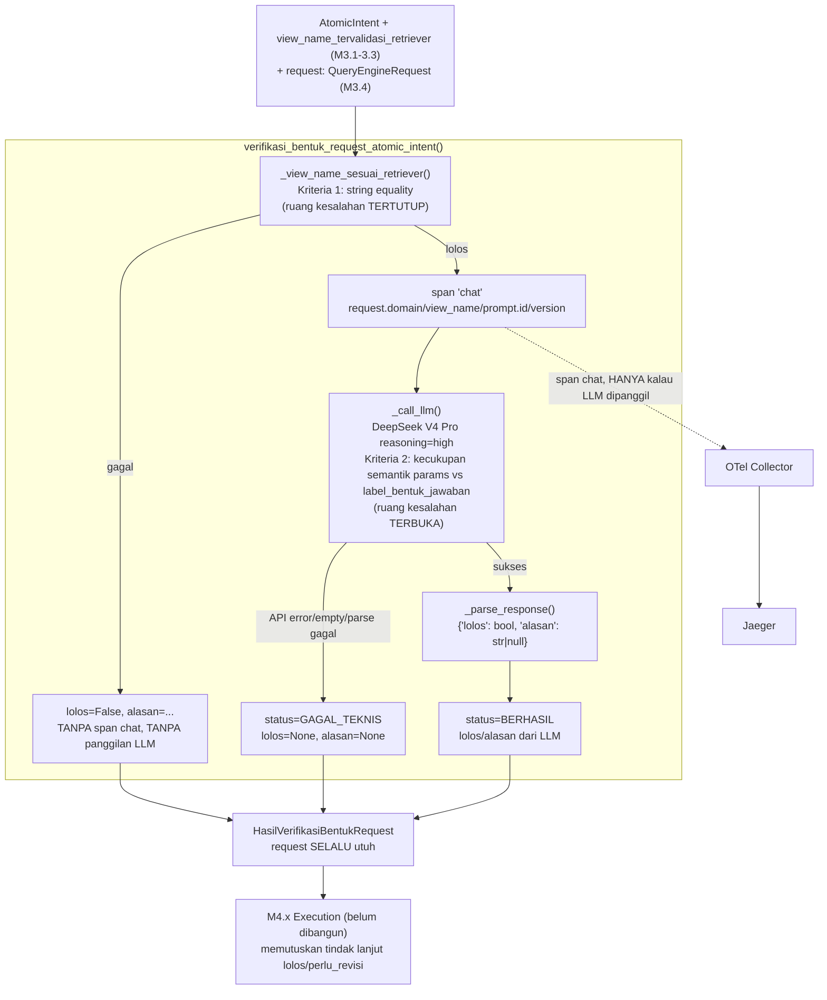

# Report — Milestone 3.5: Verifikasi Bentuk Request

Milestone ini berjenis **berbasis kode/sistem** — outputnya mekanisme HYBRID (pre-check deterministik + satu pemanggilan LLM konservatif) yang benar-benar berjalan end-to-end dan bisa dibuktikan bekerja lewat eksekusi nyata. Bagian 3 diisi penuh.

## Bagian 1 — Ringkasan Hasil

**Status akhir:** Selesai sesuai rencana. Milestone ini adalah **Langkah 2 (verifikasi independen)** dari dua langkah Query Engine — melengkapi pola generate-verify yang dibuka Milestone 3.4. Milestone 3.5 adalah **milestone TERAKHIR** di `rancangan-retrieval-query.md`.

Milestone 3.5 menghasilkan `verifikasi_bentuk_request_atomic_intent()`/`verifikasi_bentuk_request_semua()` (`src/layers/query_engine/verifikasi_bentuk_request.py`, subpackage `query_engine/` yang sudah ada) — dari `QueryEngineRequest` hasil M3.4 + `view_name_tervalidasi_retriever` (hasil M3.1-3.3), menilai ulang SECARA INDEPENDEN (tanpa melihat proses generate M3.4) terhadap dua kriteria: (1) kepatuhan sumber `view_name`, (2) kecukupan semantik `params` terhadap `label_bentuk_jawaban`.

**Mekanisme HYBRID (bukan LLM tunggal)**: Kriteria 1 adalah pre-check DETERMINISTIK (`_view_name_sesuai_retriever()`, perbandingan string, ruang kesalahan tertutup) yang dijalankan LEBIH DULU — kalau gagal, short-circuit TANPA membuka span `chat` dan TANPA memanggil LLM sama sekali. Kriteria 2 BUTUH LLM (DeepSeek V4 Pro `reasoning="high"`, ruang kesalahan terbuka) — SATU pemanggilan, tanpa retry. Keputusan ini forced langsung dari prinsip arsitektur "ruang kesalahan tertutup vs terbuka" `CLAUDE.md`, bukan asumsi bebas.

Diverifikasi nyata lolos KEDUA Kriteria Keberhasilan sumber lewat 16 unit test baru (mocked LLM), eval nyata (5 skenario end-to-end, **5/5 lolos di run pertama** — termasuk replikasi PERSIS temuan nyata S04 M3.4 yang sengaja dibiarkan untuk milestone ini), reliability testing Promptfoo (4/4 lolos di run pertama, prompt tetap v1 tanpa revisi), dan verifikasi Jaeger nyata (DUA trace_id konkret — satu membuktikan span `chat` lengkap saat LLM dipanggil, satu membuktikan span `chat` TIDAK ADA SAMA SEKALI saat pre-check short-circuit).

## Bagian 2 — Kriteria Keberhasilan vs Bukti Nyata

| Kriteria (dari dokumen sumber) | Bukti Aktual | Terpenuhi? |
|---|---|---|
| "Request dengan `view_name` yang sengaja dibuat tidak sesuai hasil Retriever (skenario uji terkontrol) berhasil ditangkap dan ditolak oleh verifikasi ini." | Unit test `test_pre_check_gagal_llm_tidak_pernah_dipanggil` (LLM dibuktikan TIDAK terpanggil via monkeypatch raise). Eval nyata S01 (`lolos=False`, `alasan` persis string deterministik pre-check) — `evals/3.5-.../payloads/S01.json`. Verifikasi Jaeger: trace `723e581591cb1284143a6c65afc20037` TIDAK mengandung span `chat` sama sekali. | Ya |
| "Request berlabel tren yang parameter rentang tanggalnya sengaja dipersempit jadi satu hari saja (skenario uji terkontrol) berhasil ditangkap sebagai tidak sesuai bentuk jawaban yang diminta." | Eval nyata S02 (`lolos=False`, alasan eksplisit menyebut rentang satu hari tidak cukup untuk tren) — `evals/3.5-.../payloads/S02.json`. Diperkuat Promptfoo S02_tren_rentang_satu_hari_tidak_cukup (skenario terpisah, hasil identik). | Ya |

Verifikasi span nyata (Checkpoint 7): trace `b75702b73540855d7e5e18df835870e7` — span `"chat"` membawa `gen_ai.request.model=deepseek/deepseek-v4-pro`, `prompt.id=query_engine.verifikasi_bentuk_request`, `prompt.version=1`, `request.domain=reservation`, `request.view_name=v_reservation_room_type_daily` sekaligus, sesuai kontrak Bagian 2 `rancangan-observability-ai-chatbot.md` baris "Query Engine (Langkah 1 & 2)".

## Bagian 3 — Cara Kerja dan Arsitektur

### Cara Kerja

`verifikasi_bentuk_request_atomic_intent(atomic_intent, view_name_tervalidasi_retriever, request)`: pre-check `_view_name_sesuai_retriever()` dijalankan LEBIH DULU (perbandingan string `request.view_name == view_name_tervalidasi_retriever`) — gagal → langsung `HasilVerifikasiBentukRequest(status=BERHASIL, lolos=False, alasan=...)` TANPA span `chat`/panggilan LLM. Lolos pre-check → buka span `"chat"` (atribut `gen_ai.*`/`prompt.id`/`prompt.version`/`request.domain`/`request.view_name`), panggil LLM (DeepSeek V4 Pro `reasoning="high"`) dengan konteks: teks kebutuhan, `label_bentuk_jawaban`, definisi lengkap view (`DEFINISI_LENGKAP_VIEW`, M3.2, untuk grain), dan `params` request apa adanya. Respons di-parse (`_parse_response`, gagal total → `GAGAL_TEKNIS`), `lolos`/`alasan` LLM diteruskan langsung ke `HasilVerifikasiBentukRequest` — `request` SELALU utuh di output (tidak pernah di-null-kan/dimodifikasi, beda `verifikasi_gate()` M2.4). `verifikasi_bentuk_request_semua()` mengorkestrasi batch, span pembungkus non-LLM dengan statistik agregat.

### Diagram Arsitektur

### Integrasi dengan Komponen Lain

Input: `AtomicIntent` (M1.6) + `view_name_tervalidasi_retriever` (M3.3) + `request: QueryEngineRequest` (M3.4, `HasilPenyusunanRequest.request`, sudah pasti non-`None` — pemanggil menyaring hanya item M3.4 `status=BERHASIL`, konsisten preseden M3.4 Keputusan 4). Output: `HasilVerifikasiBentukRequest` — konsumen berikutnya M4.x (Execution, belum dibangun), yang memutuskan tindak lanjut untuk kasus `lolos=False` (jalur perbaikan/retry, EKSPLISIT DI LUAR cakupan milestone ini, lihat Bagian 5).

**Konfirmasi Catatan Serah Terima `rancangan-retrieval-query.md` TERPENUHI PENUH**: dicek ulang kedua paragraf Catatan Serah Terima — (1) "Daftar `view_name` yang divalidasi di Milestone 3.1-3.3 menjadi rujukan yang dipakai Verification Gate" — sudah terpenuhi sejak M2.4/M3.1, tidak berubah. (2) "Request final hasil Milestone 3.4-3.5 dikirim ke Verification Gate sebagai bagian dari alur normal... skema `{domain, view_name, params}` adalah kontrak yang mengikat ketiga pekerjaan ini sekaligus" — `QueryEngineRequest` M3.5 output (`HasilVerifikasiBentukRequest.request`) bentuknya PERSIS SAMA dengan yang diterima M2.4 (`verifikasi_gate()`), dicek langsung dari kode `src/layers/verification_gate/verifikasi_gate.py` — 100% kompatibel, tidak ada perubahan skema M2.4 diperlukan. (3) "Jalur perbaikan untuk request yang gagal... perlu disepakati bentuknya dengan pemilik `rancangan-execution-interpretation.md` sebelum diimplementasikan" — TETAP BELUM diimplementasikan (sesuai instruksi eksplisit dokumen sumber sendiri), dicatat sebagai follow-up murni di Bagian 6, BUKAN kegagalan memenuhi Catatan Serah Terima (dokumen sumber sendiri yang menyatakan ini "perlu disepakati... sebelum diimplementasikan", bukan kewajiban M3.5 untuk membangunnya).

**PIC 3 (Retriever + Query Engine, Milestone 3.1-3.5) SELESAI SEPENUHNYA** setelah milestone ini.

## Bagian 4 — Perubahan dari Plan

Tidak ada perubahan pada checkpoint atau bentuk akhir yang direncanakan. Prompt TIDAK direvisi (tetap v1) — 5/5 eval nyata dan 4/4 Promptfoo lolos di run pertama, tidak ada temuan yang memicu iterasi seperti pola v1→v2 M3.4 atau v1→v3 M3.3.

## Bagian 5 — Keterbatasan dan Item Provisional

- **Ketidakkonsistenan nyata S04 vs S05 (eval Checkpoint 5)** — dua skenario dengan gap struktural serupa (params tanpa filter `room_type` pada view berdimensi tipe kamar) mendapat verdict `lolos` berbeda (`true` vs `false`). Dicatat transparan di `evals/3.5-.../audit.md` Temuan 3 — BUKAN dianggap kegagalan (kedua skenario tetap match ekspektasi independennya masing-masing), tapi observasi kualitas nyata. Baru 1 titik data — TIDAK dicatat sebagai entri formal `docs/keterbatasan-diterima.md`, dipantau untuk pola berulang di masa depan.
- **Jalur perbaikan/retry (baik ke M3.4 maupun ke Execution `400`) TETAP di luar cakupan** — dokumen sumber sendiri eksplisit menyatakan ini "perlu disepakati... sebelum diimplementasikan di kedua sisi" dengan pemilik `rancangan-execution-interpretation.md` (M4.x, belum dibangun). Follow-up eksplisit untuk M4.x, bukan celah M3.5.
- **Pre-check Kriteria 1 SENGAJA redundan dengan `verifikasi_kepatuhan_sumber()` M2.4** — didokumentasikan penuh di `decisions.md` Keputusan 2, risiko drift dinilai rendah (keduanya perbandingan string sederhana atas dua nilai yang sama).
- **Konvensi parameter (`PARAM_WHITELIST_VIEW`, M3.4) tetap PROVISIONAL** — penilaian kecukupan M3.5 beroperasi terhadap konvensi provisional yang sama (`docs/keputusan-tertunda.md` #3), TIDAK diperluas cakupannya oleh M3.5.
- **Belum ada M4.x untuk diuji integrasi end-to-end penuh** — M3.5 diverifikasi lewat `AtomicIntent`/`QueryEngineRequest` yang dikonstruksi manual di eval, bukan lewat pipeline penuh M1.x-M3.4 nyata.
- **Belum wired ke endpoint HTTP manapun** — konsisten preseden M1.2-M3.4.
- **Model reuse tanpa perbandingan empiris baru** — forced preseden model chat/completion biasa dengan peran verifier independen (M1.6/M2.1/M2.3/M3.2).

## Bagian 6 — Follow-up

- **PIC 3 (Retriever + Query Engine, Milestone 3.1-3.5) SELESAI SEPENUHNYA.** Langkah berikutnya yang disarankan: Milestone 4.x (Execution & Interpretation, PIC 4) — konsumen langsung `HasilVerifikasiBentukRequest` (via `HasilVerifikasiGate` M2.4 setelah Verification Gate). **WAJIB memverifikasi keterbatasan #10 (konvensi `employee_id`) DAN keputusan tertunda #3 (konvensi parameter `chatbot_api`) sebelum mengirim request nyata ke `chatbot_api` produksi** — kedua risiko ini genuinely belum terverifikasi dari dalam repo ini.
- Jalur perbaikan/retry (M3.5 → M3.4, dan `400` Execution → M3.4) perlu dirancang bersama pemilik M4.x begitu M4.x mulai dikerjakan — bukan diasumsikan bentuknya sepihak oleh M3.5.
- Kalau M4.x/produksi menunjukkan pola berulang ketidakkonsistenan verdict (Bagian 5, Temuan 3 `audit.md`) pada kasus dengan gap struktural serupa, naikkan jadi entri formal `docs/keterbatasan-diterima.md` — saat ini baru satu titik data.
- Verifikasi berkelanjutan: `verifikasi_bentuk_request.py` dan prompt sudah terdaftar di `prompt_reliability/query_engine/` — reliability testing wajib dijalankan ulang kalau versi prompt di-bump di masa depan.
