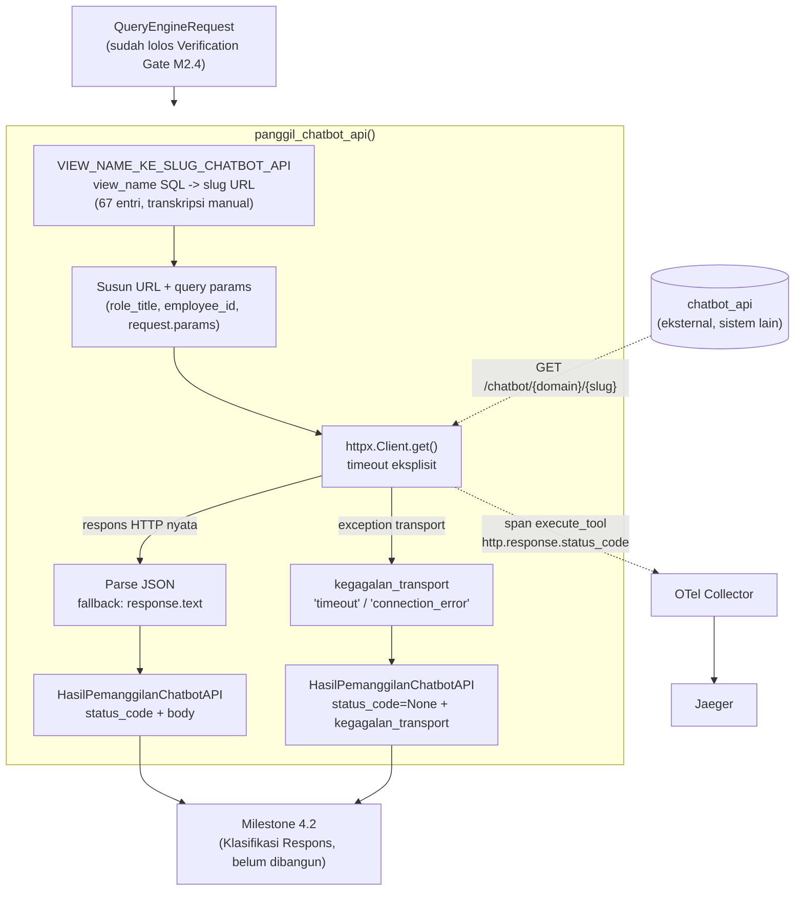

# Report — Milestone 4.1: Membangun Pemanggilan chatbot_api

Milestone ini berjenis **berbasis kode/sistem** — outputnya mekanisme HTTP client yang benar-benar berjalan dan bisa dibuktikan bekerja lewat panggilan nyata ke `chatbot_api`. Bagian 3 diisi penuh.

## Bagian 1 — Ringkasan Hasil

**Status akhir:** Selesai sesuai rencana, dengan dua jeda operasional di tengah jalan (keduanya diselesaikan pihak eksternal/user, bukan revisi kode M4.1) — lihat Bagian 4. Milestone ini adalah **pekerjaan pertama PIC 4 (Execution & Interpretation)**.

Milestone 4.1 menghasilkan `panggil_chatbot_api()` (`src/layers/execution/pemanggilan_chatbot_api.py`) — satu-satunya titik dalam seluruh sistem yang benar-benar melakukan panggilan HTTP ke `chatbot_api`, murni teknis TANPA LLM sama sekali. Menerima `QueryEngineRequest` yang sudah lolos Verification Gate (M2.4), mengembalikan respons mentah `{status_code, body}` **apa adanya tanpa interpretasi** — klasifikasi status jadi tanggung jawab Milestone 4.2 (belum dikerjakan). Span `execute_tool` mencatat `http.response.status_code` sesuai kontrak observability.

**Dua temuan signifikan sebelum dan selama implementasi:**
1. **Audit plan menemukan gap kritis**: `view_name` internal (nama SQL) TIDAK SAMA dengan slug URL `chatbot_api`, transformasinya tidak konsisten antar view sehingga tidak bisa diturunkan otomatis. Diselesaikan lewat `src/config/slug_view_chatbot_api.py` — tabel pemetaan eksplisit 67 entri, ditranskripsi manual dari 10 file `whitelist_<domain>.py` di repo bertetangga, diverifikasi cocok 100% terhadap `DAFTAR_VIEW_PER_DOMAIN`. Tanpa perbaikan ini, KK1 (respons 200) tidak mungkin lolos.
2. **Verifikasi wajib risiko #10 (`docs/keterbatasan-diterima.md`) dituntaskan**: riset plan menemukan repo `chatbot_api` ternyata bisa dibaca (read-only) dari repo bertetangga — mengonfirmasi 7 dari 9 view cakupan-individu M2.3 GENUINELY tidak menegakkan filter `employee_id` server-side. Disampaikan ke tim database engineering (draf pesan disiapkan sesi ini), **diperbaiki tim database di hari yang sama** — dikonfirmasi ulang lewat pembacaan langsung whitelist, seluruh 9/9 view sekarang menegakkan filter dengan pemetaan kolom benar (`staff_id`/`assigned_staff_id`/`employee_id`).

Diverifikasi nyata lolos KEDUA Kriteria Keberhasilan sumber lewat panggilan HTTP sungguhan ke instance lokal `chatbot_api` dan span nyata di Jaeger (dua `trace_id` konkret).

## Bagian 2 — Kriteria Keberhasilan vs Bukti Nyata

| Kriteria (dari dokumen sumber) | Bukti Aktual | Terpenuhi? |
|---|---|---|
| "Request yang valid terhadap salah satu endpoint `chatbot_api` (dicoba nyata terhadap sistem yang sudah berjalan) menghasilkan respons `200` dengan data yang benar diterima dan diteruskan apa adanya." | Panggilan nyata: `role_title="Front Office Staff"`, `employee_id="E0071"`, domain `reservation`/`v_lookup_daily_occupancy`, `property_id=P01` → `status_code=200`, `body` berisi 8 kolom data occupancy nyata (`property_id`/`room_type`/`date`/`rooms_sold`/`adr`/`total_rooms_available`/`occupancy_rate`/`revpar`), diteruskan tanpa modifikasi. Span nyata Jaeger `trace_id=7f79c0a8fe748539cf184cac940baace`: span `execute_tool` (`otel.scope.name=execution.pemanggilan_chatbot_api`), tag `http.response.status_code=200` (int64), dikonfirmasi lewat Jaeger HTTP API `/api/traces/<trace_id>`. | Ya |
| "Request yang sengaja dibuat melanggar otorisasi (skenario uji: role tanpa akses ke suatu domain) menghasilkan respons `403` yang tertangkap dan diteruskan apa adanya ke langkah klasifikasi, tanpa memodifikasi atau menyembunyikannya." | Panggilan nyata: `role_title="Front Office Staff"` (tidak py akses domain `fnb`), domain `fnb`/`v_fnb_outlet_daily` → `status_code=403`, `body={"detail": "role 'Front Office Staff' is not permitted for domain 'fnb'"}` diteruskan utuh (bukan di-raise/disembunyikan/diubah). Span nyata Jaeger `trace_id=2a3c8338023749851de6017592459739`: span `execute_tool`, tag `http.response.status_code=403` (int64). | Ya |

Kedua span `execute_tool` dikonfirmasi TIDAK membawa atribut `error.type` — sesuai desain (`decisions.md` Keputusan 7): klasifikasi status adalah tanggung jawab Milestone 4.2, bukan M4.1.

## Bagian 3 — Cara Kerja dan Arsitektur

### Cara Kerja

`panggil_chatbot_api(request, role_title, employee_id)` menerjemahkan `request.view_name` (nama SQL internal) ke slug URL lewat `VIEW_NAME_KE_SLUG_CHATBOT_API`, menyusun URL `{base_url}/chatbot/{domain}/{slug}`, menggabungkan `request.params` (filter `None`) dengan `role_title`+`employee_id` sebagai query string, memanggil `httpx.Client` sinkron (timeout eksplisit) di dalam span `execute_tool`. Body respons di-parse JSON dengan fallback ke teks mentah untuk respons non-JSON. Exception transport (`httpx.TimeoutException`/`httpx.TransportError`) ditangkap DI SINI dan dipetakan ke `kegagalan_transport` — pemanggil (M4.2 nanti) tidak perlu tahu detail exception `httpx` sama sekali. Hasil dibungkus `HasilPemanggilanChatbotAPI` (`status_code`/`body`/`kegagalan_transport`, `model_validator` XOR menjamin salah satu selalu terisi).

### Diagram Arsitektur

### Integrasi dengan Komponen Lain

Input: `QueryEngineRequest` (skema `{domain, view_name, params}`, dari `HasilVerifikasiGate.request_final` saat `lolos=True`, M2.4) + `role_title`/`employee_id` (dari `TurnPayload`, mengalir sejak M1.2). Output: `HasilPemanggilanChatbotAPI` — konsumen berikutnya Milestone 4.2 (Klasifikasi Respons dan Penanganan Kegagalan, belum dibangun), yang akan membaca `status_code`/`kegagalan_transport` untuk menentukan lima jalur penanganan (berhasil/kirim-balik-revisi/retry/eskalasi).

## Bagian 4 — Perubahan dari Plan

Tidak ada perubahan pada bentuk kode akhir maupun struktur checkpoint — Checkpoint 1-4 (dokumentasi, konfigurasi, implementasi, unit test) berjalan persis sesuai plan yang disetujui. Penyimpangan terjadi murni pada **jadwal dan operasional** Checkpoint 5:

1. **Dua putaran jeda-lanjut, bukan satu.** Plan awal menunda Checkpoint 5 sampai tim database memperbaiki gap `employee_id` (7/9 view) — ini terjadi dan dikonfirmasi. Tapi begitu verifikasi nyata dilanjutkan, ditemukan **blocker KEDUA yang tidak diantisipasi plan**: kredensial `CHATBOT_AUTHZ_READER_DB_URL` milik `chatbot_api` kehilangan izin `SELECT` ke `mart_cleaned.role_permissions` (murni masalah grant database eksternal, tidak berkaitan dengan fix `employee_id`) — menyebabkan SETIAP request 500. Disampaikan ke tim database (draf pesan kedua), diperbaiki di hari yang sama, verifikasi nyata dilanjutkan dan lolos.
2. **Infrastruktur lokal perlu disiapkan di luar langkah eksplisit plan**: Docker Desktop belum aktif (perlu dinyalakan sebelum `docker compose up` Collector+Jaeger); repo bertetangga `chatbot_api` tidak punya `.venv` (dijalankan lewat environment ephemeral `uv run --with fastapi --with "uvicorn[standard]" --with psycopg2-binary`, TIDAK mengubah dependency permanen proyek ini atau repo bertetangga).

Kedua penyimpangan murni operasional/jadwal — tidak ada baris kode `src/` yang direvisi setelah Checkpoint 4 selesai.

## Bagian 5 — Keterbatasan dan Item Provisional

- **`src/config/slug_view_chatbot_api.py` hanya diverifikasi nyata untuk 2 dari 67 entri** (`v_lookup_daily_occupancy`→`daily-occupancy`, `v_fnb_outlet_daily`→`outlet-daily`) lewat panggilan HTTP sungguhan — 65 entri lain lolos verifikasi TIDAK LANGSUNG (cross-check jumlah/tanpa-duplikat terhadap `DAFTAR_VIEW_PER_DOMAIN`, transkripsi manual dari sumber yang sama dibaca langsung) tapi belum dicoba satu per satu ke server nyata. Risiko salah ketik pada entri yang tidak tersentuh sampel ini baru akan ketahuan sebagai 404 tak terduga saat milestone berikutnya (M4.2/M4.3) benar-benar mengintegrasikan lebih banyak view.
- **`docs/kontrak-parameter-chatbot-api-usulan.md`/`docs/keputusan-tertunda.md` #3 (konvensi parameter per-view) TETAP terbuka** — M4.1 tidak menyentuh/menuntaskan ini, murni meneruskan `request.params` apa adanya. Rekonsiliasi dengan tim `chatbot_api` di akhir proyek tetap diperlukan.
- **Jalur `400`/`5xx`/timeout BELUM diuji nyata** — KK1/KK2 M4.1 hanya mencakup skenario 200/403; penanganan `400` (kirim balik revisi), `5xx`/timeout (retry), dan `404` (eskalasi) sepenuhnya jadi tanggung jawab Milestone 4.2 yang belum dibangun. `kegagalan_transport` (timeout/connection_error) sudah diuji lewat unit test mocked (Checkpoint 4), belum lewat skenario nyata (mis. mematikan `chatbot_api` di tengah panggilan).
- **M4.1 TIDAK dirangkai ke `src/main.py`** — tetap fungsi standalone, konsisten preseden M1.2-M3.5. Komposisi end-to-end sembilan layer belum eksplisit jadi tanggung jawab milestone manapun di 8 dokumen sumber.
- **Instance `chatbot_api` yang diverifikasi adalah instance lokal repo bertetangga**, bukan deployment produksi terpisah — konsisten dengan cara `api-chatbot.md` sendiri menyebut sistem ini ("Manual-only, tidak dideploy").

## Bagian 6 — Follow-up

- **Milestone 4.2 (Klasifikasi Respons dan Penanganan Kegagalan)** adalah konsumen langsung `HasilPemanggilanChatbotAPI` — perlu membaca `status_code`/`kegagalan_transport`/`body` dan menentukan 5 jalur penanganan. Perlu memutuskan bagaimana `error.type`/retry count ditambahkan ke span `execute_tool` yang SAMA (M4.1 membuka span ini, M4.2 kemungkinan perlu memperkayanya — pola serupa span `retriever.cari_kandidat_view` M3.1-3.3, perlu keputusan desain eksplisit saat M4.2 dimulai).
- Jalur revisi `400`→Query Engine (M3.4) tetap kontrak dua arah yang perlu disepakati bersama pemilik `rancangan-retrieval-query.md` — belum dikerjakan (dicatat eksplisit di dokumen sumber sendiri sebagai serah terima terbuka).
- Rekomendasi: saat M4.2/M4.3 mulai mengintegrasikan lebih banyak kombinasi domain/view, jalankan verifikasi tambahan sampel `VIEW_NAME_KE_SLUG_CHATBOT_API` di luar 2 entri yang sudah tersentuh sesi ini.
- `docs/keterbatasan-diterima.md` #10 sekarang berstatus **DIPERBAIKI** — tidak ada lagi tindak lanjut tersisa untuk entri itu.
- Docker Desktop + `infra/observability/docker-compose.yml` perlu aktif untuk verifikasi span nyata milestone berikutnya — dicatat sebagai prasyarat operasional yang sebaiknya dicek di awal sesi kerja M4.2 dst., bukan diasumsikan sudah jalan.
