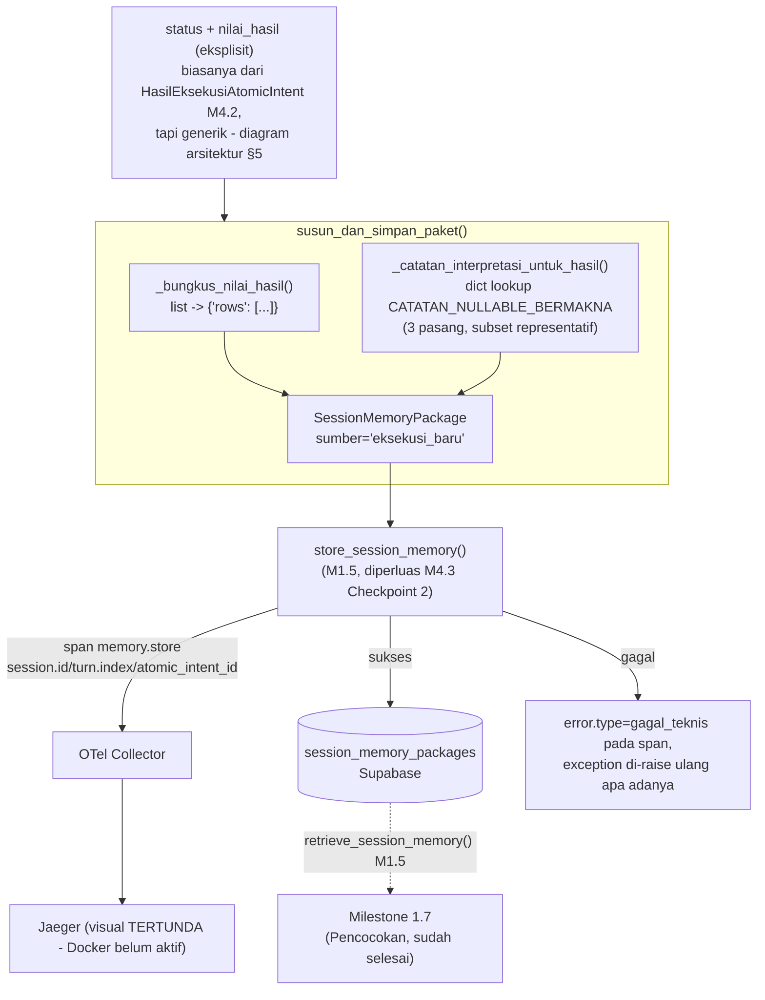

# Report — Milestone 4.3: Membangun Penyimpanan Paket ke Session Memory

Milestone ini berjenis **berbasis kode/sistem** — outputnya mekanisme penyusunan+penyimpanan paket yang benar-benar berjalan dan dibuktikan bekerja lewat panggilan nyata ke Supabase. Bagian 3 diisi penuh.

## Bagian 1 — Ringkasan Hasil

**Status akhir:** Selesai — 2 dari 3 Kriteria Keberhasilan sumber (KK1, KK3) terbukti nyata terhadap Supabase sungguhan; KK2 (span nyata di Jaeger) mekanismenya sudah terbukti (unit test mocked) tapi konfirmasi visual trace tertunda karena Docker Desktop tidak aktif di environment sesi ini — lihat Bagian 5.

Milestone 4.3 menghasilkan `susun_dan_simpan_paket()` (`src/layers/execution/penyimpanan_paket.py`) — konsumen `status`/`nilai_hasil` (biasanya dari `HasilEksekusiAtomicIntent`, M4.2, tapi diterima sebagai parameter eksplisit generik, bukan terikat ketat tipe M4.2 — forced diagram arsitektur §5 yang menunjukkan "Simpan paket" sebagai satu langkah membungkus SELURUH Fase 2). Menyusun `SessionMemoryPackage` sesuai skema M1.5, menyimpannya lewat `store_session_memory()` (M1.5, sekarang ter-instrumentasi span `memory.store` + penanganan kegagalan — Checkpoint 2).

**Tiga temuan signifikan selama plan/implementasi:**
1. **Referensi basi "Milestone 4.5"** ditemukan di 5 titik dokumentasi M1.5 (`decisions.md` ×2, `report.md` ×2, docstring `session_memory.py`) — dikoreksi/dianotasi Checkpoint 1, konsisten prinsip menjaga jejak sejarah.
2. **Ketidakcocokan tipe `nilai_hasil`** (`dict` dikunci M1.5 vs list-of-row nyata `chatbot_api`) diselesaikan lewat konvensi `{"rows": [...]}`, dikonfirmasi eksplisit user.
3. **Verifikasi nyata M4.3 TIDAK perlu ditunda** seperti M4.2 — `DATABASE_URL` sudah tersedia, Checkpoint 5 langsung dijalankan terhadap Supabase sungguhan (beda dari M4.2 yang menunggu `chatbot_api` lokal).

## Bagian 2 — Kriteria Keberhasilan vs Bukti Nyata

| Kriteria (dari dokumen sumber) | Bukti Aktual | Terpenuhi? |
|---|---|---|
| "Paket yang tersimpan untuk suatu atomic intent bisa ditarik kembali oleh mekanisme Milestone 1.5 dan menghasilkan isi yang identik dengan yang disimpan." | `test_kk1_round_trip_identik` (`tests/layers/execution/test_penyimpanan_paket_integrasi.py`) — paket disimpan `susun_dan_simpan_paket()` (session `test-m43-kk1`, turn 1), ditarik `retrieve_session_memory("test-m43-kk1", 1)`, `hasil[0] == disimpan` — PASSED terhadap Supabase sungguhan. | Ya |
| "Span penulisan ke Session Memory terlihat di Jaeger/Grafana dengan durasi yang tercatat, dan skenario uji penulisan yang sengaja dibuat gagal... menghasilkan `error.type` yang sesuai pada span tersebut." | Mekanisme terbukti: `test_session_memory_kegagalan.py` (Checkpoint 2, mocked, 2/2 PASSED) — `error.type=gagal_teknis` tercatat span saat DB gagal, exception tetap ter-raise. **Konfirmasi visual span nyata di Jaeger BELUM dilakukan** — Docker Desktop tidak aktif sesi ini (`docker ps` gagal connect daemon). | **Sebagian** (mekanisme ya, bukti visual nyata tertunda) |
| "Atomic intent dengan hasil non-normal (skenario uji: kolom yang kosong karena pola nullable-bermakna) tersimpan dengan catatan interpretasi yang tepat." | `test_kk3_nullable_bermakna_tersimpan_dengan_catatan_tepat` — `room_id=None` (view `v_lookup_maintenance_tickets`, katalog Checkpoint 3) menghasilkan `catatan_interpretasi=["Kosong jika kerusakan di fasilitas umum..."]`, identik sebelum+sesudah round-trip DB — PASSED terhadap Supabase sungguhan. | Ya |

## Bagian 3 — Cara Kerja dan Arsitektur

### Cara Kerja

`susun_dan_simpan_paket(atomic_intent, session_id, turn_index, status, view_name=None, nilai_hasil=None)`: `nilai_hasil` (list-of-row atau `None`) dibungkus `_bungkus_nilai_hasil()` jadi `{"rows": [...]}`. `_catatan_interpretasi_untuk_hasil(view_name, nilai_hasil)` memindai tiap baris hasil, mencocokkan kolom yang benar-benar `None` terhadap `CATATAN_NULLABLE_BERMAKNA[view_name]` (katalog subset 3 pasang, `src/config/catatan_nullable_bermakna.py`) — HANYA kolom yang terdaftar DAN null yang memicu catatan. `SessionMemoryPackage` dibangun (`sumber` selalu `"eksekusi_baru"`), lalu `store_session_memory()` (M1.5) dipanggil — sekarang membuka span `memory.store` (co-located di `session_memory.py`), menangkap kegagalan DB (`error.type=gagal_teknis`) sebelum meneruskan exception ke atas.

### Diagram Arsitektur

### Integrasi dengan Komponen Lain

Input: `status`/`nilai_hasil` (dari `HasilEksekusiAtomicIntent`, M4.2, selesai) + `atomic_intent`/`session_id`/`turn_index` (mengalir sejak M1.2/M1.6). Output: `SessionMemoryPackage` tersimpan — konsumen berikutnya M1.7 (retrieve, sudah selesai) dan M4.4 (Narasi, belum dibangun, akan membaca campuran paket `sumber="eksekusi_baru"` dari M4.3 dan `sumber="session_memory (turn N)"` dari M1.7).

**Konfirmasi kompatibilitas dengan M1.5**: dibuktikan LANGSUNG lewat KK1 (round-trip nyata) — skema dan storage benar-benar sama, bukan asumsi.

## Bagian 4 — Perubahan dari Plan

Tidak ada perubahan pada bentuk kode akhir maupun struktur checkpoint. Penyimpangan kecil murni operasional:
1. **Test skenario gagal Checkpoint 2** ditempatkan di file TERPISAH (`test_session_memory_kegagalan.py`), bukan di `test_session_memory.py` seperti disebut plan — supaya tidak ikut ter-skip oleh `pytestmark` module-level `DATABASE_URL` (test itu sendiri murni mocked, sengaja tidak butuh DB nyata).
2. **Katalog nullable-bermakna** awalnya draft 5 pasang, dikoreksi ke 3 pasang final saat menulis test — supaya konsisten angka "2-3 pasang" yang disepakati Keputusan 2.
3. **KK2 skenario gagal di Checkpoint 5** diputuskan TIDAK disimulasikan sebagai test otomatis terpisah (risiko merusak koneksi test lain) — mekanismenya sudah cukup terbukti Checkpoint 2.

## Bagian 5 — Keterbatasan dan Item Provisional

- **Katalog nullable-bermakna hanya 3 pasang dari 67 view** — dicatat eksplisit provisional `docs/keterbatasan-diterima.md` #12. Kolom nullable-bermakna lain yang tidak terdaftar akan tersimpan TANPA catatan (jujur soal keterbatasan, bukan menyamarkan tahu).
- **KK2 sub-bagian visual Jaeger BELUM dikonfirmasi** — Docker Desktop tidak aktif sesi ini. Mekanisme `error.type` sudah terbukti lewat mock (`test_session_memory_kegagalan.py`), tapi span nyata di Jaeger dengan durasi tercatat belum dilihat langsung. **Follow-up wajib**: begitu Docker+`docker-compose` Collector/Jaeger aktif, jalankan skenario 200/gagal nyata + screenshot/trace_id konkret, tambahkan sebagai addendum ke report.md ini.
- **Fungsi generik (`status`/`nilai_hasil` eksplisit) belum ada pemanggil NYATA selain jalur M4.2** — desainnya sudah mengakomodasi pemanggil lain (Domain Gate reject, dependency-block) tapi wiring itu sendiri di luar cakupan M4.3 (belum ada komposisi end-to-end di project ini, konsisten preseden M1.2-M4.2).
- **M4.3 TIDAK dirangkai ke `src/main.py`** — konsisten preseden seluruh milestone sebelumnya.

## Bagian 6 — Follow-up

- **Milestone 4.4 (Penyusunan Narasi)** — konsumen berikutnya, membaca campuran paket `sumber="eksekusi_baru"` (M4.3) dan `sumber="session_memory (turn N)"` (M1.7) yang DIPERLAKUKAN IDENTIK (skema sama). Perlu tahu konvensi `nilai_hasil["rows"]` yang dikunci M4.3 Keputusan 1.
- **Konfirmasi visual Jaeger KK2** — follow-up wajib begitu Docker aktif, dicatat eksplisit di Bagian 5.
- **Perluasan katalog nullable-bermakna** — pemicu peninjauan ulang tercatat `docs/keterbatasan-diterima.md` #12 (begitu ada bukti traffic nyata kolom lain yang sering kosong).
- Rekomendasi: saat M4.4/4.5 mulai membaca `nilai_hasil["rows"]` secara nyata, verifikasi tambahan bentuk data untuk `label_bentuk_jawaban` selain `nilai_tunggal` (tren/perbandingan/peringkat/komposisi) — Checkpoint 5 M4.3 hanya menguji `nilai_tunggal`.

## Addendum (Revisit, 2026-08-17) — Integrasi Sinyal Freshness/Kualitas Data

Tim database engineering mengonfirmasi endpoint `_meta` aktif (lihat `milestones/4.2-.../decisions.md` Keputusan 11) — memenuhi pemicu peninjauan ulang yang tercatat di Bagian 5/6 di atas ("Perluasan katalog nullable-bermakna" pemicunya beda, tapi ini pemicu SERUPA soal kejujuran sinyal kualitas data, dicatat `docs/keputusan-tertunda.md` #3).

`susun_dan_simpan_paket()` (`penyimpanan_paket.py`) diperluas: parameter `data_quality_status`/`last_refreshed_at` opsional, `_catatan_kualitas_data()` baru menghasilkan teks berbeda nada untuk 3 kasus (SEBAGIAN+flagged, SEBAGIAN+stale, BERHASIL+tidak diketahui) — digabung (bukan menimpa) dengan catatan nullable-bermakna yang sudah ada. Lihat `decisions.md` Keputusan 9 untuk detail lengkap.

**Bukti:** 81/81 test `tests/layers/execution/` lolos (9 test baru khusus catatan kualitas + regresi penuh) — termasuk 2 test REAL Supabase (`test_kk1_round_trip_identik`, `test_kk3_...`) yang disesuaikan (`data_quality_status="ok"` eksplisit) supaya tetap fokus menguji nullable-bermakna secara terisolasi dari fitur baru ini.

**Status verifikasi nyata endpoint `_meta` itu sendiri**: TERTUNDA — mengikuti status DITUNDA yang sama dengan M4.1/M4.2 Checkpoint 7 (instance lokal `chatbot_api` belum tentu aktif/sudah termasuk endpoint `_meta` baru). Seluruh logic Revisit ini dibangun+diuji lewat simulasi/mock, konsisten prinsip project ("disimulasikan" sah sebagai bukti sebelum verifikasi nyata tersedia).
