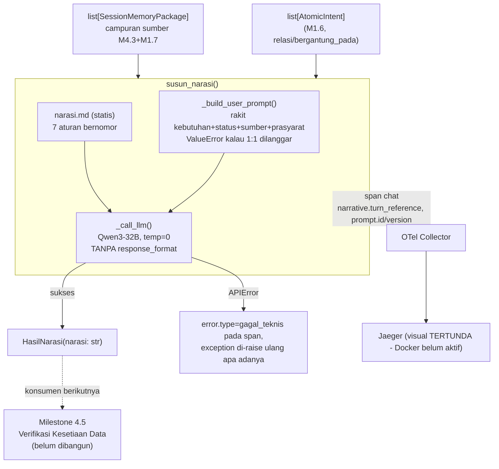

# Report — Milestone 4.4: Membangun Penyusunan Narasi

Milestone ini berjenis **berbasis kode/sistem** — outputnya mekanisme yang benar-benar berjalan (satu pemanggilan LLM) dan dibuktikan bekerja lewat panggilan nyata ke OpenRouter (Checkpoint 4, eval Checkpoint 7, prompt reliability Checkpoint 8). Bagian 3 diisi penuh.

## Bagian 1 — Ringkasan Hasil

**Status akhir:** Selesai — kedua Kriteria Keberhasilan sumber dibuktikan nyata lewat panggilan LLM sungguhan (bukan simulasi), di 3 lapis bukti independen: verifikasi manual Checkpoint 4, eval 13 skenario Checkpoint 6-7, dan reliability testing Promptfoo Checkpoint 8.

Milestone 4.4 menghasilkan `susun_narasi()` (`src/layers/interpretation/narasi.py`, subpackage BARU `src/layers/interpretation/` — layer ke-9 dari 9) — langkah "generate" pertama Fase 3 (Interpretation), menyusun jawaban akhir berbahasa Indonesia dari campuran dua sumber paket Session Memory (`sumber="eksekusi_baru"` M4.3, `sumber="session_memory (turn N)"` M1.7) yang diperlakukan identik. SATU pemanggilan LLM murni (Qwen3-32B, reuse dikonfirmasi user, `decisions.md` Keputusan 1), TANPA retry/parameter `feedback` internal (mirror preseden `penyusunan_request.py` M3.4) — dipisah sengaja dari verifikasinya (M4.5, belum dibangun). Output adalah teks bebas (`response.choices[0].message.content`), bukan JSON terstruktur — satu-satunya layer LLM di project dengan bentuk output ini, menghilangkan kelas kegagalan parse yang dialami layer lain tapi juga mengubah cara pengujian: verdict akhir eval WAJIB audit manual, heuristik kata kunci hanya lapis tambahan (terbukti sendiri lewat 2 false-negative di Checkpoint 7 dan 3 putaran perbaikan assertion di Checkpoint 8).

**Tiga temuan signifikan selama plan/implementasi:**
1. **Status `ditolak_otorisasi`/`terblokir_ketergantungan` belum pernah diproduksi nyata oleh komponen manapun di codebase** (dikonfirmasi grep sebelum plan ditulis) — data uji untuk KK2 dikonstruksi manual, mirror preseden M1.7 yang sudah menetapkan pola ini.
2. **Kontrak 1:1 atomic_intent↔package** (setiap atomic intent turn ini diasumsikan sudah punya tepat satu paket, forced diagram arsitektur §5) ditegakkan eksplisit lewat `ValueError` di `_build_user_prompt()` — gagal terlihat jelas kalau asumsi ini dilanggar di masa depan, bukan diam-diam salah.
3. **Output teks bebas menuntut ulang desain pengujian**: `evals/4.4-.../rancangan.md` dan `prompt_reliability/interpretation/narasi.promptfooconfig.yaml` sama-sama butuh kolom/skema tambahan ("Audit Manual Wajib") yang tidak ada di preseden milestone LLM manapun sebelumnya (semuanya menilai keputusan terstruktur, bukan prosa).

## Bagian 2 — Kriteria Keberhasilan vs Bukti Nyata

| Kriteria (dari dokumen sumber) | Bukti Aktual | Terpenuhi? |
|---|---|---|
| "Jawaban yang mencampur hasil baru dan hasil dari turn sebelumnya... secara eksplisit menyebutkan mana yang baru dihitung dan mana yang merujuk hasil sebelumnya, bukan menyajikan keduanya seolah dihitung bersamaan." | (a) Checkpoint 4: panggilan nyata dengan 2 paket campuran sumber — narasi eksplisit membedakan "hasil perhitungan baru" vs "data yang telah dihitung sebelumnya (turn 3)". (b) `test_susun_narasi_atribut_span_terisi_sesuai_kontrak` — `narrative.turn_reference` terhitung benar. (c) Eval S01 (2 sumber) dan S13 (**3 sumber, 2 turn berbeda: turn 2 DAN turn 4**) — audit manual LOLOS, narasi menyebut kedua turn secara terpisah, `_turn_reference()` deterministik cocok persis `[2, 4]`. (d) Promptfoo S01/S13 — 13/13 lolos regresi. | Ya |
| "Jawaban yang mengandung atomic intent berstatus ditolak_otorisasi menyebutkan penolakan itu secara jelas dan spesifik ke user, sementara atomic intent berstatus gagal_teknis disampaikan jujur tanpa detail teknis internal yang membingungkan." | Eval S02 (`ditolak_otorisasi` sendiri) — "tidak dapat diakses karena keterbatasan otorisasi". S03 (`gagal_teknis` sendiri) — "sistem mengalami kendala teknis", nol istilah teknis. **S04 (kedua status BERDAMPINGAN dalam satu jawaban, skenario paling representatif KK ini)** — "sistem mengalami **kendala teknis**..." vs "...tidak dapat diberikan karena **keterbatasan kewenangan sistem**" — kontras nada eksplisit, audit manual LOLOS bersih (lihat `audit.md`). S12 (kedua status, TANPA kebutuhan berhasil) — kejujuran total kegagalan juga LOLOS. | Ya |

## Bagian 3 — Cara Kerja dan Arsitektur

### Cara Kerja

`susun_narasi(atomic_intents, packages, session_id, turn_index)`: `_build_user_prompt()` merakit daftar kebutuhan (teks, label bentuk jawaban, status, sumber, nilai_hasil, catatan_interpretasi) + relasi `bergantung_pada` (dicocokkan ke `atomic_intent_id` lain dalam daftar yang sama, ditampilkan sebagai teks kebutuhan+status prasyarat — bukan ID mentah), menegakkan kontrak 1:1 atomic_intent↔package (`ValueError` kalau dilanggar). System prompt (`src/prompts/interpretation/narasi.md`) statis, 7 aturan bernomor (5 arsitektur + rujukan lintas-turn + kontras nada ditolak/gagal_teknis). Panggilan `OPENROUTER_MODEL_NARASI` (Qwen3-32B), `temperature=0`, TANPA `response_format` (output teks bebas). Span `chat` dibuka SEBELUM panggilan (atribut `session.id`/`turn.index`/`gen_ai.operation.name`/`gen_ai.request.model`/`prompt.id`/`prompt.version`/`narrative.turn_reference` diisi lebih dulu), `APIError` ditandai `error.type=gagal_teknis` pada span lalu diteruskan apa adanya (tidak ada fallback aman untuk sebuah narasi).

### Diagram Arsitektur

### Integrasi dengan Komponen Lain

Input: `list[AtomicIntent]` (M1.6, Decomposition) + `list[SessionMemoryPackage]` (campuran M4.3 `eksekusi_baru` dan M1.7 `session_memory (turn N)`) — diterima sebagai parameter polos, TIDAK memanggil layer sebelumnya secara internal (mirror pola komposisi longgar seluruh project). Output `HasilNarasi` — konsumen berikutnya M4.5 (Verifikasi Kesetiaan Data + Penyusunan Data Visualisasi, belum dibangun), yang akan menilai narasi ini secara independen (tidak melihat proses berpikir langkah ini, sesuai prinsip generate-lalu-verify).

## Bagian 4 — Perubahan dari Plan

Tidak ada perubahan pada bentuk kode akhir maupun struktur checkpoint. Penyimpangan kecil, seluruhnya operasional dan sudah dicatat eksplisit di `logs.md` masing-masing checkpoint saat terjadi:

1. **Checkpoint 3**: plan menyebut "6 instruksi wajib" secara longgar di teks Task, tapi rincian plan sendiri (dan Lingkup M4.4 sumber: "5 ketentuan wajib... ditambah satu ketentuan yang lahir khusus dari kebutuhan multi-turn") sebenarnya menghitung 6 — prompt final menambahkan kontras nada ditolak/gagal_teknis sebagai instruksi bernomor terpisah (bukan tersirat di salah satu dari 6), sehingga jadi 7 aturan bernomor total. Bukan penyimpangan makna, murni klarifikasi penghitungan.
2. **Checkpoint 8**: tiga bug DI ASSERTION Promptfoo (bukan di kode produksi) ditemukan dan diperbaiki sebelum config final — bug sintaks JS (`return` ganda), false-positive substring "api" dalam kata "tetapi", dan negation-blindness berulang pada S10 (akhirnya dihapus assertion-nya, murni audit manual, mirror S04). Detail lengkap di `logs.md` Checkpoint 8.
3. **Checkpoint 4**: verifikasi awal sempat gagal `ModuleNotFoundError` karena memanggil `python` sistem, bukan `.venv/Scripts/python.exe` proyek — diperbaiki dengan interpreter yang benar, bukan bug kode.

## Bagian 5 — Keterbatasan dan Item Provisional

- **Verifikasi visual Jaeger TERTUNDA** — Docker Desktop tidak aktif sesi ini (`docker ps` gagal), mirror keterbatasan M4.1-M4.3. Mekanisme span sudah terbukti lewat `InMemorySpanExporter` (Checkpoint 4) dan mocked tracer (Checkpoint 5, 8/8 test PASSED) — seluruh 7 atribut kontrak terisi benar, tapi konfirmasi visual trace nyata belum dilakukan. **Follow-up wajib**: begitu Docker+Collector/Jaeger aktif, jalankan skenario nyata + screenshot/trace_id konkret, tambahkan sebagai addendum ke report.md ini (mirror pola M4.3).
- **Data uji `ditolak_otorisasi`/`terblokir_ketergantungan` dikonstruksi manual** — belum ada komponen produksi nyata yang memproduksi kedua status ini (Domain Gate reject, dependency-block belum di-wiring). Konsisten preseden M1.7, dicatat eksplisit sebagai keterbatasan cakupan bukan kegagalan.
- **Model Qwen3-32B dipilih tanpa perbandingan empiris baru khusus tugas Narasi** — dikonfirmasi user (`decisions.md` Keputusan 1), didasarkan preseden benchmark SEA-HELM M1.4 untuk tugas NLG Bahasa Indonesia. Hasil eval 13 skenario (Bagian 2 di atas + `audit.md`) mendukung kecukupan model ini pada cakupan yang diuji — tidak ada bukti sebaliknya, tapi juga bukan klaim ini pilihan optimal dari seluruh ruang model yang mungkin.
- **Temuan minor "klaim tindakan proaktif tidak berdasar"** (`audit.md`, S03/S08 — model menambahkan frasa seperti "tim sedang meninjau" tanpa dasar dari data) — baru 2 data point dari 1 eval, BELUM cukup untuk revisi prompt atau entri `docs/keterbatasan-diterima.md` baru. Dicatat sebagai item pantauan (lihat Bagian 6).
- **Ukuran user prompt berpotensi membesar** untuk turn dengan banyak atomic intent + `nilai_hasil` besar — belum ada mitigasi aktif (mirror pola diterima entri #2 `docs/keterbatasan-diterima.md` soal payload histori), belum ada bukti traffic nyata yang menunjukkan ini masalah.
- **M4.4 TIDAK dirangkai ke `src/main.py`** — konsisten preseden seluruh milestone sebelumnya, belum ada komposisi end-to-end di project ini.
- **Catatan Serah Terima ke Pekerjaan Lain** (`rancangan-execution-interpretation.md`) — dokumen sumber ini punya bagian "Catatan Serah Terima" di akhir, TAPI M4.4 BUKAN milestone terakhir di dokumen itu (M4.5 masih berikutnya) — konfirmasi kontrak serah-terima lengkap ditunda ke `report.md` M4.5, mengikuti aturan template (hanya milestone TERAKHIR di suatu dokumen sumber yang mengonfirmasi bagian itu).

## Bagian 6 — Follow-up

- **Milestone 4.5 (Verifikasi Kesetiaan Data + Penyusunan Data Visualisasi)** — konsumen langsung `HasilNarasi` dari milestone ini, menilai independen (tidak melihat proses `susun_narasi()`) apakah narasi setia terhadap data sumber, lalu (untuk narasi yang lolos) menyusun data terstruktur untuk visualisasi berdasar `label_bentuk_jawaban`.
- **Konfirmasi visual Jaeger** — follow-up wajib begitu Docker aktif, dicatat eksplisit Bagian 5.
- **Pantau pola "klaim tindakan proaktif tidak berdasar"** — kalau berulang konsisten di eval M4.5 atau traffic produksi nanti, pertimbangkan instruksi eksplisit tambahan ke `narasi.md` versi berikutnya (bump `version`, jalankan ulang Promptfoo sebelum commit — sesuai kontrak `rancangan-manajemen-prompt.md` Bagian 5).
- **Perluasan katalog nullable-bermakna** (`docs/keterbatasan-diterima.md` #12) — tetap relevan untuk M4.4: S10 (nullable-bermakna) hanya diuji dengan 1 pasangan katalog M4.3, belum diuji volume lebih besar begitu katalog diperluas.
- Rekomendasi: begitu M4.5 mulai dan verifikasi/wiring end-to-end lebih matang, revisit apakah kontrak 1:1 atomic_intent↔package (Bagian 5) benar-benar terjaga di produksi, atau `ValueError` di `_build_user_prompt()` justru sering terpicu (indikasi gap di pipeline upstream yang perlu diperbaiki di luar cakupan M4.4).
