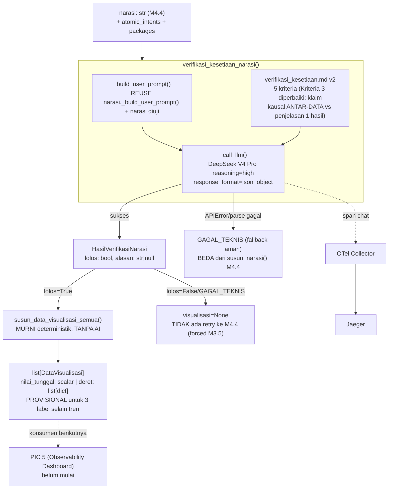

# Report — Milestone 4.5: Membangun Verifikasi Kesetiaan Data dan Penyusunan Visualisasi

Milestone ini berjenis **berbasis kode/sistem** — outputnya dua mekanisme yang benar-benar berjalan (satu pemanggilan LLM verifikasi + satu transformasi deterministik) dan dibuktikan bekerja lewat panggilan nyata ke OpenRouter (Checkpoint 4, eval Checkpoint 8, prompt reliability Checkpoint 9) dan unit test murni (Checkpoint 7). Bagian 3 diisi penuh.

**Ini milestone TERAKHIR di `rancangan-execution-interpretation.md`** — Bagian 6 mengonfirmasi status penuh "Catatan Serah Terima ke Pekerjaan Lain" dokumen sumber, dan menyatakan **PIC 4 (Execution & Interpretation) SELESAI SEPENUHNYA**.

## Bagian 1 — Ringkasan Hasil

**Status akhir:** Selesai — kedua Kriteria Keberhasilan sumber dibuktikan nyata: KK1 (larangan klaim sebab-akibat) lewat panggilan LLM sungguhan berulang (Checkpoint 4 manual, eval 10 skenario Checkpoint 8, Promptfoo Checkpoint 9); KK2 (bentuk data visualisasi sesuai label) lewat 10 unit test deterministik (Checkpoint 7) yang mencakup seluruh 5 nilai `label_bentuk_jawaban`.

Milestone 4.5 menghasilkan dua mekanisme baru di `src/layers/interpretation/` (subpackage sudah ada sejak M4.4, tidak ada subpackage baru): (A) `verifikasi_kesetiaan_narasi()` (`verifikasi_kesetiaan.py`) — verifier independen (DeepSeek V4 Pro `reasoning="high"`, reuse preseden 5x tanpa perbandingan empiris baru) yang menilai narasi hasil M4.4 terhadap 5 kriteria kesetiaan data, TANPA retry balik ke M4.4 (mirror preseden persis M3.5); (B) `susun_data_visualisasi()` (`visualisasi.py`) — transformasi murni deterministik `nilai_hasil` jadi bentuk siap-visualisasi sesuai `label_bentuk_jawaban`, TANPA model AI. Keduanya digabung lewat orkestrator `verifikasi_dan_susun_visualisasi()` — visualisasi HANYA dijalankan untuk narasi yang `lolos=True`, forced Lingkup M4.5 sumber sendiri.

**Temuan signifikan selama implementasi:** eval Checkpoint 8 menemukan SATU false-positive nyata pada prompt v1 (skenario S06) — verifier menolak narasi JUJUR yang menjelaskan keterbatasan kualitas data (memakai kata "sehingga") sebagai pelanggaran Kriteria 3 (larangan sebab-akibat), padahal pola kalimat itu PERSIS yang diinstruksikan `narasi.md` M4.4 sendiri. Diperbaiki di tengah checkpoint (prompt v1→v2, Kriteria 3 direvisi membedakan klaim kausal ANTAR-DATA dari penjelasan keterbatasan SATU hasil) — diverifikasi ulang S06 (kini lolos) DAN S01 (klaim kausal nyata, tetap benar ditolak) sebelum re-run penuh (10/10). Lihat `evals/4.5-.../audit.md` untuk analisis lengkap.

## Bagian 2 — Kriteria Keberhasilan vs Bukti Nyata

| Kriteria (dari dokumen sumber) | Bukti Aktual | Terpenuhi? |
|---|---|---|
| "Narasi yang sengaja dibuat mengandung klaim sebab-akibat tidak berdasar dari data deskriptif (skenario uji terkontrol) berhasil ditangkap dan ditolak oleh verifikasi ini." | Checkpoint 4 (manual, panggilan nyata): narasi dengan "MENYEBABKAN" antara dua data independen → `lolos=False`. Eval S01 (skenario formal, sama persis) → `lolos=False`, alasan mengutip kata pemicu eksplisit. S02 (kontrol negatif, data identik TANPA klaim kausal) → `lolos=True` — membuktikan verifier membedakan PRESENCE vs ABSENCE klaim, bukan menolak buta. Promptfoo S01/S02 — 10/10 lolos regresi (prompt v2). | Ya |
| "Data terstruktur yang dihasilkan untuk kebutuhan berlabel tren benar-benar berbentuk deret yang bisa digambar sebagai grafik garis, dan untuk kebutuhan berlabel nilai tunggal berbentuk angka tunggal yang sesuai — tidak ada ketidaksesuaian antara label bentuk jawaban dan struktur data yang dihasilkan." | `test_visualisasi.py` (10 unit test): `nilai_tunggal` 1 baris 1 kolom → scalar benar (`test_nilai_tunggal_satu_baris_satu_kolom_jadi_scalar`); `tren` 3 baris → `deret` list panjang 3 (`test_tren_multi_baris_jadi_deret`); validator skema `DataVisualisasi` MEMAKSA struktur benar secara konstruksi (bukan sekadar dicek pasca-fakta) — `nilai_tunggal` tidak bisa punya `deret` terisi bersamaan tanpa raise `ValidationError`, kecuali kasus ambigu yang sengaja fallback jujur ke `deret` (dicatat sebagai keterbatasan, Bagian 5). | Ya |

## Bagian 3 — Cara Kerja dan Arsitektur

### Cara Kerja

`verifikasi_kesetiaan_narasi(narasi, atomic_intents, packages, session_id, turn_index)`: reuse `narasi._build_user_prompt()` (M4.4) untuk konteks ground-truth + narasi yang dinilai, span `chat` (DeepSeek V4 Pro, `reasoning="high"`, `response_format=json_object`), parse `{"lolos": bool, "alasan": str|null}` (mirror `_parse_response()` M3.5) — `APIError`/`empty_choices`/`parse_error` SEMUANYA fallback aman ke `GAGAL_TEKNIS` (beda `susun_narasi()` M4.4 yang tidak punya fallback aman, karena verifier di sini PUNYA nilai default valid). `susun_data_visualisasi(package)`: `label=nilai_tunggal` dengan `rows` persis 1 baris 1 kolom → ekstrak scalar; kasus ambigu → fallback jujur ke `deret` (tidak menebak); 4 label lain → `deret=rows` apa adanya. `verifikasi_dan_susun_visualisasi()` mengorkestrasi: visualisasi HANYA jalan kalau `lolos=True`.

### Diagram Arsitektur

### Integrasi dengan Komponen Lain

Input: `narasi: str` (M4.4, `HasilNarasi.narasi`) + `list[AtomicIntent]` (M1.6) + `list[SessionMemoryPackage]` (campuran M4.3/M1.7) — parameter polos, tidak memanggil layer sebelumnya secara internal. Output: `tuple[HasilVerifikasiNarasi, list[DataVisualisasi] | None]` — konsumen berikutnya: frontend/dashboard (PIC 5, belum mulai) untuk `visualisasi`; belum ada konsumen nyata untuk `lolos=False` (jalur revisi lintas-milestone sengaja tidak dibangun, Keputusan 2).

## Bagian 4 — Perubahan dari Plan

Satu perubahan substantif dari plan awal, didokumentasikan penuh sebagai bagian proses (bukan disembunyikan):

1. **Prompt `verifikasi_kesetiaan.md` direvisi v1→v2 di tengah Checkpoint 8** — plan awal tidak mengantisipasi kebutuhan ini secara eksplisit (wajar, karena baru ditemukan lewat eval nyata). Kriteria 3 (larangan klaim sebab-akibat) diperbaiki membedakan klaim kausal ANTAR-DATA (dilarang) dari penjelasan keterbatasan SATU hasil berdasar catatan kualitas data (bukan pelanggaran) — dipicu temuan S06 (false-positive nyata). Lihat `evals/4.5-.../audit.md` dan `logs.md` Checkpoint 8 untuk kronologi lengkap.
2. **Validator skema `DataVisualisasi`** (Checkpoint 2) diperbaiki SEBELUM commit final saat implementasi Checkpoint 5 menemukan versi awal terlalu ketat (tidak mengakomodasi fallback ambigu yang SUDAH direncanakan di plan Risiko & Mitigasi) — koreksi internal terhadap desain yang sudah disetujui, bukan keputusan baru.
3. Urutan penulisan Checkpoint 4-6 sedikit menyimpang dari urutan plan (implementasi `visualisasi.py` ditulis lebih dulu dari yang direncanakan supaya import `verifikasi_kesetiaan.py` tidak pecah) — TIDAK mengubah bentuk akhir kode maupun checkpoint, murni urutan operasional (dicatat `logs.md` Checkpoint 4).

## Bagian 5 — Keterbatasan dan Item Provisional

- **Skema `DataVisualisasi` untuk 3 label selain `tren`/`nilai_tunggal` PROVISIONAL** — dicatat `docs/keputusan-tertunda.md` #4, belum ada konsumen nyata (PIC 5 belum mulai). Bentuk `deret` (list apa adanya dari `rows`) adalah pendekatan pragmatis tersedia sekarang, bukan klaim bentuk optimal untuk kebutuhan chart library nyata nanti.
- **Ekstraksi scalar `nilai_tunggal` fallback ke `deret` untuk kasus ambigu** (>1 baris atau >1 kolom) — jujur soal keterbatasan (tidak menebak kolom mana "nilai"-nya), TAPI berarti KK sumber ("nilai_tunggal berbentuk angka tunggal") tidak 100% terjamin untuk SELURUH kemungkinan bentuk `nilai_hasil` — hanya terjamin untuk kasus tidak ambigu (1 baris 1 kolom), yang merupakan bentuk yang teramati konsisten di seluruh eval M4.3-M4.5 sejauh ini.
- **Model verifier (DeepSeek V4 Pro reasoning=high) dipilih tanpa perbandingan empiris baru khusus tugas ini** — mirip M4.4, tapi di sini forced preseden 5x lebih kuat (bukan genuinely open seperti M4.4). Eval Checkpoint 8 menemukan DAN memperbaiki satu isu presisi (Kriteria 3 over-triggering) — bukti model MEMADAI setelah prompt diperbaiki, tapi baru 10 skenario, bukan cakupan produksi penuh.
- **Belum ada wiring end-to-end** — M4.5 (seperti seluruh milestone sebelumnya) tidak dirangkai ke `src/main.py`. Kontrak "1 atomic_intent = 1 package" (warisan dari M4.4) tetap belum diuji terhadap pipeline nyata.
- **Verifikasi visual Jaeger untuk span `verifikasi_kesetiaan_narasi()` BELUM dikonfirmasi eksplisit** (beda dari M4.4 yang punya addendum khusus) — mekanisme span sudah terbukti lewat `InMemorySpanExporter` (implisit dari test mocked Checkpoint 7) dan atribut lengkap terkonfirmasi via `_TracerRekam`, tapi tidak ada sesi verifikasi visual Jaeger terpisah seperti M4.4. **Follow-up**: kalau dibutuhkan, jalankan skrip verifikasi serupa `verifikasi_jaeger_m44.py` (scratchpad M4.4, tidak di-commit) untuk `verifikasi_kesetiaan_narasi()`.

## Bagian 6 — Status "Catatan Serah Terima ke Pekerjaan Lain" (`rancangan-execution-interpretation.md`)

M4.5 adalah milestone TERAKHIR di dokumen sumber ini — ketiga item dikonfirmasi eksplisit:

1. **"Jalur revisi untuk respons `400` di Milestone 4.2 dikirim balik ke Query Engine... kontrak dua arah yang perlu disepakati bersama pemilik pekerjaan tersebut."** — **TERPENUHI.** M4.2 mengimplementasikan penuh (perluasan `susun_request_atomic_intent()` M3.4 dengan parameter `feedback`, backward-compatible), dikonfirmasi `CLAUDE.md` Status Proyek.
2. **"Skema paket Session Memory yang ditulis di Milestone 4.3 wajib identik dengan yang dibaca `rancangan-context-decomposition.md` (Milestone 1.5)."** — **TERPENUHI.** Dibuktikan langsung KK1 M4.3 (`test_kk1_round_trip_identik`, round-trip nyata Supabase) — skema dan storage benar-benar sama.
3. **"Klasifikasi `403`/`404` sebagai sinyal bug prioritas tinggi (Milestone 4.2) idealnya juga menjadi masukan penting bagi pekerjaan observability... seharusnya terlihat menonjol di dashboard, baik privat maupun publik."** — **BELUM terpenuhi, TAPI BUKAN kegagalan M4.4/M4.5.** PIC 5 (Observability Dashboard) belum mulai sama sekali — item ini forward-looking guidance yang HANYA bisa dipenuhi PIC 5 begitu mulai bekerja. Dicatat eksplisit sebagai item tertunda menunggu PIC 5, bukan diam-diam dilewati.

**Kesimpulan: 2 dari 3 item Catatan Serah Terima terpenuhi penuh; 1 item (dashboard) tertunda secara sah menunggu PIC 5 mulai bekerja — bukan gap yang bisa/harus ditutup PIC 4.**

## Bagian 7 — PIC 4 (Execution & Interpretation) SELESAI SEPENUHNYA

Dengan selesainya M4.5, seluruh 5 milestone PIC 4 (M4.1 Membangun Pemanggilan chatbot_api, M4.2 Klasifikasi Respons & Penanganan Kegagalan, M4.3 Penyimpanan Paket ke Session Memory, M4.4 Penyusunan Narasi, M4.5 Verifikasi Kesetiaan Data + Visualisasi) telah selesai kode+test, dengan bukti nyata di tiap milestone. Beberapa item verifikasi-nyata-lanjutan (Checkpoint 7 M4.1/M4.2, terkait `chatbot_api` lokal) tetap tertunda karena prasyarat eksternal di luar kendali sesi kerja manapun — TIDAK memblokir kelengkapan fungsional PIC 4.

**PIC 1 (Input Layer/Context Resolution/Decomposition), PIC 2 (Domain Gate/Verification Gate), PIC 3 (Retriever/Query Engine), dan PIC 4 (Execution/Interpretation) SEMUANYA SELESAI SEPENUHNYA.** Sisa pekerjaan project: PIC 5 (Observability Dashboard, Grafana+Next.js) dan PIC 6 (Custom Exporter Supabase, Go) — keduanya belum dimulai, boleh berjalan paralel satu sama lain.

## Bagian 8 — Follow-up

- **PIC 5 (Observability Dashboard)** — dapat mulai dengan data dummy mengikuti skema Supabase yang sudah dikunci (`rancangan-observability-ai-chatbot.md` Bagian 4), tanpa menunggu PIC 6. WAJIB memenuhi item #3 Catatan Serah Terima (Bagian 6) — sinyal `403`/`404` prioritas tinggi menonjol di dashboard.
- **PIC 6 (Custom Exporter Supabase, Go)** — dapat mulai paralel, hanya butuh kontrak span (`rancangan-observability-ai-chatbot.md` Bagian 2) yang sudah stabil.
- **Revisit skema `DataVisualisasi` provisional** (`docs/keputusan-tertunda.md` #4) begitu PIC 5 benar-benar mulai dan tahu kebutuhan chart library nyata.
- **Konfirmasi visual Jaeger `verifikasi_kesetiaan_narasi()`** — opsional, kalau dibutuhkan bukti visual tambahan di luar mekanisme yang sudah terbukti lewat test.
- Kalau eval/produksi berikutnya (di luar cakupan PIC 4, mis. saat wiring end-to-end akhirnya dibangun) menemukan pola over-triggering serupa Kriteria 3 (Bagian 1) pada prompt verifier LAIN di project, pertimbangkan audit menyeluruh daftar kata-kunci-pemicu di seluruh prompt verifier (baru 1 data point sekarang).
