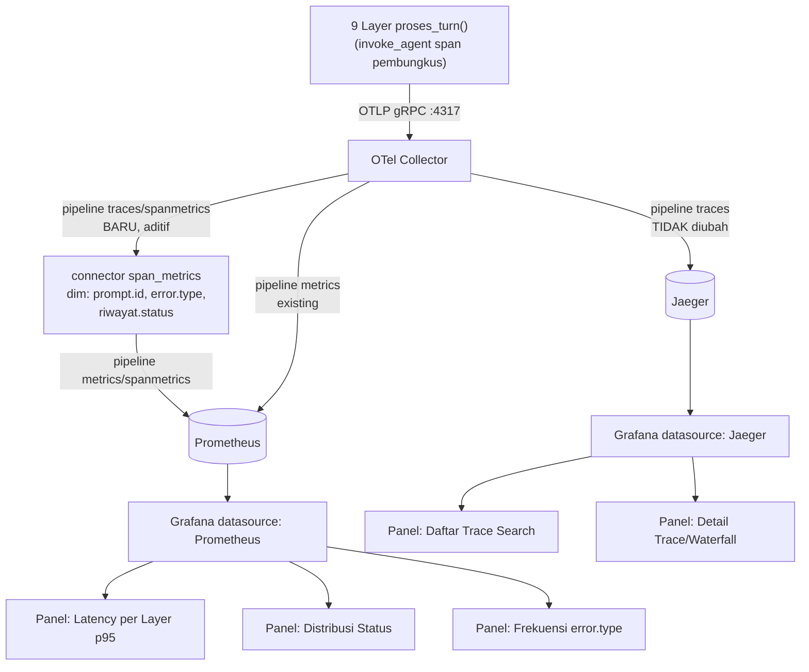

# Report — Milestone 5.1: Membangun Dashboard Grafana untuk Trace dan Metrics

## Bagian 1 — Ringkasan Hasil

**Status akhir:** Selesai dengan penyesuaian dari plan.

Grafana self-hosted (`grafana/grafana-oss:latest`, port host 3001) berjalan sebagai service ke-4 di `infra/observability/docker-compose.yml`, tersambung ke Jaeger (trace) dan Prometheus (metrics) lewat datasource provisioning-as-code. Lima panel dibangun: daftar trace + waterfall (murni Jaeger datasource), latency per layer p95, distribusi status per turn, dan frekuensi `error.type` (ketiganya lewat pipeline baru `spanmetricsconnector` yang menurunkan metrik agregat dari span, ditambahkan aditif ke `otel-collector-config.yaml` tanpa mengubah pipeline trace existing menuju Jaeger). Kedua Kriteria Keberhasilan sumber dibuktikan dengan turn percakapan nyata (bukan data dummy) — trace lengkap 28 span untuk KK1, dan skenario RBAC-denial `gop_margin` yang menghasilkan `error.type=ditolak_otorisasi` untuk KK2 — keduanya dikonfirmasi bisa ditampilkan lewat Grafana sendiri (disimulasikan lewat `POST /api/ds/query`, bukan cuma dicek di Jaeger/Prometheus API mentah).

Pengerjaan sempat terhenti ~1 sesi karena OpenRouter mengalami hang berkepanjangan di endpoint completions (diisolasi sampai level `curl` mentah, dikonfirmasi bukan bug project — lihat `docs/keterbatasan-diterima.md` #7 recurrence) — atas instruksi user, pekerjaan non-LLM (panel, config) dilanjutkan lebih dulu, verifikasi nyata dilanjutkan begitu OpenRouter pulih di sesi berikutnya.

## Bagian 2 — Kriteria Keberhasilan vs Bukti Nyata

| Kriteria (dari dokumen sumber) | Bukti Aktual | Terpenuhi? |
|---|---|---|
| "Trace dari satu turn percakapan nyata (dicoba dari sistem yang sudah berjalan, bukan data dummy) bisa ditelusuri di Grafana sampai terlihat urutan span dan durasi tiap layer yang dilaluinya." | Turn nyata via `POST /v1/turns` (payload contoh `docs/panduan-integrasi-frontend.md` 3.1) menghasilkan trace `d13c84ac3249cc1266a8935b4523e4b4` — 28 span, `invoke_agent` (314483ms) sebagai root membungkus seluruh 9 layer bersarang benar. Dikonfirmasi bisa ditampilkan Grafana lewat simulasi query panel sungguhan (`POST /api/ds/query`, datasource Jaeger `uid=PC9A941E8F2E49454`, target persis Panel "Detail Trace/Waterfall") → `200`, dataframe 28 baris lengkap `operationName`/`parentSpanID`/`duration`. Detail: `logs.md` Checkpoint 4 Task 6. | Ya |
| "Kemunculan `error.type` bertipe `ditolak_otorisasi` atau `gagal_teknis` (dari skenario uji terkontrol) terlihat menonjol dan bisa dibedakan dari sekadar hasil berhasil biasa." | Skenario RBAC-denial `gop_margin` (Front Office Staff, domain `financial`, reuse persis `evals/7.17-.../payloads/E02.json`) menghasilkan trace `48ab532d38dae3db2b05a5aae6d2b63d` dengan 2× `error.type=ditolak_otorisasi` (`rbac.decision=deny`) + 1× `error.type=gagal_teknis`. Dikonfirmasi lewat simulasi query panel "Frekuensi error.type" sungguhan → 2 series Prometheus terpisah dan jelas berbeda (`ditolak_otorisasi`=2, `gagal_teknis`=1). Detail: `logs.md` Checkpoint 6 Task 10. | Ya |

## Bagian 3 — Cara Kerja dan Arsitektur

### Cara Kerja

Grafana membaca dari dua datasource yang sudah ada dari fondasi M1.1 (Jaeger, Prometheus), tapi dengan satu tambahan pipeline baru di Collector: `spanmetricsconnector` (`connectors.span_metrics` di `otel-collector-config.yaml`) menerima span yang sama persis dengan yang dikirim ke Jaeger (fan-out dari receiver `otlp` yang sama), lalu menurunkan metrik agregat (`traces_span_metrics_calls_total`, `traces_span_metrics_duration_milliseconds_*`) berdimensi `prompt.id` (disambiguator span `chat` yang nama-nya dipakai ulang ~13 lokasi berbeda lintas layer), `error.type` (taksonomi kegagalan), dan `riwayat.status` (status level-turn dari span `riwayat.simpan`, M7.18) — metrik ini diserap Prometheus lewat exporter yang sama dengan metrics existing.

Dua panel (Daftar Trace, Detail Trace/Waterfall) murni memakai Jaeger datasource native (query type `search` dan `traceID`) — tidak butuh spanmetrics sama sekali, karena Jaeger sendiri sudah menyimpan struktur trace penuh. Tiga panel lain (Latency per Layer, Distribusi Status, Frekuensi error.type) murni memakai Prometheus, karena Jaeger datasource Grafana tidak mendukung agregasi time-series/count-by-tag — genuinely butuh data yang sudah diagregasi di sisi Collector.

### Diagram Arsitektur

### Integrasi dengan Komponen Lain

- **M1.1 (fondasi Collector)**: dependensi eksplisit dokumen sumber — dipenuhi, `otel-collector-config.yaml` diperluas aditif (pipeline baru, pipeline existing tidak disentuh), diverifikasi tidak mengganggu PIC 1-4.
- **M7.6-7.16 (span `invoke_agent`)**: rekomendasi eksplisit dari `rancangan-orkestrasi-api.md`/report M7.18 ("dipakai sebagai unit trace utama waterfall PIC 5") — **terpenuhi**, Panel "Detail Trace/Waterfall" memakai `invoke_agent` sebagai akar tampilan, dikonfirmasi nyata di Checkpoint 4.
- **M7.18 (span `riwayat.simpan`)**: dipakai sebagai sumber Panel "Distribusi Status" (`decisions.md` Keputusan 5) — perilaku "trace terpisah dari `invoke_agent`" (didokumentasikan M7.18 report) dikonfirmasi ulang nyata di Checkpoint 4 Task 8 (trace `riwayat.simpan` `c7b00c22f361d110f234b15d4ff882aa` terpisah dari trace turn `d13c84ac...`), TIDAK menimbulkan masalah karena spanmetricsconnector membaca semua trace yang lewat, terlepas dari trace mana.
- **M5.2-5.4 (Next.js + Supabase)**: TIDAK bergantung pada M5.1 secara teknis (jalur data terpisah total, Supabase belum disentuh M5.1) — tapi Panel Grafana di sini jadi rujukan bentuk visual yang perlu ditiru kesetaraannya di Next.js, sesuai Lingkup dokumen sumber ("panel privat ini juga jadi rujukan bentuk visual yang perlu ditiru kesetaraannya").

## Bagian 4 — Perubahan dari Plan

1. **Port Grafana**: rencana `3000:3000`, aktual `3001:3000` — port 3000 di mesin developer sudah dipakai proses lain (Kubernetes Grafana milik project berbeda, tidak berkaitan). Ditemukan+diperbaiki Checkpoint 2 (`logs.md`).
2. **Dimension `riwayat.status` tertinggal di Checkpoint 3**: `decisions.md` Keputusan 5 sudah menyatakan `riwayat.status` sebagai sumber Panel "Distribusi Status", tapi implementasi Checkpoint 3 hanya mendaftarkan `prompt.id`+`error.type`. Ditemukan+diperbaiki saat membangun panel itu sendiri (Checkpoint 4 lanjutan).
3. **Alias connector `spanmetrics` deprecated**: ditemukan warning startup Collector, diperbaiki jadi `span_metrics` (non-deprecated) di checkpoint yang sama sebelum sempat jadi utang teknis.
4. **Urutan checkpoint menyimpang** (Task 7/9 dikerjakan mendahului verifikasi Task 6/8/10): atas instruksi eksplisit user, karena bagian buildable (definisi panel) tidak butuh panggilan LLM sementara OpenRouter sedang hang — dicatat eksplisit di `logs.md`, bukan penyimpangan diam-diam.
5. **Dua bug query panel ditemukan saat verifikasi nyata** (bukan saat pembuatan awal): panel "Daftar Trace (Search)" gagal `400` karena `service` kosong (Jaeger API menolak); panel "Latency per Layer" awalnya group by `span_name` saja (merusak tujuan panel karena span `chat` dipakai ulang ~13 lokasi), dan `histogram_quantile(...rate()...)` mengembalikan `NaN` karena volume traffic dev/test terlalu jarang untuk `rate()` — diganti `increase($__range)`. Ketiganya diperbaiki di commit `cf2163b`.
6. **Insiden operasional OpenRouter berulang** (5 percobaan turn nyata sepanjang milestone: 2 hang, 1 timeout klien, 2 berhasil) — bukan bug M5.1, dicatat sebagai recurrence `docs/keterbatasan-diterima.md` #7. Metodologi baru diadopsi (cek murah 1 panggilan LLM tunggal sebelum retry pipeline penuh yang mahal) — akan berguna untuk milestone berikutnya yang butuh verifikasi turn nyata.

## Bagian 5 — Keterbatasan dan Item Provisional

- **`docs/keterbatasan-diterima.md` #7** (LLM hang tanpa exception) — recurrence baru dicatat untuk M5.1, isolasi paling dalam sejauh ini (sampai level `curl` mentah ke endpoint completions), akhirnya teratasi via retry setelah OpenRouter pulih. Status entri tetap "diterima sebagian" (tidak diperbaiki definitif, di luar kendali project).
- **`docs/keterbatasan-diterima.md` #18 (BARU)** — bucket histogram default `spanmetricsconnector` (≈2ms-15s) tidak mencakup rentang latency nyata project ini (sub-5ms non-LLM sampai >300s span pembungkus) — Panel "Latency per Layer" menampilkan `NaN` untuk 18/29 series saat verifikasi nyata, 11/29 menampilkan nilai valid (cukup membuktikan tujuan inti "bottleneck terlihat"). Diterima, bukan diperbaiki (tuning bucket custom butuh data distribusi volume lebih besar dari test manual).
- **`docs/keterbatasan-diterima.md` #15** (data `chatbot_api` lokal stale) — status `berhasil` genuinely belum teramati di lingkungan kerja manapun sepanjang M5.1 (seluruh turn nyata berakhir `gagal_teknis`/`sebagian`/`ditolak_otorisasi`) — Panel "Distribusi Status" mekanismenya terbukti benar (menerima nilai apapun yang dikirim `riwayat.status`), tapi belum ada data poin `berhasil` nyata untuk mengisinya sampai data lokal di-refresh.
- **`docs/keputusan-tertunda.md` #4** (skema `DataVisualisasi`) — trigger "Milestone 5.x mulai" terpicu tapi dikonfirmasi TIDAK actionable dalam lingkup M5.1 (beda domain data dari trace/span Grafana), revisit substantif tetap ditunda ke M5.2. Dicatat update di file itu sendiri.

## Bagian 6 — Follow-up

- **M5.2 (Skema Data dan Koneksi Next.js ke Supabase)**: tidak ada dependensi teknis baru dari M5.1 (jalur data Grafana vs Next.js+Supabase terpisah total sesuai desain awal) — TAPI panel M5.1 ini jadi rujukan bentuk visual yang wajib ditiru kesetaraannya di Next.js sesuai Lingkup dokumen sumber, dan revisit `docs/keputusan-tertunda.md` #4 (skema `DataVisualisasi`) sebaiknya dilakukan di sana.
- **Tuning bucket histogram `spanmetricsconnector`** (`docs/keterbatasan-diterima.md` #18) — revisit begitu ada volume data nyata lebih besar (bukan test manual beberapa turn) untuk menentukan boundary yang representatif.
- **PIC 6 (Custom Exporter Go)** — boleh mulai paralel, kontrak span (Bagian 2 `rancangan-observability-ai-chatbot.md`) tidak berubah oleh M5.1 (pipeline `spanmetricsconnector` murni tambahan konsumen, bukan perubahan kontrak span yang dikirim 9 layer).
