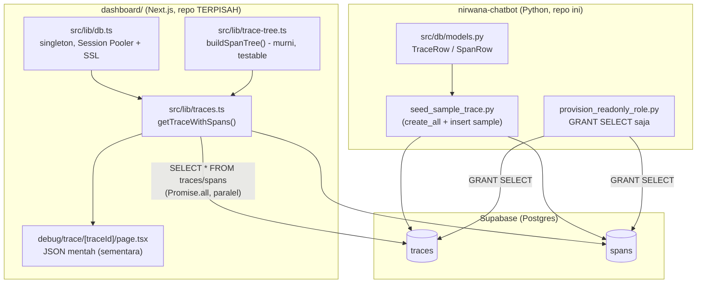

# Report — Milestone 5.2: Membangun Skema Data dan Koneksi Next.js ke Supabase

## Bagian 1 — Ringkasan Hasil

**Status akhir:** Selesai sesuai rencana.

Tabel `traces`/`spans` (skema Bagian 4 `rancangan-observability-ai-chatbot.md`) genuinely dibuat pertama kali di Supabase project ini (sebelumnya hanya "dipesan secara konsep"), diisi satu trace contoh realistis (29 span, meniru struktur nyata M5.1 termasuk percabangan paralel Rewrite+Tarik Session Memory M7.7). Proyek Next.js baru (`dashboard/`, repo Git terpisah nested di `nirwana-chatbot/dashboard/`, mirror pola `nirwana-database/web`) dibangun dengan modul koneksi Postgres server-only (kredensial read-only least-privilege, terpisah dari `DATABASE_URL` backend Python) dan lapisan query yang mengambil satu trace lengkap beserta seluruh span anaknya, tersusun waktu dan hierarki induk-anak, dalam bentuk siap pakai komponen tampilan (`{trace, spans, tree}`). Kedua Kriteria Keberhasilan dibuktikan nyata lewat halaman debug yang di-fetch langsung (bukan asumsi kode benar) terhadap data sample di Supabase.

## Bagian 2 — Kriteria Keberhasilan vs Bukti Nyata

| Kriteria (dari dokumen sumber) | Bukti Aktual | Terpenuhi? |
|---|---|---|
| "Query dari Next.js terhadap data contoh berhasil mengembalikan satu trace lengkap beserta seluruh span anaknya tersusun sesuai urutan waktu dan hubungan induk-anaknya." | `GET http://localhost:3000/debug/trace/sample-6d7f5cea8dfd` → `200`, mengembalikan 29 span terurut `started_at` DAN `tree` bersarang 1 root (`invoke_agent`) dengan 17 anak langsung — termasuk pasangan `rewrite`/`memory.retrieve` (percabangan paralel M7.7) sebagai sibling terpisah dengan `started_at` overlap yang benar, dan nested multi-level (`domain_gate.identifikasi_semua` dengan 2 anak). Detail: `logs.md` Checkpoint 5 Task 9. | Ya |
| "Struktur data yang diambil sudah dalam bentuk yang siap dipakai komponen tampilan, tidak perlu transformasi tambahan yang rumit di sisi komponen." | Page debug (`src/app/debug/trace/[traceId]/page.tsx`) langsung `JSON.stringify(detail)` tanpa transformasi apa pun — `TraceDetail` (`{trace, spans, tree}`) dari `getTraceWithSpans()` sudah final. `buildSpanTree()` (transformasi non-trivial flat→tree) sudah selesai di lapisan query, dibuktikan 5 unit test Vitest hijau (out-of-order, bercabang, nested, orphan defensif, kosong). | Ya |

## Bagian 3 — Cara Kerja dan Arsitektur

### Cara Kerja

Next.js (`dashboard/`, repo terpisah) terhubung ke Supabase via koneksi Postgres langsung (bukan REST/PostgREST) menggunakan role baru read-only (`nirwana_dashboard_reader`, `GRANT SELECT` saja) lewat Session Pooler dengan SSL eksplisit. Modul `src/lib/db.ts` menyediakan singleton client (`globalThis`-guarded, padanan `@lru_cache get_engine()` Python) supaya dev server tidak membuka koneksi berulang. `src/lib/traces.ts` (`getTraceWithSpans()`) menjalankan dua query paralel (`traces` by `trace_id`, `spans` by `trace_id` terurut waktu) lalu memanggil `buildSpanTree()` (di `src/lib/trace-tree.ts`, fungsi murni tanpa I/O supaya testable terisolasi) untuk menyusun span flat jadi tree bersarang by `parent_span_id`. Hasil akhir (`TraceDetail`) sudah dalam bentuk siap pakai — `spans` flat untuk kebutuhan render waterfall M5.3 nanti (mis. hitung offset waktu), `tree` bersarang untuk struktur visual hierarkis.

Data sumbernya sendiri (tabel `traces`/`spans`) dibuat dan diisi lewat skrip Python sekali-jalan (`seed_sample_trace.py`, `src/db/models.py` — konsisten pola project ini, `SQLModel.metadata.create_all()` tanpa Alembic), karena PIC 6 (custom exporter Go yang seharusnya mengisi data asli) belum mulai — sesuai arahan eksplisit dokumen sumber M5.2.

### Diagram Arsitektur

### Integrasi dengan Komponen Lain

- **M5.1 (Grafana)**: TIDAK ada dependensi teknis — jalur data terpisah total (Jaeger/Prometheus vs Supabase). Struktur trace sample M5.2 SENGAJA meniru bentuk nyata M5.1 (trace 28 span, percabangan M7.7) supaya representatif, murni untuk realisme data, bukan dependensi kode.
- **PIC 6 (Custom Exporter Go, belum mulai)**: dokumen sumber menjanjikan M5.2 "dapat mulai bekerja paralel dengan data dummy" tanpa menunggu PIC 6 — **terpenuhi**. Skema `traces`/`spans` yang dibuat di sini (`src/db/models.py`) adalah kontrak yang WAJIB diikuti PIC 6 saat mulai (Bagian 4 `rancangan-observability-ai-chatbot.md`) — tidak boleh didesain ulang sepihak oleh PIC 6 nanti.
- **M5.3 (Tampilan Waterfall Trace, di luar cakupan M5.2)**: `getTraceWithSpans()`/`TraceDetail` yang dibangun di sini adalah fondasi langsung M5.3 — page debug JSON mentah bersifat SEMENTARA, dijanjikan digantikan (bukan dihapus tanpa pengganti) begitu M5.3 membangun komponen visual sungguhan. Bentuk `spans` flat (bukan cuma `tree`) sengaja disediakan mengantisipasi kebutuhan hitung offset waterfall M5.3, tanpa M5.2 menebak detail render lebih jauh dari itu.
- **Repo `nirwana-chatbot` (Python)**: `TraceRow`/`SpanRow` didefinisikan di `src/db/models.py` (bukan di repo `dashboard/`) — Next.js murni KONSUMEN skema, tidak mendefinisikan ulang. Kredensial dua repo genuinely terpisah (least-privilege), tidak ada shared secret.

## Bagian 4 — Perubahan dari Plan

1. **Urutan eksekusi Task 2/3 terbalik dari penomoran**: `GRANT SELECT` (Task 2) butuh tabel sudah ada — dijalankan SETELAH `seed_sample_trace.py` (Task 3) membuat tabel, bukan sebelum seperti urutan nomor task di plan. Tidak mengubah desain, murni dependency eksekusi nyata yang baru terlihat saat implementasi.
2. **FK violation saat seed data** (`ForeignKeyViolation` pada insert `spans`): `session.add(trace); session.add_all(spans); session.commit()` dalam satu commit gagal karena Postgres cek FK per-statement, bukan ditunda ke akhir transaksi. Diperbaiki: pisah jadi dua commit eksplisit (trace dulu, baru spans).
3. **`.gitignore` bawaan `create-next-app` terlalu lebar**: `.env*` ikut mengecualikan `.env.local.example` (template tanpa secret). Ditambah pola negasi `!.env*.example`.
4. **`buildSpanTree()` dipisah ke file sendiri** (`trace-tree.ts`, bukan digabung di `traces.ts` seperti draf awal Task 8) — supaya genuinely testable tanpa memicu `import "server-only"`/butuh `DATABASE_URL` saat test dijalankan, konsisten Keputusan 10 ("diuji terisolasi tanpa perlu koneksi DB nyata").
5. **`create-next-app` tidak auto-`git init`** (beda dari ekspektasi awal berdasar versi lama) — `git init` dijalankan manual, tidak mengubah rencana lokasi/struktur repo.

Tidak ada penyimpangan pada substansi Kriteria Keberhasilan atau Keputusan Desain — seluruh 5 poin di atas adalah detail eksekusi yang ditemukan+diperbaiki di checkpoint yang sama, dicatat lengkap di `logs.md`.

## Bagian 5 — Keterbatasan dan Item Provisional

- **Data masih 100% manual/sample** — PIC 6 (custom exporter Go) belum mulai, tabel `traces`/`spans` hanya berisi 1 trace buatan tangan (bukan data produksi asli). Ini SENGAJA dan diantisipasi dokumen sumber M5.2, bukan gap tak terduga.
- **Tuning connection-pool serverless** (`max:1`, dsb. — relevan kalau nanti dashboard di-deploy ke platform serverless seperti Vercel) SENGAJA belum diterapkan — tidak relevan untuk `npm run dev` lokal, dan belum ada milestone deployment manapun di M5.1-5.4. Dicatat sebagai follow-up (Bagian 6), BUKAN item `docs/keterbatasan-diterima.md` baru (karena belum genuinely jadi masalah, murni scope belum tiba).
- **Page debug JSON mentah** (`debug/trace/[traceId]`) bukan tampilan produksi — akan digantikan M5.3, bukan dianggap selesai/final.
- **Repo `dashboard/` belum punya remote/deploy** — sesuai Keputusan 12, murni local git repo untuk sesi kerja M5.2. Kalau nanti perlu deploy, itu keputusan terpisah.

## Bagian 6 — Follow-up

- **M5.3 (Tampilan Waterfall Trace dan Daftar Turn)**: lanjutan langsung — pakai `getTraceWithSpans()`/`TraceDetail` yang sudah ada, ganti page debug JSON mentah dengan komponen visual sungguhan. Kalau M5.3 butuh bentuk data berbeda dari `TraceDetail` saat ini, komunikasikan balik (bukan kontrak beku, hanya desain awal berbasis KK M5.2).
- **PIC 6 (Custom Exporter Go)**: begitu mulai, WAJIB mengikuti skema `traces`/`spans` yang sudah dibuat di `src/db/models.py` apa adanya (kontrak Bagian 4) — perubahan skema di kemudian hari wajib dikomunikasikan ke M5.2-5.4 dan PIC 6 sesuai catatan dependensi dokumen sumber.
- **Tuning connection-pool serverless**: revisit begitu ada milestone deployment nyata (belum ada saat ini).
- **`docs/keputusan-tertunda.md` #4** (skema `DataVisualisasi`): DIKONFIRMASI tetap tidak actionable di M5.2 juga — M5.2 murni skema `traces`/`spans` (observability), sama sekali tidak menyentuh `DataVisualisasi` (skema jawaban chatbot, dikonsumsi frontend aplikasi chat yang terpisah dari dashboard observability PIC 5). Revisit entri ini kemungkinan besar tidak akan pernah relevan untuk PIC 5 sama sekali — dicatat sebagai temuan untuk ditinjau ulang triggernya, bukan ditindaklanjuti di sini.
