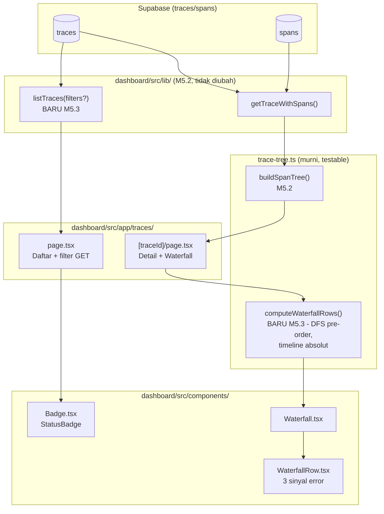

# Report — Milestone 5.3: Membangun Tampilan Waterfall Trace dan Daftar Turn

## Bagian 1 — Ringkasan Hasil

**Status akhir:** Selesai sesuai rencana.

Dashboard publik (`dashboard/`) sekarang punya dua tampilan inti: `/traces` (daftar trace, bisa disaring by status/role/session) dan `/traces/[traceId]` (waterfall visual — batang horizontal proporsional durasi, tersusun induk-anak, meniru bentuk panel Grafana M5.1). Route debug JSON mentah M5.2 (`/api/debug`, `/debug/trace/[traceId]`) dihapus, digantikan tampilan sungguhan sesuai janji milestone sebelumnya. Kedua Kriteria Keberhasilan dibuktikan nyata lewat data sample baru yang dirancang khusus merepresentasikan skenario uji literal KK (multi-wave untuk KK1, span gagal untuk KK2) — diverifikasi lewat query DOM presisi (posisi/lebar bar, class CSS) dari browser sungguhan, bukan `curl`.

## Bagian 2 — Kriteria Keberhasilan vs Bukti Nyata

| Kriteria (dari dokumen sumber) | Bukti Aktual | Terpenuhi? |
|---|---|---|
| "Trace dengan banyak span bercabang (skenario uji: turn dengan lebih dari satu atomic intent yang diproses dalam wave berbeda) tergambar dengan hubungan induk-anak yang benar, bukan sekadar daftar datar tanpa struktur." | Trace `sample-mw-e2a07d4512` (29 span, 2× `orchestration.wave` sibling) di `/traces/sample-mw-e2a07d4512` — `get_page_text` menunjukkan urutan DFS benar (wave1+anaknya, lalu wave2+anaknya, bukan digabung/hilang); query DOM presisi: bar wave1 `left=60.39% width=6.32%` (berakhir ~66.71%), bar wave2 `left=66.76% width=6.84%` — posisi absolut berbeda, genuinely tidak overlap, BUKAN direset ke 0% per parent. Detail: `logs.md` Checkpoint 5 Task 8. | Ya |
| "Trace yang mengandung span berstatus gagal (`error.type` terisi) menampilkan penanda visual yang jelas berbeda dari span yang berhasil." | Trace `sample-fail-37d0b3fd05` (27 span, 3× `error_type` terisi) di `/traces/sample-fail-37d0b3fd05` — query DOM `[class*="bg-red-900"]` → tepat 3 bar, semua `hasDashedBorder=true`, title berisi teks `error_type` eksplisit (`"ditolak_otorisasi"`×2, `"gagal_teknis"`×1); 24 bar normal (`bg-sky-700`, solid) vs 3 bar error (`bg-red-900`, dashed) — dua sinyal visual independen (warna+bentuk) + teks, jelas berbeda. Detail: `logs.md` Checkpoint 5 Task 8. | Ya |

## Bagian 3 — Cara Kerja dan Arsitektur

### Cara Kerja

`/traces` (Server Component) memanggil `listTraces(filters?)` — filter status/role_title/session_id diterapkan lewat fragment SQL dinamis (`postgres` library), form `<form method="GET">` native mengubah `searchParams` URL tanpa JavaScript client tambahan. `/traces/[traceId]` memanggil `getTraceWithSpans()` (M5.2, tidak diubah) lalu `computeWaterfallRows()` (fungsi murni baru di `trace-tree.ts`) — DFS pre-order atas `tree`, menghitung `offsetPct`/`widthPct` tiap span terhadap timeline ABSOLUT trace (`t0`=`trace.started_at`, `totalMs` konstan untuk seluruh span, bukan dihitung ulang per-parent) supaya span di kedalaman berbeda tetap valid dibandingkan visual. Hasil dirender `<Waterfall>`/`<WaterfallRow>` — grid CSS dua-kolom (label terindentasi + track bar), tanpa library chart eksternal. Span gagal (`error_type !== null`) ditandai 3 sinyal bersamaan: warna merah, `border-dashed`, dan teks `error_type` eksplisit.

### Diagram Arsitektur

### Integrasi dengan Komponen Lain

- **M5.2 (`getTraceWithSpans()`/`TraceDetail`)**: dipakai apa adanya, TIDAK diubah — `TraceDetail` terbukti "siap pakai" sesuai desain awal M5.2 (KK2-nya sendiri).
- **M5.1 (panel Grafana)**: bentuk visual "batang horizontal proporsional durasi, tersusun induk-anak" langsung meniru panel "Detail Trace/Waterfall" — kesetaraan tampilan (bukan kode) terpenuhi sesuai Lingkup dokumen sumber.
- **M5.4 (Panel Agregat, di luar cakupan M5.3)**: `listTraces()` yang dibangun di sini query SQL-side (bukan fetch-semua) — pola siap dipakai kalau M5.4 butuh agregasi lintas-trace skala lebih besar.
- **PIC 6 (Custom Exporter Go, belum mulai)**: tidak ada dependensi baru — `/traces` dan `/traces/[traceId]` bekerja terhadap skema `traces`/`spans` apa adanya, akan otomatis menampilkan data asli begitu PIC 6 mengisi tabel.

## Bagian 4 — Perubahan dari Plan

1. **Bug kecil `DetachedInstanceError`** saat seed data Checkpoint 2 (akses atribut SQLModel setelah session ditutup) — diperbaiki dengan capture `trace_id` ke variabel lokal sebelum blok `with Session`. Data yang sudah ter-commit tidak terpengaruh (bug murni di `print()`, bukan transaksi DB).
2. **Tool screenshot (`computer` action) gagal sepanjang milestone** ("Browser pane is not displayed") — panel Browser sisi user belum terbuka visual. Diatasi konsisten dengan verifikasi setara: `get_page_text`, `read_console_messages`, `read_network_requests`, dan `javascript_tool` (query `getComputedStyle`/DOM/`style.left`/`style.width` langsung) — sama-sama bukti nyata browser sungguhan, bahkan lebih presisi untuk nilai numerik (persentase posisi bar) dibanding interpretasi visual screenshot.
3. **Tool `computer left_click` (koordinat) tidak berhasil submit form** di Checkpoint 4 — diisolasi dan dikonfirmasi BUKAN bug implementasi (kemungkinan terkait keterbatasan compositing yang sama dengan poin 2). Diverifikasi via `form.requestSubmit()` (DOM API native) sebagai pembuktian alternatif setara — mekanisme form/kode Next.js terbukti genuinely benar.

Tidak ada penyimpangan pada substansi Kriteria Keberhasilan atau Keputusan Desain — seluruh 3 poin di atas adalah detail eksekusi yang ditemukan+diperbaiki/diisolasi di checkpoint yang sama, dicatat lengkap di `logs.md`.

## Bagian 5 — Keterbatasan dan Item Provisional

- **Data masih 100% manual/sample** (1 trace M5.2 + 2 trace baru M5.3, total 3) — PIC 6 belum mulai, konsisten status M5.2, bukan gap tak terduga.
- **Interaktivitas waterfall** (collapse/expand subtree, klik span untuk detail atribut JSONB penuh) SENGAJA di luar cakupan KK1/KK2 — dicatat sebagai follow-up potensial, bukan blocker.
- **Panel Browser sisi user belum bisa menampilkan screenshot visual** (compositing gagal) sepanjang sesi M5.2 lanjutan dan M5.3 — tidak menghalangi verifikasi (metode alternatif DOM/computed-style terbukti setara atau lebih presisi), tapi dicatat sebagai keterbatasan lingkungan kerja saat ini, bukan sesuatu yang project ini kendalikan.
- **Filter daftar trace** (`status`/`role_title`/`session_id`) berbentuk text input bebas, bukan dropdown pilihan tervalidasi — cukup untuk skala data sample saat ini (3 baris), mungkin perlu direvisit jadi `<select>` begitu ada lebih banyak nilai unik dari data asli PIC 6.

## Bagian 6 — Follow-up

- **M5.4 (Panel Agregat dan Metrik Ringkasan)**: lanjutan langsung — bisa reuse pola `listTraces()`/query SQL-side untuk agregasi (`COUNT`/`GROUP BY status` dst.), dan `computeWaterfallRows()`/timeline-absolut sebagai referensi pola kalkulasi kalau ada kebutuhan visual waktu lagi.
- **Interaktivitas waterfall** (collapse subtree, detail atribut JSONB) — tidak wajib M5.4, tapi kandidat perbaikan UX kalau ada kesempatan.
- **Filter jadi dropdown tervalidasi** — revisit begitu data asli PIC 6 tersedia dan nilai unik `status`/`role_title` genuinely diketahui.
- **`docs/keputusan-tertunda.md` #4** (skema `DataVisualisasi`) — tidak disentuh M5.3 (konsisten temuan M5.1/M5.2: kemungkinan besar tidak pernah relevan untuk PIC 5).
