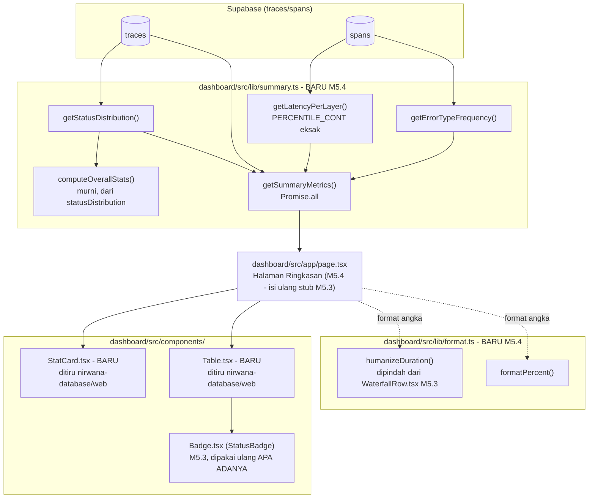

# Report — Milestone 5.4: Membangun Panel Agregat dan Metrik Ringkasan

## Bagian 1 — Ringkasan Hasil

**Status akhir:** Selesai sesuai rencana.

Halaman beranda dashboard publik (`dashboard/` → `/`) sekarang menampilkan panel ringkasan/agregat lintas SELURUH trace tersimpan — jumlah query, tingkat keberhasilan, distribusi status, latency rata-rata+persentil per layer, dan frekuensi tiap `error.type` — setara isinya dengan tiga panel agregat Grafana Milestone 5.1 (Latency per Layer, Distribusi Status, Frekuensi error.type). Ini milestone **terakhir PIC 5** — dengan selesainya M5.4, PIC 5 (Observability Dashboard) selesai sepenuhnya (M5.1-5.4).

Plan pertama milestone ini sempat diajukan lalu ditolak user untuk digali lebih dalam. Riset lanjutan (2 agent Explore + bacaan langsung project tetangga `nirwana-database/web`) mengubah pendekatan visual secara signifikan — dari rencana awal bar-chart CSS custom jadi struktur `StatCard`+`Table` yang mensintesis preseden project tetangga (halaman "Performa Query AI Chatbot" yang nyaris identik kasus pakainya) dengan konvensi internal `dashboard/` sendiri (`StatusBadge`, `humanizeDuration`). Kedua Kriteria Keberhasilan dibuktikan nyata via dua lapis verifikasi independen: query SQL manual langsung ke Supabase (sebelum UI dibangun) DAN browser sungguhan (setelah UI dibangun), keduanya menghasilkan angka yang identik.

## Bagian 2 — Kriteria Keberhasilan vs Bukti Nyata

| Kriteria (dari dokumen sumber) | Bukti Aktual | Terpenuhi? |
|---|---|---|
| "Angka ringkasan yang ditampilkan (jumlah query, tingkat keberhasilan) terbukti cocok dengan penghitungan manual terhadap data yang sama di Supabase, tidak ada penyimpangan akibat kesalahan agregasi." | Checkpoint 3: query manual (`getSummaryMetrics()` dijalankan via skrip ad-hoc langsung ke Supabase) menghasilkan `totalTraces=3` (2× `berhasil` + 1× `sebagian`), `successRate=0.6666666666666666` — persis 2/3. Checkpoint 4: UI di `http://127.0.0.1:3000/` menampilkan "Jumlah Query 3" dan "Tingkat Keberhasilan 66.7%" — IDENTIK dengan hasil query manual (dikonfirmasi `get_page_text` browser sungguhan). Tabel Distribusi Status (`berhasil 2`/`sebagian 1`) dan Latency per Layer (10 baris) juga dikonfirmasi cocok baris-demi-baris dengan output skrip verifikasi Checkpoint 3. Detail: `logs.md` Checkpoint 3 Task 4, Checkpoint 4 Task 6. | Ya |
| "Kemunculan `error.type` bertipe `ditolak_otorisasi` atau `gagal_teknis` sama-sama terlihat menonjol di dashboard publik ini seperti di Grafana, membuktikan kesetaraan isi yang dijanjikan di awal dokumen ini benar-benar terwujud, bukan sekadar niat." | Tabel "Frekuensi error.type" menampilkan `ditolak_otorisasi 2`/`gagal_teknis 1`. Query DOM langsung (`javascript_tool`, bukan interpretasi screenshot) mengonfirmasi KEDUA badge memakai class `bg-red-950 text-red-300 border-red-800` — merah, jelas berbeda dari badge `berhasil` (`bg-emerald-950`/hijau) dan `sebagian` (`bg-amber-950`/amber) di tabel Distribusi Status. Detail: `logs.md` Checkpoint 4 Task 6. | Ya |

---

## Bagian 3 — Cara Kerja dan Arsitektur

### Cara Kerja

Halaman `/` (Server Component) memanggil `getSummaryMetrics()` (`dashboard/src/lib/summary.ts`, baru) — tiga query SQL agregat dijalankan paralel (`Promise.all`): `getStatusDistribution()` (`GROUP BY status` langsung dari kolom trace-level, tanpa proksi span seperti Grafana), `getLatencyPerLayer()` (`GROUP BY layer_name`, `PERCENTILE_CONT(0.95) WITHIN GROUP (ORDER BY duration_ms)` — persentil eksak Postgres native, bukan aproksimasi histogram bucket Grafana), `getErrorTypeFrequency()` (`GROUP BY error_type` dari `spans`, filter `IS NOT NULL`). Seluruh angka SQL di-cast eksplisit `::int`/`::float8` untuk menghindari ambiguitas tipe bigint/numeric dari driver. `computeOverallStats()` — fungsi murni terpisah — menghitung `totalTraces`/`successRate` dari hasil `statusDistribution` yang sama (satu sumber kebenaran, bukan query COUNT terpisah). Hasil dirender lewat dua komponen baru yang mensintesis preseden ekosistem: `StatCard` (angka besar bertone, struktur ditiru `nirwana-database/web`) untuk Jumlah Query/Tingkat Keberhasilan, dan `Table` generik (juga ditiru dari sana) untuk tiga tabel kategorikal — kolom status/error_type memakai `<StatusBadge>` yang sudah ada sejak M5.3 apa adanya (tanpa modifikasi), karena `error_type` share vocabulary persis dengan `status` project ini.

### Diagram Arsitektur

### Integrasi dengan Komponen Lain

- **M5.3 (`getTraceWithSpans()`/`Badge.tsx`/`WaterfallRow.tsx`)**: `<StatusBadge>` dipakai ulang apa adanya untuk kolom status DAN error_type — nol modifikasi ke `Badge.tsx`. `humanizeDuration()` dipindah (bukan disalin) dari `WaterfallRow.tsx` ke `format.ts`, `WaterfallRow.tsx` diupdate mengimpor dari sana — diverifikasi regresi (Checkpoint 5) halaman `/traces/[traceId]` tetap render benar setelah refactor.
- **M5.1 (panel Grafana)**: kesetaraan ISI (bukan cara teknis) dengan 3 panel agregat Grafana ("Latency per Layer (p95)", "Distribusi Status (per turn)", "Frekuensi error.type") — Next.js/Supabase justru query lebih presisi (persentil eksak, kolom trace-level langsung) karena tidak mewarisi keterbatasan teknis Jaeger/Prometheus yang memaksa Grafana melakukan workaround (proksi span, dimensi ganda, histogram bucket).
- **`nirwana-database/web` (sibling project, di luar repo ini)**: `StatCard`/`Table` mensintesis STRUKTUR visualnya (bukan kode yang disalin) — penyesuaian sadar: taksonomi warna 5-nilai `StatusBadge` project ini (bukan tone generik 4-nilai sibling), format durasi presisi `humanizeDuration()` (bukan `.toFixed(0)+"ms"` polos), file terpisah per komponen (bukan satu `ui.tsx` bundel).
- **PIC 6 (Custom Exporter Go, belum mulai)**: tidak ada dependensi baru — panel agregat bekerja terhadap skema `traces`/`spans` apa adanya, otomatis mencerminkan data asli begitu PIC 6 mulai mengisi tabel dalam skala lebih besar.

## Bagian 4 — Perubahan dari Plan

1. **Plan pertama ditolak user secara menyeluruh** sebelum implementasi dimulai — bukan penyimpangan checkpoint, melainkan revisi plan itu sendiri sebelum `ExitPlanMode` disetujui. Riset lanjutan (2 agent Explore) mengubah pendekatan visual utama: bar-chart CSS width% (ide plan pertama, meniru `Waterfall` M5.3) dibatalkan sepenuhnya setelah dikonfirmasi `nirwana-database/web` (satu-satunya preseden dashboard lain di ekosistem) tidak punya pola itu sama sekali — diganti `StatCard`+`Table` yang mensintesis preseden sibling. Lihat `decisions.md` Keputusan 9 dan `logs.md` Checkpoint 1.
2. **Skrip verifikasi ad-hoc Checkpoint 3** (`verify_summary.mjs`, tidak commit) sempat gagal sekali (`ERR_UNSUPPORTED_ESM_URL_SCHEME`, import path Windows absolut) — diperbaiki dengan bare specifier + `cwd` di `dashboard/`. Bug murni di skrip verifikasi, bukan `summary.ts`.
3. **Percobaan membuka dev server baru di Checkpoint 4 gagal** (server `dashboard/` dari sesi M5.3 sebelumnya ternyata masih hidup, port 3000) — bukan bug, diselesaikan dengan memakai server yang sudah aktif itu langsung.

Tidak ada penyimpangan pada substansi Kriteria Keberhasilan atau jumlah/isi checkpoint — seluruh 3 poin di atas adalah detail eksekusi yang ditemukan+diperbaiki/diisolasi di checkpoint yang sama, dicatat lengkap di `logs.md`.

## Bagian 5 — Keterbatasan dan Item Provisional

- **Data masih 100% sample manual** (3 trace: 1× M5.2, 2× M5.3) — PIC 6 belum mulai, konsisten status M5.1-5.3, bukan gap tak terduga. Tabel Latency per Layer sudah punya 10 `layer_name` distinct (sebaran cukup kaya), tapi `PERCENTILE_CONT` pada beberapa layer dihitung dari sample kecil (7-19 span) — bukan salah hitung, tapi nilai persentilnya belum tentu representatif skala produksi nanti.
- **Makna "jumlah query" (=jumlah trace/turn)** adalah interpretasi yang didukung kuat oleh bukti tekstual+preseden Grafana (lihat `decisions.md` Keputusan 2), TAPI istilah "query" sendiri tidak pernah didefinisikan formal di dokumen sumber manapun — kalau pemilik dokumen sumber (`rancangan-observability-dashboard.md`) memaksudkan granularitas lain, angka ini perlu direvisi. Dampak error rendah (murni satu StatCard, `computeOverallStats()` tinggal diberi sumber data berbeda).
- **Tone `StatCard` ringkasan sengaja neutral** (bukan hijau/merah berdasar ambang tertentu) — project belum punya kebijakan ambang tingkat-keberhasilan yang didokumentasikan formal (`decisions.md` Keputusan 10). Kalau kebijakan itu nanti disepakati, StatCard bisa diberi tone kondisional.

## Bagian 6 — Follow-up

- **PIC 6 (Custom Exporter Go)**: begitu mulai mengalirkan data asli, seluruh panel M5.1-5.4 otomatis mencerminkannya tanpa perubahan kode — tidak ada follow-up teknis spesifik dari M5.4.
- **`docs/keputusan-tertunda.md` #4** (skema `DataVisualisasi`) — tidak disentuh M5.4, konsisten temuan M5.1-5.3 (kemungkinan besar tidak pernah relevan untuk PIC 5).
- **Interaktivitas panel** (mis. klik baris layer untuk lihat span terkait, filter rentang waktu) — SENGAJA di luar cakupan KK1/KK2, dicatat sebagai kandidat perbaikan UX di masa depan kalau ada kesempatan, bukan blocker.
- **PIC 5 selesai sepenuhnya (M5.1-5.4)** — pekerjaan berikutnya di project ini adalah PIC 6 (Custom Exporter Go), yang boleh dikerjakan kapan saja karena hanya bergantung kontrak span yang sudah stabil sejak M7.6-7.16, tidak menunggu PIC 5.
