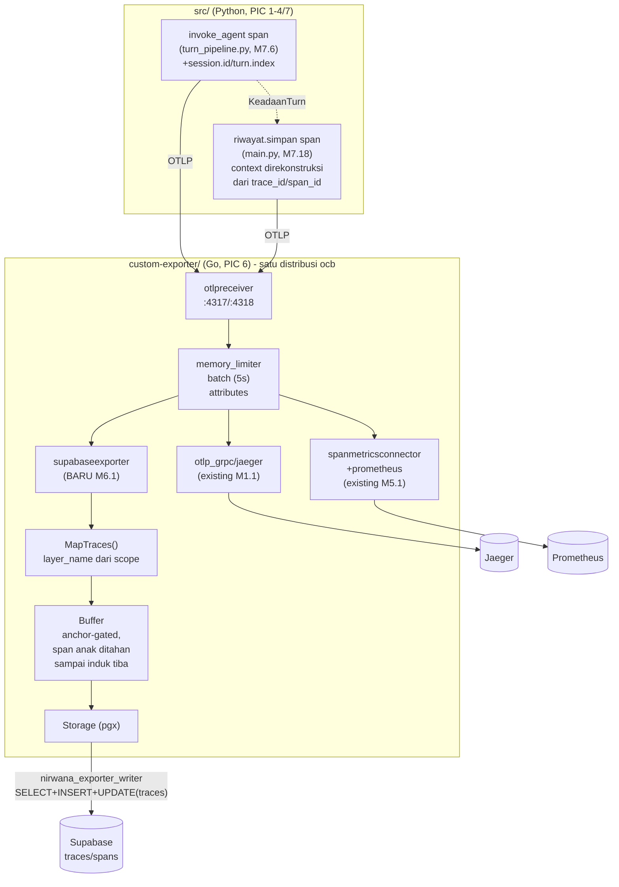

# Report — Milestone 6.1: Membangun Exporter Dasar yang Menulis ke Supabase

## Bagian 1 — Ringkasan Hasil

**Status akhir:** Selesai sesuai rencana.

Milestone pertama PIC 6 (Custom Exporter Supabase, Go) — satu-satunya pekerjaan project ini di luar Python — selesai sepenuhnya. Komponen exporter Go "supabase" berhasil dibangun sebagai komponen NATIVE OTel Collector (dikompilasi bersama seluruh distribusi Collector via `ocb`/OpenTelemetry Collector Builder, BUKAN proses terpisah), menggantikan image resmi `otel/opentelemetry-collector-contrib` di `docker-compose.yml`, dan terbukti menulis span nyata ke tabel `traces`/`spans` Supabase — dibuktikan berulang kali lewat jalur berbeda (binary lokal, stack produksi Docker, skrip test formal) tanpa satu pun regresi ke pipeline Jaeger/Prometheus existing (M1.1/M5.1).

Riset mendalam sebelum implementasi (dua putaran `AskUserQuestion`, 6 keputusan genuinely terbuka) menemukan gap arsitektur signifikan yang tidak diantisipasi dokumen sumber manapun: span `riwayat.simpan` (M7.18) genuinely jadi trace akar terpisah dari `invoke_agent`, yang akan membuat kolom `traces.status` permanen kosong untuk data asli begitu PIC 6 mengalirkannya. Gap ini diperbaiki DI SUMBERNYA (file kepemilikan M7.6/M7.18) sebagai prasyarat Checkpoint 2, sebelum kode Go apa pun ditulis — dan pada akhirnya terbukti nyata bekerja lewat turn produksi sungguhan di Checkpoint 10.

Milestone ini juga mengalami dan mengatasi dua insiden operasional signifikan: gangguan OpenRouter berkepanjangan (recurrence `docs/keterbatasan-diterima.md` #7, akhirnya pulih di tengah Checkpoint 10) dan kehabisan resource Docker Desktop akibat workload Kubernetes tidak terkait yang berjalan bersamaan di mesin yang sama (diselesaikan lewat eskalasi transparan ke user, bukan aksi sepihak).

## Bagian 2 — Kriteria Keberhasilan vs Bukti Nyata

| Kriteria (dari dokumen sumber) | Bukti Aktual | Terpenuhi? |
|---|---|---|
| "Span percobaan sederhana yang dikirim dari skrip Python ke Collector benar-benar muncul sebagai baris baru di Supabase, dengan seluruh atribut wajib (nama layer, durasi, status) terisi sesuai nilai aslinya." | Dibuktikan **3× independen**: (1) Checkpoint 8, binary lokal — `layer_name='orchestration'`, `operation_name='invoke_agent'`, `duration_ms=3` benar; (2) Checkpoint 9, stack produksi Docker (port 4317) — `traces`+`spans` row terkonfirmasi via SQL langsung; (3) Checkpoint 10, skrip formal `verify_kk1_kk2.py` (committed, bisa dijalankan ulang) — `KK1 TERPENUHI: True`. Detail: `logs.md` Checkpoint 8/9/10. | Ya |
| "Span anak dengan `parent_span_id` yang mengarah ke span induk yang sudah tertulis lebih dulu, tersimpan dengan relasi induk-anak yang benar dan bisa ditelusuri kembali lewat query sederhana." | Dibuktikan **3× independen** (sama seperti KK1) via `LEFT JOIN spans p ON s.parent_span_id = p.span_id` — `resolved_parent` cocok persis `span_id` induk di setiap percobaan. Checkpoint 7 unit test (`buffer_test.go`) JUGA membuktikan mekanisme bekerja untuk kondisi REALISTIS (span anak tiba SEBELUM induk, bukan cuma kasus sederhana literal KK) — bukan sekadar lolos test box-checking. Detail: `logs.md` Checkpoint 7/8/9/10. | Ya |

---

## Bagian 3 — Cara Kerja dan Arsitektur

### Cara Kerja

Collector (dikompilasi custom via `ocb`, `custom-exporter/builder-config.yaml`) menerima batch span OTLP di `otlpreceiver` (port 4317/4318), diteruskan lewat `memory_limiter`→`batch`(timeout 5s)→`attributes` processor, lalu fan-out ke exporter existing (`otlp_grpc/jaeger`, `prometheus` via `spanmetricsconnector`) DAN exporter baru `supabase`. Di dalam `supabaseexporter` (`custom-exporter/supabaseexporter/`): `pushTraces()` (`factory.go`) memanggil `MapTraces()` (`mapping.go`) mengonversi tiap span OTel jadi `SpanRow` — `layer_name` diturunkan dari **instrumentation scope name** (bukan span name, yang terbukti dipakai ulang ≥13 lokasi lintas layer), `trace_id`/`span_id` di-hex-encode standar OTel, `attributes` diserialisasi JSON penuh. Tiap `SpanRow` diserahkan ke `Buffer.Ingest()` (`buffer.go`): span anchor (bawa `session.id`+`turn.index`, hanya `invoke_agent`) memicu upsert baris `traces` lalu flush seluruh span yang sempat tertahan untuk `trace_id` itu; span non-anchor untuk trace belum dikenal DITAHAN sampai anchor-nya tiba — forced karena `invoke_agent` SELALU berakhir belakangan dibanding anak-anaknya (`BatchSpanProcessor` Python SDK + nested span semantics). Penulisan aktual ke Postgres (`storage.go`) pakai `pgx`, kredensial role write-only `nirwana_exporter_writer` (`SELECT`+`INSERT`+`UPDATE` khusus `traces` — `UPDATE` ditemukan wajib lewat E2E test nyata, bukan diasumsikan di depan).

Prasyarat lintas-PIC: span `riwayat.simpan` (M7.18) sebelumnya jadi trace akar terpisah dari `invoke_agent` (context OTel sudah exit saat dipanggil) — diperbaiki (`KeadaanTurn` M7.6 membawa `invoke_agent_trace_id`/`invoke_agent_span_id`, `main.py` M7.18 merekonstruksi `SpanContext` untuk nesting) SEBELUM kode Go dibangun, supaya `traces.status` genuinely bisa terisi dari data asli.

### Diagram Arsitektur

### Integrasi dengan Komponen Lain

- **M1.1 (fondasi Collector)**: slot "jalur publik" yang disiapkan di `otel-collector-config.yaml` diisi — TAPI bentuknya berbeda dari ilustrasi placeholder (`otlphttp` forwarding ke service terpisah) karena Keputusan 1 M6.1 memilih komponen NATIVE. Pipeline `traces` existing menuju Jaeger TIDAK diubah struktur/urutannya, hanya ditambah satu exporter baru — diverifikasi nyata nol regresi.
- **M5.1-5.4 (dashboard)**: skema `traces`/`spans` (kontrak Bagian 4) diikuti PERSIS tanpa penyimpangan — begitu PIC 6 mengalirkan data asli, seluruh panel M5.1-5.4 (dibangun terhadap data sample) otomatis mencerminkannya tanpa perubahan kode di sisi dashboard. `traces.status` yang sebelumnya SELALU NULL untuk data asli (gap ditemukan+diperbaiki milestone ini) sekarang genuinely bisa terisi — memperbaiki fitur distribusi status M5.1/M5.4 untuk pertama kalinya terhadap data produksi.
- **M7.6/M7.18 (owning code untuk fix `riwayat.simpan`)**: didokumentasikan sebagai addendum di `decisions.md` MASING-MASING milestone (bukan di sini), mengikuti preseden project (M7.6/M7.7/M7.11/M7.17/M7.18 saling menemukan+memperbaiki gap lintas-milestone).

## Bagian 4 — Perubahan dari Plan

1. **Penyimpangan disiplin proses ditemukan+dikoreksi user di tengah Checkpoint 9**: Checkpoint 3-8 sempat dikerjakan berturut-turut tanpa commit+log per checkpoint (melanggar aturan eksplisit `CLAUDE.md`). Dikoreksi eksplisit — seluruh kerja tetap tersimpan benar di disk, commit disusun ulang retroaktif mengikuti urutan checkpoint yang benar sebelum Checkpoint 9 dilanjutkan. Detail: `logs.md` "Task/Checkpoint di Luar Plan" #1.
2. **Verifikasi E2E (rencana Checkpoint 10) dikerjakan lebih awal, di Checkpoint 8-9** — lebih murah memverifikasi begitu binary berhasil dikompilasi daripada menunda ke setelah investasi Docker packaging penuh. Checkpoint 10 karenanya berfokus pada skrip test formal (committed, bisa dijalankan ulang sebagai regression check) dan penuntasan verifikasi Jaeger real Checkpoint 2, bukan verifikasi fungsional pertama kali.
3. **Bug nyata ditemukan+diperbaiki**: grant Postgres role Checkpoint 4 awalnya kurang (`UPDATE` pada `traces`, dibutuhkan `ON CONFLICT DO UPDATE` UPSERT) — ditemukan lewat E2E test nyata Checkpoint 8, bukan diasumsikan di depan.
4. **Insiden resource Docker Desktop di Checkpoint 9**: build gagal 2× karena RAM habis akibat workload Kubernetes tidak terkait project ini berjalan bersamaan di mesin yang sama — diselesaikan lewat eskalasi transparan ke user (bukan aksi sepihak terhadap resource/container di luar cakupan), user men-scale-down sendiri, build ketiga berhasil.
5. **Verifikasi Jaeger real Checkpoint 2 sempat tertunda** (OpenRouter down berkepanjangan sepanjang sebagian besar sesi), akhirnya dituntaskan di Checkpoint 10 begitu OpenRouter kembali stabil — dibuktikan lewat turn produksi nyata, bukan diterima sebagai keterbatasan permanen.

Tidak ada penyimpangan pada substansi Kriteria Keberhasilan — seluruh poin di atas adalah detail eksekusi yang ditemukan+diperbaiki/diselesaikan di checkpoint yang sama, dicatat lengkap di `logs.md`.

## Bagian 5 — Keterbatasan dan Item Provisional

- **`role_title` tidak terisi untuk data asli** — dikonfirmasi TIDAK PERNAH jadi span attribute di manapun di `src/` (grep menyeluruh). KK1 M6.1 tidak mewajibkan field ini (`decisions.md` Keputusan 7). Dicatat sebagai keterbatasan diterima baru (perlu ditambahkan ke `docs/keterbatasan-diterima.md` sebagai bagian penutupan).
- **`Buffer` murni in-memory, tidak persisten lintas restart proses** — trace yang anchor-nya tidak pernah tiba (mis. `proses_turn()` crash sebelum `invoke_agent` selesai) akan tertahan selamanya di memori sampai proses Collector di-restart. Eviction/timeout adalah cakupan M6.2 (reliability), bukan M6.1 — sengaja dibatasi (`decisions.md` Keputusan 6).
- **Data produksi asli masih sangat sedikit** (hanya trace test yang sudah dibersihkan) — PIC 6 baru mulai mengalirkan data nyata mulai sekarang, panel M5.1-5.4 akan terisi bertahap seiring traffic asli.
- **Batch processor Collector (M1.1, timeout 5s) menahan span sebelum diteruskan ke exporter manapun** — ditemukan lewat race condition di skrip verifikasi Checkpoint 10 (bukan bug M6.1, konfigurasi existing M1.1 yang tidak diubah). Konsumen data (dashboard, query manual) perlu sadar ada jeda hingga beberapa detik antara turn selesai dan data genuinely muncul di Supabase.

## Bagian 6 — Follow-up

- **Milestone 6.2** (Penanganan Kegagalan dan Keandalan Pengiriman) — melengkapi exporter dasar ini dengan retry untuk kegagalan penulisan sementara, batching efisien volume tinggi, dan eviction untuk `Buffer` yang tertahan tanpa batas.
- **`role_title` span attribute** — kalau di masa depan dibutuhkan, perlu instrumentasi tambahan di banyak titik (di luar cakupan literal M6.1), kemungkinan besar di `invoke_agent` atau lewat mekanisme baggage/context propagation project-wide.
- **`docs/keterbatasan-diterima.md`** — tambahkan entri baru untuk `role_title` (di atas) dan `Buffer` in-memory (eviction, M6.2).
- **CLAUDE.md/AGENT.md** — update tabel Status Proyek (M6.1 Selesai) dan tabel Struktur Repository (baris baru `custom-exporter/`), dikerjakan sebagai bagian penutupan milestone ini (task terakhir sebelum report ini dianggap final).
