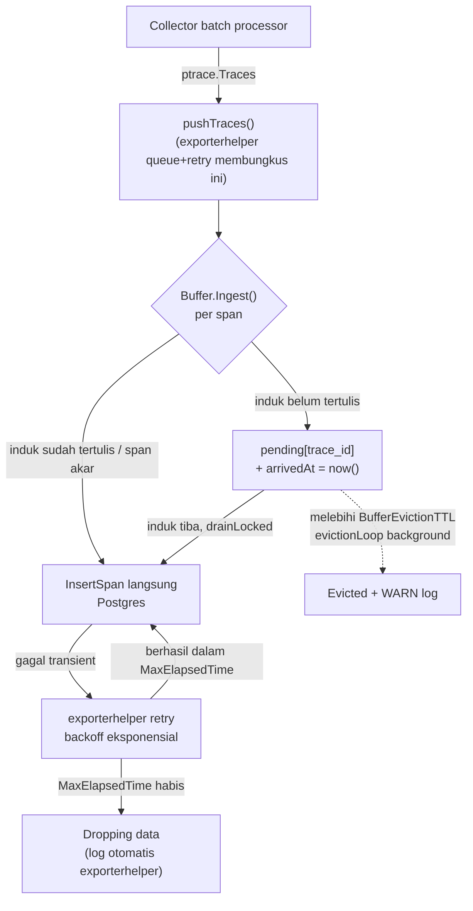

# Report — Milestone 6.2: Membangun Penanganan Kegagalan dan Keandalan Pengiriman

## Bagian 1 — Ringkasan Hasil

**Status akhir:** Selesai sesuai rencana.

Exporter `supabase` (M6.1) sekarang tahan gangguan sementara: kegagalan penulisan Postgres di-retry otomatis (backoff eksponensial, jendela 5 menit) lewat `exporterhelper.WithRetry`/`WithQueue` yang sebelumnya sama sekali tidak dipakai — sebelum milestone ini, satu kegagalan tunggal berarti data hilang total tanpa percobaan ulang. `Buffer` in-memory (M6.1) yang menahan span sampai dependensinya lengkap sekarang punya TTL eviction (60 menit default) supaya trace yang span akarnya tidak pernah tiba (proses crash, dst) tidak tertahan selamanya di memori. Kedua Kriteria Keberhasilan dibuktikan lewat eksekusi nyata (bukan simulasi/mock): fault injection genuine terhadap Postgres lokal disposable (KK1), dan turn produksi nyata 69 span sekaligus (KK2) — bukan cuma kode yang lolos unit test.

**PIC 6 (Custom Exporter Supabase) SELESAI SEPENUHNYA (M6.1+M6.2) — ini menutup milestone TERAKHIR yang belum dimulai di SELURUH project** (7 PIC, 24 milestone total).

## Bagian 2 — Kriteria Keberhasilan vs Bukti Nyata

| Kriteria (dari `rancangan-custom-exporter-supabase.md`) | Bukti Aktual | Terpenuhi? |
|---|---|---|
| "Simulasi gangguan sesaat (Supabase tidak terjangkau untuk waktu singkat, lalu pulih) menghasilkan span yang akhirnya tetap tertulis lewat mekanisme retry, bukan hilang begitu saja." | Postgres lokal disposable (`setup_local_postgres.py`) distop SEBELUM span dikirim, span dikirim SEKALI (`send_test_span_kk1.py`), Postgres dinyalakan lagi ~15 detik kemudian (Collector TIDAK di-restart selama proses) — retry backoff eksponensial teramati nyata di log (4.68s→7.91s→18.81s), trace+2 span AKHIRNYA tertulis lengkap di Postgres, TANPA pengiriman ulang manual apa pun. Lihat `logs.md` Checkpoint 7. | **Ya** |
| "Pengiriman batch span dalam jumlah besar sekaligus (skenario uji: mensimulasikan satu turn dengan banyak wave dan banyak atomic intent, menghasilkan puluhan span sekaligus) berhasil tertulis semuanya tanpa ada yang terlewat atau menyebabkan Collector kehabisan sumber daya." | Turn nyata skenario `gop_margin` majemuk-bergantung (2 wave, role `General Manager` diizinkan domain `financial`) menghasilkan **69 span** — pertumbuhan dipantau berkala (`Monitor`), termasuk lompatan 41→65 span dalam satu jendela singkat (wave 2). Jaeger vs Supabase: **69/69 cocok persis**, nol FK/reject error, `docker stats`: CPU 3.77%, memori 0.70% dari limit — jauh dari kehabisan sumber daya. Lihat `logs.md` Checkpoint 8. | **Ya** |

---

## Bagian 3 — Cara Kerja dan Arsitektur

### Cara Kerja

Sebelum M6.2, `pushTraces()` (titik masuk exporter Go) langsung meneruskan span ke `Buffer` tanpa pengaman apa pun di sekitarnya — kalau `Buffer.Ingest()` gagal (mis. Postgres sesaat tidak terjangkau), `exporterhelper.NewTraces()` yang membungkusnya TIDAK punya retry maupun queue aktif (default resmi package: keduanya *disabled*), sehingga kegagalan itu permanen. M6.2 membungkus jalur yang sama dengan dua lapis tambahan dari `exporterhelper` sendiri (bukan kode buatan sendiri): **retry** (`configretry.BackOffConfig` — percobaan ulang otomatis dengan backoff eksponensial, default `InitialInterval=5s`→`MaxInterval=30s`, menyerah setelah `MaxElapsedTime=5m`) dan **queue** (`exporterhelper.QueueBatchConfig` — mengantre `pushTraces()` di background, memisahkan kegagalan penulisan Postgres dari jalur utama Collector supaya pipeline Jaeger/Prometheus tidak ikut terblokir). Kedua konfigurasi ini configurable via `otel-collector-config.yaml` (`exporters.supabase.retry_on_failure`/`sending_queue`), bukan hardcode.

Lapis ketiga menyasar `Buffer` itu sendiri: span yang tertahan menunggu induknya (`pending`) sekarang mencatat waktu kedatangannya (`pendingEntry.arrivedAt`). Goroutine background (`evictionLoop`) memeriksa berkala, membuang entri yang tertahan melebihi `BufferEvictionTTL` (default 60 menit — jauh di atas worst-case hang LLM yang pernah tercatat project, ~25 menit) dengan WARN log eksplisit (`trace_id`/`span_id`/durasi tertahan) — bukan silent drop. `Stop()` menghentikan goroutine ini dengan bersih saat Collector shutdown.

Ketiga lapis ini SEPENUHNYA independen dari logic dependency-ordering `Buffer` (M6.1 addendum: `written` set + `insertableLocked()` + `drainLocked()` kaskade) — retry/queue yang mengirim ulang atau memproses out-of-order tidak memperkenalkan bug baru karena desain itu sudah idempoten (`ON CONFLICT`) dan tidak pernah mengasumsikan urutan kedatangan tertentu.

### Diagram Arsitektur

### Integrasi dengan Komponen Lain

"Catatan Serah Terima" `rancangan-custom-exporter-supabase.md` (identik M6.1, tidak berubah M6.2): skema `traces`/`spans` yang diisi exporter ini adalah sumber data langsung dashboard publik (M5.2-5.4) — M6.2 TIDAK mengubah pemetaan atribut span ke kolom Supabase maupun skema tabel itu sendiri (murni menambah keandalan pengiriman, bukan bentuk data), jadi TIDAK ada dampak terhadap lapisan query dashboard yang sudah dibangun. Slot exporter kedua di `otel-collector-config.yaml` (disediakan M1.1) juga tidak berubah bentuknya — hanya diperluas konfigurasi retry/queue di dalam section `exporters.supabase` yang sudah ada.

---

## Bagian 4 — Perubahan dari Plan

- **Task 2 (Checkpoint 2)**: plan awal (`decisions.md` Keputusan 1) menyebut "field custom flat per-parameter" (`retry_enabled`, `retry_initial_interval`, dst) — realisasinya memakai TIPE RESMI `configretry.BackOffConfig`/`exporterhelper.QueueBatchConfig` langsung sebagai sub-field `Config` (mapstructure `retry_on_failure`/`sending_queue`), pola idiomatik SELURUH exporter resmi OTel Collector. Ditemukan saat implementasi dimulai, TIDAK mengubah keputusan itu sendiri (tetap YAML-configurable) — murni penamaan/struktur field lebih baik. Detail: `logs.md` Checkpoint 2 Task 2.
- **Sesi sempat terputus** antara Checkpoint 3 dan 4 (komputer restart, Docker Desktop mati total) — dipulihkan penuh tanpa kehilangan progres (git sudah menyimpan seluruh commit sampai Checkpoint 3), didokumentasikan di `logs.md` Checkpoint 4.
- **`go test -race` tidak bisa jalan langsung di host** (Windows, `gcc` tidak tersedia) — dijalankan via container `golang:1.26` resmi. Bukan penyimpangan plan (tetap `-race` genuinely dijalankan), murni detail teknis pelaksanaan. Detail: `logs.md` Checkpoint 4 Task 6.

Selain dua penyesuaian di atas, seluruh checkpoint dan task lain dikerjakan persis sesuai rencana.

## Bagian 5 — Keterbatasan dan Item Provisional

- `docs/keterbatasan-diterima.md` #20 (`Buffer` in-memory tanpa eviction) — status diperbarui **DIPERBAIKI** sebagai bagian penutupan milestone ini.
- Span yang di-evict TTL (kasus trace yang span akarnya genuinely tidak pernah tiba) **hilang permanen** — bukan bug, melainkan trade-off desain sadar (`decisions.md` Keputusan 3): tujuan eviction adalah jaring pengaman memori untuk proses yang benar-benar mati, bukan mekanisme retry tambahan. TTL 60 menit dipilih jauh di atas observasi hang terpanjang project (~25 menit) untuk meminimalkan risiko salah evict turn yang masih hidup.
- Outage LEBIH LAMA dari `MaxElapsedTime` (5 menit default) tetap mengakibatkan data hilang (di-drop `exporterhelper`, dicatat log) — sesuai cakupan literal KK1 ("gangguan sesaat", bukan downtime berkepanjangan). Kalau observasi produksi nyata menunjukkan gangguan Supabase yang lebih lama dari 5 menit, `retry_on_failure.max_elapsed_time` bisa diperpanjang lewat YAML tanpa rebuild kode (Keputusan 1).

## Bagian 6 — Follow-up

Tidak ada follow-up teknis dari milestone ini sendiri. **Secara project-wide**: M6.2 adalah milestone TERAKHIR yang belum dimulai di seluruh 7 PIC (24 milestone total) — dengan selesainya ini, TIDAK ADA LAGI milestone yang belum dikerjakan di seluruh project. `CLAUDE.md`/`AGENT.md` diperbarui mencerminkan status ini sebagai bagian penutupan (task terakhir milestone ini).
