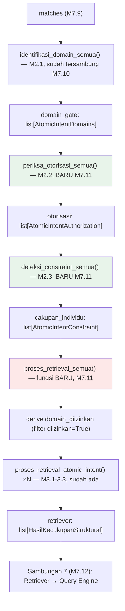

# Report — Milestone 7.11: Sambungan 6 (Domain Gate → Retriever)

## Bagian 1 — Ringkasan Hasil

**Status akhir:** Selesai dengan penyesuaian dari plan (scope diperluas sadar, bukan penyimpangan tak terduga).

M7.11 menyambungkan output Domain Gate (M2.1, sudah tersambung M7.10) ke Retriever (M3.1-3.3) — tapi riset plan menemukan bahwa "Domain Gate" secara arsitektur (`rancangan-rbac-authorization.md`) mencakup TIGA mekanisme (M2.1 identifikasi, M2.2 Pemeriksaan Otorisasi, M2.3 Deteksi Cakupan Individu), dan M7.10 hanya menyambungkan M2.1. `periksa_otorisasi_semua()` (M2.2) dan `deteksi_constraint_semua()` (M2.3) — keduanya kode matang sejak milestone aslinya masing-masing — belum pernah dipanggil `proses_turn()` sama sekali, dan tidak ada milestone Level 2 lain (M7.6-7.16) yang secara eksplisit ditugaskan menyambungkannya. User memutuskan M7.11 menutup KEDUA gap ini di dalam scope-nya sendiri, sebelum menyambungkan Retriever yang jadi tugas resmi milestone ini.

Hasil akhir: `proses_turn()` sekarang menjalankan rantai penuh `identifikasi_domain_semua()` (M2.1) → `periksa_otorisasi_semua()` (M2.2, BARU disambungkan) → `deteksi_constraint_semua()` (M2.3, BARU disambungkan) → `proses_retrieval_semua()` (Retriever, fungsi BARU dibangun — layer Retriever sebelumnya tidak py wrapper batch level-list). `KeadaanTurn` bertambah 3 field (`otorisasi`, `cakupan_individu`, `retriever`), melengkapi 10 field total. Dibuktikan nyata: 4 kejadian real-execution (LLM + Jaeger), seluruhnya `zero_leakage=True` — tidak ada kandidat view dari domain yang ditolak otorisasi pernah muncul di hasil pencarian Retriever, termasuk replikasi persis skenario `gop_margin` (M2.1/M7.3) sebagai bukti KK literal utama.

## Bagian 2 — Kriteria Keberhasilan vs Bukti Nyata

| Kriteria (dari dokumen sumber) | Bukti Aktual | Terpenuhi? |
|---|---|---|
| "Kebutuhan yang domainnya sebagian ditolak Domain Gate (skenario uji Milestone 2.2) menghasilkan Retriever yang hanya mencari kandidat view dari domain yang lolos, dibuktikan tidak ada kandidat dari domain yang ditolak muncul di hasil pencarian." (`rancangan-orkestrasi-api.md`, M7.11) | E01 (real LLM+Jaeger, `trace_id=607bf2c7...`): intent gop_margin — domain `[reservation, financial, properties_ref]` teridentifikasi, `financial` ditolak (Front Office Staff), `domain_diizinkan=[reservation, properties_ref]` diteruskan ke Retriever, `view_name_final=v_reservation_gop_impact_monthly` (view `reservation`) — inspeksi langsung `KecukupanKandidat.kandidat.domain` mengonfirmasi TIDAK ADA kandidat `financial` di antara yang dievaluasi. Lihat `evals/7.11-.../audit.md` E01. | **Ya, penuh** |

Kriteria tambahan yang turut terbukti sebagai konsekuensi keputusan menyertakan M2.2/M2.3 (di luar KK M7.11 asli, dicatat terpisah untuk kejujuran cakupan):

| Kriteria turunan | Bukti Aktual | Terpenuhi? |
|---|---|---|
| M2.2 KK 2: keputusan otorisasi per-domain benar untuk kebutuhan multi-domain campuran izin/tolak | E01 seluruh 3 atomic intent: keputusan `diizinkan`/`ditolak` per domain sesuai tabel role×domain (`Front Office Staff`=`reservation` saja) — dikonfirmasi span `authorization.check`×7 dan `hasil.otorisasi` | Ya |
| M2.3 KK 1: kebutuhan role Staff yang menyentuh view performa individu menghasilkan catatan constraint eksplisit | E04 (`trace_id=54f6978b...`, reuse persis `evals/2.3-.../S01`): `HR Staff` + "Bagaimana hasil review kinerja Budi semester ini?" → `cakupan_individu.terdeteksi=True`, `constraint.terdeteksi_count=1` di span | Ya |

Verifikasi tambahan (ketahanan mekanisme, bukan KK sumber literal): E03 (`role_title="F&B Staff"`, pertanyaan GOP murni `financial`) — seluruh domain intent ditolak, `domain_diizinkan=[]` tetap diteruskan ke Retriever (tidak di-skip), hasil `retrieval.candidates_count=0`, `view_name_final=None`, `status=BERHASIL`, `proses_turn()` selesai normal TANPA exception.

## Bagian 3 — Cara Kerja dan Arsitektur

### Cara Kerja

`proses_turn()` (`src/orchestration/turn_pipeline.py`) sekarang menjalankan 4 langkah sekuensial baru setelah Domain Gate (M7.10):

1. **Otorisasi** (`periksa_otorisasi_semua(domain_gate_result, payload.role_title)`, M2.2) — untuk tiap domain yang teridentifikasi per atomic intent, lookup deterministik (tanpa LLM) terhadap tabel `role_permissions`, menghasilkan keputusan `diizinkan`/`ditolak` per domain beserta alasan bila ditolak.
2. **Cakupan Individu** (`deteksi_constraint_semua(otorisasi_result, payload.role_title)`, M2.3) — untuk tiap atomic intent, dua pre-filter deterministik (role bukan tier Staff, atau domain tidak menyentuh `facility`/`hr` → langsung `terdeteksi=False` tanpa LLM); kalau lolos keduanya, dua pemanggilan LLM independen (deteksi + verifikasi titik buta) menentukan apakah kebutuhan menyentuh kategori data performa individu.
3. **Retriever batch** (`proses_retrieval_semua(cakupan_individu_result)`, fungsi BARU di `src/layers/retriever/kecukupan_struktural.py`) — untuk tiap atomic intent, derive `domain_diizinkan` dari `domain_decisions` (filter `diizinkan=True`), panggil `proses_retrieval_atomic_intent()` (M3.1-3.3, sudah ada) yang menjalankan BM25/embedding fallback → kecocokan makna (LLM) → kecukupan struktural (deterministik + fallback LLM kondisional), menghasilkan `view_name_final` atau `None`.

Filter domain diterapkan di titik MATERIALISASI kandidat BM25/embedding (M3.1, kode sudah ada sejak M3.1) — kandidat dari domain di luar `domain_diizinkan` TIDAK PERNAH dikonstruksi sama sekali, bukan disaring belakangan. Ini yang membuat jaminan "zero leakage" bersifat STRUKTURAL, bukan hasil pemeriksaan tambahan.

### Diagram Arsitektur

*(Hijau = wiring baru ke fungsi existing; merah = kode genuinely baru.)*

### Integrasi dengan Komponen Lain

M7.13 (Sambungan 8: Query Engine → Verification Gate) akan mengonsumsi `KeadaanTurn.cakupan_individu` — dokumen sumber (`rancangan-orkestrasi-api.md` baris 134) mengasumsikan constraint cakupan-individu "dicatat Domain Gate (Sambungan 6)", dan asumsi ini sekarang TERPENUHI: M7.11 merekam `cakupan_individu` secara nyata, M7.13 tidak perlu audit ulang keberadaan M2.3 saat gilirannya tiba. M7.12 (Sambungan 7: Retriever → Query Engine, Level 1 M7.4 sudah siap) akan mengonsumsi `KeadaanTurn.retriever[i].view_name_final` sebagai input `susun_dan_verifikasi_request_atomic_intent()`.

## Bagian 4 — Perubahan dari Plan

Tidak ada penyimpangan pada STRUKTUR checkpoint (12 checkpoint dikerjakan persis sesuai rencana plan, masing-masing diverifikasi+commit sebelum lanjut). Dua penyesuaian dicatat:

1. **Scope milestone diperluas SECARA SADAR sebelum implementasi dimulai** (bukan penyimpangan mid-execution) — dari "1 sambungan" (sesuai judul asli M7.11) jadi "3 unit wiring" (M2.2+M2.3+Retriever), dikonfirmasi user lewat `AskUserQuestion` di Plan Mode, didokumentasikan `decisions.md` Keputusan 1-2. Lihat Bagian 1 di atas.
2. **Metodologi verifikasi eval direvisi SEBELUM eksekusi Checkpoint 10** — rencana awal `rancangan.md` (ditulis Checkpoint 9) mengasumsikan verifikasi "tidak ada kandidat domain ditolak" bisa dilakukan lewat parsing tag Jaeger; ditemukan sebelum `run_eval.py` ditulis bahwa span `retriever.cari_kandidat_view` hanya merekam `retrieval.candidates_count` (angka), bukan domain per-kandidat. Diperbaiki: verifikasi substantif dilakukan lewat inspeksi langsung return value Python `proses_turn()`, Jaeger tetap dipakai untuk membuktikan span+atribut ringkasan ter-emit. Lihat `logs.md` Checkpoint 10 dan `evals/7.11-.../audit.md` "Temuan Metodologi".

Penyimpangan HASIL (bukan rencana) yang tercatat transparan di `audit.md`: E01/E02 Decomposition diklasifikasikan `tunggal` tapi menghasilkan 3 atomic_intents (bukan 1) — non-determinisme dikenal (`docs/keterbatasan-diterima.md` #3), tidak memengaruhi verdict KK (justru memperkuatnya, lebih banyak kesempatan kebocoran diuji).

## Bagian 5 — Keterbatasan dan Item Provisional

- **Span `retriever.cari_kandidat_view` tidak merekam domain per-kandidat individual** (hanya `retrieval.candidates_count`) — bukan bug, tapi keterbatasan instrumentasi yang ditemukan saat menyiapkan Checkpoint 10, membuat verifikasi zero-leakage HARUS via inspeksi return value Python, tidak bisa murni dari dashboard/trace observability (Grafana/Jaeger UI) tanpa akses ke log aplikasi. Kalau PIC 5 (Observability Dashboard) nanti butuh menampilkan bukti zero-leakage di dashboard publik, instrumentasi tambahan (atribut span berisi daftar domain kandidat, atau minimal domain yang DITOLAK vs yang MUNCUL) perlu dipertimbangkan — dicatat di sini sebagai observasi, BELUM dipindahkan ke `docs/keterbatasan-diterima.md` karena tidak ada dampak fungsional pada M7.11 sendiri (murni soal observability granularity, bukan korektnes).
- **Non-determinisme Decomposition (klasifikasi `tunggal` tapi multi-atomic-intent)** — data point baru untuk `docs/keterbatasan-diterima.md` #3, belum ditambahkan formal ke file itu (di luar cakupan checkpoint dokumentasi M7.11, mirror preseden M7.10 yang juga tidak menambah entri baru meski menemukan pola serupa).

## Bagian 6 — Follow-up

- M7.13 (Sambungan 8: Query Engine → Verification Gate) sekarang bisa langsung mengonsumsi `KeadaanTurn.cakupan_individu` tanpa perlu audit ulang keberadaan wiring M2.3 — gap yang diantisipasi sebelum M7.11 dimulai sudah tertutup.
- M7.12 (Sambungan 7: Retriever → Query Engine) adalah milestone Level 2 berikutnya (wajib berurutan) — akan mengonsumsi `KeadaanTurn.retriever` sebagai input.
- Pertimbangkan instrumentasi span tambahan untuk domain per-kandidat di `retriever.cari_kandidat_view` kalau PIC 5 (Dashboard) nanti butuh visibilitas zero-leakage langsung dari trace (lihat Bagian 5).
