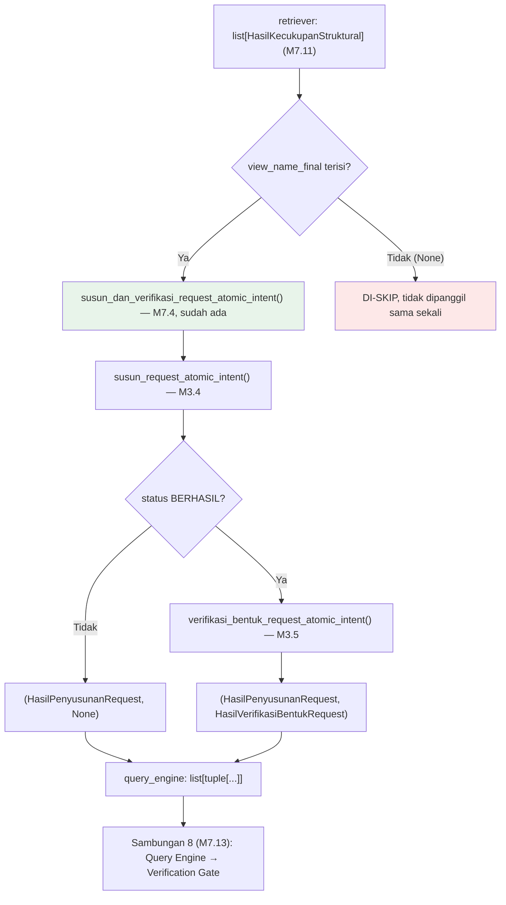

# Report — Milestone 7.12: Sambungan 7 (Retriever → Query Engine)

## Bagian 1 — Ringkasan Hasil

**Status akhir:** Selesai sesuai rencana.

M7.12 menyambungkan output Retriever (M3.1-3.3, `view_name_final` per atomic intent — tersambung M7.11) ke Query Engine (M3.4-3.5, sudah tersambung internal penuh sejak M7.4 lewat `susun_dan_verifikasi_request_atomic_intent()`). Berbeda dari M7.11, riset plan mengonfirmasi TIDAK ADA gap wiring tersembunyi di antara kedua layer ini — Query Engine sudah terbukti bekerja nyata (real LLM, audit M7.1) sejak M7.4. Satu-satunya yang genuinely hilang: layer Query Engine tidak py fungsi batch level-list untuk gabungan Langkah 1 (Susun Request) + Langkah 2 (Verifikasi Bentuk Request) — hanya versi per-atomic-intent. Fungsi baru `susun_dan_verifikasi_request_semua()` dibangun mirror pola `proses_retrieval_semua()` (M7.11), ditempatkan di `src/layers/query_engine/query_engine.py` sesuai preseden layer package sendiri.

Hasil akhir: `proses_turn()` sekarang menjalankan `susun_dan_verifikasi_request_semua(retriever_result)` sekuensial setelah Retriever selesai. Item dengan `view_name_final=None` (Retriever tidak menemukan view cukup) di-skip secara internal oleh fungsi baru ini — forced by signature `susun_request_atomic_intent(view_name: str)` non-Optional (bukan pilihan gaya, beda prinsip dari filtering M7.11). `KeadaanTurn` bertambah field `query_engine: list[tuple[HasilPenyusunanRequest, HasilVerifikasiBentukRequest | None]]` (bentuk tuple M7.4 dipertahankan apa adanya, tanpa skema baru — dikonfirmasi user setelah tidak ditemukan blocker teknis), melengkapi 11 field total. Dibuktikan nyata: 3 kejadian real-execution (LLM + Jaeger), seluruhnya membuktikan `view_name` yang dikirim Query Engine PERSIS SAMA dengan `view_name_final` hasil Retriever (5 dari 5 atomic intent yang diteruskan), dan mekanisme skip terbukti bekerja untuk item tanpa view yang cukup.

## Bagian 2 — Kriteria Keberhasilan vs Bukti Nyata

| Kriteria (dari dokumen sumber) | Bukti Aktual | Terpenuhi? |
|---|---|---|
| "View hasil Retriever untuk suatu kebutuhan mengalir ke Query Engine dan menghasilkan request dengan `view_name` yang persis sama — dibuktikan lewat span yang menunjukkan kepatuhan sumber ini terjadi dari data nyata, bukan dicocokkan manual." (`rancangan-orkestrasi-api.md`, M7.12) | E01 (real LLM+Jaeger, `trace_id=0463a322...`): 3 atomic intent, SEMUA `view_name_final=v_reservation_gop_impact_monthly` (replikasi skenario `gop_margin` M2.1/M7.3), `request.view_name` yang benar-benar dikirim Query Engine PERSIS SAMA untuk KETIGANYA — dikonfirmasi inspeksi return value Python DAN 6 span `chat` (M3.4+M3.5) di Jaeger. E03 (`trace_id=ae70c85c...`): bukti kedua independen, domain `hr`. Lihat `evals/7.12-.../audit.md`. | **Ya, penuh — dibuktikan 4 KALI independen (3× E01 + 1× E03)** |

Verifikasi tambahan (ketahanan mekanisme, konsekuensi forced dari signature — bukan KK sumber literal tapi bagian genuinely dari scope M7.12): E02 (`role_title="F&B Staff"`, domain `financial` ditolak seluruhnya) — atomic intent dengan `view_name_final=None` TIDAK PERNAH mencapai Query Engine (`diteruskan_ke_query_engine=False`, 0 span `chat` tambahan untuk intent ini), `proses_turn()` selesai normal tanpa exception.

## Bagian 3 — Cara Kerja dan Arsitektur

### Cara Kerja

`proses_turn()` (`src/orchestration/turn_pipeline.py`) menjalankan satu langkah baru setelah Retriever (M7.11): `susun_dan_verifikasi_request_semua(retriever_result)` — fungsi BARU di `src/layers/query_engine/query_engine.py`, yang untuk tiap `HasilKecukupanStruktural`:

1. **Filter** — hanya proses item dengan `view_name_final is not None`. Item lain di-skip TANPA memanggil Query Engine sama sekali (forced by signature `susun_request_atomic_intent(view_name: str)`, non-Optional — beda prinsip dari M7.11 yang sengaja TIDAK memfilter karena Retriever terbukti aman menerima input kosong; di sini Query Engine TIDAK aman menerima `None`).
2. **Panggil** `susun_dan_verifikasi_request_atomic_intent(atomic_intent, view_name_final)` (M7.4, sudah ada) untuk tiap item yang lolos filter — `view_name`/`view_name_tervalidasi_retriever` sama-sama diisi dari `view_name_final` yang SAMA, memenuhi KK M7.12 by construction (bukan kebetulan cocok).
3. Fungsi M7.4 ini sendiri menjalankan Langkah 1 (Susun Request, M3.4, 1 LLM call) → Langkah 2 (Verifikasi Bentuk Request, M3.5, pre-check deterministik + 1 LLM call kondisional), short-circuit kalau Langkah 1 gagal total.
4. Span pembungkus baru `query_engine.susun_dan_verifikasi_request_semua` dibuka dengan atribut `intent.count` (jumlah SEBELUM filter) — mirror pola 5-6x preseden `_semua()` di seluruh project, termasuk `verifikasi_bentuk_request_semua()` yang sudah ada di folder yang sama.

### Diagram Arsitektur

*(Hijau = wiring ke fungsi existing M7.4; merah = jalur skip baru M7.12, forced by signature.)*

### Integrasi dengan Komponen Lain

M7.13 (Sambungan 8: Query Engine → Verification Gate) akan mengonsumsi `KeadaanTurn.query_engine` (bentuk tuple, dipertahankan dari M7.4) — dokumen sumber secara eksplisit merujuk "Request final hasil Query Engine (Sambungan 7)" sebagai bahan uji M7.13, TIDAK ada catatan asumsi keliru seperti pola M7.11↔M7.13 (M2.3) — M7.13 bisa langsung mulai tanpa audit ulang gap wiring. Bentuk tuple `query_engine` sudah dievaluasi TIDAK menyulitkan pada titik konsumsi pertamanya (M7.12 sendiri) — kalau M7.13 nanti menemukan hal berbeda, itu jadi data point kedua untuk `docs/keputusan-tertunda.md`.

## Bagian 4 — Perubahan dari Plan

Tidak ada penyimpangan pada STRUKTUR checkpoint (8 checkpoint dikerjakan persis sesuai rencana, masing-masing diverifikasi+commit sebelum lanjut). Satu insiden OPERASIONAL (bukan penyimpangan rencana) tercatat di Checkpoint 6:

1. **Percobaan eksekusi eval PERTAMA mengalami hang ~24.7 menit** — terdeteksi lewat laporan langsung user (observasi dashboard OpenRouter: tidak ada request baru selama 11 menit) dan dikonfirmasi via query Jaeger API langsung terhadap trace yang sedang berjalan (gap antar-span melebihi jauh batas aman `timeout=90s, max_retries=1` yang sudah dikonfigurasi project, `docs/keterbatasan-diterima.md` #7). Proses dihentikan paksa dan dijalankan ulang — tidak ada payload yang sempat tersimpan sebelumnya (aman untuk restart bersih). Eksekusi kedua dipantau aktif via Jaeger (bukan menunggu buta) dan selesai normal ~15 menit kemudian, 3/3 kejadian lolos. Lihat `logs.md` Checkpoint 6 dan `evals/7.12-.../audit.md` "Temuan Metodologi" untuk detail lengkap.

Penyimpangan HASIL (bukan rencana) yang tercatat transparan di `audit.md`: E01 Decomposition menghasilkan 3 atomic_intent yang KETIGANYA bermuara ke `view_name_final` yang sama (`v_reservation_gop_impact_monthly`) — komposisi berbeda dari run M7.11 asli (campuran, hanya 1 dari 3). Non-determinisme dikenal (`docs/keterbatasan-diterima.md` #3), tidak memengaruhi verdict KK (memperkuatnya lewat 3x replikasi independen).

## Bagian 5 — Keterbatasan dan Item Provisional

- **Insiden hang eksekusi LLM (~24.7 menit, percobaan pertama Checkpoint 6) melampaui klaim mitigasi `docs/keterbatasan-diterima.md` #7** ("~180s terburuk per panggilan") secara signifikan — indikasi bahwa timeout `get_openrouter_client()` tidak selalu efektif mencegah hang total (kemungkinan hang terjadi di titik yang tidak tercakup parameter `timeout` client, mis. saat koneksi awal belum terbentuk). Dicatat sebagai temuan baru, BELUM dipindahkan ke `docs/keterbatasan-diterima.md` di checkpoint ini (M7.12 murni menemukan+mencatat, bukan menutup entri project-wide itu) — direkomendasikan sebagai follow-up (lihat Bagian 6).
- **Bentuk field `query_engine` (tuple, bukan skema bernama) baru dievaluasi PADA SATU titik konsumsi (M7.12 sendiri)** — keputusan mempertahankan bentuk M7.4 terbukti tidak menyulitkan DI SINI, tapi `docs/keputusan-tertunda.md`-style caveat M7.4 sendiri tetap berlaku: kalau M7.13 (konsumen berikutnya) menemukan kesulitan berbeda, itu data point independen kedua yang layak dipertimbangkan ulang.

## Bagian 6 — Follow-up

- **Rekomendasi tinjau ulang `docs/keterbatasan-diterima.md` #7** — tambahkan data point insiden hang M7.12 (~24.7 menit, jauh melampaui klaim "~180s terburuk") sebagai bukti bahwa mitigasi timeout saat ini belum genuinely menutup seluruh mode kegagalan hang. Tidak mendesak (tidak memblokir milestone manapun — retry manual tetap berhasil), tapi layak dicatat formal supaya sesi kerja mendatang yang mengalami hang serupa tidak menganggapnya kejadian baru.
- M7.13 (Sambungan 8: Query Engine → Verification Gate) adalah milestone Level 2 berikutnya (wajib berurutan) — akan mengonsumsi `KeadaanTurn.query_engine` sebagai input, plus constraint cakupan-individu (`KeadaanTurn.cakupan_individu`, M7.11) untuk dicek konsisten di Verification Gate.
