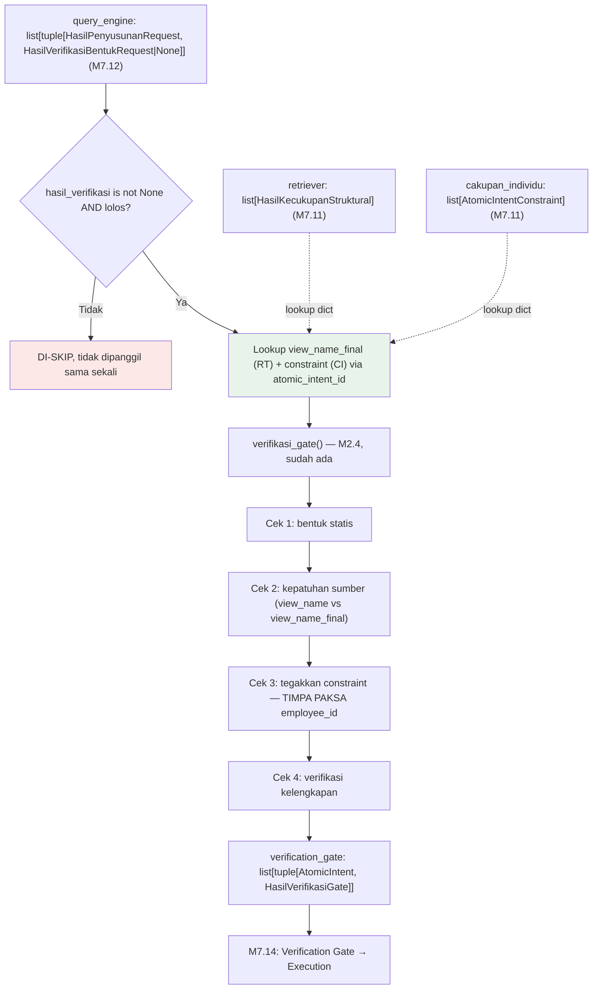

# Report — Milestone 7.13: Sambungan 8 (Query Engine → Verification Gate)

## Bagian 1 — Ringkasan Hasil

**Status akhir:** Selesai sesuai rencana.

M7.13 menyambungkan request final hasil Query Engine (M3.4-3.5, tersambung M7.12) ke Verification Gate (M2.4, sudah matang penuh sejak awal proyek — 4 pemeriksaan berlapis, murni deterministik, dikonfirmasi real DB fixture oleh audit M7.1). Berbeda dari M7.11, tidak ada gap wiring tersembunyi (Verification Gate sudah punya caller nyata lain, `_revisi_request()` M4.2) — tapi seperti M7.11/M7.12, layer ini belum py fungsi batch level-list. Kerumitan genuinely baru di M7.13 (beda dari 7 Sambungan sebelumnya): `verifikasi_gate()` butuh **fan-in TIGA sumber** (`query_engine_result`, `retriever_result`, `cakupan_individu_result`), bukan satu list linear dari langkah tepat sebelumnya, dan `HasilVerifikasiGate` adalah satu-satunya skema hasil layer di seluruh project yang TIDAK membawa field `atomic_intent`-nya sendiri.

Fungsi baru `verifikasi_gate_semua()` dibangun di `src/layers/verification_gate/verifikasi_gate.py` — membangun lookup dict `retriever_by_id`/`constraint_by_id` (key `atomic_intent_id`) untuk mencocokkan ketiga sumber secara aman (bukan asumsi sejajar by index), mengembalikan `list[tuple[AtomicIntent, HasilVerifikasiGate]]` untuk mengembalikan asosiasi identitas yang hilang dari skema aslinya. Item dengan `hasil_verifikasi is None` (forced by ketiadaan data) ATAU `lolos=False` (keputusan desain sadar, mencegah request yang ditandai M3.5 "tidak cukup" diam-diam lolos ke Execution) di-skip sebelum mencapai Verification Gate. `KeadaanTurn` bertambah field TERAKHIR `verification_gate`, melengkapi 12 field total.

Dibuktikan nyata: 3 kejadian real-execution (LLM + Jaeger), seluruh 5 item yang mencapai Verification Gate (E01×1, E02×3, E03×1) menunjukkan koreksi paksa `employee_id` yang benar — dikonfirmasi lewat inspeksi langsung return value Python DAN span `verification_gate.check` (`verification.terkoreksi`) di Jaeger, constraint yang dipakai genuinely berasal dari Domain Gate (M7.11) run yang sama, bukan dicatat manual.

## Bagian 2 — Kriteria Keberhasilan vs Bukti Nyata

| Kriteria (dari dokumen sumber) | Bukti Aktual | Terpenuhi? |
|---|---|---|
| "Skenario uji constraint cakupan-individu (staff menanyakan performa staf lain) yang mengalir dari Domain Gate asli sampai Verification Gate menghasilkan koreksi paksa yang benar, dibuktikan constraint yang dicek benar-benar berasal dari Domain Gate sungguhan di alur ini, bukan dicatat manual." (`rancangan-orkestrasi-api.md`, M7.13) | E01 (real LLM+Jaeger, `trace_id=cdec6444...`, HR Staff "review kinerja Budi"): `constraint.terdeteksi=True` dari `cakupan_individu_result` run ini, `verifikasi_gate_semua()` menimpa paksa `request_final.params["employee_id"]` dari TIDAK ADA menjadi `"emp-eval"` (persis `payload.employee_id`), `terkoreksi=True`. E03 (`trace_id=f49d161a...`, Maintenance Staff "tiket teknisi Andi", domain `facility`): bukti kedua independen, hasil identik. Lihat `evals/7.13-.../audit.md`. | **Ya, penuh — dibuktikan 2× independen (E01+E03), domain berbeda, role berbeda** |

Verifikasi tambahan (kontrol negatif, bagian genuinely dari scope M7.13 tapi bukan KK literal): E02 (Front Office Staff, gop_margin, `constraint.terdeteksi=False` untuk seluruh 3 item yang mencapai Verification Gate) — `terkoreksi=False` di ketiganya, `request_final.params` TIDAK berubah dari request Query Engine asli, membuktikan Verification Gate tidak melakukan koreksi kalau constraint genuinely tidak terdeteksi (bukan sekadar tidak pernah dicek).

## Bagian 3 — Cara Kerja dan Arsitektur

### Cara Kerja

`proses_turn()` (`src/orchestration/turn_pipeline.py`) menjalankan satu langkah baru setelah Query Engine (M7.12): `verifikasi_gate_semua(query_engine_result, retriever_result, cakupan_individu_result, payload.employee_id)` — fungsi BARU di `src/layers/verification_gate/verifikasi_gate.py`:

1. **Bangun lookup dict** `retriever_by_id`/`constraint_by_id` (key: `atomic_intent_id`) dari `retriever_result`/`cakupan_individu_result` — ketiga list bisa py panjang berbeda per konstruksi pipeline (Keputusan 7), pencocokan by-index akan salah begitu ada divergensi.
2. **Filter** `query_engine_result` ke item `hasil_verifikasi is not None and hasil_verifikasi.lolos` — dua kondisi berbeda sumber paksaan (Keputusan 2+4): `None` forced by ketiadaan `request`; `lolos=False` murni keputusan desain mencegah request "tidak cukup" lolos diam-diam.
3. Untuk tiap item lolos filter: lookup `view_name_final` dari `retriever_by_id` (SUMBER INDEPENDEN, bukan `request.view_name` milik Query Engine sendiri — Keputusan 5, mencegah Cek 2 M2.4 jadi tautologi) dan `constraint` dari `constraint_by_id.constraint` (ekstrak dari wrapper `AtomicIntentConstraint` — Keputusan 6), panggil `verifikasi_gate(request, constraint, employee_id, view_name_final)` (M2.4, sudah ada — Cek 1 bentuk statis → Cek 2 kepatuhan sumber → Cek 3 tegakkan constraint (TIMPA PAKSA `params["employee_id"]` kalau `constraint.terdeteksi=True` dan belum sesuai) → Cek 4 verifikasi kelengkapan).
4. Span pembungkus baru `verification_gate.verifikasi_gate_semua` dibuka dengan atribut `intent.count` (jumlah SEBELUM filter) — mirror pola 6-7x preseden `_semua()` di seluruh project.
5. Hasil: `list[tuple[AtomicIntent, HasilVerifikasiGate]]` — tuple mengembalikan asosiasi identitas yang hilang dari `HasilVerifikasiGate` (satu-satunya skema hasil layer tanpa field `atomic_intent`).

### Diagram Arsitektur

*(Hijau = fan-in 3 sumber, kerumitan genuinely baru M7.13; merah = jalur skip, dua sumber paksaan berbeda.)*

### Integrasi dengan Komponen Lain

M7.14 (Sambungan 9: Verification Gate → Execution) akan mengonsumsi `KeadaanTurn.verification_gate` — dokumen sumber secara eksplisit mengasumsikan "request yang lolos Verification Gate" sebagai inputnya, konsisten bentuk tuple yang sudah disiapkan di sini. `_revisi_request()` (M4.2, jalur revisi `400`) SENGAJA TIDAK direfactor memakai `verifikasi_gate_semua()` ini — tetap dipakai apa adanya (mirror preseden M7.4/M7.12 soal fungsi caller existing, di luar Lingkup M7.13).

## Bagian 4 — Perubahan dari Plan

Tidak ada penyimpangan pada STRUKTUR checkpoint (8 checkpoint dikerjakan persis sesuai rencana, masing-masing diverifikasi+commit sebelum lanjut). Dua catatan operasional (bukan penyimpangan rencana):

1. **Regresi Checkpoint 6 percobaan pertama gagal exit code 4** (sebelum eksekusi eval dimulai) — dicurigai artefak transisi foreground→background tool (output terpotong tanpa pesan error), BUKAN bug M7.13. Percobaan kedua lolos penuh 493/493 test dalam 300.95s.
2. **Docker stack observability (Jaeger+Collector+Prometheus) TIDAK `up` di awal sesi** (beda dari asumsi M7.11/M7.12 yang mewarisi stack sudah jalan) — `docker compose up -d` dijalankan eksplisit sebelum Checkpoint 6, dikonfirmasi Jaeger API 200 sebelum eksekusi eval.

Penyimpangan HASIL (bukan rencana) yang tercatat transparan di `audit.md`: E02 (baseline) menghasilkan 5 atomic intent dari Decomposition (bukan 3 seperti run M7.11/M7.12 asli), dan SEMUA 3 yang mencapai Query Engine `lolos=True` (bukan 1/3 seperti M7.12 E01) — non-determinisme dikenal (`docs/keterbatasan-diterima.md` #3), tidak memengaruhi verdict KK (E02 murni kontrol negatif pelengkap, bukan sumber utama bukti — E01+E03 yang utama sesuai Kriteria Keberhasilan plan).

## Bagian 5 — Keterbatasan dan Item Provisional

- **Tidak ada insiden hang eksekusi LLM di M7.13** — berbeda dari M7.12 (~24.7 menit, percobaan pertama), eksekusi lancar percobaan pertama (~30 menit total 3 kejadian termasuk waktu antar-kejadian). Tidak ada data point baru untuk `docs/keterbatasan-diterima.md` #7 dari milestone ini.
- **Bentuk return `list[tuple[AtomicIntent, HasilVerifikasiGate]]` baru dievaluasi PADA SATU titik konsumsi (M7.13 sendiri)** — konsisten preferensi user M7.12, tidak menyulitkan DI SINI. Kalau M7.14 (konsumen berikutnya) menemukan kesulitan berbeda, itu data point independen ketiga (setelah M7.12, M7.13) yang layak dipertimbangkan ulang untuk `docs/keputusan-tertunda.md`.

## Bagian 6 — Follow-up

- M7.14 (Sambungan 9: Verification Gate → Execution) adalah milestone Level 2 berikutnya (wajib berurutan) — akan mengonsumsi `KeadaanTurn.verification_gate` sebagai input untuk Execution (M4.1-4.2), plus kemungkinan perlu menangani item yang di-skip M7.13 (`lolos=False`/`hasil_verifikasi=None`) sebagai kegagalan yang harus dilaporkan jujur ke user (bukan diam-diam hilang), konsisten prinsip "Kejujuran terhadap keterbatasan" `CLAUDE.md`.
- **8/11 Sambungan Level 2 selesai** setelah M7.13 — sisa M7.14 (Verification Gate → Execution), M7.15, M7.16 sebelum Endpoint API (M7.17) dan Database Percakapan (M7.18).
