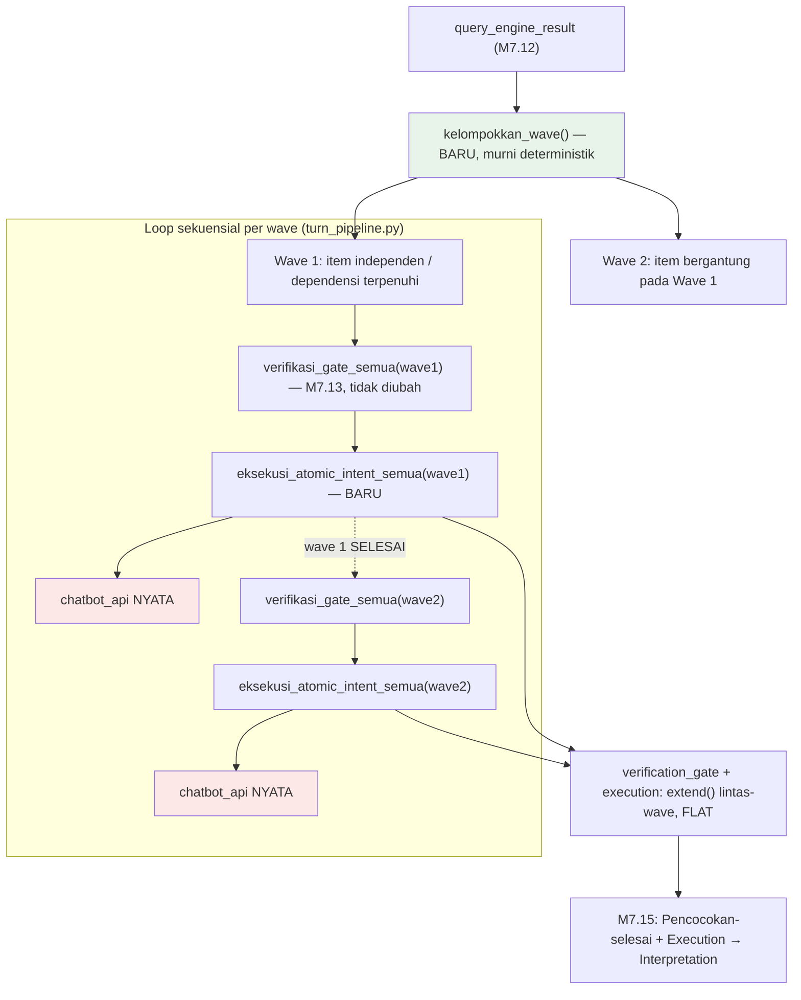

# Report — Milestone 7.14: Sambungan 9 (Verification Gate → Execution, termasuk uji wave berulang)

## Bagian 1 — Ringkasan Hasil

**Status akhir:** Selesai sesuai rencana.

M7.14 menyambungkan request yang lolos Verification Gate (M7.13) ke Execution (M4.1-4.2), sekaligus membangun mekanisme **wave** — pengelompokan atomic intent berdasar dependensi (`relasi`/`bergantung_pada`, M1.6) yang sebelumnya genuinely tidak ada satu baris kode pun di project. Berbeda dari M7.6-7.13 (seluruhnya murni aditif — menambah langkah baru di akhir pipeline), M7.14 adalah **milestone pertama yang menata ulang cara memanggil fungsi milestone sebelumnya**: `verifikasi_gate_semua()` (M7.13) yang tadinya dipanggil sekali borongan untuk seluruh atomic intent, sekarang dipanggil PER WAVE dari loop baru di `turn_pipeline.py`, diselang-seling `eksekusi_atomic_intent_semua()` (baru).

Desain wave dikonfirmasi user setelah diskusi konkret: **wave murni soal urutan eksekusi, TANPA data hasil wave 1 di-inject ke wave 2** — didukung bukti empiris dari seluruh skenario "bergantung" M7.9-7.13 yang selalu menghasilkan request Query Engine self-sufficient (rentang tanggal lebar, bukan butuh angka hasil sebelumnya). Konsekuensinya, `susun_request_atomic_intent()` (M3.4) TIDAK disentuh sama sekali — murni wiring, konsisten batasan PIC 7.

M7.14 juga menutup prasyarat eksternal wajib: `docs/keterbatasan-diterima.md` #13 (Execution belum pernah dibuktikan panggilan nyata ke `chatbot_api`) — investigasi menemukan koreksi penting: folder lokal yang benar adalah `nirwana-database/scripts/chatbot_api/` (BUKAN `nirwana-database/api/` seperti arahan awal, folder itu proyek terpisah tanpa route `/chatbot/...`). Setelah dijalankan, entri #13 DIVERIFIKASI dengan 3 panggilan nyata langsung (Checkpoint 1) dan dilengkapi eksekusi pipeline penuh (Checkpoint 7) — untuk PERTAMA KALINYA `proses_turn()` genuinely memanggil `chatbot_api` sungguhan.

Dibuktikan nyata: 3 kejadian real-execution (LLM + `chatbot_api` + Jaeger), E01 (skenario `gop_margin` majemuk-bergantung) menghasilkan **2 wave genuinely berurutan** — dikonfirmasi timestamp span `orchestration.wave` nyata (gap 96 mikrodetik antar-wave, nol overlap). E02/E03 mengalami insiden operasional (Domain Gate gagal_teknis percobaan pertama, retry berhasil) yang memberi bukti tambahan: mekanisme skip M7.13 bekerja benar di kondisi non-determinisme nyata (E02), dan bukti kedua independen reachability `chatbot_api` di domain berbeda (E03).

## Bagian 2 — Kriteria Keberhasilan vs Bukti Nyata

| Kriteria (dari dokumen sumber) | Bukti Aktual | Terpenuhi? |
|---|---|---|
| "Kebutuhan majemuk-bergantung (skenario 'bandingkan X dengan Y' yang butuh Y dulu) menghasilkan dua wave yang benar-benar berurutan lewat Verification Gate dan Execution yang sama, bukan dua panggilan independen yang hasilnya digabung manual di luar alur." (`rancangan-orkestrasi-api.md`, M7.14) | E01 (real LLM+chatbot_api+Jaeger, `trace_id=62e460e9...`): 3 atomic intent (2 independen + 1 bergantung pada keduanya) dikelompokkan `kelompokkan_wave()` jadi wave 1 (2 intent) + wave 2 (1 intent). Span `orchestration.wave` wave 2 mulai `start=1787133945483086`, PERSIS 96 mikrodetik setelah wave 1 berakhir (`end=1787133945482990`) — TANPA overlap. `verifikasi_gate_semua()`/`eksekusi_atomic_intent_semua()` (fungsi YANG SAMA) dipanggil ulang untuk kedua wave, bukan kode duplikat. Lihat `evals/7.14-.../audit.md`. | **Ya, penuh — dibuktikan lewat timestamp span nyata, non-overlap presisi mikrodetik** |

Verifikasi tambahan (prasyarat KHUSUS milestone ini, `docs/keterbatasan-diterima.md` #13): 3 panggilan manual nyata (Checkpoint 1: `panggil_chatbot_api()`, `panggil_meta_chatbot_api()` — pertama kali TEREKSEKUSI sama sekali, `eksekusi_atomic_intent()` — pertama kali dibuktikan nyata) DAN pipeline otomatis penuh (Checkpoint 7: E01 2 item + E03 1 item genuinely mencapai `chatbot_api` lewat `proses_turn()`) — entri #13 DIVERIFIKASI.

## Bagian 3 — Cara Kerja dan Arsitektur

### Cara Kerja

`proses_turn()` (`src/orchestration/turn_pipeline.py`) setelah `query_engine_result` final:

1. **`kelompokkan_wave(query_engine_result)`** (baru, `src/orchestration/wave.py`) — partisi topological berdasar `AtomicIntent.relasi`/`bergantung_pada`: wave 1 = independen (atau seluruh dependensinya sudah tidak ada di batch ini), wave N = `max(wave dependensi) + 1`. Dependensi hilang (tersaring layer sebelumnya) dianggap terpenuhi; siklus (seharusnya mustahil organik) ditangani fail-open ke wave terakhir. Beroperasi pada `query_engine_result` MENTAH (belum difilter `lolos`).
2. **Loop tiap wave** — buka span `orchestration.wave` (`wave.index`, `wave.intent_count`), panggil `verifikasi_gate_semua(wave, retriever_result, cakupan_individu_result, employee_id)` (M7.13, TIDAK diubah, hanya dipanggil per-wave sekarang) — filter internal `lolos=False`/`None` tetap berlaku PER WAVE. Hasilnya diteruskan ke `eksekusi_atomic_intent_semua(hasil_vg_wave, cakupan_individu_result, role_title, employee_id)` (baru, `src/layers/execution/klasifikasi_respons.py`) — loop memanggil `eksekusi_atomic_intent()` (M4.2, TIDAK diubah) per item lolos.
3. Hasil kedua fungsi di-`extend()` ke akumulator lintas-wave sebelum wave berikutnya diproses — memastikan wave N+1 secara STRUKTURAL tidak bisa mulai sebelum wave N selesai (loop `for` sekuensial murni, bukan `ThreadPoolExecutor`).
4. `KeadaanTurn.verification_gate`/`execution` tetap FLAT (bentuk/kontrak M7.13 tidak berubah), diisi dari gabungan seluruh wave.

### Diagram Arsitektur

*(Hijau = logic baru murni deterministik; merah = titik kontak nyata pertama dengan `chatbot_api`.)*

### Integrasi dengan Komponen Lain

M7.15 (titik pertemuan kedua: Pencocokan jalur "selesai" + Execution → Interpretation) akan mengonsumsi `KeadaanTurn.execution` (flat, `list[HasilEksekusiAtomicIntent]`) bersama `KeadaanTurn.matches` (item berstatus "selesai" dari Session Memory) sebagai dua sumber paket yang harus disatukan Interpretation (M4.4, sudah tersambung internal sejak M7.5) dengan skema identik terlepas sumbernya.

## Bagian 4 — Perubahan dari Plan

Tidak ada penyimpangan pada STRUKTUR checkpoint (9 checkpoint dikerjakan persis sesuai rencana). Catatan operasional (bukan penyimpangan rencana):

1. **Komputer restart di tengah Checkpoint 4** — proses `chatbot_api` (Checkpoint 1) dan Docker Desktop ikut mati. Tidak ada kerja/commit hilang (working tree utuh, dikonfirmasi `git status`). Keduanya dinyalakan ulang sebelum Checkpoint 6 ditutup.
2. **Domain Gate `gagal_teknis` pada percobaan pertama E02 DAN E03** (Checkpoint 7) — retry dengan `session_id` baru berhasil menembus keduanya. Payload percobaan pertama diarsipkan (`E0X_percobaan1_gagal_teknis.json`), tidak disembunyikan.
3. **Seluruh item yang mencapai Execution berakhir `GAGAL_TEKNIS` via jalur revisi 400** — temuan REAL pertama (jalur ini sebelumnya 100% simulasi mock), bukan bug M7.14 (dicatat sebagai follow-up Bagian 6).

## Bagian 5 — Keterbatasan dan Item Provisional

- **Jalur revisi 400 (M4.2) belum pernah menghasilkan `BERHASIL`/`SEBAGIAN` terhadap `chatbot_api` nyata** — SELURUH 3 item yang mencapai Execution di eval ini (E01×2, E03×1) berakhir `GAGAL_TEKNIS` (`revisi_exhausted`/`revisi_gagal_susun`). Kontrak I/O `eksekusi_atomic_intent()` tetap terverifikasi benar (klasifikasi status akurat, tidak crash, tidak silent-success) — tapi KUALITAS request hasil `susun_request_atomic_intent()` (M3.4) terhadap validasi server nyata belum terbukti memadai untuk view `v_reservation_gop_impact_monthly`/`v_maintenance_technician_daily`. DI LUAR cakupan M7.14 untuk diperbaiki (M7.14 hanya menyambungkan, tidak mengubah logic M3.4/M4.2).
- **Domain Gate mengalami `gagal_teknis` 2x berturut-turut (E02+E03 percobaan pertama)** — tidak cukup bukti untuk klaim bug sistemik (retry langsung berhasil), tapi pola ini belum pernah terjadi seberuntun ini di M7.6-7.13. Tidak ditambahkan sebagai entri `keterbatasan-diterima.md` baru (celah `try/except` sudah ada sejak M1.3/M7.6 perbaikan #14 — ini murni kegagalan LLM yang SUDAH ditangani fallback dengan benar, bukan celah baru).

## Bagian 6 — Follow-up

- **Rekomendasi investigasi jalur revisi 400 M4.2 terhadap `chatbot_api` nyata** — 3/3 percobaan real-execution M7.14 berakhir `GAGAL_TEKNIS`. Layak diselidiki apakah prompt `penyusunan_request.md` (M3.4) perlu diperkaya definisi/contoh parameter per-view, atau apakah validasi `chatbot_api` untuk view-view ini secara khusus lebih ketat dari asumsi test M4.2. Tidak mendesak (tidak memblokir M7.15/7.16 — Interpretation tetap bisa menerima hasil `GAGAL_TEKNIS` sebagai kegagalan jujur), tapi bernilai tinggi untuk kualitas jawaban produksi akhir.
- M7.15 (Sambungan 10: Pencocokan jalur "selesai" + Execution → Interpretation) adalah milestone Level 2 berikutnya (wajib berurutan) — titik pertemuan kedua project, akan mengonsumsi `KeadaanTurn.execution` bersama `KeadaanTurn.matches`.
- **9/11 Sambungan Level 2 selesai** setelah M7.14 — sisa M7.15, M7.16 sebelum Endpoint API (M7.17) dan Database Percakapan (M7.18).
