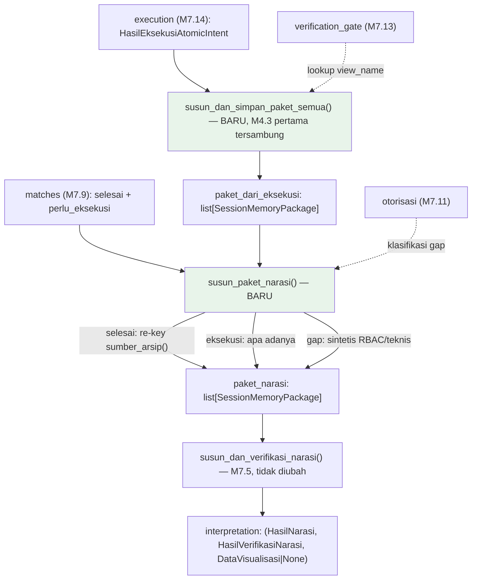

# Report — Milestone 7.15: Sambungan 10 ((Pencocokan jalur "selesai" + Execution) → Interpretation)

## Bagian 1 — Ringkasan Hasil

**Status akhir:** Selesai dengan satu item terverifikasi di tingkat unit/mekanisme, bukti live tertunda karena keterbatasan eksternal (lihat Bagian 5).

M7.15 menyambungkan DUA sumber paket ("selesai" dari Pencocokan M1.7/M7.9, dan hasil Execution M7.14) ke Interpretation (M4.4/4.5, tersambung internal sejak M7.5) — "titik pertemuan kedua" project. Riset plan menemukan DUA masalah tersembunyi yang harus diselesaikan lebih dulu: (1) bug identitas — paket "selesai" membawa `atomic_intent_id` turn asal, bukan turn ini, akan gagal dicocokkan Interpretation; (2) item yang tersaring di rantai M7.10-7.14 (ditolak Domain Gate/Otorisasi, atau gagal Retriever/Query Engine/Verification Gate) hilang total dari narasi kalau tidak ditangani, melanggar prinsip "Kejujuran terhadap keterbatasan".

Solusi untuk (1): `_sumber_arsip()` (M1.7, private) diekspos jadi publik `sumber_arsip()` (perilaku TIDAK berubah), dipakai membangun ulang paket "selesai" dengan identitas turn ini. Solusi untuk (2): klasifikasi 2 tingkat — RBAC (pesan spesifik "tidak memiliki akses") vs teknis generik ("kendala teknis") — dikonfirmasi user, DAN ditemukan `src/prompts/interpretation/narasi.md` (M4.4) SUDAH dirancang generik untuk kelima `StatusEksekusi` sejak awal, tidak perlu diubah sama sekali.

Fungsi baru: `susun_dan_simpan_paket_semua()` (M4.3, PERTAMA KALI tersambung orkestrator sejak M7.6) dan `susun_paket_narasi()` (penggabungan+klasifikasi gap). `KeadaanTurn` bertambah 2 field terakhir (`paket_narasi`, `interpretation`), 15 field total.

Dibuktikan nyata: **E02 (gap RBAC) LOLOS PENUH end-to-end** — Domain Gate asli → Otorisasi asli → klasifikasi RBAC benar → narasi menyampaikan keterbatasan akses secara eksplisit. **E01 (KK literal, campuran selesai+eksekusi) TIDAK berhasil dibuktikan LIVE setelah 4 percobaan nyata** — akar masalah ditemukan dan dibuktikan: seluruh database `chatbot_api` lokal permanen stale (>48 jam), menyebabkan SETIAP eksekusi nyata berstatus `SEBAGIAN` (bukan `BERHASIL`), dan `match_atomic_intents()` (M1.7) SECARA BENAR menolak paket `SEBAGIAN` sebagai kandidat "selesai" — ini adalah interaksi BENAR dari dua keputusan desain yang sudah ada sebelumnya (bukan bug M7.15), didokumentasikan formal sebagai `docs/keterbatasan-diterima.md` #15. Mekanisme re-keying+klasifikasi TETAP terverifikasi benar via 9 unit test deterministik yang tidak bergantung `chatbot_api` sama sekali.

## Bagian 2 — Kriteria Keberhasilan vs Bukti Nyata

| Kriteria (dari dokumen sumber) | Bukti Aktual | Terpenuhi? |
|---|---|---|
| "Turn dengan campuran atomic intent dari kedua sumber menghasilkan narasi yang menyebutkan dengan benar mana yang baru dihitung dan mana yang merujuk turn sebelumnya... dibuktikan dengan kedua sumber data yang benar-benar berasal dari alur sungguhan." (`rancangan-orkestrasi-api.md`, M7.15) | **Sebagian**: cabang "eksekusi baru" (fresh) TERBUKTI live berulang kali (E01 turn 1 ×4, E02, E03 — narasi selalu jujur menyebut status apa adanya). Cabang "merujuk turn sebelumnya" (selesai) TERBUKTI BENAR di tingkat unit deterministik (`tests/orchestration/test_paket_narasi.py`, 9/9, termasuk re-keying+`sumber_arsip()` transformasi) TAPI TIDAK berhasil direproduksi LIVE dalam 4 percobaan nyata — akar masalah: `chatbot_api` lokal permanen stale, mustahil menghasilkan `BERHASIL` di lingkungan kerja saat ini (`docs/keterbatasan-diterima.md` #15). | **Sebagian — mekanisme terverifikasi benar, bukti live cabang "selesai" tertunda karena keterbatasan eksternal** |

Verifikasi tambahan (klasifikasi gap, bagian genuinely dari scope M7.15 tapi bukan KK literal): E02 membuktikan gap RBAC end-to-end LENGKAP (Domain Gate asli → klasifikasi → narasi). E03 (bonus/opsional) tidak menghasilkan gap kali ini — kontrol negatif yang tetap membuktikan `GAGAL_TEKNIS` dari Execution (bukan gap) diproses normal.

## Bagian 3 — Cara Kerja dan Arsitektur

### Cara Kerja

`proses_turn()` (`src/orchestration/turn_pipeline.py`) setelah wave loop (M7.14) selesai:

1. **`susun_dan_simpan_paket_semua(execution_result, verification_gate_result, session_id, turn_index)`** (baru, `src/layers/execution/penyimpanan_paket.py`) — lookup `view_name` per item dari `verification_gate_result`, panggil `susun_dan_simpan_paket()` (M4.3, TIDAK diubah) per item Execution TERMASUK `GAGAL_TEKNIS` — PERTAMA KALI M4.3 genuinely tersambung orkestrator dan menulis Session Memory dari `proses_turn()`.
2. **`susun_paket_narasi(matches, paket_dari_eksekusi, otorisasi_result, session_id, turn_index)`** (baru, `src/orchestration/paket_narasi.py`) — untuk tiap `match`: (a) `status=selesai` → re-key paket lama pakai `sumber_arsip()` (M1.7, kini publik); (b) `status=perlu_eksekusi` yang ADA di `paket_dari_eksekusi` → dipakai apa adanya; (c) gap (tidak ada di manapun) → paket sintetis, klasifikasi RBAC (SELURUH `domain_decisions` ditolak) vs teknis generik.
3. **`susun_dan_verifikasi_narasi(atomic_intents, packages, session_id, turn_index)`** (M7.5, TIDAK diubah) — menyusun+memverifikasi narasi akhir dari gabungan seluruh paket.

### Diagram Arsitektur

*(Hijau = fungsi baru genuinely M7.15.)*

### Integrasi dengan Komponen Lain

M7.16 (Verifikasi Alur Penuh End-to-End, milestone Level 2 TERAKHIR) akan menjalankan `proses_turn()` sekali penuh dari Input Layer sampai Interpretation — perlu MEWASPADAI temuan `docs/keterbatasan-diterima.md` #15: kalau skenario e2e M7.16 juga mengasumsikan hasil `BERHASIL` dari eksekusi nyata, kemungkinan besar akan menemui `SEBAGIAN` yang sama (data `chatbot_api` lokal belum berubah) — bukan kegagalan M7.16, tapi perlu direncanakan sejak awal (mis. skenario e2e fokus ke jalur yang tidak butuh `BERHASIL` spesifik, atau mengulang setelah data direfresh).

## Bagian 4 — Perubahan dari Plan

Tidak ada penyimpangan pada STRUKTUR checkpoint (10 checkpoint dikerjakan sesuai rencana). Penyimpangan pada Checkpoint 8 dicatat transparan:

1. **4 percobaan E01, bukan 1 seperti rencana awal** — tiap percobaan mengungkap informasi genuinely baru (bukan retry membabi-buta): percobaan 2 gagal lebih awal di rantai; percobaan 3 (kombinasi terbukti bersih M7.14) AKHIRNYA mencapai Execution tapi `SEBAGIAN`, mengungkap staleness untuk pertama kali di konteks ini; percobaan 4 (domain berbeda total) menguji dan MENGONFIRMASI hipotesis staleness sistemik. Berhenti di percobaan 4 (bukan lanjut) karena akar masalah sudah genuinely dipahami — retry lebih lanjut tidak akan mengubah kesimpulan.
2. **2× restart komputer tak terduga** di tengah Checkpoint 8 — `chatbot_api`+Docker dinyalakan ulang tiap kali, tidak ada kerja/commit hilang.
3. **Entri baru `docs/keterbatasan-diterima.md` #15** ditambahkan — di luar rencana tertulis awal, tapi konsisten pola project (temuan signifikan didokumentasikan formal, bukan disembunyikan).

## Bagian 5 — Keterbatasan dan Item Provisional

- **`docs/keterbatasan-diterima.md` #15 (BARU)**: data `chatbot_api` lokal permanen stale (`last_refreshed_at≈2026-08-11`, dikonfirmasi identik lintas 2 domain berbeda total) — SETIAP eksekusi nyata di lingkungan kerja saat ini (2026-08-19+) PASTI `SEBAGIAN`, TIDAK PERNAH `BERHASIL`. Mencegah cabang "selesai dari BERHASIL" (KK literal M7.15) dibuktikan LIVE. Di luar kendali proyek ini (data tim database engineering) — pemicu peninjauan ulang: begitu data direfresh, ulangi skenario E01 2-turn.
- **Cabang "selesai" M7.15 hanya terverifikasi di tingkat unit/mekanisme** (`tests/orchestration/test_paket_narasi.py`, 9/9, deterministik) — BUKAN via `proses_turn()` end-to-end nyata. Kontrak I/O (`susun_paket_narasi()`, re-keying, klasifikasi) tetap terverifikasi benar; risiko yang TIDAK tertutup murni pada interaksi genuinely-live dengan seluruh rantai M1.5→M1.7→M7.15 sekaligus (belum pernah dibuktikan bersamaan dalam satu eksekusi nyata).

## Bagian 6 — Follow-up

- **Begitu data `chatbot_api` lokal direfresh tim database engineering** (atau `EXECUTION_DATA_STALENESS_THRESHOLD_JAM` dikalibrasi ulang, `docs/keputusan-tertunda.md` #3), ulangi eval E01 M7.15 (skrip `run_eval.py`/`retry_e01.py` sudah siap pakai) untuk menutup gap bukti live cabang "selesai".
- **M7.16 (Sambungan 11: Verifikasi Alur Penuh End-to-End)** — milestone Level 2 TERAKHIR, wajib mewaspadai `docs/keterbatasan-diterima.md` #15 saat merancang skenario (lihat Bagian 3 "Integrasi dengan Komponen Lain").
- **10/11 Sambungan Level 2 selesai** setelah M7.15 — HANYA M7.16 tersisa sebelum Endpoint API (M7.17) dan Database Percakapan (M7.18).
