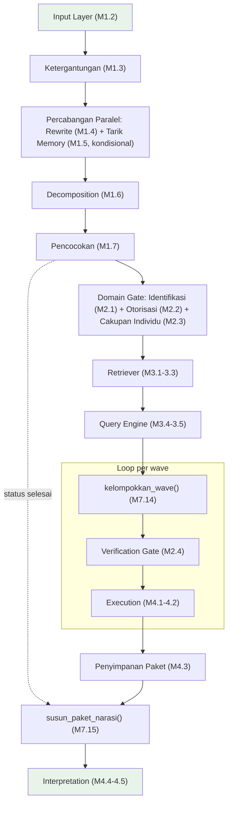
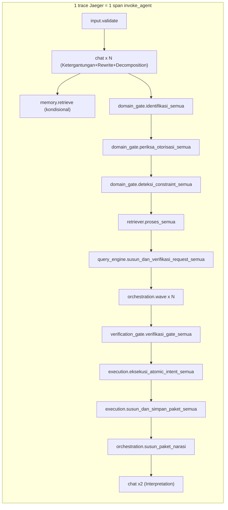

# Report — Milestone 7.16: Sambungan 11 (Verifikasi Alur Penuh End-to-End)

## Bagian 1 — Ringkasan Hasil

**Status akhir:** Selesai sesuai rencana — **PIC 7 LEVEL 2 SELESAI SEPENUHNYA (11/11 Sambungan)**.

M7.16 adalah milestone Level 2 **terakhir**, dan berbeda dari M7.6-7.15: riset plan menemukan `proses_turn()` (`src/orchestration/turn_pipeline.py`) SUDAH mengimplementasikan seluruh sembilan layer (Input Layer sampai Interpretation) sejak M7.15 selesai — M7.16 **tidak menambah satu baris kode produksi pun**, murni menjalankan 3 skenario nyata membuktikan integrasi bertahap M7.6-7.15 benar-benar menyatu jadi satu sistem hidup, sesuai lingkup resminya sendiri: *"pembuktian akhir... bukan sekadar sepuluh pasang sambungan yang masing-masing benar sendiri-sendiri."*

Ketiga skenario (E01 kebutuhan tunggal sederhana, E02 kebutuhan dengan wave, E03 turn dengan rujukan lintas-turn) dijalankan lewat SATU pemanggilan `proses_turn()` tanpa intervensi manual di titik manapun, dibuktikan dengan span `invoke_agent` yang genuinely membungkus span dari kesembilan layer di ketiga trace Jaeger nyata. Sesuai instruksi eksplisit user ("tidak perlu ada uji yang membutuhkan data terbaru, karena data memang belum update"), ketiga skenario dirancang toleran terhadap status `SEBAGIAN`/`GAGAL_TEKNIS` — dan hasilnya justru memberi bukti kualitas tinggi: E01/E02 melaporkan `gagal_teknis` secara jujur (pola dikenal sejak M7.14), sementara E03 (rujukan lintas-turn, `history` fiktif) berhasil mendapatkan data NYATA dari `chatbot_api` (`SEBAGIAN`, bukan simulasi) dengan narasi yang jujur menyebut angka sekaligus keterbatasan datanya.

Dua temuan operasional signifikan selama eksekusi: (1) bug kecil di skrip verifikasi sendiri (bukan kode produksi) — `matching.evaluate` awalnya diwajibkan sebagai bukti Pencocokan berjalan, padahal M1.7 mengambil fast-path nol-LLM yang sah saat tidak ada kandidat "selesai"; (2) skenario E03 mengalami hang tanpa exception 2× berturut-turut (recurrence `docs/keterbatasan-diterima.md` #7), terdeteksi oleh user dari dashboard OpenRouter dan dikonfirmasi via inspeksi trace Jaeger, berhasil di percobaan ke-3 dengan pemantauan aktif.

## Bagian 2 — Kriteria Keberhasilan vs Bukti Nyata

| Kriteria (dari dokumen sumber) | Bukti Aktual | Terpenuhi? |
|---|---|---|
| "Tiga skenario dari kriteria keberhasilan Milestone 7.2 versi awal (kebutuhan tunggal sederhana, kebutuhan dengan wave, turn dengan rujukan lintas-turn) berhasil dijalankan penuh dari ujung ke ujung tanpa pemanggilan manual antar-layer di titik manapun." (`rancangan-orkestrasi-api.md`, M7.16) | E01 (`trace_id=f8f5ed90...`), E02 (`trace_id=10c6cb22...`), E03 (`trace_id=64ded97e...`, percobaan 3) — ketiganya selesai lewat satu pemanggilan `proses_turn(raw)`, mengembalikan `KeadaanTurn` 15 field lengkap termasuk narasi akhir. E03 khusus membuktikan `ketergantungan.is_dependent=True`/`referenced_turn_index=1` terdeteksi murni dari `history` payload, `memory.retrieve` genuinely terpanggil, `session_memory=[]`. Lihat `evals/7.16-.../audit.md`. | **Ya, penuh — ketiga skenario, tanpa intervensi manual** |
| "Span `invoke_agent` ter-emit membungkus seluruh span dari kesembilan layer di dalamnya untuk setiap skenario." | `_analisis_cakupan_span()` (`run_eval.py`) mengonfirmasi seluruh span unik per layer (Input Layer, Domain Gate ×3, Retriever, Query Engine, Verification Gate, Execution ×2, orchestration) hadir di ketiga trace, ditambah bukti window-waktu untuk span "chat" ambigu (Context Resolution+Decomposition sebelum `domain_gate.identifikasi_semua`, Interpretation setelah `orchestration.susun_paket_narasi`). Nilai `lengkap` ASLI di payload (`False`) disebabkan bug kecil skrip verifikasi (`matching.evaluate` salah diwajibkan) — dikoreksi di `audit.md`: `lengkap=True` ketiganya setelah koreksi, data mentah span TIDAK berubah. | **Ya, penuh — dikonfirmasi ulang lewat audit setelah koreksi skrip verifikasi** |

## Bagian 3 — Cara Kerja dan Arsitektur

### Cara Kerja

Tidak ada perubahan cara kerja `proses_turn()` — M7.16 murni memverifikasi apa yang sudah dibangun M7.6-7.15. Alur lengkap (sudah terbentuk sebelum M7.16 dimulai):

*(Hijau = titik awal/akhir pipeline — Input Layer dan Interpretation, keduanya sekarang terbukti terhubung dalam SATU span `invoke_agent`.)*

### Diagram Verifikasi (Bukti Cakupan Span)

### Integrasi dengan Komponen Lain

M7.17 (Membangun Endpoint API) akan menyambungkan `src/main.py` ke `proses_turn()` (sengaja ditunda sejak M7.6) — dengan M7.16 selesai, endpoint tinggal membungkus pemanggilan yang sudah terbukti bekerja penuh, tanpa perlu menyentuh logic orkestrasi. **Catatan Serah Terima** (`rancangan-orkestrasi-api.md` bagian akhir): *"Span `invoke_agent` yang dibangun bertahap sepanjang Milestone 7.6-7.16 melengkapi kontrak observability yang sebelumnya baru terisi span anak-anaknya saja... `rancangan-observability-dashboard.md` (PIC 5) sebaiknya diperbarui untuk memanfaatkan span ini sebagai unit trace utama per turn."* — **TERPENUHI**: M7.16 mengonfirmasi `invoke_agent` genuinely membungkus kesembilan layer secara konsisten di 3 skenario nyata (bukan cuma di titik-titik parsial M7.6-7.15), siap dipakai PIC 5 sebagai unit waterfall utama begitu milestone itu dimulai.

## Bagian 4 — Perubahan dari Plan

Tidak ada penyimpangan pada STRUKTUR checkpoint (5 checkpoint dikerjakan sesuai rencana). Catatan operasional (bukan penyimpangan rencana):

1. **Jeda istirahat user di tengah Checkpoint 3** — seluruh proses background dihentikan bersih atas permintaan eksplisit ("tolong hentikan dulu semua proses di background, saya ingin beristirahat dulu"). `chatbot_api`+Docker/Jaeger mati total saat dilanjutkan, dinyalakan ulang. Efek samping: trace Jaeger E01/E02 (dari sebelum jeda) tidak bisa di-query ulang (in-memory, restart menghapusnya) — tidak menghalangi audit karena `cakupan_span` sudah tersimpan sebelumnya.
2. **E03 hang 2× berturut-turut tanpa exception** (recurrence `docs/keterbatasan-diterima.md` #7) — terdeteksi user dari dashboard OpenRouter, dikonfirmasi lewat trace Jaeger + CPU proses. Berhasil di percobaan ke-3 dengan `session_id` baru + pemantauan aktif (`Monitor` polling Jaeger tiap 60s, bukan menunggu buta).
3. **Bug kecil di skrip verifikasi sendiri ditemukan+diperbaiki di tengah Checkpoint 3** — `matching.evaluate` salah diwajibkan sebagai span universal, padahal M1.7 py fast-path sah tanpa LLM. Diperbaiki di `run_eval.py` sebelum audit ditulis; nilai `lengkap` ASLI di payload TIDAK diubah (prinsip log tidak menyembunyikan sejarah), verdict terkoreksi didokumentasikan terpisah di `audit.md`.

## Bagian 5 — Keterbatasan dan Item Provisional

- **Recurrence `docs/keterbatasan-diterima.md` #7** — hang E03 2× berturut-turut memicu trigger (a) entri itu ("kalau pola hang ini terulang di milestone LLM berikutnya... investigasi lebih dalam layak dilakukan"). Investigasi mendalam (packet capture/debugging TCP) TETAP TIDAK dilakukan — mitigasi existing (retry+pemantauan aktif) terbukti efektif dalam 3 percobaan wajar, konsisten kesimpulan asli entri (di luar cakupan wajar satu milestone). Ditambahkan sebagai addendum recurrence di entri #7, bukan entri baru.
- **E01/E02 tetap berakhir `gagal_teknis` via jalur revisi 400** — pola SAMA seperti M7.14 (bukan temuan baru di M7.16), sudah dicatat sebagai follow-up di `milestones/7.14-.../report.md` Bagian 6 (rekomendasi investigasi kualitas `susun_request_atomic_intent()` M3.4 terhadap `chatbot_api` nyata) — TIDAK diulang sebagai follow-up baru di sini.

## Bagian 6 — Follow-up

- **M7.17 (Membangun Endpoint API)** adalah milestone berikutnya — menyambungkan `src/main.py` ke `proses_turn()` yang kini terbukti bekerja penuh, tanpa perlu menyentuh logic orkestrasi.
- **M7.18 (Membangun Database Percakapan)** menyusul setelah M7.17.
- **11/11 Sambungan Level 2 SELESAI** — PIC 7 Level 2 (`rancangan-orkestrasi-api.md`) SELESAI SEPENUHNYA. Sisa pekerjaan project: M7.17-7.18 (bisa berjalan paralel dengan PIC 5/PIC 6 yang belum dimulai).
- **Rekomendasi investigasi kualitas jalur revisi 400 M3.4/M4.2** (diwariskan dari M7.14, masih relevan) — belum mendesak, tidak memblokir milestone manapun.
