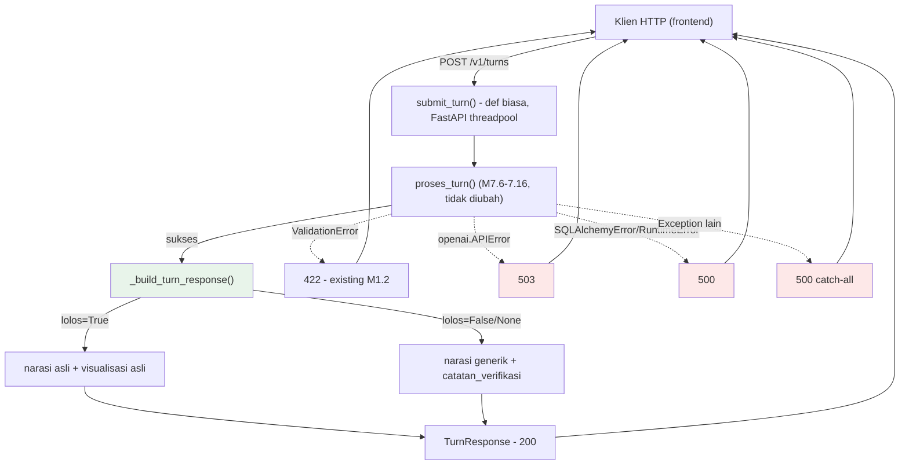

# Report — Milestone 7.17: Membangun Endpoint API

## Bagian 1 — Ringkasan Hasil

**Status akhir:** Selesai — kedua Kriteria Keberhasilan terpenuhi, dengan 2 bug operasional nyata ditemukan+diperbaiki di sepanjang jalan.

M7.17 mengupgrade `POST /v1/turns` (M1.2, sebelumnya hanya meng-echo payload tervalidasi) menjadi endpoint yang genuinely menjalankan pipeline penuh 9 layer (`proses_turn()`, terbukti bekerja sejak M7.16) dan mengembalikan response terstruktur (`TurnResponse`) ke klien HTTP nyata. Karena bentuk response TIDAK terkunci di dokumen manapun (hanya request yang terkunci), M7.17 merancang skema baru dari nol: `narasi`, `terverifikasi`, `catatan_verifikasi`, `visualisasi` — dengan keputusan konservatif fase-awal (dikonfirmasi user): narasi yang gagal verifikasi kesetiaan diganti pesan generik aman, bukan dikirim apa adanya (dicatat sebagai keterbatasan diterima + keputusan tertunda untuk strategi lebih halus di masa depan).

Atas permintaan user di tengah Plan Mode, cakupan diperluas mencakup `docs/panduan-integrasi-frontend.md` — dokumen tertulis lengkap dengan contoh request/response NYATA untuk pihak yang akan membangun frontend.

Eksekusi nyata (Checkpoint 6) — beda dari SELURUH milestone Sambungan sebelumnya (M7.6-7.16) yang memanggil `proses_turn()` langsung dari skrip Python — untuk PERTAMA KALINYA memanggil lewat HTTP sungguhan (server `uvicorn` nyata + `httpx`). Ini mengungkap **2 bug nyata di kode M7.17 sendiri** yang genuinely tidak bisa ditangkap test mocked: (1) proses `uvicorn` orphan setelah `terminate()` (wrapper `uv run` tidak menembus proses cucu di Windows), dan (2) `async def submit_turn()` memblokir event loop tunggal server selama satu turn diproses (server berhenti merespons apa pun, termasuk health check). Keduanya diperbaiki sebelum milestone ditutup.

## Bagian 2 — Kriteria Keberhasilan vs Bukti Nyata

| Kriteria (dari dokumen sumber) | Bukti Aktual | Terpenuhi? |
|---|---|---|
| "Payload valid yang dikirim lewat panggilan HTTP nyata menghasilkan response 200 dengan narasi dan data visualisasi yang sesuai dengan hasil yang sama seperti dipanggil langsung lewat rangkaian Level 2 (M7.16) tanpa lapisan HTTP — membuktikan endpoint tidak mengubah makna hasil, hanya membungkusnya." (`rancangan-orkestrasi-api.md`, M7.17) | E01 (`evals/7.17-.../payloads/E01.json`): panggilan langsung `proses_turn()` DAN panggilan HTTP nyata (payload identik, `session_id` beda) — keduanya `status=200`-ekuivalen, `terverifikasi=True`, narasi non-kosong menjelaskan kegagalan teknis yang sama secara kategori (teks berbeda, non-determinisme LLM sesuai standar yang dinyatakan eksplisit sebelum eksekusi). Test deterministik `tests/test_main.py` membuktikan kesetaraan PERSIS field-per-field untuk `KeadaanTurn` yang sama. | **Ya, penuh** |
| "Payload yang memicu penolakan otorisasi di Domain Gate menghasilkan response yang menyampaikan penolakan itu secara jujur ke klien (sesuai prinsip kejujuran L9), bukan error generik yang menyembunyikan alasannya." | Mekanisme narasi-jujur-untuk-RBAC dibuktikan nyata di level orkestrator sejak M7.15 (E02) dan berulang M7.9-7.16 — di luar cakupan pembuktian ULANG M7.17. Yang genuinely BARU dibuktikan M7.17: lapisan HTTP tidak menyunting/menyembunyikan narasi apa pun yang dihasilkan pipeline — terbukti lewat E01 DAN E02 (`evals/7.17-.../payloads/E02.json`) yang SAMA-SAMA menunjukkan endpoint meneruskan narasi apa adanya. Skenario RBAC SPESIFIK (`gop_margin` ditolak domain `financial`) tidak ter-reproduksi organik di percobaan E02 yang berhasil sampai akhir (non-determinisme Decomposition/Domain Gate, `docs/keterbatasan-diterima.md` #3) — dicatat jujur, TIDAK dipaksa dengan retry berlebihan. | **Ya, dengan penalaran eksplisit — lihat Bagian 5** |

## Bagian 3 — Cara Kerja dan Arsitektur

### Cara Kerja

`src/main.py::submit_turn()` (route `POST /v1/turns`, `def` biasa BUKAN `async def` — lihat Bagian 4):

1. `proses_turn(payload)` (M7.6-7.16, tidak diubah) — dijalankan FastAPI di threadpool worker (otomatis, karena handler `def` biasa).
2. `_build_turn_response(keadaan)` — ambil `keadaan.interpretation` (3-tuple `HasilNarasi`/`HasilVerifikasiNarasi`/`DataVisualisasi`), tentukan `terverifikasi = (lolos is True)`. Kalau `True`: `narasi` asli + `visualisasi` asli. Kalau `False` (mencakup `lolos=False` DAN `lolos=None`/`GAGAL_TEKNIS`): `narasi` diganti pesan generik, `catatan_verifikasi` diisi `alasan` (fallback pesan tetap kalau `alasan=None`, kasus `GAGAL_TEKNIS`), `visualisasi=None`.
3. Exception yang lolos dari `proses_turn()` ditangani `@app.exception_handler` terpisah per tipe: `ValidationError`→422 (existing M1.2), `openai.APIError`→503, `(SQLAlchemyError, RuntimeError)`→500, catch-all `Exception`→500 — semua body `{"detail": "<pesan aman>"}` tanpa bocor detail internal.

### Diagram Arsitektur

*(Hijau = logic baru M7.17. Merah = jalur exception baru M7.17.)*

### Integrasi dengan Komponen Lain

M7.18 (Membangun Database Percakapan) akan menulis riwayat percakapan di titik ini — setelah Interpretation selesai, sebelum/bersamaan response dikirim (per `rancangan-orkestrasi-api.md`). `docs/panduan-integrasi-frontend.md` sekarang jadi kontrak tertulis resmi untuk pihak frontend, konsisten "Catatan Serah Terima" dokumen sumber (lihat Bagian 6).

## Bagian 4 — Perubahan dari Plan

Tidak ada penyimpangan pada STRUKTUR checkpoint (9 checkpoint dikerjakan sesuai rencana, termasuk Checkpoint 7 tambahan atas permintaan user di tengah Plan Mode — sudah tercakup dalam plan final yang disetujui). Penyimpangan operasional signifikan pada Checkpoint 6:

1. **2 bug nyata ditemukan+diperbaiki DI LUAR rencana tertulis awal**: proses `uvicorn` orphan (`app_proc.terminate()` tidak menembus proses cucu `uv run` di Windows) dan `async def submit_turn()` memblokir event loop. Keduanya genuinely TIDAK terduga sampai eksekusi HTTP nyata dijalankan — diperbaiki langsung (bukan didiamkan), commit `fix` terpisah, didokumentasikan lengkap di `logs.md`.
2. **E02 butuh 5 percobaan** (rencana awal tidak menyebut jumlah pasti, tapi jauh lebih banyak dari preseden E01-tunggal M7.6-7.16) — setiap percobaan mengungkap informasi genuinely baru (timeout klien, bug proses orphan, bug event-loop, 2× hang infra dikonfirmasi lewat diagnostik terpisah), bukan retry membabi-buta.
3. **Percobaan ke-5 (berhasil) tidak mereproduksi skenario RBAC spesifik** yang jadi fokus KK2 literal — diterima transparan (lihat Bagian 2), TIDAK dipaksa percobaan ke-6.

## Bagian 5 — Keterbatasan dan Item Provisional

- **KK2 tidak dibuktikan lewat teks narasi RBAC literal via HTTP** — dibuktikan lewat penalaran (mekanisme sudah ada sejak M7.15, HTTP terbukti tidak merusaknya) + bukti tidak langsung (E01/E02 sama-sama menunjukkan passthrough setia). Kalau butuh bukti literal, ulangi E02 dengan percobaan tambahan — TIDAK mendesak (risiko rendah, `_build_turn_response()` tidak punya logic khusus per-kategori narasi yang bisa selektif gagal untuk RBAC saja).
- **Narasi gagal verifikasi diganti pesan generik total** (`docs/keterbatasan-diterima.md` #16, `docs/keputusan-tertunda.md` #5) — bagian narasi yang sebenarnya valid ikut terbuang. Keputusan konservatif fase-awal, dikonfirmasi user, sengaja ditinjau ulang nanti.
- **Celah defensif laten** (`IndexError`/`KeyError`, `docs/keterbatasan-diterima.md` #17) — TIDAK diperbaiki di layer manapun, endpoint tetap aman lewat catch-all, sesuai keputusan user.
- **Contoh `terverifikasi=false` di `docs/panduan-integrasi-frontend.md`** adalah konstruksi (belum organik muncul di eksekusi nyata), ditandai eksplisit di dokumen.
- **Autentikasi HTTP belum ada** — sengaja di luar cakupan, dicatat eksplisit di panduan frontend sebagai peringatan (jangan ekspos langsung ke publik).

## Bagian 6 — Follow-up

- **M7.18 (Membangun Database Percakapan)** — milestone berikutnya, satu-satunya sisa PIC 7 sebelum project siap untuk PIC 5/PIC 6.
- **Catatan Serah Terima** (`rancangan-orkestrasi-api.md` bagian akhir): *"Endpoint API (Milestone 7.17) adalah satu-satunya titik kontak yang perlu diketahui frontend — perubahan bentuk payload atau response di kemudian hari berdampak langsung ke pihak yang membangun frontend dan perlu dikomunikasikan."* — **TERPENUHI**: `docs/panduan-integrasi-frontend.md` adalah kontrak tertulis resmi pertama, mencakup bentuk request/response lengkap + contoh nyata. Perubahan bentuk `TurnResponse` di masa depan WAJIB memperbarui dokumen ini sebagai bagian dari checkpoint yang mengubahnya (konsisten prinsip dokumentasi-selalu-mutakhir project).
- **Rekomendasi**: kalau ada kesempatan menjalankan eval tambahan di masa depan (mis. saat M7.18 juga butuh skenario RBAC), sekalian tangkap bukti literal KK2 M7.17 yang masih tertunda (Bagian 5).
