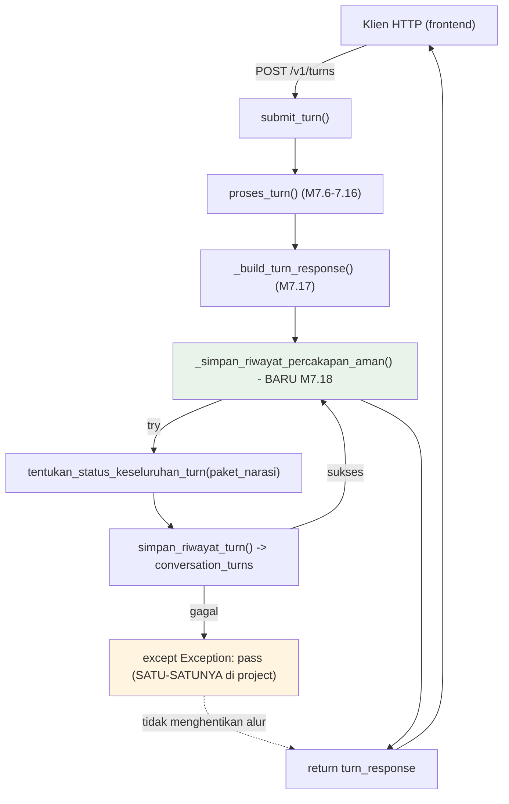

# Report — Milestone 7.18: Membangun Database Percakapan

## Bagian 1 — Ringkasan Hasil

**Status akhir:** Selesai — kedua Kriteria Keberhasilan terpenuhi. **Milestone TERAKHIR PIC 7 — PIC 7 (Orkestrasi & API Layer) SELESAI SEPENUHNYA.**

M7.18 menambah lapisan penyimpanan riwayat percakapan yang ditujukan untuk kebutuhan APLIKASI (bukan kebutuhan internal AI seperti Session Memory M1.5/M4.3) — tabel baru `conversation_turns` (`ConversationTurnRow`, mirror pola `PromptEvalRunRow`) diisi lewat `_simpan_riwayat_percakapan_aman()` di `src/main.py`, dipanggil SETELAH `_build_turn_response()` (M7.17) menghasilkan response final. Dua keputusan desain dikonfirmasi user lewat `AskUserQuestion`: lokasi kode penulisan (di endpoint `main.py`, bukan `proses_turn()`) dan sumber "status keseluruhan turn" (agregasi status seluruh item `KeadaanTurn.paket_narasi`, BUKAN reuse `terverifikasi` biner — karena `terverifikasi` hanya mengukur kejujuran narasi, bukan keberhasilan turn).

M7.18 juga JADI YANG PERTAMA di seluruh project dengan pola "tangkap kegagalan lalu DIAM (tidak re-raise)" — `_simpan_riwayat_percakapan_aman()` membungkus `simpan_riwayat_turn()` dalam `try/except Exception: pass`, forced literal oleh KK2 sumber ("kegagalan penulisan riwayat TIDAK BOLEH menggagalkan response ke user"). Kegagalan tetap tercatat sebagai sinyal terpisah lewat span `riwayat.simpan` (Jaeger), bukan disembunyikan sepenuhnya — konsisten prinsip "Kejujuran terhadap keterbatasan" `CLAUDE.md`.

Eksekusi nyata Checkpoint 7 — konsisten pola M7.6/M7.7/M7.11/M7.17 — sekali lagi menemukan bug produksi genuinely baru yang tidak terlihat dari test mocked: `klasifikasi_kebutuhan()` (M1.6) crash `TypeError` saat respons OpenRouter HTTP 200 dengan body malformah (`choices=None`). Titik ini SUDAH terdaftar lebih dulu di `docs/keterbatasan-diterima.md` #17 (ditemukan riset M7.17, sengaja diterima sampai terbukti nyata) — pemicu peninjauan ulangnya terpenuhi tepat di sini. Diperbaiki di M1.6 (milestone pemilik layer), BUKAN di M7.18 sendiri, mirror pola perbaikan M7.6/M7.7.

## Bagian 2 — Kriteria Keberhasilan vs Bukti Nyata

| Kriteria (dari dokumen sumber) | Bukti Aktual | Terpenuhi? |
|---|---|---|
| "Turn yang berhasil diproses penuh menghasilkan satu entri baru di Database Percakapan yang bisa ditarik kembali dan cocok dengan apa yang sesungguhnya ditanyakan dan dijawab." (`rancangan-orkestrasi-api.md`, M7.18) | E01 (`evals/7.18-.../payloads/E01.json`, `session_id=eval-7.18-e01f`) — panggilan HTTP nyata `POST /v1/turns`, HTTP 200. Query langsung `conversation_turns` mengembalikan TEPAT 1 baris baru: `pertanyaan` PERSIS sama dengan `question` payload, `narasi` PERSIS sama dengan body response HTTP (`TurnResponse.narasi`, bukan `HasilNarasi.narasi` internal), `turn_index=1` sesuai payload, `status="gagal_teknis"` konsisten dengan narasi yang jujur melaporkan kendala teknis (seragam, 1 atomic intent, bukan `"campuran"`). | **Ya, penuh** |
| "Penulisan ke Database Percakapan yang sengaja dibuat gagal (skenario uji terkontrol) tidak menyebabkan response ke frontend ikut gagal — user tetap menerima jawabannya meski riwayatnya gagal tersimpan, dengan kegagalan itu dicatat sebagai sinyal terpisah (bukan disembunyikan sepenuhnya)." | Checkpoint 3 (unit, `tests/orchestration/test_riwayat_percakapan_kegagalan.py`): `simpan_riwayat_turn()` menangkap kegagalan DB, menandai span `error.type="gagal_teknis"`, RAISE ulang (tanggung jawab caller). Checkpoint 5 (level HTTP, `tests/test_main.py::test_endpoint_tetap_200_walau_simpan_riwayat_gagal`): `simpan_riwayat_turn` di-mock untuk raise — response TETAP `200` dengan body `TurnResponse` benar. Kedua level deterministik, dieksekusi SEBELUM Checkpoint 7 (yang fokus KK1, butuh kondisi nyata bukan simulasi terkontrol). | **Ya, penuh** |

## Bagian 3 — Cara Kerja dan Arsitektur

### Cara Kerja

`src/main.py::submit_turn()` (diperluas dari bentuk M7.17):

1. `keadaan = proses_turn(payload)` — tidak diubah (M7.6-7.16).
2. `turn_response = _build_turn_response(keadaan)` — tidak diubah (M7.17).
3. `_simpan_riwayat_percakapan_aman(keadaan, turn_response)` — **BARU M7.18**: hitung `status = tentukan_status_keseluruhan_turn(keadaan.paket_narasi)` (agregasi — seragam kalau seluruh item share `StatusEksekusi` sama, `"campuran"` kalau beragam, `"tidak_ada_kebutuhan"` kalau kosong), panggil `simpan_riwayat_turn(session_id, turn_index, pertanyaan, narasi, status)` DI DALAM `try/except Exception: pass` — SATU-SATUNYA titik di seluruh project dengan pola tangkap-dan-diam ini.
4. `return turn_response` — TIDAK PEDULI hasil Task 3.

`simpan_riwayat_turn()` (`src/orchestration/riwayat_percakapan.py`, mirror pola `store_session_memory()`): buka span `riwayat.simpan`, tulis `ConversationTurnRow` (UUID PK, `session_id` indexed, `turn_index`, `pertanyaan`, `narasi`, `status`, `created_at` default) ke Supabase via SQLModel, tangkap `Exception` → tandai span `error.type="gagal_teknis"` → RAISE ulang (tanggung jawab CALLER, yaitu `_simpan_riwayat_percakapan_aman()`, untuk memutuskan nasib kegagalan — bukan fungsi ini sendiri yang diam).

### Diagram Arsitektur

*(Hijau = logic baru M7.18. Kuning = pola exception baru — tangkap-dan-diam, bukan tangkap-tandai-raise seperti seluruh layer lain.)*

### Integrasi dengan Komponen Lain

`conversation_turns` TERPISAH TOTAL dari Session Memory (`session_memory`, M1.5/M4.3) — tidak dibaca AI sama sekali, murni untuk kebutuhan aplikasi/frontend (mis. riwayat percakapan yang bisa ditampilkan ulang ke user). Tidak ada endpoint/fungsi retrieve baru dibangun (di luar Output KK M7.18) — Checkpoint 7 memverifikasi lewat query SQLModel langsung di skrip eval, bukan API produksi.

## Bagian 4 — Perubahan dari Plan

Struktur 9 checkpoint dikerjakan sesuai rencana, TANPA penyimpangan pada breakdown task. Satu penyesuaian kecil dicatat eksplisit di `logs.md` Checkpoint 3: test murni `tentukan_status_keseluruhan_turn()` dipindah ke file TANPA `skipif` (`test_riwayat_percakapan_kegagalan.py`) supaya tidak ikut ter-skip di lingkungan tanpa `DATABASE_URL` — tidak melanggar maksud plan (tetap tercakup verifikasi checkpoint).

Penyimpangan operasional signifikan, DI LUAR rencana tertulis:

1. **Kebocoran test-hygiene ditemukan+diperbaiki (Checkpoint 5)**: 3 test existing (`test_main.py`, `test_input_layer.py`) diam-diam mulai menulis baris NYATA ke `conversation_turns` sejak Checkpoint 4 (mock `proses_turn()` tapi bukan `simpan_riwayat_turn()` yang baru). 3 baris `session_id="sess-test"` sempat tersimpan di Supabase — dihapus manual sebelum commit, 4 test diberi mock tambahan.
2. **Bug produksi genuinely baru ditemukan+diperbaiki DI LUAR cakupan M7.18 (Checkpoint 7)**: `klasifikasi_kebutuhan()` (M1.6) crash saat `response.choices=None` — TIDAK ADA di rencana Checkpoint 7 asli (yang hanya mengharapkan eksekusi lancar mengikuti pola M7.14-7.17). Diperbaiki di M1.6 (milestone pemilik), didokumentasikan lengkap di `milestones/1.6-decomposition/decisions.md` Keputusan 15 (Addendum) — BUKAN di file M7.18 manapun, konsisten prinsip "perbaikan logic internal layer adalah tanggung jawab milestone pemilik".
3. **4 percobaan Checkpoint 7 sebelum sukses**, TIGA penyebab berbeda (bukan pengulangan satu masalah) — infra transient (percobaan 1), bug produksi M1.6 di atas (percobaan 2), proses `nohup` manual tidak survive antar-tool-call (percobaan 3) — dicatat detail lengkap `logs.md` Checkpoint 7 dan `evals/7.18-.../audit.md`.
4. **Urutan commit `logs.md` sempat menyimpang** dari kebiasaan "commit tepat setelah checkpoint diverifikasi" (Checkpoint 1-5 sempat tertunda, dicatat retroaktif Checkpoint 7) — dikoreksi kembali ke pola per-checkpoint mulai Checkpoint 7 seterusnya.

## Bagian 5 — Keterbatasan dan Item Provisional

- **Span `simpan_riwayat_turn()` TIDAK ter-nest di bawah `invoke_agent`** — trace terpisah, karena `proses_turn()` sudah menutup spannya sebelum `submit_turn()` memanggil fungsi ini. Diterima sebagai simplifikasi sejak `decisions.md` Keputusan (Checkpoint 1) — memperbaikinya butuh threading context OTel lintas-boundary, kompleksitas tidak sepadan untuk milestone ini.
- **Tidak ada endpoint/fungsi retrieve riwayat** — forced by Output KK M7.18 sendiri (hanya menyebut "mekanisme penulisan"). Verifikasi KK1 murni lewat query langsung tabel.
- **4 dari 5 titik `docs/keterbatasan-diterima.md` #17 TETAP belum diperbaiki** (`detect_turn_dependency` M1.3, `pemecahan.py`/`verifikasi.py` M1.6, `susun_narasi` M4.4) — hanya `klasifikasi.py` yang genuinely terbukti crash nyata di sini yang diperbaiki, mirror prinsip "perbaiki yang terbukti, bukan borongan preventif" (M7.6/M7.7).
- **KK1 hanya dibuktikan untuk status `gagal_teknis`** (data `chatbot_api` lokal stale, `docs/keterbatasan-diterima.md` #15, belum diperbarui tim database engineering) — mekanisme penyimpanan sendiri tidak bergantung status APA yang terjadi (kode `_simpan_riwayat_percakapan_aman()` tidak punya cabang logic per-status), jadi risiko residual RENDAH, tapi belum ada bukti LIVE untuk `status="berhasil"`/`"campuran"` spesifik.

## Bagian 6 — Follow-up dan Catatan Serah Terima

**PIC 7 (Orkestrasi & API Layer) SELESAI SEPENUHNYA** — M7.18 adalah milestone terakhirnya. Ketiga item "Catatan Serah Terima ke Pekerjaan Lain" (`rancangan-orkestrasi-api.md`, bagian akhir) dikonfirmasi status akhirnya di sini:

1. **"Endpoint API (Milestone 7.17) adalah satu-satunya titik kontak yang perlu diketahui frontend..."** — **TERPENUHI** (M7.17). `docs/panduan-integrasi-frontend.md` adalah kontrak tertulis resmi, mencakup bentuk request/response lengkap + contoh nyata. Tidak disentuh M7.18 (M7.18 menambah SISI SERVER — penyimpanan riwayat — tanpa mengubah bentuk `TurnResponse` yang sudah dikontrakkan ke frontend).
2. **"Skema Database Percakapan (Milestone 7.18) adalah sumber data yang relevan bagi kebutuhan analitik/audit di masa depan..."** — **TERPENUHI di sini**: `ConversationTurnRow` (`session_id`, `turn_index`, `pertanyaan`, `narasi`, `status`, `created_at`) tersedia sebagai fondasi kalau project diperluas ke arah analitik/audit — dicatat eksplisit sebagai "pertimbangan lanjutan", TIDAK ada endpoint/fitur analitik dibangun aktif di milestone ini (di luar cakupan).
3. **"Span `invoke_agent` yang dibangun bertahap sepanjang Milestone 7.6-7.16... `rancangan-observability-dashboard.md` (PIC 5) sebaiknya diperbarui..."** — **TERPENUHI** (M7.6-7.16, tidak disentuh M7.18). Rekomendasi untuk PIC 5 tetap berlaku, dicatat sebagai follow-up PIC 5 (bukan tindakan M7.18).

**Sisa pekerjaan project**: PIC 5 (Observability Dashboard), PIC 6 (Custom Exporter Go) — keduanya boleh berjalan paralel, tidak ada lagi ketergantungan dari PIC 7. Area masih terbuka: keputusan lanjut/pindah fallback PIC 6 (belum diputuskan, baru relevan saat M6.1 dimulai); skema `DataVisualisasi` provisional (`docs/keputusan-tertunda.md` #4, revisit begitu PIC 5 mulai).
