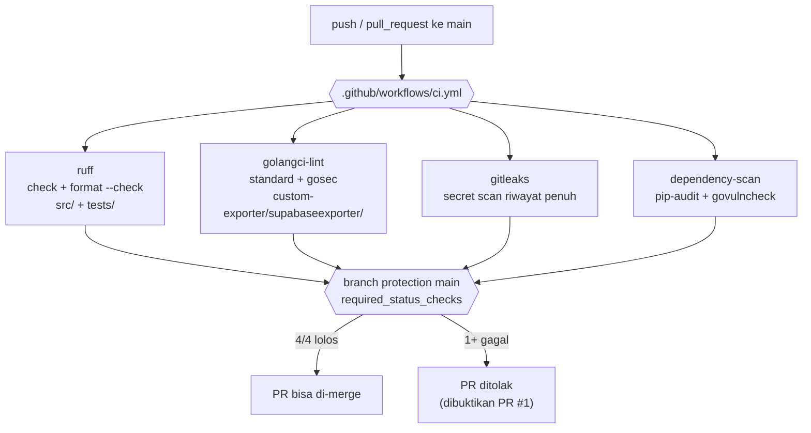

# Report — Milestone 8.1: Fondasi CI — Kebersihan Kode & Rahasia

## Bagian 1 — Ringkasan Hasil

**Status akhir:** Selesai sesuai rencana, dengan penyesuaian signifikan dari plan (granularitas pembersihan per-fitur diminta user di tengah plan, 2 kebijakan rule ruff ditemukan+diputuskan mid-implementation, 2 bug nyata ditemukan+diperbaiki lewat eksekusi CI sungguhan).

Milestone ini membangun fondasi CI pertama project ini — sepanjang 24 milestone sebelumnya (M1.1-M7.18), `nirwana-chatbot` TIDAK PERNAH py lint config, secret scanning, atau gate otomatis apa pun. Hasil akhir: seluruh `src/`+`tests/`+`custom-exporter/` (175+8 file) lolos `ruff`/`golangci-lint` tanpa temuan, riwayat 654 commit yang sekarang publik dikonfirmasi bebas rahasia, 0 CVE aktif di kedua ekosistem (Python+Go), dan `.github/workflows/ci.yml` (4 job: `ruff`, `golangci-lint`, `gitleaks`, `dependency-scan`) berjalan nyata di GitHub Actions dengan branch protection `main` mewajibkan keempatnya lolos sebelum merge — dibuktikan lewat PR percobaan nyata yang genuinely ditolak.

## Bagian 2 — Kriteria Keberhasilan vs Bukti Nyata

| Kriteria (dari dokumen sumber) | Bukti Aktual | Terpenuhi? |
|---|---|---|
| Seluruh `src/`, `tests/`, `custom-exporter/` lolos `ruff check`/`golangci-lint run` tanpa temuan tersisa, dibuktikan run lokal nyata sebelum gate CI dinyalakan sebagai wajib. | 12 unit dibersihkan satu-per-satu (Checkpoint 4-15) + 1 celah tabel ditutup (`tests/config/`, Checkpoint 15 Task 15b). Sanity check akhir `uv run ruff check src/ tests/` + `format --check` → "All checks passed!"/"175 files already formatted". `golangci-lint run` di `custom-exporter/supabaseexporter/` → "0 issues." (Checkpoint 7). | Ya |
| PR percobaan yang sengaja mengandung pelanggaran lint/format ATAU pola menyerupai credential (bukan rahasia asli) terbukti ditolak CI lewat run nyata di GitHub Actions, bukan cuma dibaca dari isi file workflow. | PR #1 (`test/m8-1-ci-gate-percobaan`) — run nyata `32552303789`: `ruff` GAGAL (F401), `gitleaks` GAGAL (`aws-access-token`, pola dummy `AKIA…227`), `golangci-lint`+`dependency-scan` tetap lolos (benar). Ditutup tanpa merge, branch dihapus. Lihat `logs.md` Checkpoint 18. | Ya |
| `pip-audit` dan `govulncheck` dijalankan nyata sekali terhadap `uv.lock`/`go.sum` saat ini, hasilnya (ada/tidak ada CVE aktif) dicatat sebagai baseline awal di `logs.md` milestone ini. | Checkpoint 16: `govulncheck ./...` → "No vulnerabilities found." `uv run --with pip-audit pip-audit` → "No known vulnerabilities found". Baseline: 0 CVE aktif kedua ekosistem. | Ya |

---

## Bagian 3 — Cara Kerja dan Arsitektur

### Cara Kerja

Setiap `push`/`pull_request` ke `main` memicu `.github/workflows/ci.yml`, 4 job paralel independen:

1. **`ruff`** — `uv sync --group dev` lalu `ruff check src/ tests/` (rule Baseline: `E,F,I,UP,B,SIM`, `E501` dikeluarkan — Keputusan 1+16) dan `ruff format --check src/ tests/`.
2. **`golangci-lint`** — dari working-directory `custom-exporter/supabaseexporter/` (lokasi nyata `go.mod`), `.golangci.yml` (linter default + `gosec` eksplisit), dijalankan via `golangci-lint-action@v9` (pin `v2.13.1`).
3. **`gitleaks`** — `gitleaks/gitleaks-action@v2` dengan `fetch-depth: 0` (scan riwayat penuh), gratis karena repo public.
4. **`dependency-scan`** — `pip-audit` (via `uv run --with pip-audit`) + `govulncheck` (pin `v1.7.0`) dalam satu job.

Branch protection `main` (`required_status_checks`, `enforce_admins: false`, tanpa wajib-PR — Keputusan 18) mewajibkan keempat context lolos sebelum PR bisa di-merge, TANPA mengunci commit langsung admin/owner (mempertahankan pola kerja 24 milestone sebelumnya).

### Diagram Arsitektur

### Integrasi dengan Komponen Lain

Dokumen sumber (`rancangan-ci-cd.md`) tidak py "Catatan Serah Terima" khusus untuk M8.1 (catatan serah-terima di dokumen itu untuk M8.10) — tapi M8.1 sendiri adalah **prasyarat struktural** untuk M8.2-8.5 (Bagian 1 dokumen sumber eksplisit: "milestone berikutnya menambah job ke workflow yang dibangun di sana"). Kontrak yang diwariskan: `ci.yml` dengan 4 job existing (nama context stabil) + branch protection dengan `required_status_checks.checks` yang bisa ditambah incremental. Keduanya dikonfirmasi berfungsi nyata (Checkpoint 17-19) — M8.2 (Test Gate) tinggal menambah job `pytest`/`go test` ke file yang sama dan menambah context baru ke branch protection yang sudah ada, tanpa perlu membangun ulang struktur.

---

## Bagian 4 — Perubahan dari Plan

1. **Granularitas pembersihan lint diubah dari "sekaligus" jadi "per-fitur" di tengah Plan Mode** — user meminta analisis fitur dulu, pembersihan fokus satu unit per waktu, sebelum plan final ditulis. Checkpoint 3 (draf awal) pecah jadi Checkpoint 3-15 (13 checkpoint: 1 config + 11 unit Python + 1 unit Go). Lihat Keputusan 4-5 `decisions.md`.
2. **`E501` dikeluarkan dari rule ruff (Keputusan 16)** — ditemukan Checkpoint 3: 867/933 temuan awal (93%) adalah line-too-long, mayoritas genuinely tidak bisa dibereskan formatter (komentar/docstring naratif). Diajukan ke user dengan data konkret, dikeluarkan dari rule set.
3. **Migrasi `UP042` (`StrEnum`) diterapkan project-wide di Checkpoint 6, bukan per-unit** — ditemukan cross-cutting (9 lokasi, dipakai 49 file). Diaudit menyeluruh (agent Explore) sebelum diterapkan sekali untuk seluruh project. Lihat Keputusan 17.
4. **Celah tabel unit ditemukan+ditutup** — `tests/config/` (2 file) terlewat dari tabel 12 unit saat disusun, ditemukan lewat sanity check ruff full-project di akhir Checkpoint 15 (Task 15b), ditutup sebagai commit tambahan kecil.
5. **2 bug nyata di `ci.yml` ditemukan+diperbaiki lewat eksekusi nyata (Checkpoint 17)** — `golangci-lint-action@v6` genuinely tidak mendukung golangci-lint v2 (upgrade ke `@v9`); cache `go.sum` gagal ditemukan karena path default vs lokasi module nyata (`cache-dependency-path` ditambah). Keduanya TIDAK mungkin ditemukan dari validasi lokal (`actionlint`) — hanya dari run nyata GitHub Actions.
6. **Cakupan branch protection dipersempit ke `required_status_checks` saja (Keputusan 18)** — ditemukan saat konfigurasi `gh api` Checkpoint 19: opsi penuh (wajib-PR, `enforce_admins: true`) akan mengubah workflow project secara fundamental (24 milestone sebelumnya + M8.1 sendiri pakai commit langsung), di luar apa yang eksplisit diminta.
7. **Contoh AWS key resmi ("...EXAMPLE") tidak bisa dipakai untuk PR percobaan** — gitleaks default config py allowlist eksplisit untuk pola itu (justru untuk hindari false-positive dokumentasi) — diganti pola dummy lain yang genuinely terdeteksi, dikonfirmasi lokal dulu sebelum push.
8. **Dokumentasi milestone ini sendiri (`logs.md`/`report.md`) sempat men-trigger ulang gitleaks di `main`** — string dummy Checkpoint 18 ditulis literal saat didokumentasikan, gitleaks (scan riwayat penuh) menemukannya lagi begitu ter-commit ke `main`. `.gitleaksignore` per-fingerprint saja TIDAK cukup (fingerprint berubah tiap kali `logs.md` yang terus tumbuh disentuh commit baru) — solusi akhir: redact string literal di seluruh working tree + `.gitleaksignore` untuk commit historis yang immutable. Butuh 2 iterasi perbaikan sebelum `main` genuinely hijau lagi. Lihat `logs.md` Task 24b-24d.

Task numbering final: 24 task, 20 checkpoint (naik dari 9 checkpoint draf awal) — seluruhnya tercatat kronologis di `logs.md`.

## Bagian 5 — Keterbatasan dan Item Provisional

- **Upgrade rule `ruff` Baseline → Ketat** dicatat sebagai keputusan tertunda (`docs/keputusan-tertunda.md` #6) — belum dijadwalkan, trigger: PIC 8 selesai sepenuhnya, kontributor baru, atau bukti bug nyata yang akan tertangkap `ANN`/`ARG`.
- **`gitleaks-action` gagal menulis komentar inline PR** ("Resource not accessible by integration", `GITHUB_TOKEN` default kurang permission `pull-requests: write`) — TIDAK mempengaruhi status check (mekanisme gate tetap benar), cuma fitur komentar otomatis. Tidak diperbaiki (cosmetic, di luar cakupan KK manapun).
- **Kegagalan LLM pra-eksisting di modul `domain_gate`** (`docs/keterbatasan-diterima.md` #7) aktif berulang sepanjang sesi kerja ini (Checkpoint 6, 11, 15) — dikonfirmasi BUKAN regresi milestone ini lewat investigasi causality (`git diff`/`git stash` + audit kode) di tiap kemunculan, tidak ada tindakan perbaikan diambil (konsisten preseden milestone lain).

## Bagian 6 — Follow-up

1. **M8.2 (Test Gate)** menambah job `pytest`+`go test` ke `ci.yml` yang sudah ada, dan menambah context baru ke `required_status_checks` branch protection yang sudah dikonfigurasi milestone ini.
2. **`docs/keputusan-tertunda.md` #6** (upgrade ruff Ketat) — revisit sesuai pemicu yang tercantum di sana, tidak mendesak.
3. Tidak ada follow-up lain di luar 2 poin di atas — hasil milestone ini final untuk cakupannya.
