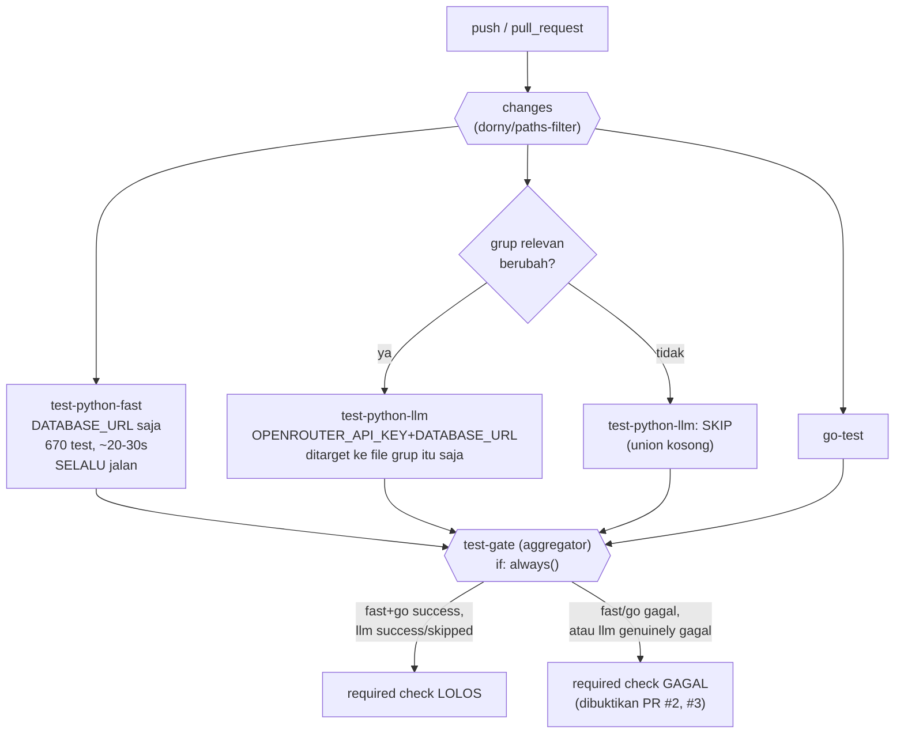

# Report — Milestone 8.2: Test Gate — Unit & Integration

## Bagian 1 — Ringkasan Hasil

**Status akhir:** Selesai sesuai rencana, dengan penyesuaian signifikan ditemukan mid-implementation lewat eksekusi nyata (arsitektur kredensial direvisi setelah bukti lokal, 1 bug pre-existing ditemukan+diperbaiki, 2 kesalahan proses sendiri ditemukan+diperbaiki sebelum sempat menyentuh `main`).

Milestone ini menyambungkan `pytest tests/` (705 test) dan `go test ./...` (4 file) sebagai *required status check* di `.github/workflows/ci.yml` (fondasi M8.1). Alih-alih satu job monolitik, dibangun arsitektur 2-tier: `test-python-fast` (baseline SELALU jalan, 670 test deterministik+DB-backed, ~20-30 detik) dan `test-python-llm` (path-filtered via `dorny/paths-filter`, genuinely jalan HANYA saat salah satu dari 5 layer LLM-sensitif berubah) — plus `go-test` dan job aggregator `test-gate` yang mengatasi gotcha "skip tidak selalu dihitung sah oleh required status check" GitHub Actions. Branch protection `main` diperluas 4→7 context. Kedua tier dibuktikan genuinely blocking lewat 2 PR percobaan nyata.

## Bagian 2 — Kriteria Keberhasilan vs Bukti Nyata

| Kriteria (dari dokumen sumber) | Bukti Aktual | Terpenuhi? |
|---|---|---|
| `pytest tests/` dan `go test ./...` dijalankan nyata lewat GitHub Actions menghasilkan status yang konsisten dengan hasil run manual lokal. | Run CI `32558994822` (setelah fix bug M4.2): `test-python-fast`✓ (670 passed, 35 skipped — identik lokal), `go-test`✓, `test-python-llm` skip bersih (union kosong, konsisten tidak ada layer relevan berubah). Checkpoint 7. | Ya |
| PR percobaan yang sengaja membuat satu assertion test gagal terbukti diblokir merge oleh gate ini, dibuktikan lewat percobaan PR nyata bukan simulasi. | PR #2 (`32559487377`): `test-python-fast`+`test-gate` GAGAL, `test-python-llm` tetap skip (tidak relevan) — Checkpoint 9. PR #3 (`32559640670`): `test-python-llm` GENUINELY JALAN (union `domain_gate` non-kosong, 6 file target presisi) DAN gagal, `test-gate` gagal — Checkpoint 10. Extends KK literal dengan cakupan path-filter presisi sesuai permintaan user. | Ya |

---

## Bagian 3 — Cara Kerja dan Arsitektur

### Cara Kerja

Setiap `push`/`pull_request` ke `main` memicu 3 job baru (selain 4 job M8.1):

1. **`changes`** — `dorny/paths-filter@v3` mendeteksi apakah salah satu dari 5 grup layer (`context_resolution`, `decomposition`, `domain_gate`, `query_engine`, `interpretation`) atau file cross-cutting (`shared`: `llm.py`/`prompts/loader.py`) berubah.
2. **`test-python-fast`** — SELALU jalan, `pytest tests/` dengan `DATABASE_URL` (cepat+andal) TAPI TANPA `OPENROUTER_API_KEY` (mahal+flaky) — skipif existing otomatis skip ~35 test LLM-gated, 670 sisanya (termasuk Input Layer/Orchestration yang genuinely butuh DB untuk validasi `role_title`) genuinely dijalankan, ~20-30 detik.
3. **`test-python-llm`** — HANYA jalan kalau `needs.changes` menunjukkan grup relevan berubah; kalau ya, `pytest` ditarget PERSIS ke file grup itu, dengan KEDUA kredensial (`OPENROUTER_API_KEY`+`DATABASE_URL`). Union kosong = job skip bersih (bukan gagal).
4. **`go-test`** — `go test ./...` di `custom-exporter/supabaseexporter/`.
5. **`test-gate`** — aggregator (`needs: [...]`, `if: always()`) yang jadi *required status check* sesungguhnya — memeriksa `test-python-fast`+`go-test` HARUS `success`, `test-python-llm` boleh `success` ATAU `skipped`.

### Diagram Arsitektur

### Integrasi dengan Komponen Lain

Melanjutkan fondasi M8.1 (`ci.yml`+branch protection) — 3 job baru ditambahkan ke file yang sama, branch protection diperluas (bukan dibangun ulang). M8.3 (RBAC Regression Gate) dan M8.4 (LLM Eval Gate) mewarisi pola yang sama: menambah job ke `ci.yml`, menambah context ke `required_status_checks`. M8.4 khususnya kini py preseden LANGSUNG untuk path-filtering LLM-sensitive testing (`dorny/paths-filter`) dari milestone ini, bukan cuma niat tertulis di dokumen sumber.

---

## Bagian 4 — Perubahan dari Plan

1. **Rencana awal (`test-python-fast` TANPA kredensial apa pun) direvisi jadi (`DATABASE_URL` disediakan, HANYA `OPENROUTER_API_KEY` di-path-filter)** — ditemukan Checkpoint 3: tanpa `DATABASE_URL` genuinely 27 test gagal + 1 collection error (validasi `role_title` database-backed sejak M1.5, dampak lebih luas dari 8 grup awal). Lihat Keputusan 10.
2. **Tabel pemetaan grup direvisi 8→5** (`verification_gate`+`orchestration` dihapus, sepenuhnya tercakup baseline setelah `DATABASE_URL` disediakan) — konsekuensi langsung Keputusan 10.
3. **Bug pre-existing ditemukan+diperbaiki**: `test_400_lalu_200_di_revisi_kedua_berhasil` lupa mock `panggil_meta_chatbot_api()` — gap maintenance revisit M4.2 yang cuma menyentuh satu dari dua helper `_patch_raw()` duplikat. Lihat Keputusan 11.
4. **2 kesalahan proses ditemukan+diperbaiki SEBELUM sempat menyentuh `main`**: nama file percobaan awalan underscore tidak terdeteksi pytest (Checkpoint 9); `git add -A` sempat ikut men-stage 2 perubahan pra-existing tidak terkait, diperbaiki via `git checkout`+`amend`+`force-with-lease` ke branch percobaan (bukan `main`) sebelum push.
5. **Path-filter TIDAK me-refactor 18 file test existing** menjadi pytest marker resmi (Keputusan 5, sudah diputuskan sebelum implementasi, dipertahankan tanpa penyimpangan).

## Bagian 5 — Keterbatasan dan Item Provisional

- **Node.js 20 deprecation warning** (non-fatal) muncul di seluruh job berbasis action pihak ketiga (`actions/checkout@v4`, `gitleaks-action@v2`, dst.) — tidak mempengaruhi hasil run, tidak ditindaklanjuti (di luar kendali project, akan hilang otomatis begitu action-action itu upgrade base image-nya sendiri).
- **`test-python-llm` cuma diverifikasi nyata untuk 1 dari 5 grup** (`domain_gate`, Checkpoint 10) — 4 grup lain (`context_resolution`, `decomposition`, `query_engine`, `interpretation`) memakai konfigurasi path-filter YANG SAMA (mapping identik, mekanisme `dorny/paths-filter` generik per-grup), TIDAK diverifikasi individual dengan PR percobaan terpisah — keputusan sadar (bukan celah) untuk membatasi jumlah PR percobaan, konsisten prinsip 1 bukti representatif cukup untuk mekanisme generik yang sama.

## Bagian 6 — Follow-up

1. **M8.3 (RBAC Regression Gate)** menambah job baru ke `ci.yml`+`required_status_checks` yang sudah ada, mewarisi pola dari M8.1+M8.2.
2. **M8.4 (LLM Eval Gate)** py preseden langsung `dorny/paths-filter` dari milestone ini untuk diterapkan ke Promptfoo.
3. Tidak ada follow-up lain di luar 2 poin di atas — hasil milestone ini final untuk cakupannya.
