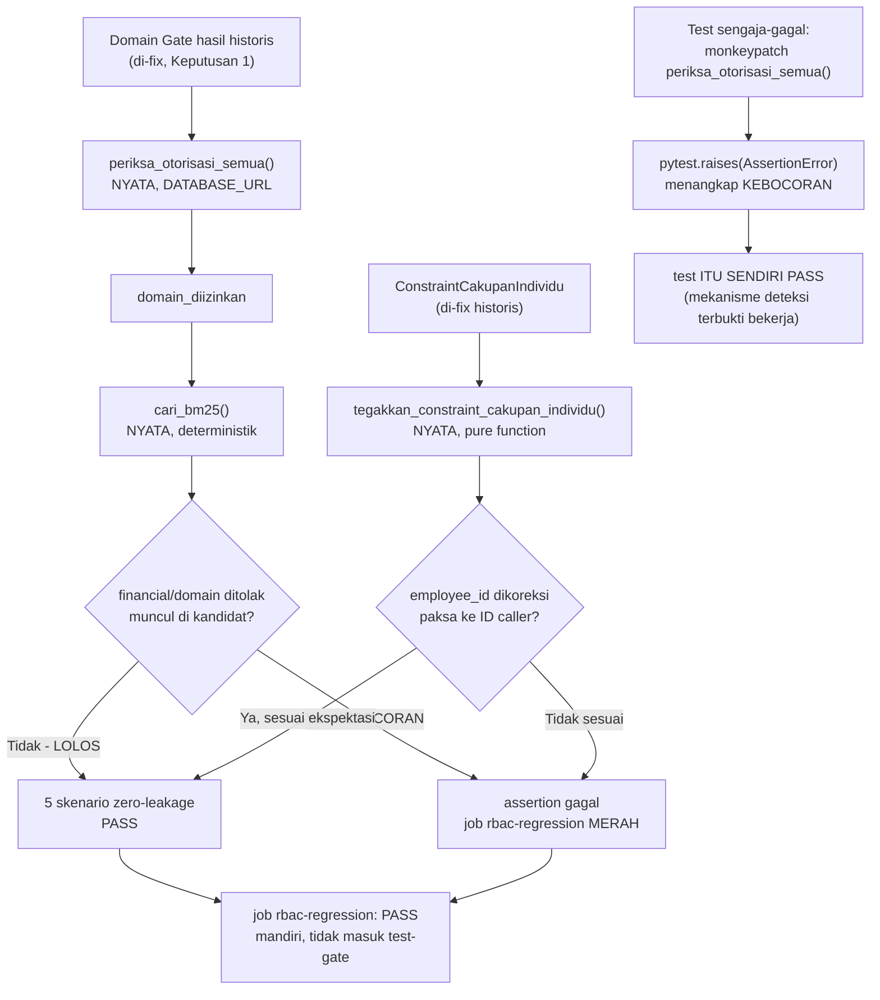

# Report — Milestone 8.3: RBAC/Authorization Regression Gate

**Jenis milestone:** Berbasis kode/sistem (job CI baru + package test baru) — Bagian 3 diisi penuh.

---

## Bagian 1 — Ringkasan Hasil

**Status akhir:** Selesai sesuai rencana, cakupan diperluas dari KK literal atas keputusan sadar user (`AskUserQuestion` sebelum implementasi).

Milestone ini mengurasi 5 skenario "zero-leakage" RBAC yang sudah terbukti nyata sepanjang M7.11-M7.14 (tapi sebelumnya hanya pernah dibuktikan SEKALI lewat eval real-LLM/real-DB saat milestone asalnya dikerjakan) menjadi regression suite otomatis PERMANEN: `tests/rbac_regression/test_zero_leakage.py` (6 test — 5 skenario zero-leakage + 1 test "sengaja dibuat gagal") dan job CI baru `rbac-regression`, terpisah dari `test-python-fast`/`test-python-llm` (M8.2). Klasifikasi Domain Gate (LLM) di-fix ke hasil historis yang sudah terbukti benar — file test ini fokus murni ke logika enforcement deterministik (`periksa_otorisasi_semua()`, `cari_bm25()`, `tegakkan_constraint_cakupan_individu()`), genuinely TANPA panggilan LLM (hanya butuh `DATABASE_URL`, bukan `OPENROUTER_API_KEY`). Kedua Kriteria Keberhasilan sumber dibuktikan nyata: skenario `gop_margin` lolos run job CI sungguhan, DAN skenario sengaja-dibuat-gagal terbukti membuat job ini genuinely merah — dibuktikan GANDA (unit test level + PR percobaan nyata dengan RBAC dilonggarkan di kode produksi, melampaui KK literal yang hanya minta "di kode uji"). Branch protection `main` diperluas dari 7 jadi 8 required status check.

## Bagian 2 — Kriteria Keberhasilan vs Bukti Nyata

| Kriteria (dari dokumen sumber) | Bukti Aktual | Terpenuhi? |
|---|---|---|
| Minimal skenario `gop_margin` berhasil direplikasi sebagai test otomatis yang lolos run nyata di job ini. | `test_gop_margin_financial_ditolak_view_reservation_tetap_benar()` (Checkpoint 3) lolos lokal DAN di GitHub Actions run `32579838069` (job `rbac-regression`, 16s, `gh run view --job` log lengkap dikonfirmasi "collected 6 items"/6 PASSED). Cakupan diperluas comprehensive ke 4 skenario tambahan (F&B all-denied, HR Staff Budi, Maintenance Staff Andi, CEO baseline) atas keputusan `AskUserQuestion` (Checkpoint 1, Keputusan 2, decisions.md). | Ya |
| Skenario yang sengaja dibuat gagal (constraint RBAC dilonggarkan secara buatan di kode uji) terbukti membuat job ini merah, membuktikan gate benar-benar mendeteksi regresi, bukan selalu hijau tanpa syarat. | Dibuktikan GANDA: (1) unit test `test_sengaja_dibuat_gagal_assertion_zero_leakage_genuinely_mendeteksi()` (Checkpoint 8, `monkeypatch` `periksa_otorisasi_semua()` di kode uji, `pytest.raises(AssertionError, match="KEBOCORAN")` menangkap assertion yang genuinely terpicu — test ITU SENDIRI lolos, PERSIS sesuai KK literal "di kode uji"); (2) PR percobaan #4 (Checkpoint 11, `periksa_domain()` dilonggarkan di KODE PRODUKSI `src/layers/domain_gate/otorisasi.py`, bukan cuma kode uji — melampaui KK literal) — run `32595510296` job `rbac-regression` genuinely FAIL nyata (11s, log log dikonfirmasi "3 failed, 3 passed", identik dengan hasil lokal), `test-gate` ikut FAIL, PR ditutup tanpa merge+branch dihapus. | Ya |

---

## Bagian 3 — Cara Kerja dan Arsitektur

### Cara Kerja

`tests/rbac_regression/test_zero_leakage.py` membangun state HASIL Domain Gate (domain teridentifikasi, `cakupan_individu.terdeteksi`) yang di-fix ke nilai historis per skenario (Keputusan 1, bukan memanggil `identifikasi_domain`/`deteksi_constraint` sungguhan — itu tercakup grup `domain_gate` M8.2), lalu memanggil fungsi enforcement DETERMINISTIK apa adanya:

1. **Otorisasi** — `periksa_otorisasi_semua()` (M2.2) dipanggil NYATA terhadap `DATABASE_URL`, membaca matriks `role_permissions` SUNGGUHAN (bukan snapshot statis) supaya test menangkap regresi kalau tabel berubah.
2. **Pencarian kandidat** — `cari_bm25()` (M3.1, Retriever) dipanggil NYATA dengan `domain_diizinkan` hasil Langkah 1 — 100% deterministik (`rank_bm25`, bukan API), diverifikasi empiris skor kandidat cocok persis data historis (`evals/7.11-.../E01.json`, skor `11.414159413192564`). Cakupan zero-leakage SENGAJA berhenti di level candidate generation ini (Keputusan turunan Checkpoint 2), bukan sampai `evaluasi_kecukupan_struktural` (berpotensi LLM fallback) — klaim inti RBAC sudah genuinely terbukti di level ini.
3. **Koreksi paksa cakupan individu** — `tegakkan_constraint_cakupan_individu()` (M2.4, Verification Gate) dipanggil NYATA, pure function tanpa LLM/DB, membuktikan `employee_id` hasil LLM yang bisa salah/dimanipulasi WAJIB ditimpa paksa ke ID caller sungguhan.

6 test dikodekan: `gop_margin` (Front Office Staff, `financial` ditolak tapi kandidat `reservation` tetap ditemukan), F&B Staff all-denied (edge case `domain_diizinkan=[]`, tidak crash), HR Staff "Budi" + Maintenance Staff "Andi" (koreksi paksa `employee_id`, dua domain berbeda sebagai bukti independen), CEO baseline (kontrol anti-false-positive — akses luas tidak boleh ditolak/dikoreksi keliru), dan test "sengaja dibuat gagal" (`monkeypatch` `periksa_otorisasi_semua()` supaya salah melonggarkan `financial`, membuktikan assertion KEBOCORAN genuinely terpicu, bukan selalu lolos).

Job CI `rbac-regression` (`.github/workflows/ci.yml`) menjalankan `pytest tests/rbac_regression/ -v` dengan `DATABASE_URL` saja — berdiri MANDIRI, tidak masuk `needs:` job aggregator `test-gate` M8.2 manapun (Keputusan 3, forced KK sumber: job ini harus terpisah supaya kegagalannya bermakna beda — sinyal kebocoran RBAC prioritas tinggi — dari kegagalan unit test generik).

### Diagram Arsitektur

### Integrasi dengan Komponen Lain

Job `rbac-regression` terdaftar sebagai required status check ke-8 di branch protection `main` (bersama `ruff`/`golangci-lint`/`gitleaks`/`dependency-scan`/`go-test`/`test-python-fast`/`test-gate` dari M8.1-8.2) — genuinely blocking merge kalau merah, dibuktikan nyata lewat PR percobaan #4. Tidak ada kontrak "Catatan Serah Terima" dari dokumen sumber untuk milestone ini (M8.3 murni konsumen fungsi enforcement M2.2/M2.4/M3.1 yang sudah matang, tidak mengubah kontrak apa pun di layer tersebut).

---

## Bagian 4 — Perubahan dari Plan

- **Cakupan diperluas dari KK literal (Checkpoint 3-7)** — KK sumber literal cuma minta skenario `gop_margin`; dikodekan comprehensive 5 skenario atas keputusan sadar user (`AskUserQuestion`, Keputusan 2, decisions.md) karena data+bukti nyata untuk 4 skenario tambahan sudah tersedia dari M7.11-M7.14.
- **Checkpoint 11 melampaui KK literal** — KK2 sumber literal hanya minta pembuktian "di kode uji" (terpenuhi penuh oleh Checkpoint 8); Checkpoint 11 menambah lapis pembuktian kedua yang lebih kuat (RBAC dilonggarkan di KODE PRODUKSI lewat PR percobaan nyata) — bukan penyimpangan, melainkan perluasan bukti di atas yang diwajibkan, konsisten pola milestone-milestone M8.1/M8.2 sebelumnya (selalu memverifikasi nyata via GitHub Actions/PR percobaan, bukan cuma lolos lokal).
- Selain dua hal di atas, tidak ada penyimpangan lain dari plan — seluruh 12 checkpoint dikerjakan sesuai urutan dan desain yang disetujui di Plan Mode.

## Bagian 5 — Keterbatasan dan Item Provisional

- Cakupan "zero-leakage" SENGAJA berhenti di level candidate generation (`cari_bm25()`), bukan sampai `evaluasi_kecukupan_struktural`/pemilihan `view_name_final` akhir (M3.2-3.3, berpotensi LLM fallback) — keputusan sadar Checkpoint 2 (klaim inti RBAC "domain ditolak tidak pernah muncul sebagai opsi" sudah genuinely terbukti di level pencarian kandidat; relevansi/pemilihan kandidat terbaik adalah concern kualitas retrieval, sudah tercakup test unit Retriever M3.1-3.3 terpisah). Tidak dicatat sebagai keterbatasan diterima baru — ini batas cakupan yang disengaja sejak desain, bukan gap yang ditemukan lalu diterima.
- Job `rbac-regression` bergantung `DATABASE_URL` (matriks `role_permissions` nyata) — kalau tabel itu berubah tanpa sepengetahuan, test BISA genuinely gagal; ini SENGAJA (Keputusan 4: menangkap regresi otorisasi nyata, bukan snapshot statis yang bisa basi), bukan bug.

## Bagian 6 — Follow-up

Tidak ada follow-up — hasil milestone ini final untuk cakupannya. Milestone berikutnya di jalur PIC 8 (M8.4 LLM Eval Gate, M8.5 Red-Team Scan) independen sepenuhnya dari M8.3 (tidak saling bergantung data, per catatan "Bagian 1" `rancangan-ci-cd.md`).
