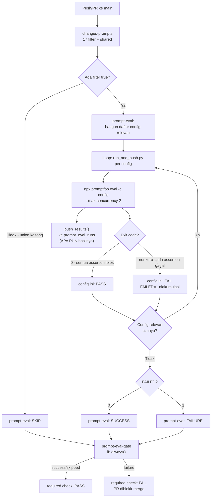

# Report — Milestone 8.4: LLM Eval Gate (Promptfoo → CI)

**Jenis milestone:** Berbasis kode/sistem (job CI baru + wrapper Python baru) — Bagian 3 diisi penuh.

---

## Bagian 1 — Ringkasan Hasil

**Status akhir:** Selesai sesuai rencana, dengan satu koreksi metodologi mid-checkpoint (percobaan sengaja-gagal v1→v2, ditemukan+dikoreksi transparan) dan satu keputusan dikonfirmasi ulang setelah bukti empiris (gate 100%).

Milestone ini menyambungkan `prompt_reliability/` (17 config Promptfoo — dikoreksi dari "18" di dokumen sumber, dikonfirmasi riset) ke CI lewat 3 job baru: `changes-prompts` (path-filter presisi per-file, 17 filter individual + `shared`), `prompt-eval` (jalankan config yang relevan lewat wrapper Python baru `run_and_push.py`), dan `prompt-eval-gate` (aggregator skip-tolerant, required status check ke-9). `run_and_push.py` sekaligus merealisasikan baris "nanti dari CI" yang sudah lama tertulis di `rancangan-manajemen-prompt.md` Bagian 6 — hasil setiap eval (lolos maupun gagal) otomatis dipush ke Supabase `prompt_eval_runs`. Kedua Kriteria Keberhasilan sumber dibuktikan nyata lewat PR percobaan sungguhan: presisi filter (KK1) dan blocking genuinely merah (KK2, `mergeStateStatus=BLOCKED` dikonfirmasi via API).

Temuan material di tengah jalan: run CI pertama (tidak sengaja menjalankan seluruh 17 config karena `run_and_push.py` sendiri adalah file `shared`) mengungkap 108/117 (92.3%) pass rate pra-existing — 9 skenario gagal di 8 config, termasuk 2 config RBAC-sensitif, SELURUHNYA perilaku lama yang baru pertama kali terukur sebagai gate blocking. Dibawa ke user sebelum lanjut branch protection; user mengonfirmasi ulang gate 100% dipertahankan, trade-off dicatat sadar di `docs/keterbatasan-diterima.md` #21.

## Bagian 2 — Kriteria Keberhasilan vs Bukti Nyata

| Kriteria (dari dokumen sumber) | Bukti Aktual | Terpenuhi? |
|---|---|---|
| Perubahan pada prompt RBAC-sensitif (mis. `src/prompts/domain_gate/identifikasi.md`) memicu job ini menjalankan `identifikasi.promptfooconfig.yaml` secara otomatis, dibuktikan lewat run PR nyata. | PR percobaan [#5](https://github.com/Ardiyanto24/nirwana-chatbot/pull/5) (Checkpoint 9, config `decomposition/pemecahan` dipilih atas `identifikasi` supaya bukti presisi tidak tercampur flakiness pra-existing) — run `32612628760` job `prompt-eval` PASS nyata (1m57s), log dikonfirmasi HANYA 1 `::group::` block (bukan 17), `Running 3 test cases` (persis jumlah skenario config itu), config lain TIDAK ikut jalan. | Ya |
| Skenario yang sengaja dibuat gagal (perubahan prompt buatan yang melanggar salah satu dari 10 assertion `identifikasi.promptfooconfig.yaml`) terbukti membuat gate ini merah dan memblokir PR. | Percobaan v1 (hapus `catatan_pola_jebakan`) TIDAK reliable (LLM infer domain dari world knowledge, genuinely PASS di CI meski gagal lokal — non-determinisme). Percobaan v2 (korupsi kunci JSON `domains`→`domain_list`, PR [#7](https://github.com/Ardiyanto24/nirwana-chatbot/pull/7)) — run `32613431710` job `prompt-eval` FAIL nyata (0/10, identik lokal), `prompt-eval-gate` FAIL, `gh pr view --json mergeable,mergeStateStatus` → **`BLOCKED`** dikonfirmasi genuinely diblokir merge (bukan cuma job merah). | Ya |

---

## Bagian 3 — Cara Kerja dan Arsitektur

### Cara Kerja

`changes-prompts` (`dorny/paths-filter@v3`) mendeteksi perubahan per-pasangan prompt/config (17 filter individual, 6 di antaranya menyertakan file Python `render_context` terkait) + 1 filter `shared` (provider/loader/config LLM/wrapper sendiri/package Node). `prompt-eval` (needs: `changes-prompts`) membaca 18 output filter, membangun daftar config yang relevan (bash, mirror pola M8.2), lalu loop memanggil `uv run python prompt_reliability/run_and_push.py <config>` per config — TIDAK berhenti di kegagalan pertama, mengakumulasi status lewat variabel `FAILED` supaya SEMUA config relevan tetap dijalankan dan dilaporkan.

`run_and_push.py` (file baru) untuk SATU config: extract `prompt_id`+`model` dari YAML config itu sendiri, `prompt_version` LIVE dari `src.prompts.loader.load_prompt()` (bukan tabel hardcode CI yang bisa basi), jalankan `npx promptfoo eval -c <config> --output <tmp>.json --max-concurrency 2` (flag diverifikasi empiris via `--help` sebelum dipakai), lalu push hasil ke `prompt_eval_runs` via `push_results()` (fungsi di-import langsung, bukan subprocess CLI kedua) APA PUN hasil eval-nya — riwayat gagal dianggap sama bernilai diaudit dengan riwayat lolos. Exit code Promptfoo dipropagate apa adanya ke caller — gate 100% lolos wajib (Keputusan 3), tanpa threshold persentase custom.

`prompt-eval-gate` (aggregator, `if: always()`) menormalkan `prompt-eval` yang genuinely SKIP (union 17 filter kosong — kondisi PALING UMUM untuk PR yang tidak menyentuh prompt) jadi `success`, mirror mekanisme `test-gate` M8.2 tapi job TERPISAH (pesan gagal tidak boleh tercampur antara "unit test Python gagal" dan "prompt reliability gagal").

### Diagram Arsitektur

### Integrasi dengan Komponen Lain

Job `prompt-eval-gate` terdaftar sebagai required status check ke-9 di branch protection `main` (bersama 8 check M8.1-8.3) — genuinely blocking, dibuktikan nyata (`mergeStateStatus=BLOCKED`, Checkpoint 10). `run_and_push.py` menyambungkan `push_results()` (dibangun Fase 2 Manajemen Prompt, sebelumnya manual-only) ke jalur otomatis pertama kalinya — `prompt_eval_runs` Supabase kini terisi otomatis tiap kali `prompt-eval` genuinely berjalan, bukan cuma saat dijalankan manual developer. Tidak ada "Catatan Serah Terima" formal dari dokumen sumber untuk milestone ini.

---

## Bagian 4 — Perubahan dari Plan

- **Checkpoint 7 (push baseline) tidak menghasilkan skip bersih seperti diprediksi** — plan berasumsi push CP1-6 tidak menyentuh path apa pun di filter `changes-prompts`, tapi `prompt_reliability/run_and_push.py` (dibuat CP2) SENDIRI adalah salah satu path `shared` (ditulis CP3) — file baru itu genuinely terdeteksi berubah, memicu `shared=true`, menjalankan SELURUH 17 config secara nyata. Bukan bug — mekanisme filter bekerja persis seperti dirancang, cuma prediksi di plan yang keliru. Dikoreksi transparan di `logs.md`, dan tanpa sengaja menghasilkan bukti pertama "shared memicu semua config" plus temuan material 92.3% pass rate.
- **Titik keputusan tambahan tidak direncanakan**: temuan 92.3% pass rate dibawa kembali ke user via `AskUserQuestion` sebelum Checkpoint 8 dilanjutkan (bukan diputuskan sepihak) — user mengonfirmasi ulang Keputusan 3 (gate 100%) tetap berlaku, dicatat sebagai addendum di `decisions.md` + entri baru `docs/keterbatasan-diterima.md` #21.
- **Checkpoint 9 mengganti config contoh** — plan sempat menyebut `domain_gate/identifikasi.md` (mengikuti "mis." KK literal) untuk bukti presisi; diganti `decomposition/pemecahan` (100% reliable) supaya bukti presisi tidak tercampur flakiness pra-existing #21. `identifikasi.md` tetap dipakai di Checkpoint 10 sesuai rencana asli.
- **Checkpoint 10 butuh 2 percobaan** — pendekatan v1 (hapus `catatan_pola_jebakan`) ternyata tidak reliable secara empiris (LLM infer domain dari world knowledge, PASS di CI meski gagal sekali secara lokal) — ditemukan+dikoreksi transparan, diganti pendekatan v2 (korupsi skema kunci JSON) yang deterministik (0/10, dikonfirmasi identik lokal-vs-CI).

## Bagian 5 — Keterbatasan dan Item Provisional

- **`docs/keterbatasan-diterima.md` #21 (BARU)** — 9 skenario `prompt_reliability/` gagal pra-existing (92.3% pass rate agregat), gate 100% tetap diberlakukan sadar setelah dikonfirmasi ulang user. `prompt-eval-gate` berpotensi merah untuk PR yang menyentuh `shared` meski PR itu sendiri benar, sampai skenario-skenario ini diperbaiki via follow-up terpisah.
- Cakupan "gate" murni exit code Promptfoo (biner per config) — tidak ada logic retry/skip-list untuk skenario yang sudah diketahui flaky, sesuai keputusan sadar user (Keputusan 3 addendum).

## Bagian 6 — Follow-up

- **Investigasi 9 skenario gagal pra-existing** (`docs/keterbatasan-diterima.md` #21) — terutama 2 skenario RBAC-sensitif (`domain_gate/identifikasi`, `domain_gate/verifikasi_titik_buta`, masing-masing 9/10) — layak jadi milestone/task perbaikan tersendiri per prompt kalau frekuensi blocking PR tidak terkait terbukti tinggi dalam pemakaian nyata ke depan.
- Milestone berikutnya di jalur PIC 8 (M8.5 Red-Team/Adversarial Scan) independen sepenuhnya dari M8.4 (tidak saling bergantung data, per catatan "Bagian 1" `rancangan-ci-cd.md`).
