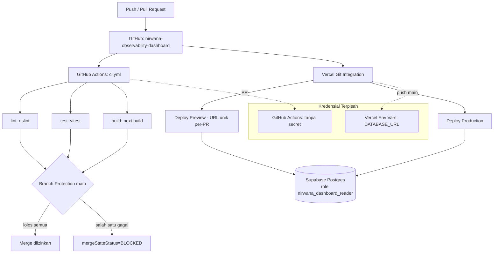

# Report — Milestone 8.6: Remote + CI untuk `dashboard/`

## Bagian 1 — Ringkasan Hasil

**Status akhir:** Selesai dengan penyesuaian dari plan.

`dashboard/` (Next.js, PIC 5) sekarang punya remote GitHub baru (`Ardiyanto24/nirwana-observability-dashboard`, public), CI (`lint`/`test`/`build` — GitHub Actions, branch protection aktif), dan deploy otomatis lewat integrasi Git Vercel (preview per-PR + production per-merge ke `main`). Ketiga Kriteria Keberhasilan sumber dibuktikan nyata: repo+riwayat commit terlihat di GitHub, dua PR percobaan (pelanggaran eslint dan assertion vitest gagal) sama-sama genuinely `mergeStateStatus=BLOCKED`, dan deploy preview + production keduanya diverifikasi lewat browser sungguhan menampilkan data live dari Supabase.

Penyesuaian signifikan dari plan: riset Plan Mode salah menduga bahwa `export const dynamic = "force-dynamic"` di `page.tsx` saja sudah cukup menghilangkan kebutuhan `DATABASE_URL` saat `next build` — verifikasi empiris di tengah eksekusi Checkpoint 2 membuktikan itu keliru (Next.js App Router meng-*import* modul setiap route, dynamic maupun static, saat fase "Collecting page data"). Akar masalah sesungguhnya diperbaiki dengan me-refactor `dashboard/src/lib/db.ts` jadi lazy (client Postgres dibuat via `Proxy` saat query pertama, bukan saat modul di-*import*) — lihat Bagian 4.

## Bagian 2 — Kriteria Keberhasilan vs Bukti Nyata

| Kriteria (dari dokumen sumber) | Bukti Aktual | Terpenuhi? |
|---|---|---|
| "`dashboard/` punya remote GitHub baru dengan riwayat commit yang berhasil di-push, dibuktikan nyata terlihat di GitHub." | `gh repo view Ardiyanto24/nirwana-observability-dashboard` → `visibility: PUBLIC`. `gh api repos/.../commits` menunjukkan seluruh commit (termasuk 2 commit sesi ini) match persis `git log` lokal. Lihat `logs.md` Checkpoint 4. | Ya |
| "PR percobaan yang sengaja melanggar eslint ATAU membuat test vitest gagal terbukti diblokir CI." | Dua PR percobaan terpisah (bukan cuma satu, melebihi minimum "ATAU"): PR #1 (pelanggaran `react-hooks/rules-of-hooks`) → job `lint`+`build` FAIL, `mergeStateStatus=BLOCKED`. PR #2 (assertion vitest salah) → job `test` FAIL (lint/build tetap PASS, membuktikan isolasi antar-job), `mergeStateStatus=BLOCKED`. Lihat `logs.md` Checkpoint 7-8. | Ya |
| "Deploy preview Vercel muncul otomatis untuk PR tersebut, dibuktikan URL preview nyata dari Vercel — bukan asumsi integrasi berhasil dari dokumentasi Vercel semata." | PR #3 (README) memicu deploy preview otomatis (`https://dashboard-blush-gamma-47.vercel.app`), dikunjungi lewat browser tool sungguhan — `/` dan `/traces` menampilkan data live Supabase (12 trace, distribusi status, latency per layer). Setelah merge, deploy production baru muncul otomatis dalam hitungan detik, dikunjungi ulang dengan hasil identik. Lihat `logs.md` Checkpoint 11-12. | Ya |

## Bagian 3 — Cara Kerja dan Arsitektur

### Cara Kerja

Push/PR ke `dashboard/` (repo GitHub terpisah dari `nirwana-chatbot`) memicu dua sistem independen secara paralel:

1. **GitHub Actions** (`dashboard/.github/workflows/ci.yml`) — 3 job (`lint`/`test`/`build`) jalan tanpa secret apa pun (job `build` tidak butuh `DATABASE_URL` karena `db.ts` lazy — lihat Bagian 4). Branch protection `main` mewajibkan ketiganya lolos sebelum merge diizinkan.
2. **Vercel** (git integration, disambungkan lewat `vercel link`) — tiap PR mendapat deploy preview otomatis (URL unik per-PR); tiap push ke `main` men-deploy production. Environment variable `DATABASE_URL` (role read-only `nirwana_dashboard_reader`) diset langsung di Vercel (Production/Preview/Development), terpisah dari GitHub Secrets — CI dan runtime deployment punya jalur kredensial yang benar-benar terpisah.

Kedua sistem tidak saling bergantung — CI bisa hijau sementara deploy preview masih berjalan, dan sebaliknya. Keduanya sama-sama muncul sebagai status check di halaman PR GitHub (CI lewat integrasi Actions native, Vercel lewat GitHub App terinstal saat `vercel link` menyambungkan repo).

### Diagram Arsitektur

### Integrasi dengan Komponen Lain

`dashboard/` tetap repo Git terpisah dari `nirwana-chatbot` (M5.2 Keputusan 1, tidak direvisi) — milestone ini TIDAK mengubah hubungan itu, hanya memberi `dashboard/` infrastruktur CI/CD sendiri yang sepenuhnya independen dari `.github/workflows/ci.yml` `nirwana-chatbot` (M8.1-8.5). Tidak ada "Catatan Serah Terima" eksplisit dari `rancangan-ci-cd.md` untuk milestone ini secara spesifik selain yang tercakup Bagian "Catatan Serah Terima ke Pekerjaan Lain" dokumen itu (soal `docs/panduan-integrasi-frontend.md` — itu terkait Bagian 3/backend, bukan Bagian 2/`dashboard/`).

## Bagian 4 — Perubahan dari Plan

1. **Bug staleness `page.tsx` + bug build-time DB `db.ts` (Checkpoint 2) — koreksi dua babak.** Plan menduga `export const dynamic = "force-dynamic"` di `page.tsx` SAJA cukup menutup KEDUA masalah (staleness produksi DAN kebutuhan `DATABASE_URL` di CI). Verifikasi empiris membuktikan itu hanya menutup masalah staleness — kebutuhan `DATABASE_URL` di `next build` tetap ada karena akar masalahnya berbeda (Next.js meng-*import* modul setiap route saat build, terlepas dari dynamic/static). Dikoreksi lewat `AskUserQuestion` kedua, hasil akhir: `db.ts` direfactor jadi lazy (`Proxy`). Detail lengkap: `logs.md` Checkpoint 2 + Task di Luar Plan, `milestones/5.4-.../decisions.md` Keputusan 14, `milestones/8.6-.../decisions.md` Keputusan 3 dan 9.
2. **Dua defect kecil tambahan ditemukan+diperbaiki di commit yang sama:** `trace-tree.test.ts` TS2783 (key `span_id` duplikat, menggagalkan type-check `next build`) dan directive `eslint-disable` basi di `db.ts`. Keduanya murni penghapusan dead code tanpa keputusan desain — tidak ada entri `decisions.md` terpisah, dicatat di `logs.md` Checkpoint 2.
3. **PR percobaan Checkpoint 7 (eslint) memakai pelanggaran berbeda dari yang disebut plan.** Plan mencontohkan "variabel tidak terpakai" — ternyata itu cuma *warning* (bukan error) di config `eslint-config-next` project ini, tidak akan menggagalkan CI. Diganti pelanggaran `react-hooks/rules-of-hooks` (severity error), yang genuinely menggagalkan job.
4. **`vercel link` (Checkpoint 9) menyatukan pembuatan project DAN koneksi git dalam satu command**, bukan dua langkah terpisah seperti dugaan plan (`vercel link` lalu `vercel git connect`) — CLI mendeteksi git remote yang sudah ada di folder dan langsung menyambungkannya otomatis.

Seluruh checkpoint plan (1-13) tetap dikerjakan, tidak ada yang dihilangkan — penyimpangan murni pada ISI Checkpoint 2 dan detail eksekusi beberapa task, bukan struktur milestone.

## Bagian 5 — Keterbatasan dan Item Provisional

- **Alias project-name Vercel (`dashboard-ardiyanto-s-projects.vercel.app`) berada di belakang login wall Vercel (deployment protection), sementara alias acak bawaan (`dashboard-blush-gamma-47.vercel.app`) publik tanpa hambatan — keduanya sama-sama menunjuk ke deployment Production yang sama.** Ditemukan di Checkpoint 12. Ini setting default Vercel untuk project di bawah scope tim, bukan bug kode `dashboard/` — KK M8.6 tetap terpenuhi (URL production nyata yang bisa diakses publik memang ada), tapi kalau URL yang dibagikan ke pihak lain nantinya adalah alias project-name, itu akan menampilkan login wall. **Belum dicatat di `docs/keterbatasan-diterima.md`** — direkomendasikan ditambahkan sebagai entri baru sebelum URL dashboard ini dibagikan ke pihak eksternal, dengan opsi solusi: matikan Deployment Protection di Vercel project settings, atau pasang custom domain (di luar cakupan M8.6, tidak diminta dokumen sumber).
- **Domain produksi masih domain bawaan Vercel** (`*.vercel.app`), belum custom domain — sesuai dokumen sumber yang tidak menyebutkan kebutuhan custom domain untuk `dashboard/` (beda dari Milestone 8.9 backend yang eksplisit minta HTTPS domain publik).

## Bagian 6 — Follow-up

- **Tambahkan entri baru di `docs/keterbatasan-diterima.md`** untuk temuan Deployment Protection di atas (Bagian 5) — belum dilakukan di sesi ini, direkomendasikan sebagai langkah pembuka sesi berikutnya sebelum URL dashboard dibagikan ke pihak eksternal manapun.
- **`docs/02-implementation-plan/rancangan-ci-cd.md`** — Milestone 8.7-8.10 (Bagian 3, Continuous Deployment backend+observability ke VPS) belum dimulai. Milestone 8.6 (Bagian 2) tidak jadi prasyarat untuk Bagian 3 manapun (dokumen sumber eksplisit: "Bagian 2... independen sepenuhnya dari Bagian 1... boleh dikerjakan kapan saja").
- Perbarui tabel "Status Proyek" `CLAUDE.md`/`AGENT.md` — dilakukan sebagai Task 18 checkpoint ini (lihat commit `docs: perbarui status project`).
