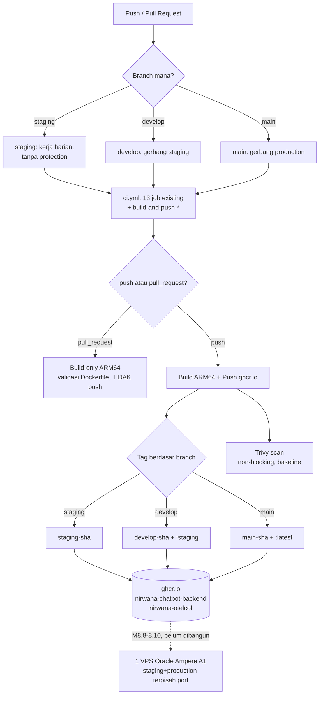

# Report — Milestone 8.7: Kontainerisasi Backend (+ Restrukturisasi Branch Git)

## Bagian 1 — Ringkasan Hasil

**Status akhir:** Selesai dengan penyesuaian dari plan (bukan penyesuaian isi, melainkan cakupan yang diperluas signifikan atas permintaan eksplisit user, dan 1 iterasi perbaikan versi action CI yang salah tag).

Backend `nirwana-chatbot` sekarang punya `Dockerfile` multi-stage teruji (build+run lokal DAN native ARM64 nyata), dan CI (`ci.yml`) mem-build+push image (backend + `custom-exporter`) ke `ghcr.io` lewat runner ARM64 native (`ubuntu-24.04-arm`) di setiap push ke tiga branch. Cakupan milestone ini jauh melebihi "sekadar Dockerfile" — atas permintaan eksplisit user di tengah Plan Mode, milestone ini JUGA membangun restrukturisasi git penuh: model 3-branch permanen (`staging`→`develop`→`main`) dengan branch protection bertingkat, mengantisipasi arsitektur dual-environment (staging+production) di 1 VPS untuk M8.8-8.10 mendatang.

Kedua Kriteria Keberhasilan sumber dibuktikan nyata dengan bukti kuat: image genuinely dibangun DAN dijalankan (bukan cuma dibangun) di arsitektur ARM64 — termasuk `docker run --platform linux/arm64` sungguhan (via emulasi QEMU lokal) yang membuktikan `psycopg[binary]`/`uvloop`/`httptools` benar-benar ter-load tanpa error, bukan diasumsikan dari kompatibilitas wheel semata.

## Bagian 2 — Kriteria Keberhasilan vs Bukti Nyata

| Kriteria (dari dokumen sumber) | Bukti Aktual | Terpenuhi? |
|---|---|---|
| "Image backend berhasil di-build nyata dari `Dockerfile` baru, container-nya menjawab request dasar tanpa error dependency ARM64 — `psycopg[binary]`/`uvloop`/`httptools` ... terverifikasi nyata punya wheel `aarch64` yang terpasang benar, bukan diasumsikan." | Build native ARM64 di CI sukses (~38-44s, tanpa compile-from-source). Image di-pull ulang dan DIJALANKAN via emulasi QEMU (`docker run --platform linux/arm64`) — `curl /health` → `200 {"status":"ok"}`, log `Uvicorn running on http://0.0.0.0:8001` tanpa error import apa pun. Lihat `logs.md` Checkpoint 10 (sanity lokal amd64) + Checkpoint 13 (bukti ARM64 nyata). | Ya |
| "CI berhasil mem-push image ke `ghcr.io` memakai native arm64 runner, dibuktikan image benar-benar muncul di registry dan bisa di-pull ulang." | `docker manifest inspect -v` mengonfirmasi `{"architecture": "arm64", "os": "linux"}` untuk kedua image (`nirwana-chatbot-backend`, `nirwana-otelcol`), publicly pullable tanpa autentikasi. Tag scheme (`<branch>-<sha>`, `:latest`, `:staging`) dikonfirmasi tepat sesuai desain di ketiga branch. Lihat `logs.md` Checkpoint 13. | Ya |

## Bagian 3 — Cara Kerja dan Arsitektur

### Cara Kerja

Push/PR ke salah satu dari 3 branch (`main`/`develop`/`staging`) memicu `ci.yml` lengkap, termasuk 2 job baru (`build-and-push-backend`, `build-and-push-exporter`) yang jalan di runner ARM64 native. Pada event `pull_request`, job HANYA membangun image (validasi Dockerfile+dependency ARM64 compile) tanpa push — mencegah floods image PR yang tidak perlu, sekaligus memenuhi syarat jadi *required status check* pada `develop`/`main` tanpa terjebak gotcha "job tidak pernah jalan → PR macet selamanya" (pola sama `test-gate`/`prompt-eval-gate`). Pada event `push`, image dibangun DAN di-push ke `ghcr.io` dengan tag `<branch>-<sha>` selalu, ditambah tag mengambang sesuai tujuan environment (`latest` dari `main` untuk production, `staging` dari `develop` untuk staging environment — keduanya BELUM ada VPS-nya, disiapkan untuk M8.8-8.10).

`Dockerfile` sendiri 2-stage: builder menjalankan `uv sync --frozen` menghasilkan `.venv/` lengkap dari `uv.lock` (sudah py marker `aarch64` bawaan), runtime stage cuma meng-copy `.venv/`+`src/` tanpa `uv` sama sekali — proses `CMD` memanggil `python -m uvicorn` langsung (bukan `uv run`) supaya jadi PID 1 yang benar menerima `SIGTERM` untuk graceful shutdown di container.

### Diagram Arsitektur

### Integrasi dengan Komponen Lain

Model 3-branch+dual-environment didokumentasikan sebagai addendum resmi di `docs/02-implementation-plan/rancangan-ci-cd.md` (Checkpoint 2) — M8.8 (provisioning), M8.9 (topologi/reverse-proxy), M8.10 (deploy pipeline) WAJIB membaca addendum ini sebelum plan masing-masing ditulis, karena mengubah asumsi dasar ketiganya dari 1-environment jadi 2-environment di 1 VPS yang sama. Endpoint `GET /health` (Checkpoint 7) disiapkan untuk dipakai M8.9 (health-check reverse-proxy Caddy) dan M8.10 (KK sumbernya sendiri menyebut "endpoint health/versi").

## Bagian 4 — Perubahan dari Plan

1. **Cakupan meluas signifikan dari dokumen sumber asli** (Dockerfile+CI job murni) jadi mencakup restrukturisasi branch git penuh (3 branch permanen, branch protection bertingkat, perluasan trigger `ci.yml` existing) — perluasan ini SUDAH tercakup di plan yang disetujui (hasil 5 putaran `AskUserQuestion` sebelum plan ditulis), jadi bukan penyimpangan eksekusi, murni penyimpangan dari Lingkup dokumen sumber ASLI (`rancangan-ci-cd.md` sebelum addendum).
2. **Versi action CI yang ditulis di plan (`docker/setup-buildx-action@v3`, `docker/login-action@v3`, `docker/build-push-action@v6`, `aquasecurity/trivy-action@0.28.0`) TERNYATA salah/usang** — ditemukan lewat kegagalan run nyata Checkpoint 13 (`Set up job` gagal resolve versi), diperbaiki ke versi riil terkini (`@v4`/`@v4`/`@v7`/`@v0.36.0`) yang dikonfirmasi via `gh api repos/.../tags` sebelum commit ulang. Detail lengkap: `logs.md` Checkpoint 13.

Tidak ada checkpoint yang dihilangkan atau ditambah di luar plan — seluruh 15 checkpoint plan dikerjakan sesuai urutan.

## Bagian 5 — Keterbatasan dan Item Provisional

- **Verifikasi ARM64 fungsional lokal memakai emulasi QEMU** (mesin dev adalah amd64/Windows), bukan hardware ARM64 asli — BUKAN keterbatasan bukti utama (bukti utama adalah BUILD nyata di runner `ubuntu-24.04-arm`, hardware ARM64 asli, yang menjadi dasar KK sumber), emulasi lokal murni verifikasi TAMBAHAN untuk keyakinan ekstra bahwa container genuinely bisa DIJALANKAN, bukan cuma dibangun.
- **Kebijakan blocking Trivy (threshold severity) belum diputuskan** — baseline sudah direkam (189 temuan OS-level backend, 3 dependency Python, 1 exporter), tapi keputusan "severity apa yang wajib memblokir job" sengaja ditunda (Keputusan 9, mirror proses M8.1). **Ditambahkan sebagai entri baru di `docs/keputusan-tertunda.md`** sebagai bagian penutupan milestone ini (lihat Bagian 6).
- **`chatbot_api` (servis eksternal) TIDAK dikontainerisasi** — sesuai batasan mengikat, backend tetap mengasumsikan `chatbot_api` reachable lewat `CHATBOT_API_BASE_URL` dari lingkungan manapun ia berjalan nanti (operasional M8.9/8.10, bukan M8.7).

## Bagian 6 — Follow-up

- **Tambahkan entri baru di `docs/keputusan-tertunda.md`** untuk kebijakan blocking Trivy (severity threshold) — pemicu peninjauan ulang: setelah M8.8 (VPS nyata ada) atau setelah cukup banyak run mengumpulkan pola baseline, tinjau ulang apakah CRITICAL/HIGH perlu jadi blocking.
- **M8.8 (Provisioning VPS)** — WAJIB baca addendum `rancangan-ci-cd.md` (Checkpoint 2 milestone ini) sebelum plan ditulis: provisioning perlu alokasi resource untuk 2 environment (staging+production) di 1 VPS yang sama, bukan 1 seperti asumsi dokumen sumber asli.
- **`docs/panduan-integrasi-frontend.md`** belum perlu diperbarui di titik ini (masih menunggu M8.10, sesuai "Catatan Serah Terima" dokumen sumber) — dicatat ulang di sini supaya tidak terlewat mengingat sekarang ada 2 environment yang mungkin masing-masing perlu URL sendiri didokumentasikan.
